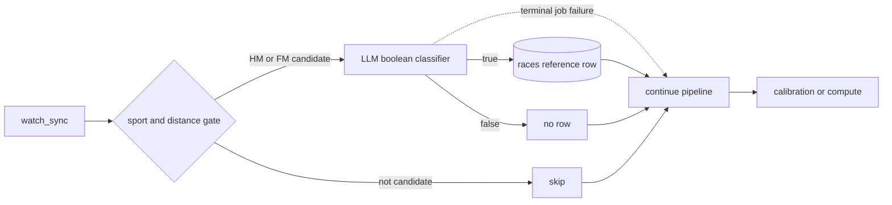

# Independent race-history detection in the sync pipeline

Historical race detection currently happens as part of Coach context building,
where long training runs can be mistaken for races. In particular, 25 km and
30 km training activities are not evidence of a half marathon or marathon. Race
classification is a data-ingestion concern: it should run once when an activity
is synchronized, persist a reusable fact, and stay independent from Coach Agent.

## Decision

- Add an independent Go `internal/racedetection` module. Its external interface
  accepts one bounded activity summary and returns a boolean decision; it has no
  dependency on Coach configuration, prompts, graphs, or persistence.
- Use a strict deterministic gate before any model call. Only `run_outdoor` and
  `run_track` activities in these inclusive ranges are candidates:
  - half marathon: 20.9–22.0 km;
  - marathon: 41.9–44.0 km.
  Every other sport or distance—including 25 km and 30 km runs—is rejected
  locally and consumes no model request.
- Ask an OpenAI-compatible Chat Completions model for one structured boolean,
  `is_race`. Both organized races and personal half/full-marathon time trials
  count as races; ordinary long runs and workouts do not. The default provider
  is DeepSeek (`https://api.deepseek.com`, model `deepseek-v4-flash`) with JSON
  response format. Endpoint, model, timeout, and concurrency are configurable;
  default concurrency is 8. The API key is environment-only.
- Persist confirmed decisions in canonical MySQL `races`. A row contains only
  `(user_id, label_id, created_at)`; all activity attributes remain canonical in
  `activities`. The composite activity identity is the reference. Inserts are
  idempotent, and confirmed references are excluded from future classification.
  False decisions are not persisted or cached.
- Insert each confirmed race immediately. Candidate calls run concurrently. If
  one candidate fails, the other candidates continue and their confirmed rows
  remain committed; failed candidates write no race row. The job then follows
  the normal retry policy.
- Insert `race_detection` after `watch_sync` in both sync pipelines. It receives
  only the current sync's `label_ids`; a non-nil empty list means there is no
  activity work and must never expand into a history scan. The step is marked
  `continue_on_failure`: after retries are exhausted, the step remains visibly
  failed but the pipeline continues to calibration/compute and can finish
  `done`. Thus model/provider failure never makes data synchronization fail.
- Add a separate internal-only `race_detection_backfill` job. It scans all
  historical candidates once, skips already-confirmed references, and is not
  part of normal incremental synchronization. Operationally it is intended for
  a single rollout-time run, not a recurring schedule.
- Race-detection configuration is required by the worker. Missing or invalid
  endpoint, API key, model, timeout, or concurrency fails worker startup. The
  API process does not load this configuration because it never calls the model.

## Pipeline behavior

The optional-failure flag belongs to the generic pipeline step definition and
is exposed in pipeline catalog/run JSON. This keeps failure policy explicit and
observable rather than hiding errors inside the race handler.

## Consequences

- Race history becomes a durable ingestion-derived projection that future Coach
  work can read without repeating model classification. Updating Coach Agent to
  consume `races` is deliberately a later change.
- Candidate selection is deterministic, cheap, and testable without a model.
  Model cost is bounded to plausible half/full-marathon efforts.
- A model outage may leave a temporary detection gap while the underlying sync
  still succeeds. Normal job retry handles transient failures; operators can
  observe the failed step and explicitly retry/backfill if needed.
- Full-history false results may be reconsidered if the one-time backfill is
  manually rerun, because only positive decisions are stored. This is accepted:
  there is no requested negative-decision table or model-version audit history.
- Deleting a user also deletes their `races` rows before activities.

## Rejected options

- Detect races inside Coach Agent. Rejected because classification would be
  coupled to plan generation, repeated by consumers, and harder to reuse.
- Treat every long activity as a race. Rejected because it reproduces the 25 km
  and 30 km false positives that motivated this decision.
- Distinguish organized events from personal time trials. Rejected because the
  available activity data cannot do this reliably and both represent race
  efforts for training-history purposes.
- Persist copied race metrics or model output. Rejected because `activities` is
  canonical and the required projection is only an activity reference.
- Fail the whole sync pipeline when classification fails. Rejected because race
  detection is an optional enrichment and must not block raw data or deterministic
  derived metrics.
