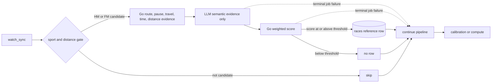

# Independent race-history detection in the sync pipeline

Historical race detection currently happens as part of Coach context building,
where long training runs can be mistaken for races. In particular, 25 km and
30 km training activities are not evidence of a half marathon or marathon. Race
classification is a data-ingestion concern: it should run once when an activity
is synchronized, persist a reusable fact, and stay independent from Coach Agent.

## Decision

- Add an independent Go `internal/racedetection` module. Its external interface
  accepts one gated activity context and returns a Go-computed weighted decision
  plus auditable evidence. It has no dependency on Coach configuration,
  prompts, graphs, or persistence.
- Use a strict deterministic gate before any model call. Only `run_outdoor` and
  `run_track` activities in these inclusive ranges are candidates:
  - half marathon: 20.9–22.0 km;
  - marathon: 41.9–44.0 km.
  Every other sport or distance—including 25 km and 30 km runs—is rejected
  locally and consumes no model request.
- Ask an OpenAI-compatible model only for two structured semantic evidence
  values: event/full-effort intent and intensity/continuity. Each value is one
  of `支持比赛`, `支持训练`, or `信息不足`; the model neither assigns weights
  nor returns the final boolean. Both organized races and personal half/full-
  marathon time trials count as races; ordinary long runs and workouts do not.
  Both Chat Completions and Responses protocols are supported. The deployed
  default remains DeepSeek
  (`https://api.deepseek.com`, model `deepseek-v4-flash`) until a
  worker-reachable Responses endpoint is provisioned. Endpoint, API protocol,
  model, timeout, and concurrency are configurable; default concurrency is 8.
  The API key is environment-only.
- Keep the complete ordered GPS trace inside Go. `AnalyzeRoute` projects every
  valid point to local meters and derives coordinate-free topology metrics:
  bounding span, path length, start/end distance, path-to-bounding-perimeter
  ratio, distance-normalized spatial revisit ratio, and out-and-back match ratio. It
  classifies compact repeated routes, out-and-back routes, and large loops or
  point-to-point routes without downsampling. Isolated GPS spikes are removed;
  after a larger discontinuity, every metric uses the longest continuous segment.
  Raw coordinates, timestamps, altitude samples, and
  derived home-area coordinates are never sent to the model or written to logs.
  Small-area repeated laps and dense route overlap are strong training evidence;
  a point-to-point route or a large city loop is race-like. Track-based personal
  HM/FM time trials still count as races, so route shape contributes to the score
  rather than acting as a rejection gate.
- Parse watch-recorded pause count, total duration, and Shanghai-local intervals
  from `activities.pauses` in Go. Missing pause data stays unknown rather than
  being interpreted as zero pauses. Pause details are not sent to the model.
- Infer the athlete's usual activity area from the largest strict-majority
  cluster of historical activity start points. Go compares the candidate start
  with that area; an HM/FM in a clearly different city is strong race evidence.
  If fewer than three valid historical starts exist or no strict majority exists,
  the location context is unknown; no home location is guessed or persisted, and
  neither the cluster nor its distance is sent to the model.
- Treat 42.0–43.5 km as strong positive evidence because ordinary training very
  rarely exceeds 40 km. This is a general distance prior, not a city-, date-, or
  fixture-specific rule, and does not replace the model decision.
- Go owns all weights and sums the following signed contributions. `信息不足`
  always contributes zero.

  | Dimension | `支持比赛` | `支持训练` | Source |
  | --- | ---: | ---: | --- |
  | Event/full-effort intent | +35 | -30 | LLM |
  | Marathon distance prior | +25 | -25 | Go |
  | Intensity/continuity | +20 | -20 | LLM |
  | Pause pattern | +20 | -20 | Go |
  | Route shape | +20 | -15 | Go |
  | Travel | +25 | -15 | Go |
  | Start window | +10 | -20 | Go |

  A signed total greater than or equal to the inclusive threshold of 20 is a
  race. The asymmetric time weight makes a typical Sunday start weak positive
  evidence while retaining stronger negative evidence for a clearly
  training-like start. Every dimension and contribution is logged without
  activity content or coordinates.
- The same 28 manually labelled activities are an opt-in real-provider golden
  regression for both adapters. After moving route analysis to Go, a local
  Agent Maestro `gpt-5.6-luna` Responses run with route race weight 20 and
  travel race weight 25 classified all 28 correctly after the manually verified
  label for activity `459985079758782468` was corrected to race: all 24 races
  were retained and all four training activities were rejected. The
  provider reported roughly 628–740 input tokens for ordinary candidates, down
  from the earlier complete/512-point trace design's 19,158.5-token average. A
  single real-provider pass is not a stable quality guarantee; the fixed labels,
  deterministic Go features, score logs, and repeat runs remain the regression
  mechanism. Agent Maestro is a VS Code-local service and therefore is not a
  production endpoint; these runs validate the model/protocol adapter and
  quantify input size, not production reachability.
  `make test-racedetection` reads local MySQL and Luna/Agent Maestro settings
  from `src/go/config.local.yml`; ordinary tests and production read
  `src/go/config.yml` and do not require Agent Maestro.
- Record provider-reported `input_tokens`, `output_tokens`, and `total_tokens`
  for every model-backed candidate with API protocol, model, user, and activity
  reference. Logs never include prompts, responses, API keys, or activity
  content. Compatible endpoints that omit usage are recorded as unavailable;
  counts are never estimated locally.
- Persist confirmed decisions in canonical MySQL `races`. A row contains only
  `(user_id, label_id, created_at)`; all activity attributes remain canonical in
  `activities`. The composite activity identity is the reference. Inserts are
  idempotent, and confirmed references are excluded from future classification.
  False decisions are not persisted or cached.
- Insert each confirmed race immediately. Candidate calls run concurrently. If
  one candidate fails, the other candidates continue and their confirmed rows
  remain committed; failed candidates write no race row. The job then follows
  the normal retry policy.
- Insert `race_detection` after `watch_sync` in both sync pipelines. It receives
  only the current sync's `label_ids`; a non-nil empty list means there is no
  activity work and must never expand into a history scan. The step is marked
  `continue_on_failure`: after retries are exhausted, the step remains visibly
  failed but the pipeline continues to calibration/compute and can finish
  `done`. Thus model/provider failure never makes data synchronization fail.
- Add a separate internal-only `race_detection_backfill` job. It scans all
  historical candidates once, skips already-confirmed references, and is not
  part of normal incremental synchronization. Operationally it is intended for
  a single rollout-time run, not a recurring schedule.
- Race-detection job results report `{candidates, confirmed}`. `candidates`
  counts unconfirmed activities selected for model assessment; `confirmed`
  counts only rows newly inserted by that job. Already-confirmed
  references are filtered in the Go storage query before model classification,
  so reruns do not spend model tokens on them. An idempotent insert that loses a
  concurrent race to another job is not counted as newly confirmed.
- Race-detection configuration is required by the worker. Missing or invalid
  endpoint, API key, model, timeout, or concurrency fails worker startup. The
  API process does not load this configuration because it never calls the model.

## Pipeline behavior

The optional-failure flag belongs to the generic pipeline step definition and
is exposed in pipeline catalog/run JSON. This keeps failure policy explicit and
observable rather than hiding errors inside the race handler.

## Consequences

- Race history becomes a durable ingestion-derived projection that future Coach
  work can read without repeating model classification. Updating Coach Agent to
  consume `races` is deliberately a later change.
- Candidate selection is deterministic, cheap, and testable without a model.
  Model cost is bounded to plausible half/full-marathon efforts.
- A model outage may leave a temporary detection gap while the underlying sync
  still succeeds. Normal job retry handles transient failures; operators can
  observe the failed step and explicitly retry/backfill if needed.
- Full-history false results may be reconsidered if the one-time backfill is
  manually rerun, because only positive decisions are stored. This is accepted:
  there is no requested negative-decision table or model-version audit history.
- Deleting a user also deletes their `races` rows before activities.

## Rejected options

- Detect races inside Coach Agent. Rejected because classification would be
  coupled to plan generation, repeated by consumers, and harder to reuse.
- Treat every long activity as a race. Rejected because it reproduces the 25 km
  and 30 km false positives that motivated this decision.
- Distinguish organized events from personal time trials. Rejected because the
  available activity data cannot do this reliably and both represent race
  efforts for training-history purposes.
- Persist copied race metrics or model output. Rejected because `activities` is
  canonical and the required projection is only an activity reference.
- Fail the whole sync pipeline when classification fails. Rejected because race
  detection is an optional enrichment and must not block raw data or deterministic
  derived metrics.
