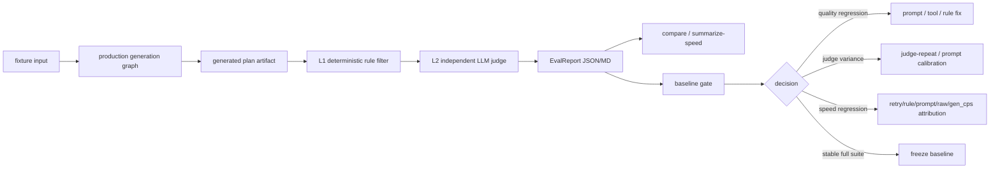

# Coach Agent Evaluation — Framework

**何时读**：要读 coach eval 框架级概念（L1/L2/L3 三层栈、Judge graph 设计、fixture 通用 envelope、CLI、目录约定）时必读。Scope-specific 内容（fixture 字段、coverage 场景、L1 规则、judge axes）请按 scope 跳转：

- [`coach-eval_S1.md`](coach-eval_S1.md) —— S1 赛季备战计划
- [`coach-eval_S2.md`](coach-eval_S2.md) —— S2 周训练计划
- [`coach-eval_S3.md`](coach-eval_S3.md) —— S3 每日问答

**范围**：本文档定义的是 **offline evaluation framework** —— 用户在本地手动跑 fixture 拿 deterministic + LLM-judge 分数，对比历史 baseline 看有没有退化。**不包含** production runtime 接入、CI 自动触发、observability dashboard、用户面 thumbs-up 反馈等问题；那些等离线框架稳了、有了 baseline signal 后再单独立项。

## S1 / S2 / S3 是什么

Coach agent 三个 scope，对应三类用户场景。每个 scope 在 `src/coach/graphs/conversation/graph.py` 里走不同的 system prompt（`_SCOPE_PROMPTS`），但共享同一个 LangGraph 骨架。

| Scope | 中文名 | 输入 | 输出 | 调用频率 | Code path |
|-------|--------|------|------|---------|-----------|
| **S1** | 赛季备战计划 | 用户目标比赛、当前能力、可用训练时长、周期化偏好 | `MasterPlan` 结构（含 base / build / peak / taper / recovery 阶段，每阶段周量与强度框架） + 配套 markdown | 一个赛季 1 次（夏训 / 冬训 / 备赛周期开始时） | `master_chat` prompt；generation 已接入 `build_generation_graph`，底层 adapter 在 `stride_server/master_plan_generator.py` / `stride_server/coach_adapters/master_plan_adapter.py` |
| **S2** | 周训练计划 | 当前 master plan 阶段、上周 feedback.md、最近身体信号（HRV/RHR/sleep/PMC）、用户文字 request | `WeeklyPlan` 结构（每日 run / strength / rest / nutrition session） + `plan.md` + `plan.json` | 每周 1 次（下周开始前） | `week_chat` prompt + `build_generation_graph` |
| **S3** | 每日问答 | 用户自由文字问题（"今天该跑长 run 吗"、"为什么 HRV 在掉"、"明天下雨怎么办") + 当前周 plan + DB grounding | 文字回答（**read-only**，不生成 / 不改 plan） | 每天 N 次 | `qa` prompt + conversation graph only（没有 generation pipeline） |

**关键区别**：
- **S1 / S2 同时有 conversation 和 generation 两条路径**：
  - **Conversation 路径** —— 用户多轮聊天讨论调整（`master_chat` / `week_chat` scope）。AI 工具 emit typed `PlanDiff` / `MasterPlanDiff`，server 经 **Pattern Y** 落盘。
  - **Pattern Y** = "stateless propose → apply"：AI 在 propose 阶段只产出 typed diff（结构化、schema-validated 的字段级 patch），不直接改 DB；server 在 propose 和 apply endpoint 之间 **不留任何内存中的 pending-diff 状态**，diff 经 HTTP request body 由前端在 apply 调用时送回。完整性靠 path-match validation（`diff.folder == path_folder`、`accepted_op_ids ⊆ diff.ops.id`）+ post-apply rule_filter rerun + schema validation 保证。完整定义见 [`coach-agent.md`](coach-agent.md) § v1 architectural patterns。
  - **Generation 路径** —— 一次性整体生成。S1 / S2 都走 `build_generation_graph`（`load_context → generator → rule_filter → reviewer → verdict`，输出 schema-可校验的完整 plan）；S1 的 master-plan adapter 复用同一套 rule_filter / reviewer / verdict 机制。
  - **Eval 主套件评估 generation 路径** —— 它是 plan 的 source；S1 另有 `s1_conversation` 子套件评估 master-plan 调整协议（先澄清、再读数据、评估合理性、最后才 proposal），避免 generation 全绿却让 conversation 提前提案。
- **S3 只走 conversation graph** —— `reason → tools? → reason`，输出自由文字（无 schema 可校验，evaluation 必须靠 hallucination check + LLM judge）
- **S1 / S2 偶发**，**S3 高频** —— eval coverage 重心不同：S1 / S2 追深度（每条 fixture 验证细节），S3 追覆盖（多条 fixture 验证不出 hallucination）

## Source of truth

| 概念 | 代码 |
|------|------|
| Plan schema (S2) | `src/stride_core/plan_spec.py` (`WeeklyPlan.from_dict`) |
| Master plan schema (S1) | `src/stride_core/master_plan.py` (pydantic `MasterPlan`) |
| 现有 rule filter (S2) | `src/coach/graphs/generation/rule_filter.py` |
| Reviewer 输出 schema | `src/coach/schemas/review.py` (`ReviewReport`) |
| Generation pipeline | `src/coach/graphs/generation/graph.py` |
| Conversation pipeline (S3) | `src/coach/graphs/conversation/graph.py` |

文档落后于代码时 **信代码**。

## 评测系统设计总览

Coach eval 的目标是把一次 agent 改动拆成四类可解释信号：计划质量、规则合规、生成速度、基础设施可用性。系统不直接追求一个总分，而是保留每条 fixture 的生成 artifact、L1 违规、L2 axis 分、timing metadata 和 baseline diff，让开发者能判断下一步该改 prompt、改 deterministic rule、校准 fixture，还是等待 LLM 容量窗口。



关键设计原则：

| 原则 | 设计 |
|------|------|
| 评测复用真实生成路径 | S1/S2 generation 走 production `build_generation_graph`，eval 只在 artifact 之后加 judge/report 层 |
| 可复现优先 | baseline 只接受 `frozen_fixture`，fixture 的 `input` 一旦冻结不漂移；真实 DB 只用于探索和采样 |
| 快速反馈分层 | L1 先用 Python 拦 schema/硬规则；L2 只评价 deterministic rule 抓不到的训练学质量；L3 留给人工 spot-check |
| 质量和速度分开归因 | 报告同时记录 axis score、`generation_iterations`、rule retry history、prompt/raw chars、`gen_cps`、judge retry |
| 基础设施失败不污染质量判断 | 429/no_capacity/5xx/rate limit 归为 `infra=llm_transient`，CLI 返回 `64`，不当作 plan fail |
| baseline 只收新鲜样本 | `freeze_baseline.py` 默认拒绝 live DB、单 fixture、judge-only、replay backfill、marginal/fail 报告 |

一次标准迭代按这个顺序走：

1. 用 targeted fixture 跑真实生成，优先看 `iter`、L1、9 维 judge、raw/prompt 和 `gen_cps`。
2. 对可疑 judge 分数用 `--judge-artifact --judge-repeat 3` 验证方差，不急着改 prompt。
3. 对速度问题先看 `generation_iterations` 和 `rule_filter_history`；若 `iter=1` 且 raw/prompt 稳定但 `gen_cps` 掉速，先归因为服务吞吐长尾。
4. 多样本用 `--summarize-speed` 聚合，fresh generation 计入速度，judge-artifact replay 只计入质量方差。
5. full-suite 候选先过 `--gate-report`，再用 `freeze_baseline.py` 更新 suite baseline。

## 三层评估栈

| Layer | 谁判 | 输出 | 成本 |
|-------|------|------|------|
| **L1: rule filter** | 纯 Python | `pass` / `error` + violation list | 0 USD，30 秒跑完全部 fixture |
| **L2: LLM judge** | GPT-5.4（≠ reviewer model） | N 维 1-5 + rationale + overall verdict | 每 fixture ~1-3 美分，全量 30 条 ~1 USD |
| **L3: human spot-check** | 用户 | accept / reject + 自由备注 | 每条 5-15 分钟人工 |

三层都是离线跑 —— 用户起 `python -m coach.eval` 命令触发，结果写到本地 JSON / markdown。不接 CI、不接 prod runtime。

**L1 抓不到的**：训练学合理性（"对一个 HRV 下行的用户排两个质量课在周一周三"通过所有规则但训练学不合理）→ 留给 L2。
**L2 抓不到的**：风格、tone、用户体感 → 留给 L3。
**L3 抓不到的**：覆盖度 → L1+L2 解决。三层互补，单层都不够。

各 scope 的 L1 规则、L2 axis 集合在 scope-specific doc 里。

## Fixture 通用规范

### 目录结构

```
tests/fixtures/coach_eval/
    s1/                          # master plan fixtures
        s1-summer-base-build.json
        s1-winter-from-injury-return.json
        ...
    s2/                          # weekly plan fixtures
        s2-hrv-drop-keep-volume.json
        s2-recovery-week-after-race.json
        ...
    s3/                          # daily Q&A fixtures
        s3-why-easy-pace-feels-hard.json
        ...
    spot_checks/                 # L3 人工审过的 sample（追加）
        2026-05-18_s2-hrv-drop-keep-volume.md
```

文件名规则：`{scope}-{kebab-case-scenario}.json`，**不带日期** —— fixture 是 timeless contract。

### Fixture JSON Envelope（所有 scope 共享）

```json
{
  "fixture_id": "<unique slug, == 文件名去 .json>",
  "scope": "s1" | "s2" | "s3",
  "description": "一句话场景描述（给 human reviewer 看）",
  "tags": ["recovery_signal", "user_pushback", ...],
  "input": { /* scope-specific —— 见各 _S 文档 */ },
  "expected": {
    "hard_constraints": { /* scope-specific —— L1 必过项 */ },
    "soft_rubric": { /* axis -> { min_score: 1-5, behavior: str } */ },
    "anti_patterns": [ /* 显式不允许的行为 */ ]
  }
}
```

### 通用字段含义

| 字段 | 必需 | 含义 |
|------|------|------|
| `fixture_id` | ✅ | 唯一，文件名去 `.json` 同值 |
| `scope` | ✅ | `"s1"` / `"s2"` / `"s3"` |
| `description` | ✅ | 一句话场景描述 |
| `tags` | ✅ | 用于 fixture coverage 统计 |
| `input.*` | scope-specific | 见 `coach-eval_S{1,2,3}.md` |
| `expected.hard_constraints` | ✅ | L1 rule filter 必须全过的 deterministic 约束 |
| `expected.soft_rubric` | ✅ | L2 judge 每维 `min_score`（1-5）+ `behavior` 描述 |
| `expected.anti_patterns` | optional | 显式不允许的行为，judge prompt 会列出来 |

### 冻结原则（HARD）

Fixture 一旦 commit，`input.*` **不可再改**。要测新场景就建新 fixture。这是 regression test —— input 漂移 = signal 漂移 = 无法对比。

如果发现 fixture 标注有 bug（`expected` 写错），允许改 `expected.*` + 在 commit message 解释原因，但 `input.*` 永远 frozen。

## L2: Judge graph 设计

### 新增模块

eval framework 是 **dev-only**，单独成顶层 package `coach_eval`，不混进 prod agent (`coach.*` / `stride_server.*`) 的代码路径：

```
src/coach_eval/                  # 顶层 dev-only package
    __init__.py                  # 仅 re-export schemas
    schemas.py                   # AxisScore / JudgeScore / EvalReport (通用)
    graph.py                     # run_evaluation_for_fixture / run_evaluation_suite
    judge_s1.py                  # S1 judge prompt + make_s1_judge factory
    judge_s2.py                  # （后续 phase 补）
    judge_s3.py                  # （后续 phase 补）
    runner.py                    # 加载 fixture / 注入 LLM / 跑 pipeline / 写报告
scripts/
    eval_coach.py                # CLI entrypoint → coach_eval.runner
```

依赖方向（`.importlinter` 合约 **coach-eval-dev-only** 强制单向）：

- ✅ `coach_eval.*` 可以 import `coach.*` / `stride_server.*` / `stride_core.*`
- ❌ `coach.*` / `stride_server.*` / `stride_core.*` **不能** import `coach_eval.*`

Dockerfile 还会在 build 时 `rm -rf /app/src/coach_eval` 把整个包从 prod 镜像里删掉，避免任何意外被 prod route 调用。

### Flow

```
fixture_input → load_frozen_context → generate (复用 build_generation_graph)
                                          ↓
                                       final_artifact
                                          ↓
                                       judge_node ←─ judge_prompt（含 fixture.expected）
                                          ↓
                                       JudgeScore + per-axis rationale
                                          ↓
                                       aggregate_node → EvalReport
```

- `load_frozen_context` 把 fixture 的冻结 input 注入成 `GenState.context`，**不调任何 DB**。这是 fixture 冻结原则的执行点。
- generate 阶段完全复用 `build_generation_graph`（S1 / S2 共用同样的 rule_filter / reviewer 形态）—— eval 不是替换 pipeline，而是在生成产物后套一层 judge。S3 直接走 conversation graph。
- judge_node 调 GPT-5.4（**不**用 Claude Opus 4.7，避免 reviewer↔judge self-bias）。

### JudgeScore schema (通用)

```python
# src/coach_eval/schemas.py
from typing import Literal
from pydantic import BaseModel, Field

# Axis 是 scope-specific —— S1/S2/S3 各自的 axis Literal 在 scope-specific 模块定义
# JudgeScore 用 str 持 axis name 而不是固定 Literal，保持 schema 通用

class AxisScore(BaseModel):
    axis: str                       # axis name (scope-specific enum 在 judge_s{1,2,3}.py 校验)
    score: int | None = Field(default=None, ge=1, le=5)  # None = N/A
    rationale: str
    matches_expected: bool          # axis 是否达到 fixture.expected.soft_rubric[axis].min_score；N/A 时 True
    anti_patterns_hit: list[str] = []

class JudgeScore(BaseModel):
    fixture_id: str
    scope: Literal["s1", "s2", "s3"]
    axes: list[AxisScore]
    overall_verdict: Literal["pass", "marginal", "fail"]
    overall_rationale: str
    judge_model: str
    judge_prompt_version: str       # 改 prompt 就 bump（"v1" → "v2"），让历史 score 可比

class EvalReport(BaseModel):
    run_id: str                     # ISO timestamp + git sha
    git_sha: str
    fixtures_total: int
    fixtures_passed: int            # all hard + every axis >= min_score
    fixtures_marginal: int          # hard pass 但有 axis < min_score
    fixtures_failed: int            # hard 违反 或 schema_validity < 5
    per_axis_avg: dict[str, float]  # 聚合时跳过 score=None 的 axis；分母只算有效样本数
    per_fixture: list[JudgeScore]
```

`judge_prompt_version` 是关键 —— prompt 改了等于"换了考官"，旧分数和新分数不能直接比。用户改 prompt 时应当手动 bump version、重跑所有 fixture、把新报告作为新 baseline 单独存档，不要混合两个版本的分数做趋势分析。

## CLI 用法

```bash
# 跑某一 scope 的全部 fixture
PYTHONIOENCODING=utf-8 python scripts/eval_coach.py --scope s1

# 从中断的 suite partial 继续：复用已完成 fixture，只跑缺失 fixture
python scripts/eval_coach.py --scope s1 \
  --resume-report .omc/eval/reports/<run>.partial.json

# 跑指定 fixture
python scripts/eval_coach.py --scope s1 --fixture s1-summer-base-build

# 跑 S1 master_chat conversation fixtures（frozen plan + frozen tool results）
python scripts/eval_coach.py --scope s1 --conversation

# 只跑一条 conversation fixture
python scripts/eval_coach.py --scope s1 --conversation \
  --fixture s1c-exact-range-reasonable

# v1 暂只实现 S1；其他 scope 等 S1 baseline 稳定后接入
python scripts/eval_coach.py --scope s1

# 只跳过 L2 judge。注意：当前 v1 仍需先调 generator LLM 生成 draft，之后才有 L1 rule_filter 可跑
python scripts/eval_coach.py --scope s1 --layer L1

# 只重跑 L1 + L2 judge：复用已生成的 master plan artifact，跳过昂贵的生成调用
python scripts/eval_coach.py --scope s1 \
  --fixture s1-summer-base-build \
  --judge-artifact .omc/eval/reports/<run>/artifacts/s1-summer-base-build.generated-plan.json

# 对同一个 artifact 重复跑 L2 judge，量化 judge 方差；报告采用保守聚合
python scripts/eval_coach.py --scope s1 \
  --fixture s1-summer-base-build \
  --judge-artifact .omc/eval/reports/<run>/artifacts/s1-summer-base-build.generated-plan.json \
  --judge-repeat 3

# S1 速度实验：只在本次 eval 中覆盖 master-plan 生成 max_tokens，并在报告 timings 中记录实际值
python scripts/eval_coach.py --scope s1 \
  --fixture s1-zhaochaoyi-altitude-p2-replan \
  --master-max-tokens 20000

# 对比已有报告：不跑 LLM，直接汇总 gen/judge/total、prompt chars、raw/max、warnings、judge_n/unstable/axis 分数
python scripts/eval_coach.py --compare-reports \
  .omc/eval/reports/<run-a>.json \
  .omc/eval/reports/<run-b>.json

# 汇总多份报告的生成速度稳定性：按 fixture 聚合 fresh run / judge-artifact replay、gen_s、gen_cps、质量分数范围
python scripts/eval_coach.py --summarize-speed \
  .omc/eval/reports/<run-a>.json \
  .omc/eval/reports/<run-b>.json \
  .omc/eval/reports/<repeat-judge-run>.json

# Baseline gate：不跑 LLM，把候选报告和冻结 baseline 比较，质量或生成速度回退则退出 1
python scripts/eval_coach.py --scope s1 \
  --gate-report .omc/eval/reports/<candidate>.json \
  --baseline-report .omc/eval/baselines/s1_v1.json

# Targeted gate 诊断：只比较与 baseline 共享的 fixture，跳过 suite-level gate；不用于冻结 baseline
python scripts/eval_coach.py --scope s1 \
  --gate-report .omc/eval/reports/<targeted>.json \
  --baseline-report .omc/eval/baselines/s1_v1.json \
  --allow-partial-gate

# 冻结 baseline：显式指定一份 full-suite frozen_fixture 报告
python scripts/freeze_baseline.py --scope s1 --label v1 \
  --report .omc/eval/reports/<run>.json

# 输出报告
# - stdout: 表格汇总
# - file: .omc/eval/reports/{run_id}.json (EvalReport)
# - file: .omc/eval/reports/{run_id}.md  (human-readable summary)
# - file: .omc/eval/reports/{run_id}/artifacts/{fixture_id}.generated-plan.json
# - during suite runs: .omc/eval/reports/{run_id}.partial.json/.md plus partial artifacts, overwritten after each completed fixture
```

报告会记录每条 fixture 的 `generation_iterations` 和 `timings`。真实 S1 调试时优先看三类时间：`generator_total_s`（模型生成耗时）、`judge_s`（L2 评委耗时）、`total_s`（端到端耗时）。若出现 `generation_iterations > 1`，看 `timings.rule_filter_history` 可定位每次 generator attempt 后的 L1 违规；这比只看最终 `l1_violations=[]` 更适合诊断速度被 retry 拉长的原因。长 suite 每完成一条 fixture 会覆盖写入 `{run_id}.partial.json/.md` 和 `{run_id}.partial/artifacts/`，用于保留中断前已完成的真实样本；正式 `{run_id}.json/.md` 写出后会自动清理同 run 的 partial。用 `--resume-report <run>.partial.json` 可以复用 partial 中已有 outcome，只跑缺失 fixture，并沿用原 run id 输出最终报告。Partial report 只能做诊断、resume 和 artifact replay，不能 freeze 为 baseline。当只调整 judge prompt / expected rubric 时，使用 `--judge-artifact` 可以把反馈周期压到一次评委调用。如果 artifact 来自 `.omc/eval/reports/<run>/artifacts/` 且与源 EvalReport 内嵌 artifact 精确一致，judge-only 报告会回填源生成侧 metadata（`generation_iterations`、`generator_total_s`、prompt/raw chars、`rule_filter_history`），并记录 `timings.artifact_source_report`，从而仍可用于 targeted `--allow-partial-gate` 诊断。

`--judge-repeat N` 只支持 `--judge-artifact` 路径，用来测 L2 judge 方差。重复 judge 时报告同时保存 `judge_samples` 与 `judge_summary`；主 `judge_score` 采用保守聚合：每个 axis 取非空最低分，overall verdict 取最差 verdict，`judge_summary.unstable_axes` 标出重复评分中有波动的 axis。

S1 速度实验还会在 `timings` 中记录 `generator_system_prompt_chars`、`generator_user_prompt_chars`、`generator_raw_response_chars` 和 `generator_max_tokens`，用于比较 generator prompt/output 体积与单轮耗时。L2 judge 侧对应记录 `judge_system_prompt_chars`、`judge_user_prompt_chars`、`judge_compact_plan_chars` 和 `judge_original_plan_chars`；`judge_user_prompt_chars` 是实际送入 judge 的 user message 长度，`judge_compact_plan_chars`/`judge_original_plan_chars` 用来量化 compact view 压缩效果。
多次真实 run 后，用 `--compare-reports` 可以把 speed metadata、L1 warning 数、L2 axis 分数、`judge_prompt_version`、`judge_n` 和 `unstable` 并排输出。表格中的 `gsys/guser/raw/max` 对应 generator system/user prompt、raw response 和 output cap，`gen_cps` 是 `raw / generator_total_s` 的粗略生成吞吐（chars/sec），用于识别 raw/prompt 变小但服务吞吐掉速的长尾样本；`jsys/juser/jplan/jorig` 对应 judge system/user prompt、compact plan 和原始 plan 体积；`warn_rules` 是 final L1 warning 的规则类型集合，`warn_counts` 是对应规则的触发次数（例如 `long_run_distance_share=13`）；`retry_rules` 从 `timings.rule_filter_history` 汇总失败 attempt 的 L1 规则（例如 `i1:weekly_volume_ramp(error)`），用于解释最终 pass 但 `iter>1` 的 generator 速度退化；`judge_retry` 显示 L2 judge 侧因 transient infra 的重试次数，避免把 judge 慢误读成 plan 生成慢。这适合比较 `--master-max-tokens 24576 / 22000 / 20000`、generator prompt 压缩或 judge compact prompt 这类实验档位。如果输入报告混用了不同 judge prompt version，CLI 会提示 L2 axis 分数不可直接横向比较，应先用同一版本重跑 judge 或分组看趋势。若同一 fixture 已有多份真实样本，用 `--summarize-speed` 可以按 fixture 聚合 `fresh` generation 样本与 `replay` judge-artifact 样本，输出 `gen_s` 范围/中位数、`gen_cps` 范围/中位数、raw/prompt/iter 范围、score 范围、最快/最慢报告；带 `artifact_source_report` 的 replay 会计入报告数和质量波动，但不会重复计入 fresh generation 速度统计。加 `--baseline-report .omc/eval/baselines/s1_v1.json` 时，summary 额外显示 `base_gen`、`latest_vs_base`、`base_cps`、`latest_cps_vs_base` 和 `speed_cause`，用于直接判断最新 fresh 样本是 prompt/raw 变大、retry 变多，还是服务吞吐下降。`speed_cause=throughput_drop` 表示 `iter` 未增加、prompt/raw 没有明显膨胀但 `gen_cps` 明显下降；它是诊断标签，不会放宽 gate。

建立 suite baseline 后，用 `--gate-report` 做本地门禁：它要求候选报告保持同 scope / mode / `judge_prompt_version`、无 marginal/fail、覆盖 baseline 的所有 fixture，并检查每个 fixture 的 L2 axis 分数、final L1 warning 规则类型、`generation_iterations`、`generator_total_s`、generator prompt chars，以及 suite 总 `generator_total_s`。默认阈值是 axis 均分或单项下降 `>=0.5` 判 fail，候选新增 final L1 warning 规则类型判 fail，suite 生成耗时变慢 `>=60s` 且 `>=25%` 判 fail，单 fixture 生成耗时变慢 `>=120s` 且 `>=50%` 判 fail，单 fixture generator prompt 总字符数增长 `>=12000ch` 且 `>=30%` 判 fail，任一 fixture retry 次数增加也判 fail。同类 final L1 warning 数量增长默认只在 `--compare-reports` 中显示；需要收紧时显式传 `--max-fixture-l1-warning-increase 0` 等阈值。若失败来自 retry 或速度回退，gate 会附上 `speed_context`（iter、retry_rules、judge_retries、prompt/raw 变化、`gen_cps` 吞吐变化、`speed_cause`）和 suite `top_contributors`，避免再手动二次 compare。`--allow-partial-gate` 只用于 targeted fixture 诊断：缺失 baseline fixture 降级为 warning，并跳过 suite-level `per_axis_avg` / `generator_total_s` gate，但仍保留 shared fixture 的质量和速度 gate；正式冻结 baseline 前必须用默认 full-suite gate。做 prompt / tool / fixture 迭代时，推荐顺序是：先 targeted fixture 实验 → `--compare-reports` / `--allow-partial-gate` 看速度和分数 → full-suite → 默认 `--gate-report` 对 baseline 过门禁 → 需要时 `freeze_baseline.py --force` 更新 baseline。

`freeze_baseline.py` 默认只接受可复现的 `frozen_fixture` fresh generation 报告，并拒绝 `live_local_db`、单 fixture 诊断报告、`--judge-artifact` 产出的 judge-only 报告、带 `artifact_source_report` 的回填报告、fixture count 不一致、以及含 marginal/fail 的报告。确实要冻结诊断基线时需要显式加 `--allow-single-fixture` / `--allow-judge-artifact` / `--allow-nonpass`，并建议在 label 中标明用途，避免和 suite baseline 混用。

`repair_eval_report_judges.py` 用于从 full-suite 报告生成 repaired candidate：`--judge-report` 只替换 L2 judge 结果并保留 base report 的生成 artifact/timings；`--replacement-report` 才替换整个 fixture outcome，且必须是真正的 fresh generation 报告。带 `artifact_source_report` 的 judge-artifact replay 即使回填了 `generator_total_s`，也不能作为 full replacement，避免把同一份生成结果伪装成新的 generator 样本。

当前 zhaochaoyi S1 speed/quality 观察（`config/coach.local.toml` / `gpt-5.5`，fixture `s1-zhaochaoyi-altitude-p2-replan`）：

| Run / artifact | Max tokens | Gen | Total / judge | Raw | L1 | Judge | Result |
|----------------|------------|-----|---------------|-----|----|-------|--------|
| `2026-06-30T16-30-18.798202_00-00` 24k baseline artifact | 24576 | 342.5s | judge-only | 13404 | 0 warn | `s1-v3` | pass；除 `phase_nutrition_strategy=4` 外全 5 |
| `2026-06-30T16-40-03.555892_00-00` 20k baseline artifact | 20000 | 265.1s | judge-only | 13678 | 4 warn | `s1-v3` | pass；`phase_nutrition_strategy=4`、`volume_progression=4` |
| `2026-06-30T17-37-13.127603_00-00` 22k prompt-tightened full run | 22000 | 339.9s | 376.0s | 19534 | 0 warn | `s1-v3` | 全 5；质量好但速度接近 24k |
| `2026-06-30T18-05-59.922621_00-00` 22k compact full run | 22000 | 282.1s | 324.2s | 9900 | 0 warn | `s1-v5` 复评 `2026-06-30T18-12-36.754486_00-00` | 全 5；当前稳态默认候选 |
| `2026-06-30T18-26-05.905164_00-00` 20k compact full run | 20000 | 241.5s | 296.7s | 10122 | 0 warn | `s1-v5` | pass；除 `goal_realism=4` 外全 5 |
| `2026-06-30T18-34-57.233459_00-00` 20k strict A-gate full run | 20000 | 273.6s | 321.1s | 10673 | 0 warn after inclusive-day L1 fix | `s1-v6` repeat report `2026-06-30T18-49-53.798183_00-00` | pass；repeat=3 保守聚合 `goal_realism=4`，`unstable_axes=["goal_realism"]` |
| `2026-06-30T19-18-38.656896_00-00` 20k A-gate wording full run | 20000 | 221.4s | 271.3s | 10042 | 0 warn | `s1-v6` full；`s1-v7` repeat report `2026-06-30T19-26-12.982396_00-00` | full run 全 5；v7 repeat=3 无 unstable，保守 `goal_realism=4`、其余全 5 |
| `2026-06-30T19-35-52.132893_00-00` 20k VO2 A-gate full run | 20000 | 505.1s | 545.4s | 10345 | 0 final warn | `s1-v7` | 全 5，但 `iter=2`；第 1 次生成触发 `weekly_volume_ramp`，速度被 retry 拉长 |
| `2026-06-30T19-50-51.207413_00-00` 20k ramp-rounding full run | 20000 | 214.6s | 265.7s | 9832 | 0 warn | `s1-v7` repeat report `2026-06-30T19-53-21.209791_00-00` | full run 全 5；repeat=3 全 5、无 unstable；`rule_filter_history` 显示 iter1 无违规 |
| `2026-06-30T20-00-15.310270_00-00` 20k milestone-warning full run | 20000 | 258.9s | 315.9s | 10173 | 1 warn `milestone_week_consistency` | `s1-v7` | judge 全 5；long-run milestone 目标 26km 但同周 skeleton 只有 24km，之后收紧 milestone 与同周 skeleton 精确匹配 |
| `2026-06-30T20-07-53.387976_00-00` 20k HM-gate full run | 20000 | 273.8s | 324.4s | 10590 | 0 warn | `s1-v7` | pass；除 `goal_realism=4` 外全 5；半马观察门 `<=1:27:30` 对 A 通道偏松 |
| `2026-06-30T20-10-42.515803_00-00` 20:07 artifact repeat judge | artifact | skip | 138.3s judge | same | 0 warn | `s1-v7` repeat=3 | pass；保守聚合 `goal_realism=4`、其余全 5；`unstable_axes=["goal_realism"]` |
| `2026-06-30T20-18-58.108021_00-00` 20k HM-tightened full run | 20000 | 218.2s | 267.9s | 10877 | 0 warn | `s1-v7` | full run 全 5；`iter=1`；半马门槛已收至 `<=1:25` 且 race milestone 含 HM+32km MP+VO2/HR/RPE/跟腱组合 gate |
| `2026-06-30T20-21-37.762088_00-00` 20:18 artifact repeat judge | artifact | skip | 140.2s judge | same | 0 warn | `s1-v7` repeat=3 | pass；保守聚合 `goal_realism=4`、其余全 5；`unstable_axes=["goal_realism"]`，一次 judge 仍认为 HM `<=1:25` 略宽 |
| `2026-06-30T20-28-48.996011_00-00` 20k HM-A-gate full run | 20000 | 244.1s | 294.6s | 10391 | 0 warn | `s1-v7` | full run 全 5；`iter=1`；race milestone 明确 `HM<=1:24:30+32km含MP22+VO2/HR/RPE/跟腱全过` 才开 A |
| `2026-06-30T20-31-55.403982_00-00` 20:28 artifact repeat judge | artifact | skip | 164.6s judge | same | 0 warn | `s1-v7` repeat=3 | pass；repeat=3 全 5、无 unstable；`goal_realism=[5,5,5]` |
| `2026-06-30T20-42-27.924314_00-00` 20k post-HM full run | 20000 | 459.7s | 496.4s | 9611 | 0 final warn | `s1-v7` | 全 5，但 `iter=2`；第 1 次生成触发 `weekly_volume_ramp`：`78 -> recovery -> 92` 被 L1 正确拦截，速度被 retry 拉长 |
| `2026-06-30T20-48-19.749331_00-00` 20k ramp-explicit full run | 20000 | 206.4s | 245.5s | 10557 | 0 warn | `s1-v7` | full run 全 5；`iter=1`；在 prompt 明确 `78 -> recovery -> 92` 非法后，生成速度刷新当前 20k 最快样本 |
| `2026-06-30T20-50-39.764802_00-00` 20:48 artifact repeat judge | artifact | skip | 124.9s judge | same | 0 warn | `s1-v7` repeat=3 | pass；repeat=3 全 5、无 unstable；`goal_realism=[5,5,5]` |
| `2026-06-30T20-56-51.640462_00-00` 20k repeatability full run | 20000 | 213.2s | 255.9s | 10207 | 0 warn | `s1-v7` | `iter=1` 且 L1 clean；single judge 除 `goal_realism=4` 外全 5，rationale 仍承认默认 B 与 HM+30/32km+VO2/RHR/RPE/跟腱组合 gate |
| `2026-06-30T20-59-32.610347_00-00` 20:56 artifact repeat judge | artifact | skip | 120.8s judge | same | 0 warn | `s1-v7` repeat=3 | pass；repeat=3 全 5、无 unstable；`goal_realism=[5,5,5]`，说明 20:56 的单次 4 属 judge 方差 |
| `2026-06-30T21-06-06.436868_00-00` 20k target-time full run | 20000 | 232.4s | 284.9s | 11107 | 0 warn | `s1-v7` repeat report `2026-06-30T21-08-49.134564_00-00` | full `iter=1`、L1 clean；v7 repeat 保守 `goal_realism=4` 且 unstable，原因是 judge 把 schema `goal.target_time=2:50` 与无条件 A 承诺混淆 |
| `2026-06-30T21-12-56.391410_00-00` 21:06 artifact v8 repeat judge | artifact | skip | 133.3s judge | same | 0 warn | `s1-v8` repeat=3 | pass；repeat=3 全 5、无 unstable；v8 明确 `goal.target_time` 可承载 A 目标，不能单独扣 goal_realism |
| `2026-06-30T21-17-36.008104_00-00` 20k s1-v8 full run | 20000 | 214.0s | 260.9s | 9424 | 0 warn | `s1-v8` | full run 全 5；`iter=1`；L1 zero-warning，当前 judge 版本下的 fresh full-run 证据 |
| `2026-06-30T21-20-10.696909_00-00` 21:17 artifact repeat judge | artifact | skip | 138.5s judge | same | 0 warn | `s1-v8` repeat=3 | pass；repeat=3 全 5、无 unstable；`goal_realism=[5,5,5]` |
| `2026-06-30T21-26-59.057600_00-00` 20k s1-v8 repeatability full run | 20000 | 249.6s | 300.1s | 10231 | 0 warn | `s1-v8` | full run 全 5；`iter=1`；L1 zero-warning，gen 较快样本慢但仍无 retry |
| `2026-06-30T21-29-22.146913_00-00` 21:26 artifact repeat judge | artifact | skip | 118.6s judge | same | 0 warn | `s1-v8` repeat=3 | pass；repeat=3 全 5、无 unstable；`goal_realism=[5,5,5]` |
| `2026-06-30T21-35-35.014183_00-00` 20k s1-v8 third full run | 20000 | 221.1s | 263.8s | 10005 | 0 warn | `s1-v8` | full run 全 5；`iter=1`；L1 zero-warning，第三条 fresh v8 clean 样本 |
| `2026-06-30T21-38-13.721787_00-00` 21:35 artifact repeat judge | artifact | skip | 135.4s judge | same | 0 warn | `s1-v8` repeat=3 | pass；repeat=3 全 5、无 unstable；`goal_realism=[5,5,5]` |
| `2026-06-30T22-11-25.941687_00-00` 20k risk-4 full run | 20000 | 240.3 / 251.9 / 284.3 / 302.6s | 282.0 / 339.0 / 346.7 / 344.1s | 13184 / 11197 / 14289 / 12263 | 3 条 iter=1 L1 clean-ish；advanced/unrealistic 有 warning | `s1-v8` | advanced + unrealistic pass；3跑限制和伤后返训 fail，暴露 3跑周量上限与伤后峰值上限缺口 |
| `2026-06-30T22-34-03.564651_00-00` 3跑/伤后 post-rule full run | 20000 | 219.2s / 654.6s | 309.5s / blocked | 10965 / 14365 | 3跑 pass；伤后 iter=3 block | `s1-v8` | 新增 `frequency_volume_ceiling` 后，3跑 fixture 从 fail→pass 且更快；伤后在 FM 28km 下限与伤后≤65km 上限之间来回 retry |
| `2026-06-30T22-40-07.444411_00-00` 3跑 artifact after share threshold | artifact | skip | 80.3s judge | same | 0 warn | `s1-v8` | 3跑 artifact L1 zero-warning，judge pass；放宽 volume-capped long-run share 后 warning 噪音消失 |
| `2026-06-30T22-44-59.360148_00-00` injury share-fix full run | 20000 | 210.4s | 249.4s | 14828 | `iter=1`、L1 zero-warning | `s1-v8` | 伤后 fixture 一轮生成修复到 28km/65km 折中；旧 expected 仍按 >60km anti-pattern 判 fail |
| `2026-06-30T22-47-59.490712_00-00` injury artifact after fixture calibration | artifact | skip | 52.6s judge | same | 0 warn | `s1-v8` | 更新 fixture expected：允许监控良好的 28km/64-65km FM 伤后折中；同一 artifact judge pass，injury_safety=5、volume_progression=4 |
| `2026-07-01T16-46-52.169929_00-00` 20k current prompt full run | 20000 | 319.5s | 544.5s | 10084 | 0 warn | `s1-v8` | pass；9轴全5、`iter=1`、L1 zero-warning；generator prompt `39931+6579ch`，judge 遇一次服务端 500 自动重试，故 total/judge 不作为正常速度样本 |
| `2026-07-01T16-58-34.086331_00-00` 22k current prompt full run | 22000 | 347.7s | 406.5s | 10363 | 0 warn | `s1-v8` | pass；9轴全5、`iter=1`、L1 zero-warning；judge 正常 58.8s，generator 比 20k/24576 对照样本更慢，说明当前单样本速度波动主要不由 output cap 解释 |
| `2026-07-01T17-11-39.480601_00-00` 24576 distance-compact full run | 24576 | 332.0s | 409.6s | 10136 | 0 warn | `s1-v8` | pass；9轴全5、`iter=1`、L1 zero-warning；压缩 `distance_specificity.md` 后 generator system prompt `39931 -> 38252ch`，质量保持，速度仍在模型波动区间 |
| `2026-07-01T17-33-25.410442_00-00` 24576 prompt-compact stable line | 24576 | 298.0s | 357.0s | 9586 | 0 warn | `s1-v8` | pass；9轴全5、`iter=1`、L1 zero-warning；继续压缩 `weekly_skeleton.md`、`phase_sequence.md`、`nutrition.md` 后 generator system prompt 降到 `35035ch`，稳定线 |
| `2026-07-01T17-49-45.914919_00-00` one-line JSON-template experiment | 24576 | 669.9s | 746.9s | 9402 | 0 final warn | `s1-v8` | pass 但 `iter=2`，第1次触发 `weekly_volume_ramp` + `milestone_week_consistency`；`phase_nutrition_strategy=4`。只省 `108ch`，却破坏一次通过率，已回撤；不要把 schema 示例单行化 |
| `2026-07-01T18-15-07.243372_00-00` milestone-compact first run | 24576 | 282.5s | 344.2s | 9874 | 0 warn | `s1-v8` | pass；`iter=1`、L1 zero-warning、generator system prompt `33758ch`；但 `phase_nutrition_strategy=4`，原因是 build/peak 营养被合并成一条，已加 `do not merge build+peak` 护栏 |
| `2026-07-01T18-22-56.236311_00-00` nutrition-guard run | 24576 | 269.5s | 342.4s | 9868 | 0 warn | `s1-v8` | pass；9轴全5、`iter=1`、L1 zero-warning、`33830ch`；但该 artifact repeat judge 后 `goal_realism/frequency_respect` 各有一次 4，说明 A gate 与 5-6跑日/真休表述需更显式 |
| `2026-07-01T18-38-12.072260_00-00` A-gate/frequency guard run | 24576 | 400.5s | 455.0s | 9780 | 1 warn `milestone_week_consistency` | `s1-v8` | pass；9轴全5且 A gate/频次/营养被认可；但 29km milestone 写在前一周周日 `2026-09-13`，同周 skeleton 仅 26km，已加 `week_start=2026-09-14 ... never 2026-09-13` 反例 |
| `2026-07-01T18-46-16.390048_00-00` milestone-date guard run | 24576 | 334.2s | 383.0s | 10284 | 0 warn | `s1-v8` | pass；9轴全5、`iter=1`、L1 zero-warning、`34349ch`；A gate 写明 31km MP + VO2/HR/RPE/跟腱，频次写明 6跑日+至少1天真休，31km milestone 对齐 `2026-09-14` 周 |
| `2026-07-01T18-49-19.273755_00-00` 18:46 artifact repeat judge | artifact | skip | 150.4s judge | same | 0 warn | `s1-v8` repeat=3 | pass；保守聚合 9轴全5、`unstable=none`；确认最新 artifact 在 goal_realism / frequency_respect / nutrition 上比 18:22 更稳 |

当前结论：20k/22k 都能生成高质量 pass，但默认 cap 先维持 24576，20k/22k 作为继续采样的速度实验档。Prompt 压缩有效，但要以 `iter=1` / L1 zero-warning / judge 全 5 / repeat judge 稳定为硬条件：`distance_specificity.md`、`weekly_skeleton.md`、`phase_sequence.md`、`nutrition.md`、`milestones.md` 压缩后，generator system prompt 从 `39931ch` 降到最新稳定线 `34349ch`，并通过 zhaochaoyi artifact repeat=3 全5。继续压缩时优先删重复规则，不削弱硬护栏；反例包括：把 JSON schema 示例单行化只省 `108ch` 却导致 `iter=2` 与 nutrition 轴降到 4；过度合并 build/peak 营养会让 `phase_nutrition_strategy=4`；A gate / 5-6跑日真休 / long-run milestone 同周日期必须写显式，否则 repeat judge 或 L1 会暴露退化。下一步继续采样 targeted run，并用 prompt-growth gate 防止 generator prompt 膨胀。注意：`s1-v8` 换了评委口径，历史 `s1-v3..s1-v7` 分数不要和 `s1-v8` 直接混合横比。

2026-07-02 S1 lab update：最新 prompt system 长度 `34416ch`（guard `<34500`），wide regression `300 passed`。本轮修复了两个 eval-framework 噪声源：`phase_type` 枚举归一化 + HM/10K/5K 1-week taper 不再触发 `phase_duration_balance`，以及 `refresh_eval_report_l1.py` 同步刷新 `l1_violations` 和 `rule_filter_history`。新增 `injury_return_peak_exception_count` warning，专门记录伤后返训中 `64-65km` 监控例外被重复使用的问题。

本轮真实 LLM targeted 证据：`s1-target-distance-hm` 最新 full run `2026-07-01T21-02-07.069168_00-00` 为 `iter=1`、L1 0 warning、9 轴全 5、gen `217.7s`；`s1-target-distance-10k` 最新 full run `2026-07-01T21-14-59.443444_00-00` 为 `iter=1`、L1 0 warning、9 轴全 5、gen `204.0s`；`s1-data-gap-no-recent-race` 最新 full run `2026-07-01T21-26-22.627699_00-00` 为 `iter=1`、L1 0 warning、9 轴全 5、gen `396.5s`；zhaochaoyi 最新 full artifact `2026-07-01T21-03-08.143895_00-00` 经 `2026-07-01T21-10-21.947506_00-00` repeat judge=3 后 9 轴全 5、无 unstable。追加三条 gate blocker targeted replacement：`s1-target-distance-5k` full run `2026-07-01T21-57-44.074510_00-00` 为 `iter=2`、L1 0 warning、9 轴全 5、gen `522.2s`；`s1-goal-realism-boundary-13pct` full run `2026-07-01T22-04-01.724836_00-00` 为 `iter=1`、final L1 仅保留 baseline 已有 `goal_realism` / `marathon_pace_specificity` warning、9 轴全 5、gen `320.1s`；`s1-injury-knee-return` full run `2026-07-01T22-09-06.499261_00-00` 为 `iter=1`、L1 0 warning、gen `230.3s`，经 judge prompt injury-return volume 口径修正后 artifact judge `2026-07-01T22-11-41.310641_00-00` 将 `volume_progression` 恢复到 5。

当前 repaired candidate `2026-07-01T22-12-09.189366_00-00` 是 14/14 pass，并已通过 `.omc/eval/baselines/s1_v1.json` gate：无新增 final L1 warning 规则、无 axis drop、无 retry 增加、无生成速度/提示词体积回退。验证命令：`python scripts\eval_coach.py --scope s1 --gate-report .omc\eval\reports\2026-07-01T22-12-09.189366_00-00.json --baseline-report .omc\eval\baselines\s1_v1.json` → `Gate: PASS`；wide regression `300 passed`。baseline 文件尚未更新，冻结前建议人工决定接受 repaired candidate 还是再跑一份 fresh full-suite。

后续稳定性补跑：修复 `build_master_prompts` 结构后，新增确定性 long-run milestone 同周对齐，并将普通 10K 计划的 `17-18km` 边界长跑收敛到 16km（显式高跑量 10K 仍保留空间）。当前 generator system prompt `34441ch`，仍低于 `<34500` guard。三条 gate blocker targeted real LLM 复测全部 `iter=1`、L1 0 warning、9 轴全 5：`s1-target-distance-10k` `2026-07-01T23-43-13.354112_00-00` gen `192.0s`；`s1-data-gap-no-recent-race` `2026-07-01T23-34-02.043199_00-00` gen `218.2s`；`s1-target-distance-5k` `2026-07-01T23-33-56.705216_00-00` gen `211.2s`。最新 repaired candidate `2026-07-01T23-43-38.222780_00-00` 为 14/14 pass、9 轴均分全 5，并通过 baseline gate：`python scripts\eval_coach.py --scope s1 --gate-report .omc\eval\reports\2026-07-01T23-43-38.222780_00-00.json --baseline-report .omc\eval\baselines\s1_v1.json` → `Gate: PASS`。wide regression 更新为 `304 passed`；baseline 文件仍未冻结更新。

2026-07-02 最新 S1 lab：fresh full-suite `2026-07-02T01-01-36.298979_00-00` 为 13 pass / 1 marginal，暴露 `s1-frequency-limit-3day`、`s1-target-distance-10k`、`s1-zhaochaoyi-altitude-p2-replan` 的 `iter=2`，以及 `s1-user-pushback-aggressive-peak` marginal / 若干 L2 axis 4。随后做 targeted replacement：3跑 `2026-07-02T01-21-15.584549_00-00`、10K `2026-07-02T01-11-21.834178_00-00`、pushback `2026-07-02T01-22-20.894446_00-00`、zhaochaoyi `2026-07-02T01-11-22.617439_00-00` 均为 `iter=1` 且 9 轴全 5；新补普通 5K `13-14km -> 12km` long-run 收敛与短距离营养文本清理后，`s1-target-distance-5k` `2026-07-02T01-35-08.084653_00-00` 为 `iter=1`、L1 0 warning、9 轴全 5、gen `206.0s`；新补 sub-2:50 FM A gate 组合门后，`s1-fm-target-sub250-advanced` `2026-07-02T01-50-12.805447_00-00` 为 `iter=1`、L1 OK、9 轴全 5、gen `270.6s`。`s1-phase-transition-from-recovery` 使用 judge-only 全 5 报告 `2026-07-02T01-24-48.972602_00-00` 修正 judge variance。最新 repaired candidate `2026-07-02T01-50-25.421260_00-00` 为 14/14 pass，并通过 baseline gate：`python scripts\eval_coach.py --scope s1 --gate-report .omc\eval\reports\2026-07-02T01-50-25.421260_00-00.json --baseline-report .omc\eval\baselines\s1_v1.json` → `Gate: PASS`。当前 generator system prompt `34494ch`，距 `<34500` guard 仅 6ch；wide regression `315 passed`。baseline 文件仍未冻结更新。

2026-07-02 prompt 缓冲优化：压缩 `master_plan_planner/SKILL.md`、`shared/natural_week.md`、`shared/training_load.md`、`references/weekly_skeleton.md` 中的说明性长句，不删除关键 guard；generator system prompt 从 `34494ch` 降到 `33379ch`，新增约 `1115ch` 缓冲。压缩后 zhaochaoyi targeted full-run `2026-07-02T02-01-03.488140_00-00` 为 `iter=1`、L1 0 warning、9 轴全 5、gen `273.5s`、raw `9756ch`。用该 replacement 生成 repaired candidate `2026-07-02T02-01-19.106524_00-00`，仍为 14/14 pass，并通过 baseline gate：`python scripts\eval_coach.py --scope s1 --gate-report .omc\eval\reports\2026-07-02T02-01-19.106524_00-00.json --baseline-report .omc\eval\baselines\s1_v1.json` → `Gate: PASS`。wide regression 仍为 `315 passed`。baseline 文件仍未冻结更新。

2026-07-02 output cap 负实验：在相同 `33379ch` prompt 下，把 zhaochaoyi fixture 的 `--master-max-tokens` 从 `24576` 降到 `20000` 并未提速。20k run `2026-07-02T02-09-49.164313_00-00` 为 `iter=1`、L1 0 warning、gen `328.8s`、raw `9849ch`、overall pass，但 `phase_nutrition_strategy=4`；同 artifact judge-only `2026-07-02T02-11-30.160731_00-00` 仍为 nutrition=4，说明不是单次 judge 抖动。24k 对照 `2026-07-02T02-01-03.488140_00-00` 为 gen `273.5s`、raw `9756ch`、9 轴全 5。结论：当前输出未接近 20k cap，降低 cap 没有速度收益且可能削弱营养表达；默认仍维持 `24576`，20k 暂不作为稳态默认。

2026-07-02 fresh full-suite after prompt buffer：原始 fresh suite `2026-07-02T03-46-13.465590_00-00` 为 14/14 pass，但 baseline gate fail：`s1-data-gap-no-recent-race` 从 `iter=1` 增到 `iter=2`（首轮 `target_distance_long_run`）、`s1-target-distance-10k` 从 `iter=1` 增到 `iter=2`（首轮 `hard_session_spacing`，gen 慢 301.0s / 128%）、`s1-fm-target-sub250-advanced` 的 `volume_progression` 从 5 降到 4。针对性修复只改 planner doctrine：no-recent-race 的 FM 仍保留受保护 `28km` 彩排；10K blocks 避免 5 连续双硬周；78km 历史峰值 + 跟腱/股四头风险的 sub-2:50 FM 优先 `30km / 84-86km` + strict A gates，不为 `32km` warning 推到 `92km`。修复后 targeted real LLM：data-gap `2026-07-02T03-56-45.240962_00-00` 为 `iter=1`、L1 0 warning、9 轴全 5、gen `319.9s`；10K `2026-07-02T04-02-48.545183_00-00` 为 `iter=1`、L1 0 warning、9 轴全 5、gen `297.6s`；sub250 advanced `2026-07-02T04-23-27.742015_00-00` 为 `iter=1`、final 仅 baseline 已有 `marathon_pace_specificity` warning、9 轴全 5、gen `332.5s`。用三条 replacement 生成 repaired candidate `2026-07-02T04-23-55.162175_00-00`：14/14 pass，所有 fixture `iter=1`，baseline gate PASS。当前 generator system prompt `34063ch`，仍低于早先 `34494ch` 稳定线；相关回归 `299 passed`。baseline 文件仍未冻结更新。

2026-07-02 post-fix full-suite 复测：fresh suite `2026-07-02T05-59-19.460800_00-00` 全部 `iter=1`，但 gate fail 于两条质量回归和一条 10K 速度长尾。质量修复只改 S1 planner doctrine：stale/current pace unclear 的 full-runway FM 要至少 7 周 base/calibration；sparse watch migration + credible advanced self-report 不再用 `test_run`/`time_trial` 重证 PR。targeted report `2026-07-02T06-17-10.753575_00-00` 中 `s1-data-gap-no-recent-race` 与 `s1-sparse-db-capable` 均为 `iter=1`、L1 0 warning、9 轴全 5；诊断 repaired candidate `2026-07-02T06-18-57.368086_00-00` 为 14/14 pass，gate 只剩 `s1-target-distance-10k` generator speed fail。10K 单跑 `2026-07-02T06-31-06.111532_00-00` 仍一轮 clean、9 轴全 5、raw `11326ch`，但 generator `418.4s`，judge 还遇到 Azure `429 no_capacity` / `500` 后重试成功，说明当前速度失败主要是服务容量长尾，不是计划质量或输出长度退化。当前 generator system prompt `34377ch`，相关回归 `299 passed`；baseline 文件仍未冻结更新。

2026-07-02 prompt micro-compression：压缩 `master_plan_planner/SKILL.md` 与 `references/weekly_skeleton.md` 的说明性文字，不削弱 stale-race、sparse-device、A-gate、频次、long-run milestone、营养等 guard；generator system prompt `34377ch -> 34011ch`，回归 `299 passed`。10K targeted `2026-07-02T06-51-12.784743_00-00` 仍为 `iter=1`、L1 0 warning、9 轴全 5，raw `10871ch`，gen `468.9s`；相较 `06-31` 样本体积更小但 generator 更慢，进一步说明当前 10K speed gate 不能单看单次 Azure 长尾。zhaochaoyi targeted 随后超过 900s 未落盘，后台进程已停止；这条只作为服务容量不稳定证据，不作为质量回归信号。下一步在容量稳定时补跑 zhaochaoyi/fresh full-suite，再决定是否更新 baseline。

2026-07-02 gate diagnostics + sparse-db retest：`scripts/eval_coach.py --gate-report` 已增强 speed failure 输出，单 fixture 慢会打印 `speed_context=iter/base->candidate; retry_rules; judge_retries; prompt/raw delta`，suite 慢会打印 `top_contributors`。用 `2026-07-02T06-18-57.368086_00-00` 对 baseline 验证，10K speed fail 现在显示 `iter=1->1; prompt=34768->35857ch (+3.1%); raw=11151->11046ch (-0.9%)`，说明不是 retry 或输出膨胀。新增相关测试后回归 `300 passed`。真实 LLM `s1-sparse-db-capable` retest `2026-07-02T07-24-57.514029_00-00`：`iter=1`、L1 0 warning、9 轴全 5、无 `time_trial`/`test_run`/`tune_up_race` weekly session；但 gen `539.4s`、judge `154.9s` 且 judge 遇 `429 no_capacity` 后重试一次，继续提示当前 Azure 容量长尾会污染速度样本。

2026-07-02 fixture freeze guard：新增 `tests/coach_eval/test_s1_fixture_contract.py`，固定当前 14 条 S1 fixture 的 `input` SHA-256、文件名/fixture_id/scope 对齐、基础 envelope 字段，以及 `phase_transition`、`injury_constraint`、`user_pushback`、`data_gap`、`edge_case`、`target_distance`、`unrealistic_goal`、`sparse_db_capable_user`、`frequency_limit`、`goal_realism_boundary`、`real_user` 覆盖。`expected` 仍可基于证据校准，但 `input` 改动现在必须显式更新 hash，避免 regression replay 漂移。相关回归 `302 passed`，prompt 长度仍 `34011ch`。尝试真实 LLM `s1-target-distance-5k` 报告 `2026-07-02T07-29-53.895579_00-00` 在 generator 阶段连续 Azure `429 no_capacity` 后失败，未生成 artifact，不作为 plan 质量信号；当前不宜继续消耗 full-suite LLM。

2026-07-02 LLM infra exit-code split：CLI `_exit_code` 现在识别 `generation_failed` / `judge_failed` 中的 transient LLM infra errors（`429`、`no_capacity`、5xx、rate limit 等）。若报告中的非 pass 均为这类 LLM 容量/服务失败，返回 `64` 而不是普通 eval fail `1`，并在 summary 中标 `infra=llm_transient`。这样 Azure 容量窗口差时不会被误读为 plan 质量失败；报告仍照常落盘。新增测试后 S1 相关回归 `305 passed`。真实 CLI 验证：`s1-target-distance-5k` 报告 `2026-07-02T07-34-50.870144_00-00` 在 generator 阶段遇到 `429/500/429` 后退出码为 `64`，summary 明确显示 `infra=llm_transient`；无 artifact / judge，不作为质量信号。

2026-07-02 compare/gate infra diagnostics：`--compare-reports` 现在新增 `infra` 与 `error` 列，能把 no-capacity 报告显示为 `llm_transient`，而不是只有 `(no judge)`。`--gate-report` 若候选报告的非 pass 全是 transient LLM infra failure，会直接返回 `64`，输出 `Gate: INFRA_UNAVAILABLE` 与 fixture id，不进入普通质量/速度 gate 失败。用 `2026-07-02T07-34-50.870144_00-00` 验证：compare 行显示 `infra=llm_transient`，gate 对 baseline 返回 `64` 并列出 `s1-target-distance-5k`。新增测试后相关回归 `307 passed`；没有新 LLM 消耗。

2026-07-02 LLM health check + judge 500 classification：新增 `python scripts\eval_coach.py --llm-health-check`，只做一次极小 generator LLM 调用，用来在烧 full-suite 前判断配置/容量是否可用；该命令必须单独运行，OK 返回 `0`，配置、容量或 transient 服务失败返回 `64`，失败路径也打印 `Latency` 方便判断是否经历服务端重试长尾。真实检查最新结果为 OK、`40.7s`，但先遇到一次 Azure `429 Too Many Requests` 后重试成功，所以只能说明 LLM 当前可达，不代表容量窗口稳定。另一个真实报告 `2026-07-02T07-51-03.569705_00-00` 中，`s1-target-distance-5k` generator 已成功（`iter=1`、L1 0 warning、raw `10963ch`、gen `359.0s`），但 judge 最终遇到 Azure `500 server_error`；`--compare-reports` 显示 `infra=llm_transient`，`--gate-report` 对 baseline 返回 `64` 并输出 `Gate: INFRA_UNAVAILABLE`，不作为 plan quality regression。相关回归更新为 `311 passed`。

退出码：
- `0` = 所有 fixture pass
- `1` = 有 fail
- `2` = 有 marginal 但没 fail
- `64` = LLM 不可用 / config 缺失 / Azure 容量或 transient 服务失败（区别于 plan 质量 eval failure）

### Resolver 真实 LLM 回归

Resolver 是 typed classifier，预期结果（specialist、read/write、compound、target、
clarify）可以精确断言，不需要再调用第二个 LLM judge。手动运行：

```bash
# 推荐：自动启动本地 Copilot proxy、跑 smoke，再用 orchestrator 模型执行全部 fixture
scripts/coach-local.sh eval-resolver

# 只跑一条 fixture
scripts/coach-local.sh eval-resolver resolver-master-read

# 也可直接使用当前 STRIDE_COACH_CONFIG_PATH / credential 环境
python scripts/eval_resolver.py --fixture resolver-master-read
```

全部 Resolver fixtures 集中在 `tests/fixtures/coach_eval/resolver.yaml` 的
顶层 `fixtures` 列表中；命令会调用 production
`make_llm_draft_fn + resolve`，并把 JSON/Markdown 报告写入
`.omc/eval/reports/<run>.resolver.*`。DB-backed target lookup 用 fixture 内冻结的
`target_resolution` 代替，避免结果随当前周或真实用户数据漂移。该评测依赖真实模型，
因此只手动执行，不进入默认 pytest/CI；pytest 只验证 fixture contract、评分器和报告器。

## L3: Human spot-check 流程

用户随时挑某条 fixture 跑 `python -m coach.eval --fixture <id> --emit-spot-check`，得到一个 markdown：

```
tests/fixtures/coach_eval/spot_checks/2026-05-18_s2-hrv-drop-keep-volume.md
---
fixture_id: s2-hrv-drop-keep-volume
run_at: 2026-05-18T10:00:00+08:00
generated_plan_json: <full>
l2_judge_score: <full>
human_verdict: pending           # accept | reject | mixed
human_notes: |

```

用户填完 `human_verdict` + `human_notes` commit。Spot check 文件做两件事：
1. 如果人工 verdict 跟 L2 verdict 不一致 → 触发 judge prompt 调优（bump version）
2. 累积成"已审过的 ground truth" 数据集，未来可拿来 fine-tune judge

## 不在 v1 范围（明确 out of scope）

本文档只覆盖 **offline eval**。以下都是后续阶段的工作，v1 不做：

- **CI / PR 自动触发**：先用 CLI 手动跑，等 fixture 稳定、baseline 建立后再考虑 PR auto-run
- **Production runtime 接入**：runtime metrics、token cost dashboard、reviewer verdict 分布、prod 流量回放 —— 需要先有 prod 流量信号
- **A/B 多模型 variant 评估**：`multi-variant.md` 已有架构，eval framework v1 暂不复用它
- **User-facing eval（"喜欢/不喜欢" 按钮）**：先把内部 eval 跑稳，再考虑 thumbs UI
- **Fine-tune judge / self-improvement loop**：等 `spot_checks/` 累到 ≥ 50 条再说

## Why not X

| 选择 | 拒绝的原因 |
|------|-----------|
| 复用 reviewer (Claude Opus 4.7) 当 judge | Self-confirmation bias —— reviewer 已经在 pipeline 里 sign-off 过一次 |
| Baseline 用 `live_local_db` mode（直接读真实 DB） | live mode 是 exploratory 工具：探索性看真实数据下 plan 方向、采样生成 fixture 候选。**不能作 baseline** —— SQLite 同步 / 用户继续训练让 cutoff 之后的 row 漂移，跨天分数不可比。Baseline 必须用 `frozen_fixture` mode（纯读 commit 过的 fixture inline context）。详见 [`coach-eval_S1.md`](coach-eval_S1.md) § S1 Offline Test Modes |
| 用 LangSmith / Phoenix 当 eval backend | 先 minimal local JSON，等 fixture > 30 条 + 用户每天跑再考虑 |
| 在 Azure App Insights 直接跑 eval | 那是 prod observability，不是 dev-loop |
| 跳过 L1 直接做 L2 | L1 30 秒跑完且 $0；L2 需要 LLM call，慢且贵 —— 没理由让 LLM judge 浪费 budget 给 schema invalid 的 draft |
| Judge 输出自由文本 | 自由文本无法 aggregate、无法 regression diff —— 必须结构化 1-5 分 |
| S1 / S2 / S3 用同一套 axis | 三个 scope 训练学语义差太多 —— S1 看赛季结构 / 目标达成可行性；S2 看周内 HRV 响应；S3 看 hallucination —— 共享 axis 会让分数失去信息 |

## 跟其他 doc 的关系

- `coach-agent.md` —— eval framework **不**改变 coach 架构、不动 Pattern X/Y/A/P，纯 read-only 加一层
- `plan-json-schema.md` —— S2 L1 `schema_validity` 就是跑 `WeeklyPlan.from_dict`，和 plan reparse 用同一个 gate
- `multi-variant.md` —— variants 评估目前由用户在 UI 4 维 slider 完成，跟 fixture-based eval 是两条独立轨道；未来可能合并，v1 不强求
- `working-model.md` —— eval 在 local author 环境跑（Claude Code 这边），不进 prod path
