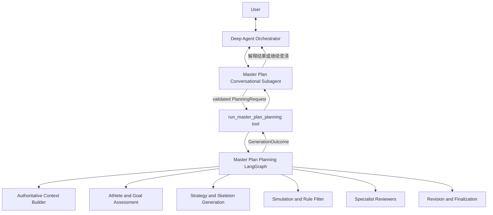
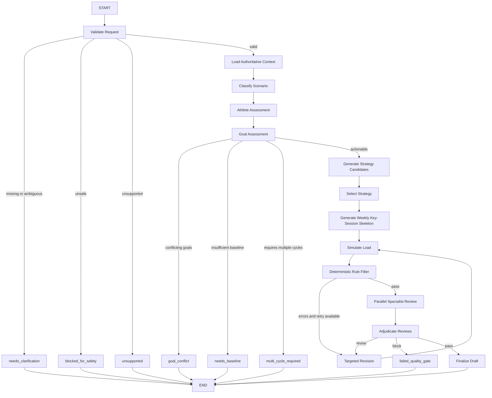

# Coach Agent Architecture

本文定义 Coach Agent 生成 Master Plan 的高层架构与职责边界。具体用户场景及条件分支见 [`scenarios.md`](scenarios.md)。

concepts: [`concepts.md`]

## 设计目标

1. 保留 Deep Agent 在开放式对话、意图理解和信息澄清上的优势。
2. 将高风险、长链路的计划生成交给显式、可重复、可审查的 LangGraph。
3. 避免聊天 Agent 与生成 Graph 同时设计计划，保证只有一个 Master Plan 生成权威。
4. 允许高成本、多模型和多轮修订，以计划质量优先。
5. 固定质量流程，但通过 planning mode、modifier 和合法停止状态适配不同用户。
6. 首期优先跑通 Planning Kernel 并验证计划质量；速度、持久化 checkpoint、断点恢复和 API 稳定性在后续集成阶段优化。

## 架构总览

系统分为 Conversation Plane 和 Planning Plane：



- **Conversation Plane** 负责理解“用户想要什么”，并把自然语言收敛为明确请求。
- **Planning Plane** 负责决定“如何可靠地产出、评审或比较高质量计划 artifact”，不承担开放式聊天。

## Agent 与组件职责

### Deep Agent Orchestrator

**职责**：

- 识别用户意图并选择 QA、Weekly Plan 或 Master Plan 等 specialist。
- 将所有赛季计划创建、延续、重规划、审查和讨论请求路由到 Master Plan Conversational Subagent。
- 保持跨领域对话连贯，并把 specialist 的用户可见结果返回给用户。

**不负责**：

- 不收集 Master Plan 的完整必需字段。
- 不读取或分析训练数据来设计赛季计划。
- 不判断目标现实性、阶段结构或周量。
- 不直接调用 Master Plan Planning LangGraph。
- 不重写、补全或“润色”结构化 Master Plan。

Orchestrator 是路由层，不是计划生成层。

### Master Plan Conversational Subagent

**职责**：

- 处理所有 Master Plan 相关多轮对话。
- 判断用户是创建、延续、重规划、替换、审查、预览还是讨论计划。
- 检查 active plan，并与用户确认继续、重规划或替换意图。
- 收集并确认用户声明的信息：
  - 目标赛事、日期、地点、距离、目标成绩和优先级；
  - 每周可训练天数、固定不可训练日、最长训练时长和双练能力；
  - 用户已知伤病、当前症状、训练偏好和现实日程约束；
  - 多场比赛优先级以及用户对 A/B/C 目标的选择。
- 识别用户请求的 mode hints 和 modifier hints；最终 `resolved_mode`、resolved modifiers 与 workflow decision 由 Planning LangGraph 基于权威上下文决定。
- 将已确认信息归一化为 `MasterPlanGraphRequest`。
- 仅在完整 intake 问卷确认后调用 `run_master_plan_planning` 工具。
- 根据 `MasterPlanGraphOutcome` 向用户继续追问、解释阻断原因、呈现 draft 或讨论修改方向。

**不负责**：

- 不自行生成 phase、周量曲线、milestone 或 weekly skeleton。
- 不把聊天记录拼接成一个自由文本 prompt 交给生成器。
- 不把自己查询到的训练事实转述为 Generation Graph 的权威输入。
- 不绕过 `needs_clarification`、`goal_conflict`、`needs_baseline` 或安全阻断。
- 不直接写入、激活或替换正式 Master Plan。

该 subagent 是用户与确定性生成流程之间的唯一对话接口。

### `run_master_plan_planning` Tool Adapter

**职责**：

- 为 Master Plan Conversational Subagent 暴露单一、结构化的生成入口。
- 从 runtime context 获取 `user_id`、身份和 invocation metadata；模型不得自行提供这些可信字段。
- 校验 `MasterPlanGraphRequest` 的结构和用户确认状态。
- 创建独立 `generation_id`，调用 Master Plan Planning LangGraph。
- 把 Graph 的结构化 `MasterPlanGraphOutcome` 原样返回聊天层。

**不负责**：

- 不做训练学推理。
- 不自动补齐缺失请求字段。
- 不把 Graph 的阻断结果转换为成功。
- 不发布或激活 draft。

它是边界适配器，不是 Agent。

### Master Plan Planning LangGraph

**职责**：

- 加载权威训练上下文。
- 生成结构化 athlete assessment 和 goal assessment。
- 选择适合当前场景的赛季策略。
- 生成战略级 weekly key-session skeleton。
- 执行负荷模拟、确定性规则校验、独立评审和定向修订。
- 只在全部质量门禁通过后产出 Master Plan draft。
- 对无法继续的情况返回结构化停止结果，而不是自行猜测或向用户自由对话。

**不负责**：

- 不解释模糊的自然语言意图。
- 不直接与用户聊天或自行发起开放式追问。
- 不改变已确认的用户目标和约束。
- 不生成逐日 Weekly Plan。
- 不持久化为 active plan。

Planning LangGraph 是 Master Plan 内容的唯一规划权威。

## Planning LangGraph 高层流程



固定的是节点契约和质量门禁，不是每个用户必须走相同训练模板。`planning_mode` 和 modifiers 决定 Strategy、Skeleton、Rule Filter 与 Reviewer 使用的规则集。

Graph 的 state、节点职责、mode 子图、Reviewer 编排和 Revision 协议统一定义在
[`master_plan_langgraph.md`](master_plan_langgraph.md)。本文件只保留系统层级和组件边界，
不重复维护 Graph 内部设计。

## Conversation 与 Generation 的交接契约

### Planning Request

聊天层只传用户声明和明确决策，不传其自行总结的训练事实：

```text
MasterPlanGraphRequest
  requested_mode
  requested_modifiers[]
  goal / races[]
  availability
  injury_declarations[]
  preferences
  active_plan_decision
  user_confirmations
```

可信身份字段（例如 `user_id`）来自 runtime context，不允许模型作为 tool 参数提供。

### Planning Outcome

Graph 只返回以下结构化结果之一：

```text
completed              -> Master Plan draft + assessments + design summary
needs_clarification    -> missing/ambiguous fields and question intents
needs_baseline         -> assessment-block strategy
goal_conflict          -> conflicting goals and required user choice
multi_cycle_required   -> realistic multi-cycle path and negotiation options
blocked_for_safety     -> reasons and prerequisites before planning
unsupported            -> missing planner capability
failed_quality_gate    -> unresolved quality issues
infrastructure_failure -> required model or data source unavailable
```

聊天层负责把结果解释给用户；只有 `completed` 才包含完整 Master Plan draft。

## 数据所有权

| 数据 | 所有者 | 使用方式 |
|---|---|---|
| 用户自然语言意图 | Conversation Plane | 澄清并归一化为用户声明 |
| 用户确认的目标与时间约束 | Planning Request | 规划时视为不可静默修改的约束 |
| 活动、健康、负荷、PB、校准、计划 | Canonical storage | 由 Context Builder 直接读取 |
| Athlete/Goal Assessment | Generation Graph state | 供 Strategy、Reviewer 和最终解释使用 |
| 候选策略与 review issues | Generation Graph private state | 不作为正式计划保存 |
| Master Plan draft | Generation Outcome | 等待用户 review，不自动激活 |
| Active Master Plan | Supported apply/publish workflow | 只有明确确认后才能更新 |

## 状态与持久化边界

- Conversation thread 保存用户对话、澄清结果和最近一次 GenerationOutcome 摘要。
- 每次正式生成创建独立 `generation_id` 和 Graph execution state。
- Generation Graph 不依赖 Conversation message history；其输入必须由结构化 request 完整表达。
- Graph 通过 tool 间接调用时，顶层 Deep Agent 不应依赖查看内部 subgraph state；进度、trace 和重试由 generation execution 独立记录。
- 同一 request 的重试应固定输入版本，避免用户信息或权威数据在无提示情况下漂移。

## 发布边界

生成和发布必须分离：

```text
Generate draft
  -> Present and discuss
  -> User explicitly approves exact revision
  -> Apply/publish through deterministic endpoint
```

任何 LLM Agent 或 Generation Graph 都不能直接激活计划。发布必须校验 user、plan identity、revision 和用户确认，并在冲突时失败。

## 当前架构的迁移方向

目标结构只保留一个 Master Plan Deep Agent specialist：

```text
orchestrator
  -> master_plan conversational subagent
       -> run_master_plan_planning tool
            -> master plan generation LangGraph
```

现有独立 `generate_master_plan` Deep Agent 不应继续承担计划生成职责。其数据分析、skill doctrine 和结构化输出能力应迁移到 Generation LangGraph 的 Context、Assessment、Planner 和 Reviewer 节点中，避免两个生成器拥有重叠权威。
