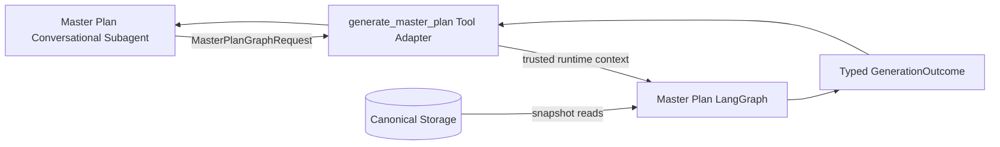
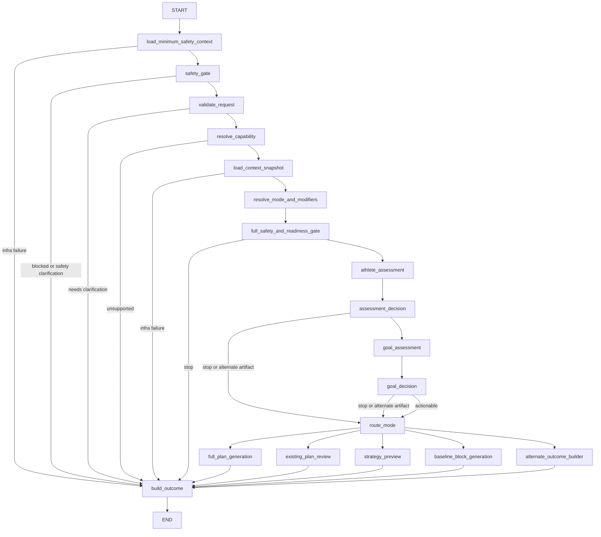
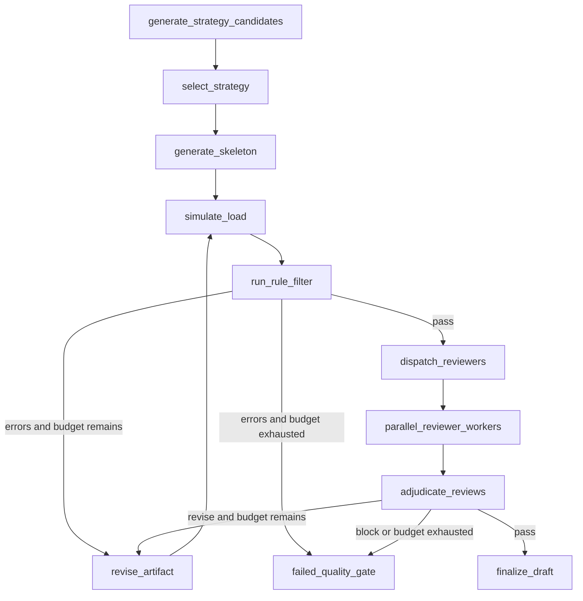

# Master Plan Generation LangGraph

本文定义 Master Plan Generation LangGraph 的系统架构。它位于 [`architecture.md`](architecture.md) 定义的 Generation Plane，由 Master Plan Conversational Subagent 通过结构化 tool adapter 调用。

用户场景与 planning mode 见 [`scenarios.md`](scenarios.md)。本 Graph 只生成或评审战略级 Master Plan artifact，不生成逐日 Weekly Plan，也不直接与用户聊天或发布计划。

## 核心原则

1. **唯一生成权威**：只有本 Graph 可以生成 Master Plan phase、周量曲线、milestone 和 weekly key-session skeleton。
2. **结构化输入**：不读取 Conversation message history，不接受拼接后的自由文本对话作为核心输入。
3. **权威数据直读**：训练事实由 Context Builder 从 canonical storage 加载，不接受聊天 Agent 的自然语言转述作为事实。
4. **固定质量门禁**：Assessment、Strategy、Simulation、Rule Filter、Review 和 Revision 的契约固定。
5. **按场景分流**：Graph 不保证每次都输出完整计划；澄清、基线周期、目标冲突、安全阻断、审查报告和方案预览都是合法结果。
6. **有限修订**：每次 revision 有明确预算和退出条件，不能无限循环。
7. **生成与发布分离**：成功输出永远是 draft 或非计划 artifact，不自动激活。

## 系统边界



Tool Adapter 负责身份和调用边界；Graph 负责训练计划质量；Conversation Subagent 负责向用户解释结果或继续澄清。

## 输入契约

### `MasterPlanGraphRequest`

Request 只携带用户声明、用户选择和外部 artifact 引用：

```text
MasterPlanGraphRequest
  request_id
  requested_mode
  requested_modifiers[]
  goals[]
  availability
  injury_declarations[]
  preferences
  active_plan_action
  source_artifact_ref?
  comparison_hypotheses[]?
  user_confirmations
  requested_as_of?
```

关键语义：

- `requested_mode` 是 Conversation Plane 对用户意图的提示，不是最终分类权威。
- `goals[]` 支持多个赛事及 A/B/C priority。
- `active_plan_action` 明确 `none`、`continue`、`replan_remaining`、`replace` 或 `review_only`。
- `source_artifact_ref` 用于审查现有教练计划或指定 active plan revision；不直接传一段未经校验的长文本。
- `comparison_hypotheses` 只用于 `strategy_preview` / `scenario_comparison`。
- `requested_as_of` 可用于回放和评测；正常生成由系统确定 snapshot 时间。

`user_id`、权限、tenant 和调用者身份来自可信 runtime context，不属于模型可填写的 Request 字段。

## 输出契约

### `MasterPlanGraphOutcome`

所有路径返回统一 envelope：

```text
MasterPlanGraphOutcome =
  | CompletedOutcome
  | ReviewCompletedOutcome
  | PreviewCompletedOutcome
  | NeedsClarificationOutcome
  | NeedsBaselineOutcome
  | GoalConflictOutcome
  | MultiCycleRequiredOutcome
  | BlockedForSafetyOutcome
  | UnsupportedOutcome
  | FailedQualityGateOutcome
  | InfrastructureFailureOutcome
```

### Decision 与 artifact

| Decision | Artifact type | 含义 |
|---|---|---|
| `completed` | `master_plan_draft` | 完整战略级 Master Plan draft 通过质量门禁 |
| `review_completed` | `plan_review_report` 或 `revision_proposal` | 审查现有计划，不自动替换 |
| `preview_completed` | `strategy_comparison` | 假设或策略比较，不产生权威 draft |
| `needs_clarification` | `none` | 用户声明缺失或歧义，需要聊天层追问 |
| `needs_baseline` | `baseline_block` | 先执行 2-4 周评估/重建 block |
| `goal_conflict` | `goal_options` | 用户必须选择赛事优先级或冲突方案 |
| `multi_cycle_required` | `multi_cycle_path` | 单周期不可达，返回多周期路线和目标选项 |
| `blocked_for_safety` | `safety_hold` | 风险阻断正常训练计划 |
| `unsupported` | `capability_gap` | 没有匹配的 discipline planner |
| `failed_quality_gate` | `quality_failure_report` | 修订预算耗尽或存在不可修复问题 |
| `infrastructure_failure` | `none` | 数据源或模型基础设施不可用，不冒充质量失败 |

`decision` 是 discriminator。每个 variant 强制自己的字段：`completed` 必须包含 draft；`needs_clarification` 必须包含非空 questions；`blocked_for_safety` 必须包含 reasons/prerequisites 且不能包含训练 artifact；`needs_baseline` 必须包含 baseline block；`failed_quality_gate` 必须包含 unresolved issues 和 attempt history。

只有 `completed` 可以携带完整 Master Plan draft，schema 必须拒绝 decision 与 artifact 不匹配的组合。

## Context Snapshot

Graph 第一次读取 canonical storage 时创建 immutable `ContextSnapshot`：

```text
ContextSnapshot
  snapshot_id
  user_id
  as_of
  source_versions
  active_plan_revision?
  profile
  injuries
  personal_bests
  running_calibration
  race_history
  long_term_history
  recent_weekly_profile
  fitness_state
  body_composition?
  current_phase
  continuity
  data_coverage
```

窗口要求：

- `long_term_history`：推荐 12-24 个月宏观跑量、峰值、最长跑、比赛和训练中断。
- `recent_weekly_profile`：最近 12-16 周逐周跑量、频次、长跑、质量课、dose、CTL/ATL/form、RHR/HRV 覆盖。

同一 generation 的所有 LLM 节点、Rule Filter、Reviewer 和 Revision 必须使用同一个 snapshot。重试不能静默刷新训练事实；需要新数据时创建新的 generation。

## Graph State

Graph 内部共享结构化 state，节点只返回局部更新。可信身份、tenant 和 repository handles 通过 LangGraph runtime context 注入，不进入 state 或 checkpoint：

```text
MasterPlanGraphState
  request
  safety_context_ref?
  snapshot?
  resolved_mode?
  resolved_modifiers[]
  workflow_decision
  athlete_assessment?
  goal_assessment?
  strategy_candidates[]
  selected_strategy?
  current_artifact?
  simulation_report?
  rule_report?
  review_tasks[]
  review_reports[]
  adjudication?
  issue_history[]
  revision_count
  revision_budget
  final_outcome?
  timings
```

State 中的 snapshot、用户确认目标和用户约束是不可被 LLM 节点修改的事实。`current_artifact` 是唯一允许 Revision 更新的计划内容。

Reducer 必须逐字段定义：`resolved_modifiers`、`strategy_candidates` 和 `review_tasks` 按当前 attempt overwrite；`review_reports` 按 `(artifact_revision, review_task_id)` keyed merge；`issue_history` append immutable records；`timings` 按 node/attempt 累积。不能给所有列表统一使用 append reducer。

## 顶层 Graph



安全按两个阶段执行：先加载最小权威安全上下文，保证安全判断先于 capability、目标冲突和普通信息澄清；完整 snapshot 加载后再用全部训练/健康上下文复核。Assessment 仍可返回 `blocked_for_safety`、`needs_clarification` 或 `needs_baseline`。

### `load_minimum_safety_context`

- 使用 runtime context 中的可信身份读取当前伤病、医学限制和必要健康风险信号。
- 只加载安全判断所需最小数据，不加载完整训练历史。
- 结果写为不可变 `safety_context_ref`；repository handles 不进入 state。
- 数据源不可用时返回 `infrastructure_failure`，不能假定安全后继续。

### `safety_gate`

- 合并用户伤病声明与最小权威安全上下文。
- 急性风险返回 `blocked_for_safety`。
- 安全信息缺失或冲突返回安全类 `needs_clarification`。
- 只有安全门通过后才允许 capability、目标冲突和普通澄清路径终止。

## 节点职责

### `validate_request`

确定性验证：

- 字段格式和用户确认状态；
- 多赛事 priority 是否明确；
- active plan action 是否满足 requested mode；
- review/preview 所需引用或 hypotheses 是否存在；
- 用户声明中的明显矛盾。

输出 `continue` 或 `needs_clarification`。它不读取训练历史，不判断训练能力。

### `resolve_capability`

- 从 capability registry 选择 discipline-specific doctrine、schema、Rule Filter 和 Reviewer policy。
- 例如 road 5K、10K、HM、FM 可以共享基础 Graph，但加载不同专项规则。
- 没有匹配 capability 时返回 `unsupported`，禁止用相邻项目模板替代。

### `load_context_snapshot`

- 调用确定性 repository/context services 读取 canonical storage。
- 创建 immutable snapshot 和 source version manifest。
- 对必需数据源失败返回 `infrastructure_failure`，不能 fallback 到过期或非 canonical 数据。
- 不调用 LLM，不设计计划。

### `resolve_mode_and_modifiers`

- 综合 `requested_mode`、active plan、赛季位置、赛事时间、训练中断和用户约束。
- 输出最终 `resolved_mode`、modifiers 和证据。
- Conversation Plane 只提供 mode hint；本节点是最终分类权威。
- 若最终 mode 与用户请求有实质冲突，返回 `needs_clarification`，不静默改道。

### `full_safety_and_readiness_gate`

- 综合用户声明和权威伤病/健康信息。
- 急性风险返回 `blocked_for_safety`。
- 安全信息缺失返回 `needs_clarification`。
- 获准返跑但耐受未知时追加 `return_to_run` modifier 或进入 baseline path。
- 不进行医疗诊断或生成康复处方。

### `athlete_assessment`

由高能力模型输出结构化 `AthleteAssessment`：

- 当前能力与置信度；
- 当前稳定周量、跑频和长跑/质量课耐受；
- 历史峰值与最近负荷；
- current phase、continuity 和推荐 entry phase；
- 风险、限制因素和需要验证的假设；
- **可行边界**：安全起始周量范围、合理 peak ceiling、允许的长跑/强度边界。

Assessment 只给可行和安全边界，不选择具体周量曲线；具体处方属于 Strategy。

### `assessment_decision`

确定性 + 结构化判断：

- 数据不足但安全边界清楚：`needs_baseline`，路由到 baseline block。
- 审查模式：继续 existing plan review，不要求完整新计划输入。
- preview 模式：继续 strategy comparison。
- 安全或信息问题：返回相应停止 decision。
- 其它 actionable 场景：进入 Goal Assessment。

### `goal_assessment`

输出：

- 目标等级：`supported`、`aggressive_but_plausible`、`conditional`、`multi_cycle_required` 或 `unsafe_or_incompatible`；
- 用户愿景与本周期可执行路径；
- A/B/C targets；
- 目标开放所需的比赛、专项彩排、HR/RPE、伤病和补给 combination gates；
- 多赛事兼容性与取舍。

它不能修改 Request 中已确认目标。

### `goal_decision`

- 多赛事不可兼容：`goal_conflict`。
- 单周期不可达：`multi_cycle_required`。
- 目标需要改为不同默认执行目标但用户尚未确认：`needs_clarification`。
- 可执行或条件性目标：继续对应 mode path。

## Mode 子图

### Mode 路由矩阵

| Resolved primary mode | Subgraph | Typical modifiers |
|---|---|---|
| `general_fitness` | Full Plan Generation | `weight_management` |
| `base_development` | Full Plan Generation | `frequency_limited` |
| `weight_management` | Full Plan Generation | `frequency_limited` |
| `new_season` | Full Plan Generation | injury/environment/frequency modifiers |
| `continue_existing` | Full Plan Generation | continuity modifiers |
| `replan_remaining_season` | Full Plan Generation | missed-training/environment modifiers |
| `race_salvage` | Full Plan Generation | `frequency_limited` |
| `taper_only` | Full Plan Generation | travel/injury modifiers |
| `completion_strategy` | Full Plan Generation | `frequency_limited` |
| `post_race_transition` | Full Plan Generation or Baseline Block | recovery modifiers |
| `return_to_run` | Baseline Block or conditional Full Plan | injury modifiers |
| `multi_race_season` | Full Plan Generation | race-priority modifiers |
| `review_existing_strategy` | Existing Plan Review | requested review dimensions |
| `coach_collaboration` | Existing Plan Review | revision requested/not requested |
| `strategy_preview` | Strategy Preview | hypothesis modifiers |
| `scenario_comparison` | Strategy Preview | hypothesis modifiers |
| `baseline_assessment` | Baseline Block | data-gap modifiers |
| `goal_negotiation` | Alternate Outcome, then Full Plan after confirmation | goal-revision modifiers |
| `multi_cycle_development` | Multi-cycle Path, then Full Plan for confirmed current cycle | long-term-goal modifiers |

`frequency_limited` 统一作为 modifier，而不是 primary mode；它改变 Strategy、Rule Filter 和 Reviewer policy，但不单独决定 artifact 类型。`road_5k`、`road_10k`、`half_marathon`、`marathon` 属于 capability，不与 planning mode 混用。

### Full Plan Generation Subgraph

适用于路由矩阵中标记为 Full Plan Generation 且已满足用户确认条件的请求。



#### Strategy Candidates

- 复杂、高风险或目标激进时生成 2-3 个候选。
- 简单场景允许一个候选，但仍使用同一 `StrategyCandidate` schema。
- 候选只描述 phase sequence、load curve、recovery cadence、专项 progression、milestones、taper、strength 和 nutrition direction。
- 不生成逐周 skeleton。

#### Strategy Selector

- 比较候选与 Assessment 边界、Goal gates、用户约束和 mode policy。
- 输出一个 `SelectedStrategy` 和 trade-off rationale。
- 不生成新候选或自行修改目标。

#### Skeleton Planner

输出完整 active timeline 的战略级 skeleton：

- phase 和自然周连续；
- 每周周量范围；
- 1-3 个适应驱动关键课；
- recovery/taper/race 标记；
- 与同周关键课一致的 milestone；
- 分阶段 strength/durability、nutrition 和 recovery strategy。

不输出普通 easy/recovery/填充跑，也不固定周二、周四等具体执行日。

#### Load Simulator

确定性计算：

- weekly volume ramp 和 recovery/taper drop；
- 关键课、长跑和比赛的预计 dose；
- long-run/dose share；
- CTL/ATL/form 预期轨迹；
- hard-session density；
- peak rehearsal 后吸收和 race-day freshness。

模拟器不修改 artifact。

#### Rule Filter

规则按 capability、resolved mode 和 modifiers 组合：

- schema 和 timeline；
- phase/week/milestone 对齐；
- 周量范围和 load-week ramp；
- recovery cadence 和 taper；
- 关键课密度与专项 progression；
- 长跑占比和 race-week volume；
- 用户频次、时长、伤病和 continuity；
- active plan revision 和 completed phase 不可重写。

所有 error 必须修复；warning 进入 Reviewer context。

### Existing Plan Review Subgraph

适用于 `review_existing_strategy` 和 `coach_collaboration`：

```text
load referenced plan revision
  -> normalize and schema check
  -> simulate load
  -> deterministic rule filter
  -> selected specialist reviewers
  -> review adjudication
  -> plan_review_report or revision_proposal
```

该路径不默认生成替代计划，也不改 active plan。只有用户明确请求候选调整时才生成 typed revision proposal。

### Strategy Preview Subgraph

适用于 `strategy_preview` 和 `scenario_comparison`：

```text
validate hypotheses
  -> derive one strategy per hypothesis
  -> compare feasibility, trade-offs and risks
  -> feasibility/constraint review
  -> strategy_comparison
```

不生成完整 weeks，不返回 Master Plan draft，不触发发布流程。

### Baseline Block Subgraph

适用于 `needs_baseline`、部分 `return_to_run` 和数据不足场景：

- 生成 2-4 周战略级评估/重建 block；
- 定义跑频、easy HR/RPE、长跑耐受、疼痛反应和必要测试 checkpoint；
- 定义何时可重新进入正式 Master Plan generation；
- 不对远期 build/peak 做无条件承诺。
- 运行 safety/injury 与 constraint reviewers，并由 baseline adjudicator 确认 block 可执行且不越过安全边界。

输出 `baseline_block`，decision 保持 `needs_baseline`。

### Alternate Outcome Builders

以下路径不调用 Skeleton Planner：

- `goal_conflict` -> 冲突赛事与必须选择的选项；
- `multi_cycle_required` -> 多周期路径与当前周期候选目标；
- `blocked_for_safety` -> 阻断原因与恢复规划前置条件；
- `unsupported` -> capability gap；
- `needs_clarification` -> 结构化问题 intents，不生成用户措辞。

Conversation Subagent 根据这些 intents 组织自然语言追问。

## Reviewer Orchestration

### Reviewer Policy

不是每个 mode 都运行全部 Reviewer。`review_policy` 根据 resolved mode、modifiers 和已出现的风险生成任务：

| Reviewer | 必选场景示例 |
|---|---|
| Periodization | 所有完整赛季计划 |
| Goal Realism | 有目标成绩或多赛事目标 |
| Load Progression | 所有包含周量和关键课的 artifact |
| Race Specificity | 有目标比赛的完整计划 |
| Injury & Strength | 有伤病、返跑或 durability 限制 |
| Nutrition & Recovery | FM/HM、体重目标、极端环境或长周期 |
| Constraint Grounding | 所有正式 draft 和 existing-plan revision |

Preview 可只运行 feasibility reviewer；baseline block 必须运行 safety/injury 和 constraint reviewer，但不要求完整 periodization review。

### Parallel Fan-out

Graph 使用并行 worker fan-out，每个 Reviewer 接收相同 snapshot、assessment、goal assessment、artifact 和 simulation report，并返回：

```text
ReviewReport
  review_task_id
  reviewer_type
  artifact_revision
  verdict
  issues[]
    severity
    evidence
    target_path
    suggested_action
  confidence
```

每轮 review 先生成带稳定 `review_task_id` 和 `artifact_revision` 的 task set。`review_reports` 使用 keyed reducer 按 `(artifact_revision, review_task_id)` 聚合，禁止最后一个 worker 覆盖其它结果，也禁止旧 artifact 的报告参与当前裁决。

### Adjudication

Adjudicator：

- 合并重复 issues；
- 解决 reviewer 建议冲突；
- 按 mode 排除不适用规则；
- 对安全和硬约束问题提供否决权；
- 输出 `pass`、`revise` 或 `block`。
- 只读取 `artifact_revision == current_artifact.revision` 的 current review set。
- 未重跑 Reviewer 只有在依赖路径未变化时，才可将上一 revision 的 pass 显式 carry forward 为绑定当前 revision 的新记录；否则必须重跑。

它不使用简单多数投票，也不直接修改 artifact。

## Revision Protocol

### Revision Budget

- 默认最多 3 次 artifact revision。
- Rule Filter error 和 Reviewer `revise` 共用预算。
- `revision_count` 每次修改 artifact 后递增。
- 基础设施重试不消耗 revision budget；它使用单独的 retry policy。

### Targeted Revision

Revision Agent 只接收：

- 当前 artifact；
- 当前 unresolved issues；
- snapshot 和不可变约束；
- 已通过且必须保持稳定的 invariants。

Revision 输出完整新 artifact 和 changed paths，但不得修改：

- 用户确认目标与时间约束；
- snapshot facts；
- resolved mode；
- completed phases；
- active plan identity/revision。

修订后必须重新经过 simulation 和 Rule Filter。只重跑受 changed paths 影响的 Reviewer，但 finalize 前必须保留所有必选 Reviewer 的有效 pass。

每个 issue 带稳定 `issue_id`、首次出现 revision、最近出现 revision 和状态。只有相同 `issue_id` 在连续 artifact revisions 中仍未改善，才触发“连续两次未改善”退出条件。

### 退出条件

以下任一情况返回 `failed_quality_gate`：

- revision budget 耗尽且仍有 Rule Filter error；
- Adjudicator 返回不可修复 `block`；
- 同一问题连续两次修订后未改善；
- 修订要求与用户确认约束冲突；
- 生成 artifact 无法满足 capability schema。

Outcome 必须携带 unresolved issues 和 attempt history，不能返回最新 draft 冒充成功。

## Retry 与错误分类

| 错误类别 | 处理方式 |
|---|---|
| 用户可修复的缺失/冲突 | 返回结构化 decision，由 Conversation Plane 追问 |
| 确定性规则失败 | 消耗 revision budget，定向修订 |
| Reviewer 质量问题 | Adjudicate 后定向修订或 block |
| 临时模型/网络错误 | 节点 retry policy，不消耗 revision budget |
| Canonical storage 不可用 | `infrastructure_failure`，不 fallback |
| 未预期实现错误 | 失败并保留 execution trace，不让 LLM 猜测恢复 |

## Finalization

`finalize_draft` 只有满足以下条件才可运行：

1. artifact schema valid；
2. Rule Filter 无 error；
3. 所有当前 mode 必选 Reviewer 有有效 pass；
4. Adjudicator verdict 为 `pass`；
5. artifact 仍匹配 snapshot、active plan revision 和用户确认约束；
6. artifact 是战略级 skeleton，没有混入逐日 Weekly Plan。

Finalizer 输出：

```text
MasterPlanDraftArtifact
  plan
  design_summary
  athlete_assessment_summary
  goal_assessment_summary
  selected_strategy_summary
  snapshot_ref
  quality_report
  artifact_revision
```

Finalizer 不写 active plan。用户确认和发布由 Graph 外部的 deterministic apply/publish workflow 负责。

## Persistence 与可观测性

- 每次 invocation 使用独立 `generation_id` 和 thread/checkpoint namespace。
- Checkpoint 保存结构化 state、节点状态、revision history 和最终 outcome。
- snapshot 通过 `snapshot_id` 引用 immutable input manifest；checkpoint 不把 Conversation history 当生成输入。
- 进度事件至少包含当前 node、resolved mode、iteration、rule/review status，不输出自然语言推理链。
- 通过 Deep Agent tool 间接调用时，Graph 状态独立观察；不要依赖父 Agent 的 subgraph introspection。

## 幂等与并发

- 同一 `request_id + snapshot_id + source_artifact_revision` 重试必须复用或返回同一 generation 结果。
- active plan review/replan 必须记录 expected revision。
- 生成期间 active plan 或 canonical snapshot 发生变化，不改变当前 generation；在呈现或发布前报告 stale，并要求基于新 snapshot 重新生成。
- Graph 不执行发布，因此并发冲突最终由 apply/publish CAS 检查处理。

## 目录建议

高层模块可以按职责组织：

```text
src/coach_agent/src/graphs/master_plan/
  graph.ts
  state.ts
  schemas.ts
  policies.ts
  nodes/
    validateRequest.ts
    loadContextSnapshot.ts
    resolveMode.ts
    safetyGate.ts
    assessAthlete.ts
    assessGoal.ts
    generateStrategies.ts
    selectStrategy.ts
    generateSkeleton.ts
    simulateLoad.ts
    runRuleFilter.ts
    dispatchReviewers.ts
    adjudicateReviews.ts
    reviseArtifact.ts
    finalizeOutcome.ts
  reviewers/
  rules/
  context/
```

目录只是实现建议；系统边界、state 契约和路由语义才是架构约束。

## 非目标

- 不在本 Graph 内处理普通训练问答。
- 不生成 Weekly Plan 的每日训练。
- 不让 Reviewer 或 Revision 直接调用发布工具。
- 不在 Graph 内维护开放式用户对话。
- 不以更多 LLM 调用替代确定性 Rule Filter 或 canonical data。
