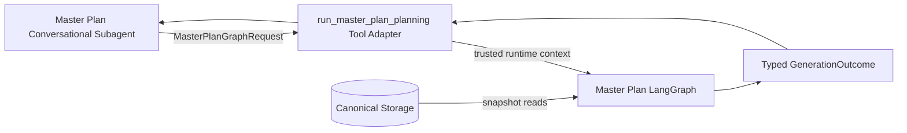
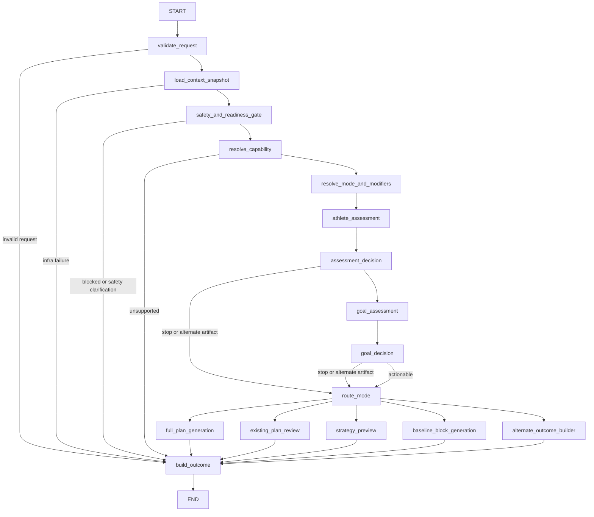
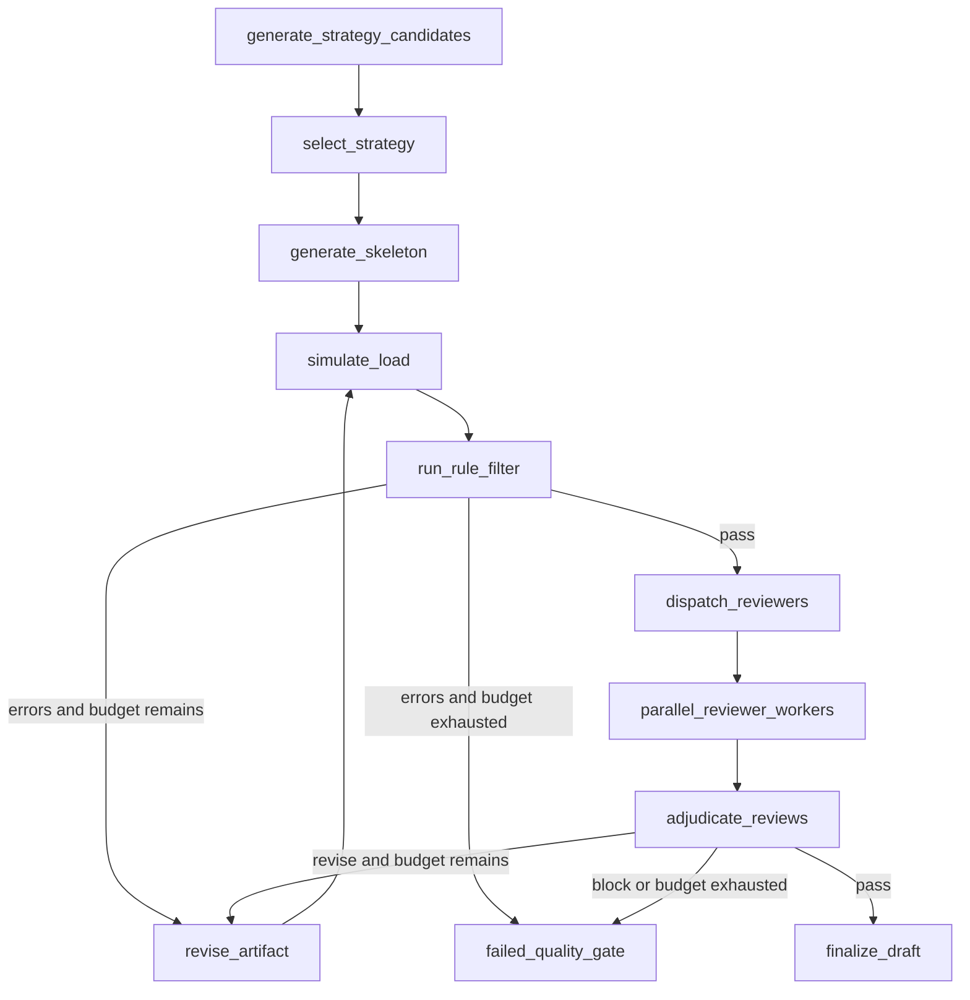

# Master Plan Planning LangGraph

本文定义 Master Plan Planning LangGraph 的系统架构。它位于 [`architecture.md`](architecture.md) 定义的 Planning Plane，由 Master Plan Conversational Subagent 通过结构化 tool adapter 调用。

用户场景与 planning mode 见 [`scenarios.md`](scenarios.md)。本 Graph 只生成或评审战略级 Master Plan artifact，不生成逐日 Weekly Plan，也不直接与用户聊天或发布计划。

## 核心原则

1. **唯一规划权威**：只有本 Graph 可以生成或评审 Master Plan phase、周量曲线、milestone 和 weekly key-session skeleton。
2. **结构化输入**：不读取 Conversation message history，不接受拼接后的自由文本对话作为核心输入。
3. **权威数据直读**：训练事实由 Context Builder 从 canonical storage 加载，不接受聊天 Agent 的自然语言转述作为事实。
4. **固定质量门禁**：Assessment、Strategy、Simulation、Rule Filter、Review 和 Revision 的契约固定。
5. **按场景分流**：Graph 不保证每次都输出完整计划；澄清、基线周期、目标冲突、安全阻断、审查报告和方案预览都是合法结果。
6. **有限修订**：每次 revision 有明确预算和退出条件，不能无限循环。
7. **生成与发布分离**：成功输出永远是 draft 或非计划 artifact，不自动激活。
8. **Quality-first delivery**：首期先跑通完整规划和质量闭环，不以生成速度、断点恢复或 API 运行稳定性作为实现门槛。

## Delivery Scope

架构目标保留正式生成、现有计划审查、策略预览和 baseline block 四种子图，但首个 tracer bullet 只实现：

- `new_season` 到 `master_plan_draft` 的正式生成主路径，并首先用 testing user 做端到端质量验证；
- `needs_clarification`、`needs_baseline`、`goal_conflict`、`multi_cycle_required`、`blocked_for_safety`、`unsupported`、`failed_quality_gate` 和 `infrastructure_failure` 等必要停止结果。

`continue_existing`、`replan_remaining_season`、Existing Plan Review、Strategy Preview 和 Baseline Block 子图属于后续增量。首期 `needs_baseline` 只返回缺失基线、原因和下一步所需信息，不生成 baseline block；接入 Baseline Block 子图后再扩展该 outcome artifact。

首期沿用当前 TypeScript `MasterPlanSchema` 的整体 shape，不同时引入新的 canonical plan schema。唯一已确认的收紧是把 `weeks[].key_sessions[].type` 从自由字符串改为 11 值领域枚举。Skeleton Planner 和 Rule Filter 必须把 key sessions 约束为战略级关键课，而不是逐日完整训练；当前 schema 尚未结构化表达的 `phase_type`、独立 taper 标记、顶层 milestones 和 A/B/C gate 暂不新增字段，后续以独立 schema 演进处理。

Key session type 枚举：`long_run`、`threshold`、`tempo`、`interval`、`vo2max`、`hill`、`race_pace`、`time_trial`、`tune_up_race`、`race`、`strength_key`。包含 MP/HMP/RP 专项段的长跑只输出一个 `long_run`，通过 `intensity`/`purpose` 描述内嵌专项段，不能再加一个重复的 `race_pace` session。

Schema 的实现所有权迁入 `graph/master_plan/schemas.ts`。首期保持现有 shape 不变；旧 `agents/master_plan/schema.ts` 暂时只做 compatibility re-export，Kernel 不反向依赖 Agent 目录，也不复制第二份 schema。

### Eval Gate Before Cutover

新 Kernel 在替换当前一次成稿路径前必须通过 TypeScript eval gate：

- 使用冻结 `ContextSnapshot` fixture，避免真实数据漂移；
- 至少覆盖 testing user、目标明显不现实、伤后返跑、比赛临近、低频训练和多赛事冲突；
- 记录 schema、Rule Filter、7 个 Reviewer 分数、revision 次数和最终 artifact；
- 与当前路径进行同输入对比，并完成人工训练学 review；
- 未达到约定质量门槛时不得切换默认生成路径。

Testing user 的首期验收标准：

- 当前 TypeScript `MasterPlanSchema` 校验通过；
- TS Rule Filter 为 0 error；
- 7 个 Reviewer 均无 block，适用评分维度均至少 4/5；
- 最多 3 次 artifact revision 后达到 `pass` 或 `pass_with_warnings`；
- 人工 review 接受周期结构、负荷进展、比赛专项性、伤病/力量和营养/恢复策略；
- 明确回归当前一次成稿的已知问题：测试赛后缺少吸收、最大长跑位置不合理、taper 降量不足、phase/week 周量不一致和激进目标 gate 过松。

### Deferred Integration Concerns

以下能力推迟到 API 集成和生产化阶段，不属于首期 Kernel 验收范围：

- 生成速度和 token/cost 优化；
- 持久化 checkpoint 与断点续跑；
- 客户端断线后的后台 execution ownership；
- 并行 worker 的局部恢复；
- generation job 查询、通知和取消；
- 跨进程幂等、并发控制和 stale-generation 处理。

首期本地执行失败时允许整轮重跑，优先保证 Graph 路由、结构化契约、Rule Filter、Reviewer 和 Revision 的正确性。

### First Runner

首期不接入 Deep Agent conversational subagent 或 `run_master_plan_planning` tool。先提供本地 runner，使用 testing user 和一份已确认的完整 intake request 直接调用 `createMasterPlanGraph`，把 snapshot、assessment、strategy candidates、review reports、revision history 和最终 draft 保存为本地 eval artifacts。Kernel 质量达标后再进行聊天层和 API 集成。

Runner 类似现有 `test.ts`，在源码中用一个明确的 `local | prod` profile 常量选择要加载的配置，方便手工测试时切换。数据库 host、username、password 等连接信息仍由对应配置文件和环境变量提供，不写入测试源码。Runner 通过注入的 ContextProvider 读取 MySQL，不 fallback 到 SQLite；可复现 eval 使用独立 frozen-snapshot provider。

Runner 使用所选 profile 的当前数据库配置，不额外校验账号权限类型。`MasterPlanContextProvider` 的接口仍严格只读，Planning Kernel 不拥有任何数据库写入或计划发布 port；最终 draft 和中间结果只写本地 eval artifact。

## 系统边界



Tool Adapter 负责身份和调用边界；Graph 负责训练计划质量；Conversation Subagent 负责向用户解释结果或继续澄清。

## 输入契约

### `MasterPlanGraphRequest`

Request 只携带用户声明、用户选择和外部 artifact 引用：

```text
MasterPlanGraphRequest
  request_id
  requested_mode
  requested_modifiers[]
  goals[]
  availability
  injury_declarations[]
  preferences
  active_plan_action
  source_artifact_ref?
  comparison_hypotheses[]?
  user_confirmations
  requested_as_of?
```

关键语义：

- `requested_mode` 是 Conversation Plane 对用户意图的提示，不是最终分类权威。
- `goals[]` 支持多个赛事及 A/B/C priority。
- `active_plan_action` 明确 `none`、`continue`、`replan_remaining`、`replace` 或 `review_only`。
- `source_artifact_ref` 用于审查现有教练计划或指定 active plan revision；不直接传一段未经校验的长文本。
- `comparison_hypotheses` 只用于 `strategy_preview` / `scenario_comparison`。
- `requested_as_of` 可用于回放和评测；正常生成由系统确定 snapshot 时间。

`user_id`、权限、tenant 和调用者身份来自可信 runtime context，不属于模型可填写的 Request 字段。

### Invocation Readiness

Conversation Plane 只有在完整 Master Plan intake 问卷已收集并由用户确认后，才调用 Planning Kernel。常规缺失字段在聊天层补齐，不以反复调用 Kernel 代替 intake。Kernel 的 `needs_clarification` 主要用于发现权威数据冲突、场景不兼容或结构化问卷校验遗漏。

完整问卷必须显式确认：

- 所有目标赛事的名称、地点、距离、日期、目标时间或仅完赛、A/B/C 优先级；
- active plan action；
- 每周可跑天数、可训练星期与时段、固定不可训练日、最大单次时长；
- 是否允许双练、偏好长跑日、每周可用力量训练次数；
- 当前伤病/疼痛、历史伤病及当前状态；
- 近期环境、高原、高温、旅行或工作限制；
- 用户明确训练偏好、禁忌和不可接受安排。

“没有限制”或“无偏好”是合法显式值；字段缺失不是。

## 输出契约

### `MasterPlanGraphOutcome`

所有路径返回统一 envelope：

```text
MasterPlanGraphOutcome =
  | CompletedOutcome
  | ReviewCompletedOutcome
  | PreviewCompletedOutcome
  | NeedsClarificationOutcome
  | NeedsBaselineOutcome
  | GoalConflictOutcome
  | MultiCycleRequiredOutcome
  | BlockedForSafetyOutcome
  | UnsupportedOutcome
  | FailedQualityGateOutcome
  | InfrastructureFailureOutcome
```

### Decision 与 artifact

| Decision | Artifact type | 含义 |
|---|---|---|
| `completed` | `master_plan_draft` | 完整战略级 Master Plan draft 通过质量门禁 |
| `review_completed` | `plan_review_report` 或 `revision_proposal` | 审查现有计划，不自动替换 |
| `preview_completed` | `strategy_comparison` | 假设或策略比较，不产生权威 draft |
| `needs_clarification` | `none` | 用户声明缺失或歧义，需要聊天层追问 |
| `needs_baseline` | 首期 `baseline_requirements`；目标态 `baseline_block` | 首期返回缺失基线与下一步；后续生成 2-4 周评估/重建 block |
| `goal_conflict` | `goal_options` | 用户必须选择赛事优先级或冲突方案 |
| `multi_cycle_required` | `multi_cycle_path` | 单周期不可达，返回多周期路线和目标选项 |
| `blocked_for_safety` | `safety_hold` | 风险阻断正常训练计划 |
| `unsupported` | `capability_gap` | 没有匹配的 discipline planner |
| `failed_quality_gate` | `quality_failure_report` | 修订预算耗尽或存在不可修复问题 |
| `infrastructure_failure` | `none` | 数据源或模型基础设施不可用，不冒充质量失败 |

`decision` 是 discriminator。每个 variant 强制自己的字段：`completed` 必须包含 draft；`needs_clarification` 必须包含非空 questions；`blocked_for_safety` 必须包含 reasons/prerequisites 且不能包含训练 artifact；首期 `needs_baseline` 必须包含 baseline requirements，接入 Baseline Block 子图后才包含 block；`failed_quality_gate` 必须包含 unresolved issues 和 attempt history。

只有 `completed` 可以携带完整 Master Plan draft，schema 必须拒绝 decision 与 artifact 不匹配的组合。

## Context Snapshot

Graph 第一次读取 canonical storage 时创建 immutable `ContextSnapshot`：

```text
ContextSnapshot
  snapshot_id
  user_id
  as_of
  source_versions
  active_plan_revision?
  profile
  injuries
  personal_bests
  running_calibration
  race_history
  long_term_history
  recent_weekly_profile
  fitness_state
  body_composition?
  current_phase
  continuity
  data_coverage
```

窗口要求：

- `long_term_history`：推荐 12-24 个月宏观跑量、峰值、最长跑、比赛和训练中断。
- `recent_weekly_profile`：最近 12-16 周逐周跑量、频次、长跑、质量课、dose、CTL/ATL/form、RHR/HRV 覆盖。

同一 generation 的所有 LLM 节点、Rule Filter、Reviewer 和 Revision 必须使用同一个 snapshot。重试不能静默刷新训练事实；需要新数据时创建新的 generation。

当前实现将完整、结构化且不可变的 `ContextSnapshot` 内嵌在 Graph state/checkpoint 中，以保证恢复和精确复现。Snapshot 只包含规划所需的事实与聚合，不包含 repository handles、认证信息、token 或原始大体量 timeseries；未来只有在 snapshot 体积成为实际问题时，才考虑把大对象外置并改为内容寻址引用。

## Graph State

Graph 内部共享结构化 state，节点只返回局部更新。可信身份、tenant 和 repository handles 通过 LangGraph runtime context 注入，不进入 state 或 checkpoint：

```text
MasterPlanGraphState
  request
  snapshot?
  resolved_mode?
  resolved_modifiers[]
  workflow_decision
  athlete_assessment?
  goal_assessment?
  strategy_candidates[]
  selected_strategy?
  current_artifact?
  simulation_report?
  rule_report?
  review_tasks[]
  review_reports[]
  adjudication?
  issue_history[]
  revision_count
  revision_budget
  final_outcome?
  timings
```

State 中的 snapshot、用户确认目标和用户约束是不可被 LLM 节点修改的事实。`current_artifact` 是唯一允许 Revision 更新的计划内容。

Reducer 必须逐字段定义：`resolved_modifiers`、`strategy_candidates` 和 `review_tasks` 按当前 attempt overwrite；`review_reports` 按 `(artifact_revision, review_task_id)` keyed merge；`issue_history` append immutable records；`timings` 按 node/attempt 累积。不能给所有列表统一使用 append reducer。

## 顶层 Graph



Request 通过纯结构校验后，Graph 只加载一次完整 snapshot，并立即执行安全门。安全判断先于 capability、目标冲突、mode 分类和训练学评估；Assessment 仍可在更深分析中返回 `blocked_for_safety`、`needs_clarification` 或 `needs_baseline`。

## 节点职责

### `validate_request`

确定性验证：

- 字段格式和用户确认状态；
- 多赛事 priority 是否明确；
- active plan action 是否满足 requested mode；
- review/preview 所需引用或 hypotheses 是否存在；
- 用户声明中的明显矛盾。

输出 `continue` 或 `needs_clarification`。它不读取训练历史，不判断训练能力。

### `resolve_capability`

- 从 capability registry 选择 discipline-specific doctrine、schema、Rule Filter 和 Reviewer policy。
- 例如 road 5K、10K、HM、FM 可以共享基础 Graph，但加载不同专项规则。
- 没有匹配 capability 时返回 `unsupported`，禁止用相邻项目模板替代。

### `load_context_snapshot`

- 只调用注入的 `MasterPlanContextProvider.loadSnapshot(userId, asOf)` port；Kernel 不直接读表、不写 SQL，也不组合数据库细节。
- MySQL 查询和领域聚合由 Kernel 外的 storage/persistence adapter 实现，并一次性返回 snapshot。
- 创建 immutable snapshot 和 source version manifest。
- 对必需数据源失败返回 `infrastructure_failure`，不能 fallback 到过期或非 canonical 数据。
- 不调用 LLM，不设计计划。

### `resolve_mode_and_modifiers`

- 综合 `requested_mode`、active plan、赛季位置、赛事时间、训练中断和用户约束。
- 输出最终 `resolved_mode`、modifiers 和证据。
- Conversation Plane 只提供 mode hint；本节点是最终分类权威。
- 若最终 mode 与用户请求有实质冲突，返回 `needs_clarification`，不静默改道。

### `safety_and_readiness_gate`

- 综合用户声明和权威伤病/健康信息。
- 急性风险返回 `blocked_for_safety`。
- 安全信息缺失返回 `needs_clarification`。
- 获准返跑但耐受未知时追加 `return_to_run` modifier 或进入 baseline path。
- 不进行医疗诊断或生成康复处方。

### `athlete_assessment`

先由纯函数从 snapshot 计算版本化 `AssessmentFacts`，包括稳定周量、历史峰值、近期跑频/长跑/质量课、训练中断、当前 PMC、比赛剩余周数和 PB→目标差距等；再由高能力模型基于这些 facts 输出结构化 `AthleteAssessment`：

- 当前能力与置信度；
- 当前稳定周量、跑频和长跑/质量课耐受；
- 历史峰值与最近负荷；
- current phase、continuity 和推荐 entry phase；
- 风险、限制因素和需要验证的假设；
- **可行边界**：安全起始周量范围、合理 peak ceiling、允许的长跑/强度边界。

Assessment 只给可行和安全边界，不选择具体周量曲线；具体处方属于 Strategy。

LLM assessment 必须引用 `fact_id` 作为证据，不能自行重算或虚构指标。确定性 facts 和 LLM 判断分别保存，Reviewer 可以追溯二者。

### `assessment_decision`

确定性 + 结构化判断：

- 数据不足但安全边界清楚：首期直接返回带 requirements 的 `needs_baseline`；后续接入 Baseline Block 子图后再路由生成 block。
- 审查模式：继续 existing plan review，不要求完整新计划输入。
- preview 模式：继续 strategy comparison。
- 安全或信息问题：返回相应停止 decision。
- 其它 actionable 场景：进入 Goal Assessment。

### `goal_assessment`

输出：

- 目标等级：`supported`、`aggressive_but_plausible`、`conditional`、`multi_cycle_required` 或 `unsafe_or_incompatible`；
- 用户愿景与本周期可执行路径；
- A/B/C targets；
- 目标开放所需的比赛、专项彩排、HR/RPE、伤病和补给 combination gates；
- 多赛事兼容性与取舍。

它不能修改 Request 中已确认目标。

### `goal_decision`

- 多赛事不可兼容：`goal_conflict`。
- 单周期不可达：`multi_cycle_required`。
- 目标需要改为不同默认执行目标但用户尚未确认：`needs_clarification`。
- 可执行或条件性目标：继续对应 mode path。

## Mode 子图

### Mode 路由矩阵

| Resolved primary mode | Subgraph | Typical modifiers |
|---|---|---|
| `general_fitness` | Full Plan Generation | `weight_management` |
| `base_development` | Full Plan Generation | `frequency_limited` |
| `weight_management` | Full Plan Generation | `frequency_limited` |
| `new_season` | Full Plan Generation | injury/environment/frequency modifiers |
| `continue_existing` | Full Plan Generation | continuity modifiers |
| `replan_remaining_season` | Full Plan Generation | missed-training/environment modifiers |
| `race_salvage` | Full Plan Generation | `frequency_limited` |
| `taper_only` | Full Plan Generation | travel/injury modifiers |
| `completion_strategy` | Full Plan Generation | `frequency_limited` |
| `post_race_transition` | Full Plan Generation or Baseline Block | recovery modifiers |
| `return_to_run` | Baseline Block or conditional Full Plan | injury modifiers |
| `multi_race_season` | Full Plan Generation | race-priority modifiers |
| `review_existing_strategy` | Existing Plan Review | requested review dimensions |
| `coach_collaboration` | Existing Plan Review | revision requested/not requested |
| `strategy_preview` | Strategy Preview | hypothesis modifiers |
| `scenario_comparison` | Strategy Preview | hypothesis modifiers |
| `baseline_assessment` | Baseline Block | data-gap modifiers |
| `goal_negotiation` | Alternate Outcome, then Full Plan after confirmation | goal-revision modifiers |
| `multi_cycle_development` | Multi-cycle Path, then Full Plan for confirmed current cycle | long-term-goal modifiers |

`frequency_limited` 统一作为 modifier，而不是 primary mode；它改变 Strategy、Rule Filter 和 Reviewer policy，但不单独决定 artifact 类型。`road_5k`、`road_10k`、`half_marathon`、`marathon` 属于 capability，不与 planning mode 混用。

### Full Plan Generation Subgraph

适用于路由矩阵中标记为 Full Plan Generation 且已满足用户确认条件的请求。



#### Strategy Candidates

- 首期正式生成固定产出 2-3 个宏观候选；默认语义为 `conservative`、`balanced`、`aggressive_gated`，不适用的模式可以使用其它清晰命名的真实策略差异。
- 候选必须在 phase/load/risk trade-off 上有实质区别，禁止只改措辞或细小数值。
- 候选只描述 phase sequence、load curve、recovery cadence、专项 progression、milestones、taper、strength 和 nutrition direction。
- 不生成逐周 skeleton。
- 使用 LangGraph `Send` 将每个 strategy brief 分发到独立 LLM worker；worker 共享同一 snapshot、AthleteAssessment 和 GoalAssessment，但看不到其它候选输出。
- `strategy_candidates` 通过 `candidate_id` keyed reducer 聚合，不能依赖并行返回顺序，也不能由最后一个 worker 覆盖。

#### Strategy Selector

- 使用三个并行 Strategy Judges，分别评估 `performance_path`、`safety_and_load`、`constraint_feasibility`，并对所有候选使用同一版本化 rubric。
- 确定性 aggregator 先淘汰违反硬约束或任一 veto 条件的候选，再按预定义权重聚合分数；不让单个 Judge 独占选择权。
- 输出一个 `SelectedStrategy`、各维评分、选择理由及放弃其它方案的 trade-off。
- Judge 和 aggregator 都不能生成新候选、修改候选或静默改变用户目标。
- 首期选择后直接进入 Skeleton Planner，不在中途等待用户确认；用户只 review 最终 draft。若策略要求改变已确认目标，则不能自动选择并继续，而应返回 `needs_clarification` 或 `multi_cycle_required`。

#### Skeleton Planner

输出完整 active timeline 的战略级 skeleton：

- phase 和自然周连续；
- 每周周量范围；
- 1-3 个适应驱动关键课；
- recovery/taper/race 标记；
- 与同周关键课一致的 milestone；
- 分阶段 strength/durability、nutrition 和 recovery strategy。

不输出普通 easy/recovery/填充跑，也不固定周二、周四等具体执行日。

#### Load Simulator

确定性计算：

- weekly volume ramp 和 recovery/taper drop；
- 关键课、长跑和比赛的预计 dose；
- long-run/dose share；
- CTL/ATL/form 预期轨迹；
- hard-session density；
- peak rehearsal 后吸收和 race-day freshness。

首期使用周级确定性模型：根据 skeleton 的周量、关键课类型/距离/时长和 running calibration，把关键课与剩余周量映射为 estimated weekly dose，再复用 canonical STRIDE PMC 公式递推 CTL/ATL/form。所有模拟字段必须标记 `estimated=true`、provenance、算法版本和 confidence，不能伪装成实际训练负荷，也不能由 LLM 自报 dose。

模拟器不修改 artifact。

#### Rule Filter

规则按 capability、resolved mode 和 modifiers 组合：

TS Kernel 的 Rule Filter 在 `graph/master_plan/rules/` 中重新设计和实现，不以现有 Python `master_rule_filter.py` 的行为等价迁移为目标，也不在运行时调用 Python 规则。训练学规则规范统一记录在 [`master_plan_rules.md`](master_plan_rules.md)；TS Rule Filter 是新运行时权威，旧 Python master-plan rules 标记为 legacy 并逐步退役，不维持两个 production verdict 来源。

- schema 和 timeline；
- phase/week/milestone 对齐；
- 周量范围和 load-week ramp；
- recovery cadence 和 taper；
- 关键课密度与专项 progression；
- 长跑占比和 race-week volume；
- 用户频次、时长、伤病和 continuity；
- active plan revision 和 completed phase 不可重写。

所有 error 必须修复；warning 进入 Reviewer context。

### Existing Plan Review Subgraph

适用于 `review_existing_strategy` 和 `coach_collaboration`：

```text
load referenced plan revision
  -> normalize and schema check
  -> simulate load
  -> deterministic rule filter
  -> selected specialist reviewers
  -> review adjudication
  -> plan_review_report or revision_proposal
```

该路径不默认生成替代计划，也不改 active plan。只有用户明确请求候选调整时才生成 typed revision proposal。

### Strategy Preview Subgraph

适用于 `strategy_preview` 和 `scenario_comparison`：

```text
validate hypotheses
  -> derive one strategy per hypothesis
  -> compare feasibility, trade-offs and risks
  -> feasibility/constraint review
  -> strategy_comparison
```

不生成完整 weeks，不返回 Master Plan draft，不触发发布流程。

### Baseline Block Subgraph

该子图是目标态扩展，首期不实现。接入后适用于 `needs_baseline`、部分 `return_to_run` 和数据不足场景：

- 生成 2-4 周战略级评估/重建 block；
- 定义跑频、easy HR/RPE、长跑耐受、疼痛反应和必要测试 checkpoint；
- 定义何时可重新进入正式 Master Plan generation；
- 不对远期 build/peak 做无条件承诺。
- 运行 safety/injury 与 constraint reviewers，并由 baseline adjudicator 确认 block 可执行且不越过安全边界。

输出 `baseline_block`，decision 保持 `needs_baseline`。

### Alternate Outcome Builders

以下路径不调用 Skeleton Planner：

- `goal_conflict` -> 冲突赛事与必须选择的选项；
- `multi_cycle_required` -> 多周期路径与当前周期候选目标；
- `blocked_for_safety` -> 阻断原因与恢复规划前置条件；
- `unsupported` -> capability gap；
- `needs_clarification` -> 结构化问题 intents，不生成用户措辞。

Conversation Subagent 根据这些 intents 组织自然语言追问。

## Reviewer Orchestration

### Reviewer Policy

不是每个 mode 都运行全部 Reviewer。`review_policy` 根据 resolved mode、modifiers 和已出现的风险生成任务：

Reviewer 与 Generator 必须使用隔离的调用上下文和版本化 rubric，但不强制使用不同模型或模型家族；模型选择由依赖配置决定。

每个 Reviewer 在 `doctrine/review/` 拥有独立、版本化的 rubric，明确 axes、evidence 要求、veto、error 和 warning 标准。`ReviewReport` 必须记录 rubric version 与 prompt version；不同 rubric version 的 eval 分数不能直接比较。

| Reviewer | 必选场景示例 |
|---|---|
| Periodization | 所有完整赛季计划 |
| Goal Realism | 有目标成绩或多赛事目标 |
| Load Progression | 所有包含周量和关键课的 artifact |
| Race Specificity | 有目标比赛的完整计划 |
| Injury & Strength | 有伤病、返跑或 durability 限制 |
| Nutrition & Recovery | FM/HM、体重目标、极端环境或长周期 |
| Constraint Grounding | 所有正式 draft 和 existing-plan revision |

Preview 可只运行 feasibility reviewer；baseline block 必须运行 safety/injury 和 constraint reviewer，但不要求完整 periodization review。

首期实现的完整 `master_plan_draft` 路径固定运行表中全部 7 个 Reviewer，且 finalize 前每个 Reviewer 都必须对当前 artifact revision 产生有效 pass。按需裁剪只适用于后续 review/preview/baseline artifact。

### Parallel Fan-out

Graph 使用并行 worker fan-out，每个 Reviewer 接收相同 snapshot、assessment、goal assessment、artifact 和 simulation report，并返回：

```text
ReviewReport
  review_task_id
  reviewer_type
  artifact_revision
  verdict
  issues[]
    severity
    evidence
    target_path
    suggested_action
  confidence
```

每轮 review 先生成带稳定 `review_task_id` 和 `artifact_revision` 的 task set。`review_reports` 使用 keyed reducer 按 `(artifact_revision, review_task_id)` 聚合，禁止最后一个 worker 覆盖其它结果，也禁止旧 artifact 的报告参与当前裁决。

### Adjudication

Adjudicator：

- 合并重复 issues；
- 解决 reviewer 建议冲突；
- 按 mode 排除不适用规则；
- 对安全和硬约束问题提供否决权；
- 输出 `pass`、`revise` 或 `block`。
- 当只剩明确标记为 non-blocking 的 warnings 时，可以输出 `pass_with_warnings`；warning 必须进入最终 quality report。
- 只读取 `artifact_revision == current_artifact.revision` 的 current review set。
- 未重跑 Reviewer 只有在依赖路径未变化时，才可将上一 revision 的 pass 显式 carry forward 为绑定当前 revision 的新记录；否则必须重跑。

它不使用简单多数投票，也不直接修改 artifact。

## Revision Protocol

### Revision Budget

- 默认最多 3 次 artifact revision。
- Rule Filter error 和 Reviewer `revise` 共用预算。
- `revision_count` 每次修改 artifact 后递增。
- 基础设施重试不消耗 revision budget；它使用单独的 retry policy。

### Targeted Revision

Revision Agent 只接收：

- 当前 artifact；
- 当前 unresolved issues；
- snapshot 和不可变约束；
- 已通过且必须保持稳定的 invariants。

首期只有一个综合 Revision Agent。它消费 Adjudicator 已去重、解决冲突并排序的 issue set，一次生成完整的新 artifact revision；不并行合并多个 LLM patch，也不把所有问题原样退回 Skeleton Planner 做无差别重生成。

Revision 输出完整新 artifact 和 changed paths，但不得修改：

- 用户确认目标与时间约束；
- snapshot facts；
- resolved mode；
- completed phases；
- active plan identity/revision。

修订后必须重新经过 simulation 和 Rule Filter。只重跑受 changed paths 影响的 Reviewer，但 finalize 前必须保留所有必选 Reviewer 的有效 pass。

每个 issue 带稳定 `issue_id`、首次出现 revision、最近出现 revision 和状态。只有相同 `issue_id` 在连续 artifact revisions 中仍未改善，才触发“连续两次未改善”退出条件。

### 退出条件

以下任一情况返回 `failed_quality_gate`：

- revision budget 耗尽且仍有 Rule Filter error；
- Adjudicator 返回不可修复 `block`；
- 同一问题连续两次修订后未改善；
- 修订要求与用户确认约束冲突；
- 生成 artifact 无法满足 capability schema。

Outcome 必须携带 unresolved issues 和 attempt history，不能返回最新 draft 冒充成功。

Revision budget 耗尽但仅剩 non-blocking warnings，且无 Rule Filter error、Reviewer block 或安全问题时，可以由 Adjudicator 输出 `pass_with_warnings` 并完成 draft；不能把 error/block 降级为 warning。

## Retry 与错误分类

| 错误类别 | 处理方式 |
|---|---|
| 用户可修复的缺失/冲突 | 返回结构化 decision，由 Conversation Plane 追问 |
| 确定性规则失败 | 消耗 revision budget，定向修订 |
| Reviewer 质量问题 | Adjudicate 后定向修订或 block |
| 临时模型/网络错误 | 节点 retry policy，不消耗 revision budget |
| Canonical storage 不可用 | `infrastructure_failure`，不 fallback |
| 未预期实现错误 | 失败并保留 execution trace，不让 LLM 猜测恢复 |

## Finalization

`finalize_draft` 只有满足以下条件才可运行：

1. artifact schema valid；
2. Rule Filter 无 error；
3. 所有当前 mode 必选 Reviewer 对当前 revision 都有有效且非 block 的 verdict；
4. Adjudicator verdict 为 `pass` 或 `pass_with_warnings`；
5. artifact 仍匹配 snapshot、active plan revision 和用户确认约束；
6. artifact 是战略级 skeleton，没有混入逐日 Weekly Plan。

Finalizer 输出：

```text
MasterPlanDraftArtifact
  plan
  design_summary
  athlete_assessment_summary
  goal_assessment_summary
  selected_strategy_summary
  snapshot_ref
  quality_report
  artifact_revision
```

Finalizer 不写 active plan。用户确认和发布由 Graph 外部的 deterministic apply/publish workflow 负责。

## Persistence 与可观测性

- 每次 invocation 使用独立 `generation_id`，便于日志、评测和 artifact 关联。
- 首期同步运行 Graph 到最终 typed outcome，不实现异步 job/polling。
- 每次 invocation 必须运行到一个 typed outcome 后结束；Kernel 不使用 `interrupt()` 跨用户轮次等待回答。
- `needs_clarification`、`goal_conflict` 和 `multi_cycle_required` 由 Conversation Plane 与用户处理；确认后发起新的 planning invocation，并可引用上一 outcome ID。
- Factory 首期不强制注入持久化 checkpointer；测试或本地调试可以使用 `MemorySaver`，但不承诺跨进程恢复。
- 结构化 outcome、snapshot manifest、revision history 和 reviewer reports 应保留在本地 eval artifact 中，支持质量分析。
- 进度事件至少包含当前 node、resolved mode、iteration、rule/review status，不输出自然语言推理链。
- 通过 Deep Agent tool 间接调用时，Graph 状态独立观察；不要依赖父 Agent 的 subgraph introspection。

## 幂等与并发

首期不实现跨进程幂等与并发恢复。Request、snapshot 和 artifact 仍应携带稳定 ID/revision，为后续 API 集成保留语义；真正的重复请求复用、CAS、stale-generation 和并发冲突处理在生产化阶段设计。

## 目录建议

高层模块可以按职责组织：

```text
src/coach_agent/src/graph/master_plan/
  index.ts
  graph.ts
  state.ts
  schemas.ts
  dependencies.ts
  policies.ts
  context.ts
  assessment.ts
  strategy.ts
  skeleton.ts
  simulation.ts
  review.ts
  revision.ts
  prompts/
  doctrine/
    review/
  reviewers/
  rules/
  context/
    provider.ts
    snapshot.ts
```

目录按稳定领域阶段聚合，不机械地为每个 graph node 创建浅文件。`rules/` 和 `reviewers/` 因包含多个独立实现而拆子目录；系统边界、state 契约和路由语义才是架构约束。

该目录是 Master Plan Planning Kernel 的实现边界。Master Plan Conversational Subagent 和 `run_master_plan_planning` tool adapter 保留在 Kernel 外部，只能通过 Kernel 的公开入口和类型契约调用它。

`context/` 只定义 `MasterPlanContextProvider` port、snapshot schema 和纯领域协议，不包含 MySQL adapter、SQL 或 repository implementation。

MySQL adapter 位于 `src/coach_agent/src/persistence/masterPlanContextProvider.ts`，实现 Kernel port，并复用或扩展 `StrideDataStore`/persistence 的语义方法。Graph 与 tool adapter 都不拥有 SQL。

所有生成、评估、策略、review 和 revision prompt/doctrine 归 Kernel 的 `prompts/` 与 `doctrine/` 单源维护。Master Plan Conversational Subagent 只保留 intake、clarification 和 outcome explanation 规则；现有 Deep Agent `generate-master-plan` skill 的训练学内容迁移完成后删除，不能与 Kernel 维护两套生成 doctrine。

首期 Prompt doctrine 迁移并精简现有 `src/coach/skills/master_plan_planner/` 中已经验证的训练学知识，包括 phase sequence、weekly skeleton、milestones、distance specificity、goal realism、strength 和 nutrition。迁移后的内容复制并重构到 Kernel，运行时不跨目录读取 Python skill；确定性 Rule Filter 仍按新的 [`master_plan_rules.md`](master_plan_rules.md) 独立设计。

### Public API

生产代码只能从该目录的 package barrel 使用：

```text
createMasterPlanGraph(dependencies)
MasterPlanGraphRequest
MasterPlanGraphOutcome
MasterPlanGraphContext
```

- `createMasterPlanGraph` 是唯一执行入口，返回编译后的 Graph。
- Request、Outcome 和 runtime context schema 是唯一公开类型契约。
- nodes、rules、reviewers、subgraphs 和内部 state 不构成公共 API，生产代码不得单独调用它们绕过流程。
- 单元测试可以直接测试内部纯函数，但这不扩大生产 API。

`createMasterPlanGraph(dependencies)` 按角色接收模型依赖，例如 `assessmentModel`、`strategyModel`、`skeletonModel`、`reviewerModel` 和 `revisionModel`。多个角色可以指向同一实际模型实例，但 node 不得读取全局 model config；角色级注入用于独立升级、测试和 A/B。

## 非目标

- 不在本 Graph 内处理普通训练问答。
- 不生成 Weekly Plan 的每日训练。
- 不让 Reviewer 或 Revision 直接调用发布工具。
- 不在 Graph 内维护开放式用户对话。
- 不在 Graph 内实现跨用户轮次的 human-in-the-loop interrupt。
- 不以更多 LLM 调用替代确定性 Rule Filter 或 canonical data。
