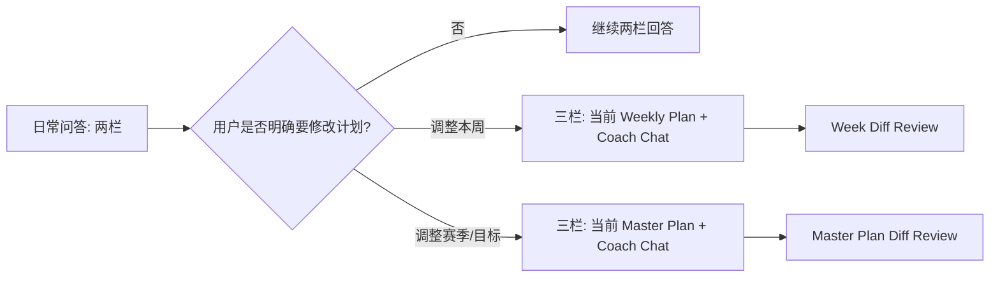

# STRIDE Web Design Rules

**日期**: 2026-07-03  
**范围**: STRIDE Web 端产品设计、Stitch 设计稿补齐与 Review 规则  
**状态**: 已确认基准  
**Stitch 项目**: `STRIDE · Web`  
**设计系统**: `STRIDE Endurance Lab`

## 1. 目的

本文件是 STRIDE Web 端设计准则的主入口。后续所有 Web 端 Stitch 设计稿补齐、重画和深度 Review，都必须以本文为基准。

当前阶段只处理产品设计与 Stitch 设计稿，不针对现有代码做设计，也不进行代码实现。

### 1.1 Stitch 设计源规则

后续设计稿以 Stitch 作为唯一设计源。本地 `frontend/design/` 目录中的 HTML 和 README 只作为导出物、审阅快照与归档索引，不作为新的设计源。

标准流程:

1. 在 Stitch 中编辑、生成或修正设计稿。
2. 将确认后的设计稿 HTML 下载到 `frontend/design/` 对应场景目录。
3. 本地只做文件命名、故事顺序整理、README 索引和一致性检查。
4. 不直接手改本地 HTML 作为最终设计稿来源。

如果为了快速 Review 临时修改了本地 HTML，必须标记为临时调整，并在设计确认前同步回 Stitch；只有 Stitch 中的版本更新后，才视为正式设计稿。

### 1.2 Stitch MCP 操作规范

本仓库的正式设计修改必须通过 Stitch MCP 完成。Codex 环境中已配置 `stitch` MCP server，地址为 `https://stitch.googleapis.com/mcp`；认证信息来自本机 Codex 配置，不写入仓库文档或设计稿文件。

使用原则:

1. 先用 Stitch MCP 读取项目和屏幕，再决定编辑、重画或新增。
2. 修改已有设计稿时，优先使用 `edit_screens`，不要从零重生成同一页面。
3. 每次 Stitch 编辑前，需要明确目标 screen、页面职责、必须保留的产品能力、禁止出现的文案和 CTA 归属。
4. Stitch 返回新 screen 后，下载 HTML 到 `frontend/design/` 对应场景目录，作为本地 Review 快照。
5. 本地 HTML 只能用于查看、命名、归档和 README 索引；不得把手改本地 HTML 当成正式设计结果。
6. 如果 Codex 工具面板没有直接暴露 `mcp__stitch__...` 工具，可以按 MCP JSON-RPC 协议直接调用 `https://stitch.googleapis.com/mcp`。
7. Stitch 返回值可能是完整设计稿，也可能只是异步 session / update 事件；如果没有返回可下载 artifact，必须再用 `get_screen` 拉取最新 screen。
8. 本地正式导出只保留 HTML，并确保 README 中的故事顺序、页面名和文件名一致。

常用 MCP 调用顺序:

1. `initialize`: 初始化 MCP 连接。
2. `tools/list`: 确认可用工具，至少应包含 `list_projects`、`list_screens`、`get_screen`、`edit_screens`、`generate_screen_from_text`、`list_design_systems`。
3. `tools/call` + `list_projects`: 找到 `STRIDE · Web`，当前项目 ID 为 `9898197682875783129`。
4. `tools/call` + `list_design_systems`: 确认设计系统 `STRIDE Endurance Lab`，当前设计系统 ID 为 `assets/78bc062efcff47b5944c094f5db74850`。
5. `tools/call` + `list_screens`: 找到目标 screen ID。
6. `tools/call` + `get_screen`: 检查当前 screen 的 title、尺寸、HTML、截图预览和现有结构。
7. `tools/call` + `edit_screens`: 对目标 screen 做定向修改。
8. 如果是缺失页面，用 `generate_screen_from_text` 生成新 screen，并传入 STRIDE 设计系统 asset ID。
9. 检查返回的 `outputComponents`、screen ID、title、尺寸、`htmlCode.downloadUrl` 和截图预览。
10. 下载 Stitch 返回的 HTML 到 `.stitch/designs/`，再按故事顺序保存到 `frontend/design/` 对应场景目录。
11. 更新 `frontend/design/README.md` 和对应场景 README 中的故事顺序。
12. 运行可见文案审计，确认没有 `Draft`、`草稿`、`赛季总纲`、`赛季总览`、`待确认`、`ACTIVE`、`Master Plan Creation`、`DRAFT REVIEW` 等对用户暴露的旧文案。

MCP JSON-RPC 调用格式示例:

```json
{
  "jsonrpc": "2.0",
  "id": 1,
  "method": "tools/call",
  "params": {
    "name": "edit_screens",
    "arguments": {
      "projectId": "9898197682875783129",
      "selectedScreenIds": ["SCREEN_ID"],
      "deviceType": "DESKTOP",
      "modelId": "GEMINI_3_1_PRO",
      "prompt": "对目标页面进行定向编辑的增强 prompt"
    }
  }
}
```

编辑 prompt 必须遵守:

- 不暴露 `Draft`、`草稿` 等内部概念，统一使用 `计划`、`新计划`、`调整后的计划`、`审阅计划调整`。
- Master Plan 统一称为 `赛季训练计划`，不用 `赛季总纲`。
- 三栏场景中，中栏是计划查看 / Review / Diff Review 主工作区，右栏是 Coach Chat。
- 最终确认 CTA 只放中栏，且统一为 `启用计划`。
- 左侧导航栏只承载产品导航和入口，不放创建进度、Review 进度或 Draft 进度。
- 设计稿要遵循 `STRIDE Endurance Lab`，保持信息密度、清晰层级、1px border、8px radius 和功能性颜色。

Stitch 返回后必须记录或转述 `outputComponents` 中的文字说明和建议，用于 Review 追踪。

导出验收标准:

- 每个设计页面都有 `.html` 快照；本地 `frontend/design/` 不保留截图。
- `frontend/design/README.md` 的链接都能指向真实文件。
- 文件名前缀按用户故事顺序排列，例如 `1_xxx.html`、`2_xxx.html`。
- 本地导出物只反映 Stitch 中已经存在的设计，不包含只在本地手改过的正式差异。
- 用户可见文案符合本文术语约束，尤其是统一使用 `赛季训练计划`。

## 2. 核心原则

布局由任务类型决定，而不是由入口决定。

- 日常 AI / Coach 交流: 两栏。
- 涉及当前计划、Plan Review、Diff Review: 三栏。
- 新用户从空白创建计划时，先两栏；计划生成完成后，由用户点击进入三栏。
- 存量用户调整计划时，从点击调整计划开始就是三栏，因为中间可以展示当前 Master Plan。
- 用户调整本周课表时，从点击调整开始也是三栏，因为中间可以展示当前 Weekly Plan。

一句话规则:

> 日常问答和从零信息收集用两栏；凡是用户在查看、修改、确认某个计划实体，就用三栏。

## 3. 计划实体层级

Web 端 Coach 体验围绕两个计划实体展开。

- `Master Plan`: 赛季训练计划、目标比赛、阶段安排、长期训练结构。
- `Weekly Plan`: 本周课表、具体训练日、单次训练、短期负荷安排。

两者都可以被查看、调整、审阅和确认，因此都可以触发三栏工作区。日常问答默认不改变计划实体，继续使用两栏。

调整边界:

- 改 Master Plan: 影响赛季目标、周期结构、阶段重点、比赛安排。
- 改 Weekly Plan: 只影响本周课表和短期恢复，不默认改赛季训练计划。
- 如果 Weekly Plan 调整会明显冲击 Master Plan，中栏需要显示影响提示，例如 `可能影响本阶段关键课完成率`。
- 只有用户明确确认，才把 Weekly Plan 调整上升为 Master Plan 调整。

## 4. 布局模式

### 4.1 两栏模式: Coach Workspace

用于没有可审阅计划内容、主要任务是和 Coach 对话的场景。

结构:

- 左栏: 产品导航、计划入口、当前状态、会话入口；不承载创建进度。
- 右栏: Coach Chat，类似 ChatGPT 的主对话区；不展示常规创建进度条，只有生成中等耗时状态才在聊天区展示等待引导。

适用场景:

- 新用户创建计划。
- Coach 追问信息。
- 新用户训练计划生成中。
- 新用户计划生成完成但尚未点击查看。
- 日常 Coach 交流。
- 没有明确计划审阅上下文的普通问答。

### 4.2 三栏模式: Plan Review Workspace

用于用户需要对计划内容进行查看、调整、审阅或确认的场景。

结构:

- 左栏: 产品导航、当前计划状态、版本入口；不承载 Review 或生成进度。
- 中栏: 当前计划 / Plan Review / Diff Review 主工作区。
- 右栏: Coach Chat，用于解释、追问、收集反馈、触发再生成；不放常规流程进度条，只有生成中或更新中状态才展示明确的等待引导。

适用场景:

- 新用户查看训练计划。
- 存量用户点击调整计划后查看当前 Master Plan。
- 用户点击调整本周课表后查看当前 Weekly Plan。
- 调整方案生成中。
- Plan Review。
- Diff Review。
- 用户对计划或 Diff 提反馈。
- 用户确认启用新版计划。

## 5. 核心场景

STRIDE Web 端当前核心场景:

1. 新用户生成 Master Plan。
2. 老用户修改 Master Plan。
3. 用户有 Master Plan 后，对生成的本周课表进行调整。
4. 用户的日常问答。

### 5.1 场景路由矩阵

| 场景 | 入口 | 初始布局 | 中栏职责 | 右栏职责 | 结果 |
| --- | --- | --- | --- | --- | --- |
| 新用户生成 Master Plan | 创建计划 / 首次进入 | 两栏 | 无中栏 | Coach 收集信息、追问、生成完成提示 | 用户点击后进入 Plan Review |
| 老用户修改 Master Plan | Master Plan 首页 `调整计划` | 三栏 | 当前 Master Plan，随后切换为 Diff Review | Coach 收集调整意图、解释变化、接收反馈 | 新版 Master Plan 生效 |
| 调整本周课表 | 本周课表页 `调整本周` | 三栏 | 当前 Weekly Plan，随后切换为 Week Diff Review | Coach 收集短期调整意图、解释变化、接收反馈 | 新版 Weekly Plan 生效 |
| 日常问答 | Coach Chat / 全局入口 | 两栏 | 无中栏 | Coach 回答、解释、复盘、做风险分流 | 保持问答，或由用户确认升级为计划调整 |

### 5.2 路由判断顺序

设计稿中遇到边界场景时，按以下顺序判断布局和页面状态。

1. 用户是否正在查看、审阅、修改或确认某个计划实体？如果是，使用三栏。
2. 用户是否是新用户、且尚未看到可审阅计划？如果是，使用两栏。
3. 用户是否只是提问、解释、复盘或咨询？如果是，使用两栏。
4. 用户是否明确要求修改目标、周期、阶段重点或比赛安排？如果是，进入 Master Plan 三栏调整。
5. 用户是否明确要求修改本周训练日、单次训练、恢复安排或短期强度？如果是，进入 Weekly Plan 三栏调整。
6. Coach 不能仅因为识别到风险就自动切换到三栏；必须让用户理解并确认要调整哪一个计划实体。

### 5.3 设计稿优先级

后续补齐 Stitch 设计稿时，优先级按用户任务闭环排序。

1. 先补齐 Master Plan 新用户闭环: 信息收集、生成等待、完成提示、Plan Review、启用成功。
2. 再补齐存量用户 Master Plan 调整闭环: 当前计划、调整意图、生成等待、Diff Review、启用成功。
3. 再补齐 Weekly Plan 调整闭环: 当前周课表、调整意图、生成等待、Week Diff Review、启用成功。
4. 最后补齐日常问答高频状态: 基本训练问题、疲劳状态、伤病疼痛、从问答升级到调整。

### 5.4 设计稿资产策略

补齐 Stitch 设计稿时，先 Review 现有页面，再决定保留、微调、重画或新增，避免重复生成同类页面。

判断口径:

- `保留`: 已符合两栏 / 三栏规则，核心任务清晰，CTA 归属正确，仅需要在 Review 文档中记录。
- `微调`: 页面结构方向正确，但信息层级、CTA 权重、状态文案或左右 / 中右职责需要修正。
- `重画`: 页面违反核心布局规则，或把聊天、当前计划、Review 任务混在同一栏，导致用户无法理解主任务。
- `新增`: 当前 Stitch 项目没有覆盖该状态，尤其是 Weekly Plan 调整和日常问答高频状态。

每个核心场景至少需要覆盖三个层级:

- 入口态: 用户从哪里进入，当前是在问问题、创建计划、调整 Master Plan，还是调整 Weekly Plan。
- 工作态: Coach 收集信息、追问、生成中、解释变化、接收反馈。
- 决策态: 用户查看 Plan Review / Diff Review，并在正确的主工作区确认或放弃。

页面命名建议:

- `Master Plan / New User / Intake`
- `Master Plan / New User / Plan Ready`
- `Master Plan / New User / Plan Review`
- `Master Plan / Existing / Current Plan Adjust`
- `Master Plan / Existing / Diff Review`
- `Weekly Plan / Current Week Adjust`
- `Weekly Plan / Week Diff Review`
- `Coach Chat / Daily QA / Metrics`
- `Coach Chat / Daily QA / Fatigue`
- `Coach Chat / Daily QA / Pain Triage`
- `Coach Chat / Escalation / To Weekly Plan`
- `Coach Chat / Escalation / To Master Plan`

## 6. 新用户生成 Master Plan


规则:

1. 新用户创建计划时使用两栏。
2. 左栏只显示产品导航和计划入口，不放创建进度。
3. 右栏由 Coach 收集目标比赛、备选赛事、地点、日期、训练背景；不放常规创建进度条。
4. Coach 追问使用结构化问题卡，用户直接在聊天区回答，不跳到独立表单页。
5. 生成中继续使用两栏，聊天区展示生成步骤、预计耗时、当前处理内容。
6. 生成完成后不自动跳三栏，而是在聊天区显示完成卡片。
7. 用户点击 `查看计划` 后，才进入三栏 Plan Review。
8. 用户确认后进入 Master Plan 首页。
9. Master Plan 首页只展示已启用计划，不混入 Plan Review 任务。

### 6.1 生成完成卡片

新用户生成完成后，右侧聊天区展示完成卡片。

卡片内容:

- 标题: `训练计划已生成`
- 摘要: 目标赛事、周期长度、每周训练天数、关键训练重点。
- 主 CTA: `查看计划`
- 次 CTA: `稍后查看`
- 辅助说明: `计划尚未启用，确认后才会成为你的 Master Plan`

交互规则:

- 不自动跳转三栏，避免打断用户。
- 可以自动滚动到完成卡片或给出轻提示。
- 用户离开后再次回来，应能通过训练计划入口继续查看待确认计划，不需要额外展示创建进度条。

## 7. 老用户修改 Master Plan


规则:

1. 存量用户在 Master Plan 首页点击 `调整计划` 后，直接进入三栏。
2. 中栏先展示当前 Master Plan，而不是空白 Review。
3. 右栏是 Coach Chat，用户表达调整意图。
4. Coach 可以追问，也可以在信息足够时生成调整方案。
5. 生成中仍保持三栏，中栏保留当前计划，并展示生成状态。
6. 新计划生成后，中栏切换为 Diff Review。
7. 用户反馈走右栏聊天输入，不在中栏形成并列决策按钮。
8. 用户确认走中栏唯一主 CTA `启用计划`。
9. 启用后回到 Master Plan 首页，并展示新版计划已生效。

## 8. 调整本周课表


规则:

1. 用户已经有 Master Plan 后，本周课表是从 Master Plan 派生出来的短周期计划。
2. 用户在本周课表页点击 `调整本周` 后，直接进入三栏。
3. 中栏先展示当前 Weekly Plan，而不是空白 Review。
4. 右栏是 Coach Chat，用户表达短期调整意图。
5. Coach 可以追问，也可以在信息足够时生成本周调整方案。
6. 生成中仍保持三栏，中栏保留当前周课表，并展示生成状态。
7. 新计划生成后，中栏切换为 Week Diff Review。
8. 用户反馈走右栏聊天输入，不在中栏形成并列决策按钮。
9. 用户确认走中栏唯一主 CTA `启用计划`。
10. 启用后回到本周课表页，并展示新版本周课表已生效。

典型调整意图:

- `这周三出差，能不能挪开？`
- `最近很累，降低一点强度。`
- `周末想参加一个 10K 测试。`
- `今天没完成训练，后面怎么调？`

Week Diff Review 必须说明:

- 哪些训练被移动、删除、替换或降强度。
- 本周训练量、强度、恢复安排如何变化。
- 是否影响本阶段关键训练目标。
- 是否需要上升为 Master Plan 调整。

### 8.1 本周课表调整的信息架构

本周课表调整是一个短周期计划工作区，不是 Master Plan 的简化版。

左栏需要展示:

- 当前所在位置: `本周课表` / `调整本周`。
- 本周版本号和生效状态。
- 本周关键目标，例如 `巩固有氧基础`、`保留一次阈值课`。
- 返回 Master Plan 和版本历史的入口。

中栏需要优先展示:

- 周一到周日的训练安排。
- 每天训练类型、预计时长、强度、关键备注。
- 本周总跑量、强度分布、恢复日数量。
- 被调整的训练项和变化原因。
- 与 Master Plan 的影响提示。

右栏需要负责:

- 收集用户短期约束，例如出差、疲劳、未完成训练、临时比赛。
- 用结构化问题卡追问必要信息。
- 解释某一处训练为什么移动、删除、替换或降强度。
- 接收反馈并由 Coach 触发计划更新。

### 8.2 Weekly Plan 与 Master Plan 的边界

Weekly Plan 调整默认只改变本周，不默认改变赛季训练计划。

需要保留在 Weekly Plan 的情况:

- 用户只是临时出差、加班、疲劳、未完成一次训练。
- 调整只影响本周训练日、单次训练或恢复安排。
- 本周关键目标仍然可以完成，或影响可以被 Coach 接受。

需要提示升级到 Master Plan 调整的情况:

- 连续多周无法完成关键课。
- 目标比赛、备选赛事或比赛日期发生变化。
- 用户明确说想降低整个周期强度、改变赛季目标或重排训练阶段。
- 本周调整会让阶段关键目标明显失效。

升级交互规则:

- 中栏显示影响提示，不直接切走当前 Review。
- 右栏由 Coach 解释为什么可能需要调整 Master Plan。
- 用户确认后，才进入 Master Plan 三栏调整。

## 9. 日常问答

日常问答默认使用两栏。

适用问题:

- `今天跑完膝盖有点不舒服怎么办？`
- `为什么我的节奏跑安排在周五？`
- `半马配速应该怎么定？`
- `这周睡眠不好，会影响训练吗？`

规则:

1. 只要用户是在提问、解释、复盘或咨询，就保持两栏 Coach Workspace。
2. Coach 可以引用计划上下文，但不直接进入 Review 工作区。
3. 只有当用户明确表达修改意图时，才切入对应三栏场景。
4. 修改目标比赛、赛季结构、阶段重点时，进入 Master Plan 调整。
5. 修改本周训练日、单次训练、短期负荷时，进入 Weekly Plan 调整。

### 9.1 高频问答类型

#### 基本训练问题

示例:

- `我最近练得怎么样？`
- `我这个月跑量多少了，平均配速多少？`
- `我今天早上的节奏跑跑得怎么样？`

布局规则:

- 使用两栏 Coach Workspace。
- 左栏展示导航、当前计划摘要、近期训练入口。
- 右栏展示 Coach 回答。

回答结构:

- 先给结论，例如 `最近 4 周训练稳定，但高强度恢复略紧`。
- 再给关键指标，例如月跑量、平均配速、完成率、强度分布。
- 再给解释，例如和 Master Plan / Weekly Plan 的关系。
- 最后给下一步建议，例如继续观察、调整本周、查看详情。

交互要求:

- 可以引用数据卡片，但不进入 Review。
- 可以提供 `查看本周课表`、`调整本周` 等入口。
- 只有用户点击或明确表达调整意图，才进入三栏。

#### 运动状态 / 疲劳

示例:

- `我感觉有点累。`
- `我有点跑不动。`
- `最近训练状态很差。`

布局规则:

- 默认两栏。
- Coach 先做状态分流，不直接修改计划。

回答结构:

- 识别用户状态: 疲劳、睡眠、压力、训练负荷、近期完成率。
- 给出短期建议: 降低强度、保留轻松跑、增加恢复、观察 24-48 小时。
- 询问是否要调整本周课表。

升级规则:

- 如果用户只是咨询，保持两栏。
- 如果用户说 `帮我把这周调轻一点`，进入 Weekly Plan 三栏调整。
- 如果用户说 `我想把整个训练周期降强度`，进入 Master Plan 三栏调整。

#### 伤病 / 疼痛

示例:

- `我跟腱疼。`
- `跑完膝盖不舒服。`
- `小腿有点刺痛。`

布局规则:

- 默认两栏。
- Coach 先做风险分流和安全建议，不把疼痛当作普通训练反馈处理。

回答结构:

- 询问疼痛位置、程度、持续时间、是否影响走路、是否有肿胀或锐痛。
- 给出保守建议，例如暂停高强度、避免硬扛、必要时就医。
- 明确说明 Coach 不能替代医疗诊断。
- 询问是否需要临时调整本周训练。

升级规则:

- 短期训练避让进入 Weekly Plan 三栏调整。
- 长期康复期、比赛目标变化或周期重排进入 Master Plan 三栏调整。

### 9.2 从日常问答升级到计划调整



升级前需要让用户理解三件事:

- 即将调整的是 Master Plan 还是 Weekly Plan。
- 这次调整会影响哪些训练内容。
- 用户仍然需要在中栏 Review 中确认后才会生效。

升级入口文案建议:

- `调整本周课表`
- `调整赛季训练计划`
- `先继续问 Coach`

## 10. 三栏中栏状态

中栏根据阶段变化:

- 存量用户刚进入调整: `当前 Master Plan`
- 调整方案生成中: `当前 Master Plan + 生成状态`
- 调整计划生成完成: `Diff Review`
- 新用户计划审阅: `Plan Review`
- 用户调整本周课表: `当前 Weekly Plan`
- 本周调整方案生成中: `当前 Weekly Plan + 生成状态`
- 本周调整计划生成完成: `Week Diff Review`
- 用户反馈后重新生成: `计划更新中`
- 接受成功: 回到 `Master Plan 首页`
- 本周调整接受成功: 回到 `本周课表页`

## 11. CTA 归属

- 两栏模式下，主要 CTA 可以在右侧聊天区；不展示常规创建进度条。
- 三栏模式下，最终确认区必须在中栏，并且只保留一个主按钮。
- 计划 Review / Diff Review 的最终确认按钮统一使用 `启用计划`。
- 中栏最终确认区不能并列出现 `提交反馈`、`放弃调整`、`稍后确认`、`重新生成计划` 等按钮。
- 右栏 Coach Chat 不提供快捷决策按钮；反馈、解释和再生成意图通过聊天输入表达；常规创建进度条不展示，生成中或更新中只展示必要等待引导。

## 12. Review 规则

### 12.1 Plan Review

Plan Review 中栏负责回答:

- 这个 Master Plan 是什么？
- 为什么这样安排？
- 用户需要确认什么？
- 有哪些风险或注意事项？
- 如何反馈或接受？

新用户审阅赛季训练计划时，尚未生成可执行的 Weekly Plan，因此中栏不能出现 `训练周列表` 入口或视图切换；只展示赛季训练计划本身。

### 12.2 Master Plan Diff Review

Diff Review 中栏负责回答:

- 从哪个版本变到哪个版本？
- 哪些内容新增、删除、修改？
- 对训练量、强度、比赛目标、恢复安排有什么影响？
- 用户是否可以接受这些变化？

Diff Review 必须突出变化，而不是重新展示一整份计划。

需要包含:

- 版本关系: `当前计划 v3` -> `调整方案 v4`
- 变化摘要: 变化数量、影响范围、风险级别。
- 分组 Diff: 目标赛事、训练周期、训练强度、关键课、恢复周、比赛周。
- 单项状态: 新增、删除、修改、受影响。
- 单项操作: 询问 Coach、提出反馈、定位到相关计划段落。
- 主 CTA: `启用计划`

### 12.3 Week Diff Review

Week Diff Review 中栏负责回答:

- 本周课表从哪个版本变到哪个版本？
- 哪些训练被移动、删除、替换、降强度或新增？
- 对本周训练量、强度分布、恢复安排有什么影响？
- 对 Master Plan 的阶段目标是否有影响？
- 用户是否可以接受这些变化？

Week Diff Review 必须突出本周变化，不重新展示整份赛季计划。

需要包含:

- 版本关系: `当前周计划 v7` -> `本周调整方案 v8`
- 变化摘要: 变化数量、影响训练日、负荷变化、风险提示。
- 日历 / 列表 Diff: 按周一到周日展示变化。
- 单项状态: 移动、删除、替换、降强度、新增、保留。
- 单项操作: 询问 Coach、提出反馈、查看与 Master Plan 的关系。
- 主 CTA: `启用计划`

## 13. Master Plan 首页规则

Master Plan 首页不是聊天页，也不是 Review 页。

它负责:

- 展示当前已启用计划。
- 展示目标比赛、周期进度、近期训练重点。
- 提供 `调整计划` 入口。
- 提供进入本周课表的入口。
- 提供版本历史入口。
- 提示是否有未完成计划或待审阅调整。

它不负责:

- 展开复杂 Coach 对话。
- 展示完整 Plan Review。
- 承担 Diff Review。

## 14. 本周课表页规则

本周课表页不是 Master Plan Review 页。

它负责:

- 展示当前已启用的 Weekly Plan。
- 展示本周每天的训练安排、关键课、休息日和力量训练。
- 展示本周训练量、强度分布和恢复提示。
- 展示训练计划、日历、力量训练、训练记录、本周反馈等核心工作区入口。
- 展示手表推送能力，包括 `一键推送本周训练`、单次训练 `推送到手表`、`已推送`、`暂不可推送` 或 `无需推送` 状态。
- 展示本周已完成训练记录，并说明训练记录与计划训练的匹配关系。
- 支持用户写入或编辑本周训练反馈，反馈入口不能被隐藏到不易发现的位置。
- 提供 `调整本周` 入口。
- 提示是否有未完成的本周调整方案。

它不负责:

- 修改目标比赛或赛季训练计划。
- 展开完整 Master Plan Review。
- 承担 Master Plan Diff Review。

## 15. 状态覆盖

后续 Stitch 设计稿至少要覆盖:

- 新用户信息收集。
- Coach 追问。
- 生成中。
- 生成完成待查看。
- 新用户 Plan Review。
- 用户确认启用。
- 存量用户当前计划调整入口。
- 调整意图对话。
- 调整方案生成中。
- Diff Review。
- 用户反馈后计划更新。
- 启用计划成功。
- 当前 Weekly Plan。
- 本周调整意图对话。
- 本周调整方案生成中。
- Week Diff Review。
- 本周调整接受成功。
- 日常问答: 基本训练指标回答。
- 日常问答: 单次训练复盘回答。
- 日常问答: 疲劳 / 跑不动状态分流。
- 日常问答: 伤病 / 疼痛风险分流。
- 日常问答升级到 Weekly Plan 调整。
- 日常问答升级到 Master Plan 调整。
- Weekly Plan 调整影响 Master Plan 的提示与确认。
- 生成失败。
- 无有效变化。
- 未完成流程恢复。

### 15.1 Stitch 设计稿最小补齐清单

#### 新用户生成 Master Plan

- 创建计划 / 信息收集: 两栏。
- Coach 结构化追问: 两栏。
- 生成中等待引导: 两栏。
- 生成完成待查看: 两栏。
- Master Plan Plan Review: 三栏。
- 确认启用后 Master Plan 首页: 非 Review 首页。

#### 老用户修改 Master Plan

- Master Plan 首页已启用状态。
- 点击 `调整计划` 后的当前 Master Plan 三栏。
- Coach 收集调整意图 / 追问。
- 调整方案生成中。
- Master Plan Diff Review。
- 反馈后计划更新。
- 启用计划成功。

#### 调整本周课表

- 本周课表已启用状态。
- 点击 `调整本周` 后的当前 Weekly Plan 三栏。
- Coach 收集本周约束 / 追问。
- 本周调整方案生成中。
- Week Diff Review。
- 本周调整启用成功。
- 需要升级 Master Plan 调整的提示。

#### 日常问答

- 基本训练问题回答。
- 月跑量 / 平均配速等指标问答。
- 单次训练复盘，例如节奏跑完成质量。
- 疲劳 / 跑不动状态分流。
- 伤病 / 疼痛风险分流。
- 从问答进入 Weekly Plan 调整。
- 从问答进入 Master Plan 调整。

## 16. Stitch Review 检查维度

每张设计稿都按以下维度 Review。

### 16.1 User Flow

- 核心任务是否能顺畅完成？
- 是否存在多余步骤或跳转？
- 两栏与三栏切换是否符合本文规则？
- 用户是否清楚自己在改 Master Plan、Weekly Plan，还是只是在问问题？

### 16.2 IA

- 页面层级是否清晰？
- 用户是否容易找到目标比赛、当前版本、待确认状态、Review 入口？
- 左栏、中栏、右栏职责是否清楚？
- Master Plan 和 Weekly Plan 的入口与边界是否清楚？

### 16.3 Visual Hierarchy

- 当前任务状态是否优先可见？
- 重点 CTA 是否足够突出？
- Review 页面中，中栏是否明显是主工作区？

### 16.4 Interaction

- Coach 追问、用户回答、反馈提交是否符合直觉？
- 生成中、失败、空状态、无变化、恢复流程是否完整？
- Plan Review / Diff Review 单项反馈是否能把上下文带入右侧聊天？
- 用户从日常问答切入计划调整时，是否有明确的确认和上下文切换？

### 16.5 Consistency

- 按钮、颜色、图标、文案风格是否统一？
- 是否遵循 `STRIDE Endurance Lab` 设计系统？
- 同类状态在新用户和存量用户流程里是否表现一致？
- Master Plan Diff 和 Week Diff 是否使用一致但可区分的模式？

### 16.6 Accessibility

- 正文字号不低于 14px，主要操作和关键信息建议 16px 以上。
- 按钮、输入框、可点击 Diff 项有清晰 focus 状态。
- 颜色不能单独表达 Diff 类型，必须配合文字或图标。
- 三栏布局在窄屏下不能硬挤: 优先折叠左栏，其次让右侧聊天变抽屉。
- 生成中状态不能只靠动画，需要有文本状态说明。
- 所有 CTA 文案要动作明确，例如 `启用计划` 优于 `完成`。

## 17. 已确认决策

- 新用户生成完成后，不自动进入三栏；先显示 `训练计划已生成` 完成卡片。
- 新用户点击 `查看计划` 后，进入三栏 Plan Review。
- 存量用户点击 `调整计划` 后，立即进入三栏。
- 存量用户三栏中栏先展示当前 Master Plan，再在计划生成后切换为 Diff Review。
- 用户点击 `调整本周` 后，立即进入三栏。
- 用户三栏中栏先展示当前 Weekly Plan，再在计划生成后切换为 Week Diff Review。
- 日常问答保持两栏；只有用户明确要修改计划实体时，才进入三栏。
- Weekly Plan 调整不默认改 Master Plan；只有用户明确确认，才上升为 Master Plan 调整。
- 三栏中最终确认 CTA 永远归属中栏，且只保留一个 `启用计划` 主按钮；右栏 Coach Chat 只负责解释、追问和接收反馈。
