# 力量训练图解 Review 报告

动作总数: **76**

## 总览

- ✅ go (产品级): 0
- 🟡 borderline_go (可用，姿态接近): 0
- 🔄 regen (需重抽): 0
- ⏸ hold (模型能力限制): 0
- ❓ unknown (未审): 76

---

## 上肢推 (4)

### ❓ T1004 — 俯卧撑 (push-up)

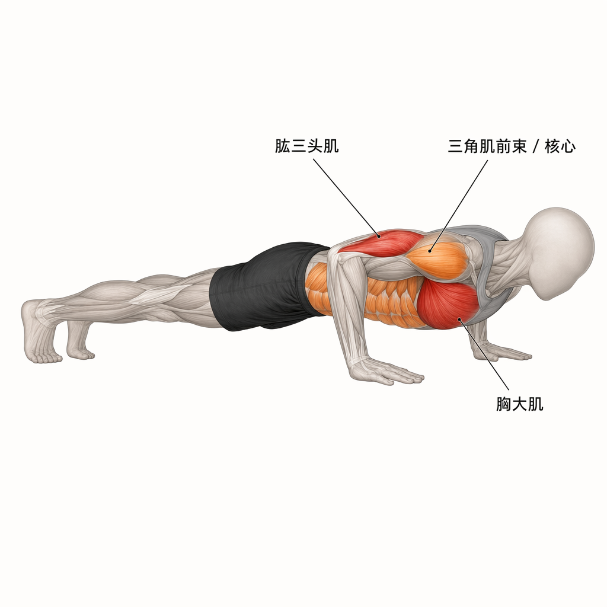

**版本**: v1 · **耗时**: 210s · **生成时间**: 2026-05-02T14:09:46Z

**分类**: 上肢推 · **视角**: side view, facing right

**应有标签 (中文)**: 胸大肌 / 肱三头肌 / 三角肌前束 / 核心

<details><summary>展开 prompt</summary>

```
Anatomical muscle-activation diagram of the "俯卧撑" (push-up) exercise, side view, facing right. Person posture: Athletic person at the bottom of a standard push-up: hands on the ground slightly wider than shoulder-width with arms bent so that elbows are at about 45 degrees from the torso (not flared out); chest hovering just above the ground; toes on the ground, feet hip-width apart; body in one straight line from heels to head with no sag and no piking; head in line with spine; plain black athletic shorts and gray tank top. Body rendered with semi-transparent skin so underlying muscles are visible. Highlight in saturated red the primary working muscles: pectoralis major (chest) and triceps brachii (back of arms). Highlight in orange the secondary stabilizers: anterior deltoid (front shoulder) and serratus anterior and core muscles. Other muscles in pale neutral gray. Add small clean labels with thin black arrow leader lines pointing from each label to its target muscle group. The labels MUST be in simplified Chinese characters using a clean sans-serif font. Use exactly the following labels: "胸大肌" pointing to the pectoralis major (chest); "肱三头肌" pointing to the triceps brachii; "三角肌前束 / 核心" pointing to the anterior deltoid and core area. 

CRITICAL CONSTRAINTS — these are non-negotiable:
1. ALL TEXT IN THE IMAGE MUST BE SIMPLIFIED CHINESE CHARACTERS ONLY.
2. ABSOLUTELY NO ENGLISH WORDS, NO LATIN LETTERS, NO PINYIN ANYWHERE IN THE IMAGE.
3. NO romanization or transliteration of muscle names.
4. NO captions, NO subtitles, NO step-by-step text overlays.
5. ONLY the muscle labels listed above should appear as text.

Style: clean medical textbook illustration, off-white background, no facial features (head shape may be shown but no eyes/nose/mouth), anatomically accurate proportions, no shadows on background, no watermarks, no signature.
```

</details>

---

### ❓ T1241 — 斜上俯卧撑 (incline push-up)

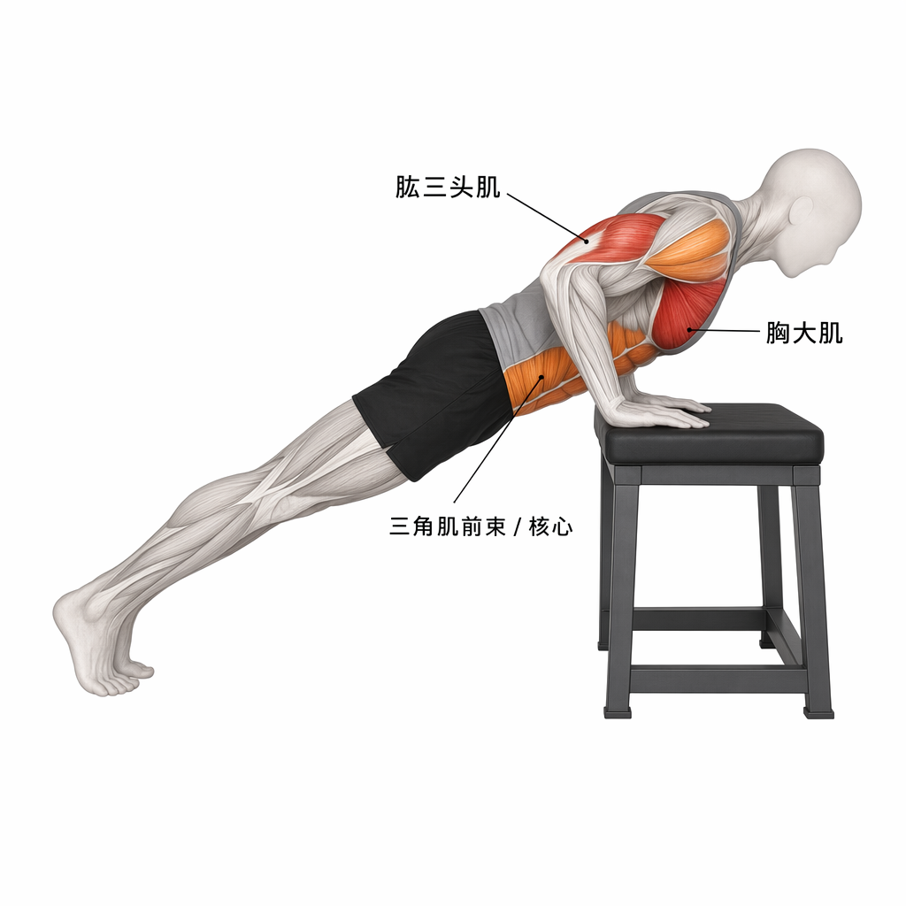

**版本**: v1 · **耗时**: 203s · **生成时间**: 2026-05-02T14:09:40Z

**分类**: 上肢推 · **视角**: side view, facing right

**应有标签 (中文)**: 胸大肌 / 肱三头肌 / 三角肌前束 / 核心

<details><summary>展开 prompt</summary>

```
Anatomical muscle-activation diagram of the "斜上俯卧撑" (incline push-up) exercise, side view, facing right. Person posture: Athletic person at the bottom of an incline push-up (hands elevated on a knee-height bench/box): hands on top of a bench shoulder-width apart; toes on the ground further away from the bench so body is at a roughly 30-45 degree angle to the floor; arms bent so chest approaches the bench; body in one straight line from heels to head; this is an easier scaled variant of push-up emphasizing the lower chest; plain black athletic shorts and gray tank top. Body rendered with semi-transparent skin so underlying muscles are visible. Highlight in saturated red the primary working muscles: pectoralis major (especially the lower fibers) and triceps. Highlight in orange the secondary stabilizers: anterior deltoid and core muscles. Other muscles in pale neutral gray. Add small clean labels with thin black arrow leader lines pointing from each label to its target muscle group. The labels MUST be in simplified Chinese characters using a clean sans-serif font. Use exactly the following labels: "胸大肌" pointing to the pectoralis major (lower fibers); "肱三头肌" pointing to the triceps; "三角肌前束 / 核心" pointing to the anterior deltoid and core area. 

CRITICAL CONSTRAINTS — these are non-negotiable:
1. ALL TEXT IN THE IMAGE MUST BE SIMPLIFIED CHINESE CHARACTERS ONLY.
2. ABSOLUTELY NO ENGLISH WORDS, NO LATIN LETTERS, NO PINYIN ANYWHERE IN THE IMAGE.
3. NO romanization or transliteration of muscle names.
4. NO captions, NO subtitles, NO step-by-step text overlays.
5. ONLY the muscle labels listed above should appear as text.

Style: clean medical textbook illustration, off-white background, no facial features (head shape may be shown but no eyes/nose/mouth), anatomically accurate proportions, no shadows on background, no watermarks, no signature.
```

</details>

---

### ❓ T1245 — 斜下俯卧撑 (decline push-up)

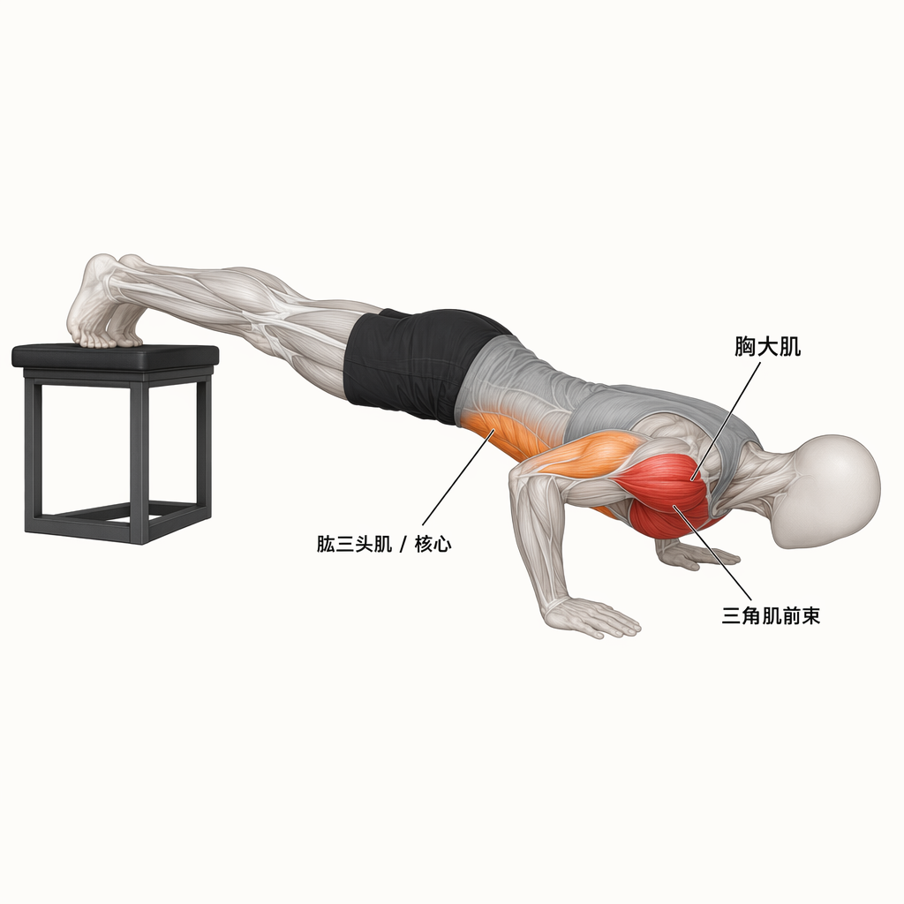

**版本**: v1 · **耗时**: 199s · **生成时间**: 2026-05-02T14:12:40Z

**分类**: 上肢推 · **视角**: side view, facing right

**应有标签 (中文)**: 胸大肌 / 三角肌前束 / 肱三头肌 / 核心

<details><summary>展开 prompt</summary>

```
Anatomical muscle-activation diagram of the "斜下俯卧撑" (decline push-up) exercise, side view, facing right. Person posture: Athletic person at the bottom of a decline push-up (feet elevated on a knee-height bench/box): hands on the ground shoulder-width apart; feet on top of a bench, the body angled so that the head and torso are lower than the feet (about 30-45 degrees decline); arms bent so chest approaches the floor; body in one straight line from feet to head; this is a harder variant emphasizing the upper chest and shoulders; plain black athletic shorts and gray tank top. Body rendered with semi-transparent skin so underlying muscles are visible. Highlight in saturated red the primary working muscles: pectoralis major (especially the upper fibers) and anterior deltoid. Highlight in orange the secondary stabilizers: triceps and core muscles. Other muscles in pale neutral gray. Add small clean labels with thin black arrow leader lines pointing from each label to its target muscle group. The labels MUST be in simplified Chinese characters using a clean sans-serif font. Use exactly the following labels: "胸大肌" pointing to the pectoralis major (upper fibers); "三角肌前束" pointing to the anterior deltoid; "肱三头肌 / 核心" pointing to the triceps and core area. 

CRITICAL CONSTRAINTS — these are non-negotiable:
1. ALL TEXT IN THE IMAGE MUST BE SIMPLIFIED CHINESE CHARACTERS ONLY.
2. ABSOLUTELY NO ENGLISH WORDS, NO LATIN LETTERS, NO PINYIN ANYWHERE IN THE IMAGE.
3. NO romanization or transliteration of muscle names.
4. NO captions, NO subtitles, NO step-by-step text overlays.
5. ONLY the muscle labels listed above should appear as text.

Style: clean medical textbook illustration, off-white background, no facial features (head shape may be shown but no eyes/nose/mouth), anatomically accurate proportions, no shadows on background, no watermarks, no signature.
```

</details>

---

### ❓ T1235 — 屈体俯卧撑 (pike push-up)

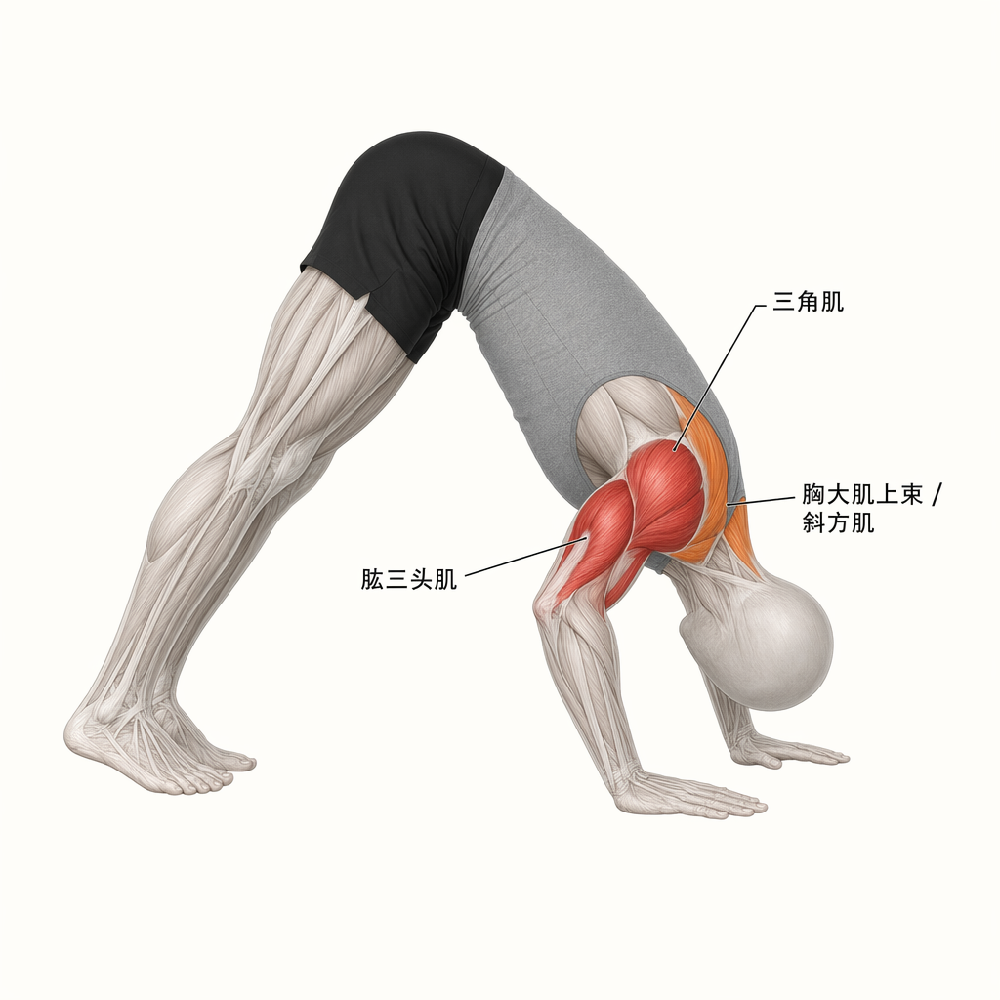

**版本**: v1 · **耗时**: 201s · **生成时间**: 2026-05-02T14:12:52Z

**分类**: 上肢推 · **视角**: side view, facing right

**应有标签 (中文)**: 三角肌 / 肱三头肌 / 胸大肌上束 / 斜方肌

<details><summary>展开 prompt</summary>

```
Anatomical muscle-activation diagram of the "屈体俯卧撑" (pike push-up) exercise, side view, facing right. Person posture: Athletic person at the bottom of a pike push-up: hands on the ground shoulder-width apart, feet on the ground close to the hands so that the hips are pushed up high creating an upside-down V shape (downward dog position); from this position the arms bend to lower the head down between the hands toward the ground; this targets the shoulders heavily; legs straight, hips high; plain black athletic shorts and gray tank top. Body rendered with semi-transparent skin so underlying muscles are visible. Highlight in saturated red the primary working muscles: deltoids (all three heads) and triceps. Highlight in orange the secondary stabilizers: upper chest (clavicular pectoralis) and trapezius. Other muscles in pale neutral gray. Add small clean labels with thin black arrow leader lines pointing from each label to its target muscle group. The labels MUST be in simplified Chinese characters using a clean sans-serif font. Use exactly the following labels: "三角肌" pointing to the deltoid (shoulders); "肱三头肌" pointing to the triceps; "胸大肌上束 / 斜方肌" pointing to the upper chest and trapezius. 

CRITICAL CONSTRAINTS — these are non-negotiable:
1. ALL TEXT IN THE IMAGE MUST BE SIMPLIFIED CHINESE CHARACTERS ONLY.
2. ABSOLUTELY NO ENGLISH WORDS, NO LATIN LETTERS, NO PINYIN ANYWHERE IN THE IMAGE.
3. NO romanization or transliteration of muscle names.
4. NO captions, NO subtitles, NO step-by-step text overlays.
5. ONLY the muscle labels listed above should appear as text.

Style: clean medical textbook illustration, off-white background, no facial features (head shape may be shown but no eyes/nose/mouth), anatomically accurate proportions, no shadows on background, no watermarks, no signature.
```

</details>

---

## 下肢复合 (8)

### ❓ T1061 — 徒手深蹲 (bodyweight squat)

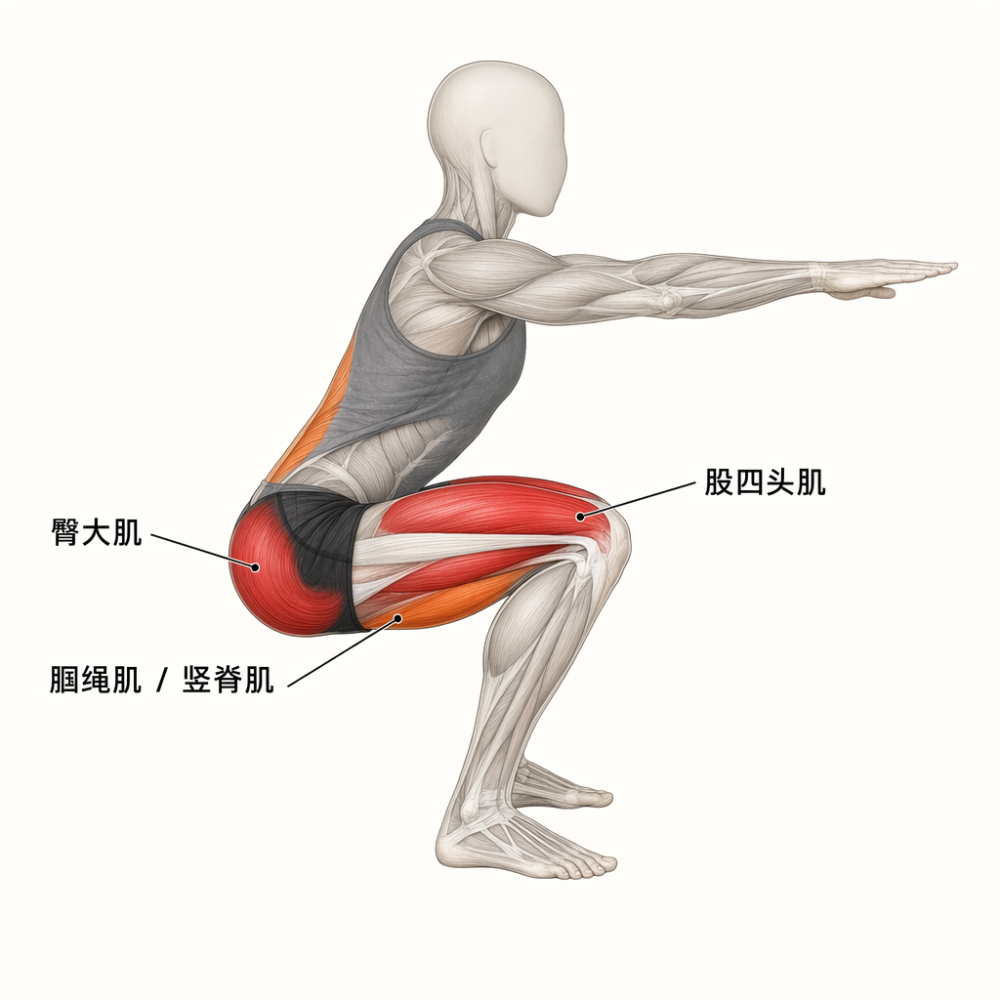

**版本**: v1 · **耗时**: 232s · **生成时间**: 2026-05-02T13:12:15Z

**分类**: 下肢复合 · **视角**: side view, facing right

**应有标签 (中文)**: 股四头肌 / 臀大肌 / 腘绳肌 / 竖脊肌

<details><summary>展开 prompt</summary>

```
Anatomical muscle-activation diagram of the "徒手深蹲" (bodyweight squat) exercise, side view, facing right. Person posture: Athletic person at the bottom of a bodyweight squat: feet shoulder-width apart and flat on the ground, knees tracking over toes, thighs roughly parallel to the floor (deep squat depth), hips pushed back, torso leaning slightly forward with neutral spine and chest up, both arms extended forward at shoulder height for balance, wearing plain black athletic shorts and a fitted gray tank top. Body rendered with semi-transparent skin so underlying muscles are visible. Highlight in saturated red the primary working muscles: quadriceps (front of thighs) and gluteus maximus. Highlight in orange the secondary stabilizers: hamstring group and erector spinae along the lower back. Other muscles in pale neutral gray. Add small clean labels with thin black arrow leader lines pointing from each label to its target muscle group. The labels MUST be in simplified Chinese characters using a clean sans-serif font. Use exactly the following labels: "股四头肌" pointing to the quadriceps; "臀大肌" pointing to the gluteus maximus; "腘绳肌 / 竖脊肌" pointing to the hamstring and erector spinae area. 

CRITICAL CONSTRAINTS — these are non-negotiable:
1. ALL TEXT IN THE IMAGE MUST BE SIMPLIFIED CHINESE CHARACTERS ONLY.
2. ABSOLUTELY NO ENGLISH WORDS, NO LATIN LETTERS, NO PINYIN ANYWHERE IN THE IMAGE.
3. NO romanization or transliteration of muscle names.
4. NO captions, NO subtitles, NO step-by-step text overlays.
5. ONLY the muscle labels listed above should appear as text.

Style: clean medical textbook illustration, off-white background, no facial features (head shape may be shown but no eyes/nose/mouth), anatomically accurate proportions, no shadows on background, no watermarks, no signature.
```

</details>

---

### ❓ T1078 — 跳跃深蹲 (squat jump)

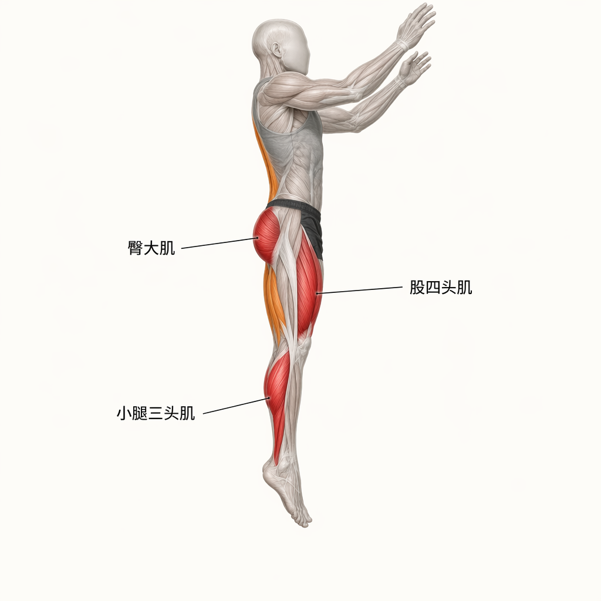

**版本**: v1 · **耗时**: 229s · **生成时间**: 2026-05-02T13:12:12Z

**分类**: 下肢复合 · **视角**: side view, facing right

**应有标签 (中文)**: 股四头肌 / 臀大肌 / 小腿三头肌

<details><summary>展开 prompt</summary>

```
Anatomical muscle-activation diagram of the "跳跃深蹲" (squat jump) exercise, side view, facing right. Person posture: Athletic person at the moment of takeoff in a jumping squat: feet shoulder-width apart leaving the ground, ankles fully extended (plantarflexed), knees and hips fully extended driving upward, arms swinging forward and up for momentum, torso upright, body in vertical alignment, plain black athletic shorts and gray tank top. Body rendered with semi-transparent skin so underlying muscles are visible. Highlight in saturated red the primary working muscles: quadriceps and gluteus maximus and calf muscles (gastrocnemius). Highlight in orange the secondary stabilizers: hamstring group and erector spinae. Other muscles in pale neutral gray. Add small clean labels with thin black arrow leader lines pointing from each label to its target muscle group. The labels MUST be in simplified Chinese characters using a clean sans-serif font. Use exactly the following labels: "股四头肌" pointing to the quadriceps; "臀大肌" pointing to the gluteus maximus; "小腿三头肌" pointing to the calf muscles. 

CRITICAL CONSTRAINTS — these are non-negotiable:
1. ALL TEXT IN THE IMAGE MUST BE SIMPLIFIED CHINESE CHARACTERS ONLY.
2. ABSOLUTELY NO ENGLISH WORDS, NO LATIN LETTERS, NO PINYIN ANYWHERE IN THE IMAGE.
3. NO romanization or transliteration of muscle names.
4. NO captions, NO subtitles, NO step-by-step text overlays.
5. ONLY the muscle labels listed above should appear as text.

Style: clean medical textbook illustration, off-white background, no facial features (head shape may be shown but no eyes/nose/mouth), anatomically accurate proportions, no shadows on background, no watermarks, no signature.
```

</details>

---

### ❓ T1167 — 单腿深蹲 (pistol squat / single-leg squat)

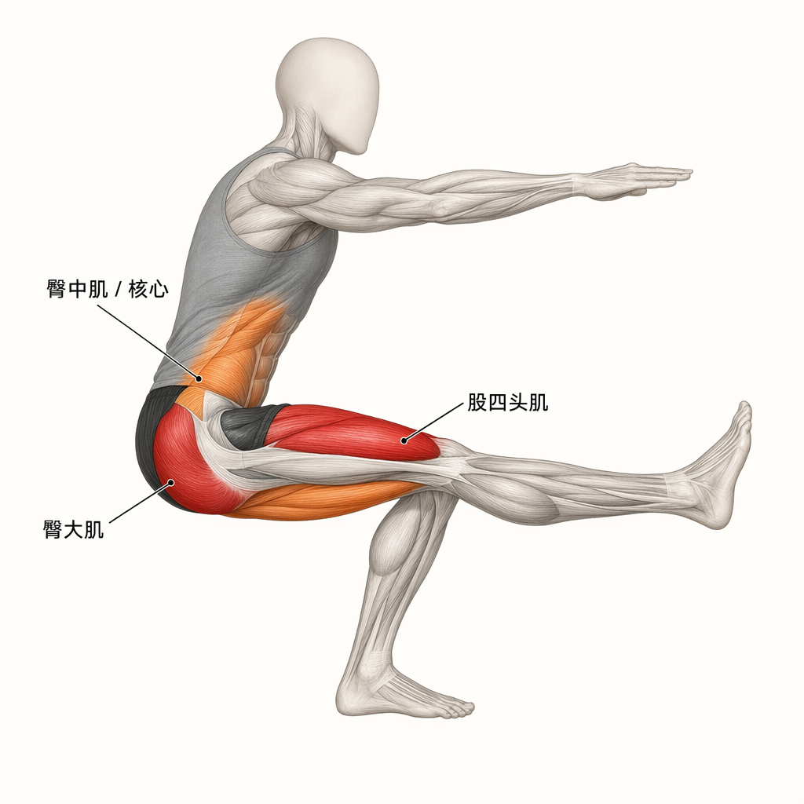

**版本**: v1 · **耗时**: 233s · **生成时间**: 2026-05-02T13:12:15Z

**分类**: 下肢复合 · **视角**: side view, facing right

**应有标签 (中文)**: 股四头肌 / 臀大肌 / 臀中肌 / 核心

<details><summary>展开 prompt</summary>

```
Anatomical muscle-activation diagram of the "单腿深蹲" (pistol squat / single-leg squat) exercise, side view, facing right. Person posture: Athletic person at the bottom of a single-leg squat (pistol squat): right leg supporting, right knee deeply bent so right thigh is parallel to the floor or slightly below, right foot flat on the ground; left leg fully extended straight forward off the ground, parallel to the floor; both arms extended forward at shoulder height for counterbalance; torso leaning forward with neutral spine; plain black athletic shorts and gray tank top. Body rendered with semi-transparent skin so underlying muscles are visible. Highlight in saturated red the primary working muscles: quadriceps and gluteus maximus of the supporting leg. Highlight in orange the secondary stabilizers: hamstring group and gluteus medius of the supporting hip and core stabilizers. Other muscles in pale neutral gray. Add small clean labels with thin black arrow leader lines pointing from each label to its target muscle group. The labels MUST be in simplified Chinese characters using a clean sans-serif font. Use exactly the following labels: "股四头肌" pointing to the quadriceps of the supporting leg; "臀大肌" pointing to the gluteus maximus of the supporting leg; "臀中肌 / 核心" pointing to the gluteus medius and core area. 

CRITICAL CONSTRAINTS — these are non-negotiable:
1. ALL TEXT IN THE IMAGE MUST BE SIMPLIFIED CHINESE CHARACTERS ONLY.
2. ABSOLUTELY NO ENGLISH WORDS, NO LATIN LETTERS, NO PINYIN ANYWHERE IN THE IMAGE.
3. NO romanization or transliteration of muscle names.
4. NO captions, NO subtitles, NO step-by-step text overlays.
5. ONLY the muscle labels listed above should appear as text.

Style: clean medical textbook illustration, off-white background, no facial features (head shape may be shown but no eyes/nose/mouth), anatomically accurate proportions, no shadows on background, no watermarks, no signature.
```

</details>

---

### ❓ T1164 — 保加利亚分腿蹲 (Bulgarian split squat)

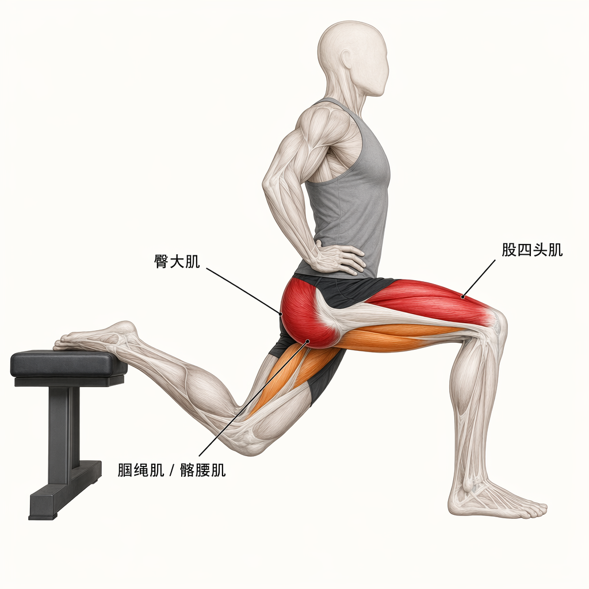

**版本**: v1 · **耗时**: 234s · **生成时间**: 2026-05-02T13:12:17Z

**分类**: 下肢复合 · **视角**: side view, facing right

**应有标签 (中文)**: 股四头肌 / 臀大肌 / 腘绳肌 / 髂腰肌

<details><summary>展开 prompt</summary>

```
Anatomical muscle-activation diagram of the "保加利亚分腿蹲" (Bulgarian split squat) exercise, side view, facing right. Person posture: Athletic person at the bottom of a Bulgarian split squat: front leg (right) supporting with foot flat on the ground and knee bent at 90 degrees with thigh parallel to the floor, knee tracking over toes; rear leg (left) extended back with the top of the rear foot resting on a knee-height platform behind, rear knee hovering just above the ground, rear hip and knee both bent; torso upright with neutral spine, hands on hips, plain black athletic shorts and gray tank top. Body rendered with semi-transparent skin so underlying muscles are visible. Highlight in saturated red the primary working muscles: quadriceps and gluteus maximus of the front leg. Highlight in orange the secondary stabilizers: hamstring group of the front leg and hip flexors of the rear leg. Other muscles in pale neutral gray. Add small clean labels with thin black arrow leader lines pointing from each label to its target muscle group. The labels MUST be in simplified Chinese characters using a clean sans-serif font. Use exactly the following labels: "股四头肌" pointing to the quadriceps of the front leg; "臀大肌" pointing to the gluteus maximus of the front leg; "腘绳肌 / 髂腰肌" pointing to the hamstring and hip flexor area. 

CRITICAL CONSTRAINTS — these are non-negotiable:
1. ALL TEXT IN THE IMAGE MUST BE SIMPLIFIED CHINESE CHARACTERS ONLY.
2. ABSOLUTELY NO ENGLISH WORDS, NO LATIN LETTERS, NO PINYIN ANYWHERE IN THE IMAGE.
3. NO romanization or transliteration of muscle names.
4. NO captions, NO subtitles, NO step-by-step text overlays.
5. ONLY the muscle labels listed above should appear as text.

Style: clean medical textbook illustration, off-white background, no facial features (head shape may be shown but no eyes/nose/mouth), anatomically accurate proportions, no shadows on background, no watermarks, no signature.
```

</details>

---

### ❓ T1217 — 侧深蹲 (lateral squat / side squat)

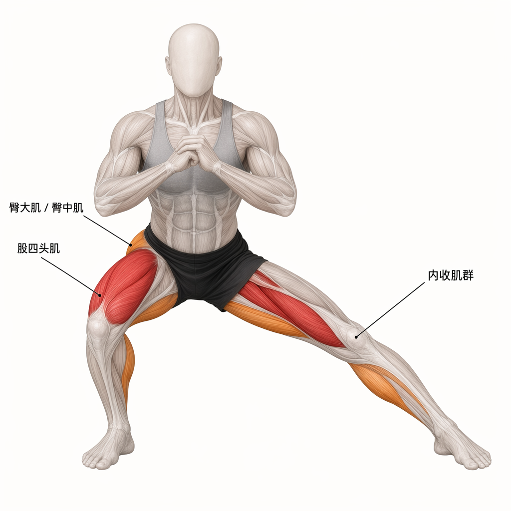

**版本**: v1 · **耗时**: 244s · **生成时间**: 2026-05-02T13:16:16Z

**分类**: 下肢复合 · **视角**: front view, facing the viewer

**应有标签 (中文)**: 股四头肌 / 臀大肌 / 臀中肌 / 内收肌群

<details><summary>展开 prompt</summary>

```
Anatomical muscle-activation diagram of the "侧深蹲" (lateral squat / side squat) exercise, front view, facing the viewer. Person posture: Athletic person at the bottom of a lateral squat: feet wider than shoulder-width apart, weight shifted entirely onto the right leg with right knee bent at roughly 90 degrees and right thigh parallel to the floor, right foot flat on the ground; left leg fully extended straight to the side with foot flat on the ground and toe pointing forward; hips pushed back, torso upright with slight forward lean, hands clasped at chest height for balance, plain black athletic shorts and gray tank top. Body rendered with semi-transparent skin so underlying muscles are visible. Highlight in saturated red the primary working muscles: quadriceps and gluteus maximus of the bent (right) leg and the adductor muscles of the extended (left) inner thigh. Highlight in orange the secondary stabilizers: gluteus medius of the bent leg and hamstring group. Other muscles in pale neutral gray. Add small clean labels with thin black arrow leader lines pointing from each label to its target muscle group. The labels MUST be in simplified Chinese characters using a clean sans-serif font. Use exactly the following labels: "股四头肌" pointing to the quadriceps of the bent leg; "臀大肌 / 臀中肌" pointing to the glutes of the bent leg; "内收肌群" pointing to the adductor muscles of the extended inner thigh. 

CRITICAL CONSTRAINTS — these are non-negotiable:
1. ALL TEXT IN THE IMAGE MUST BE SIMPLIFIED CHINESE CHARACTERS ONLY.
2. ABSOLUTELY NO ENGLISH WORDS, NO LATIN LETTERS, NO PINYIN ANYWHERE IN THE IMAGE.
3. NO romanization or transliteration of muscle names.
4. NO captions, NO subtitles, NO step-by-step text overlays.
5. ONLY the muscle labels listed above should appear as text.

Style: clean medical textbook illustration, off-white background, no facial features (head shape may be shown but no eyes/nose/mouth), anatomically accurate proportions, no shadows on background, no watermarks, no signature.
```

</details>

---

### ❓ T1188 — 曲腿深蹲 (curtsey squat)

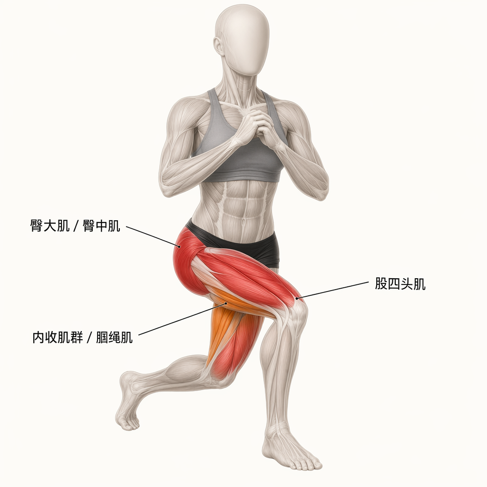

**版本**: v1 · **耗时**: 233s · **生成时间**: 2026-05-02T13:16:08Z

**分类**: 下肢复合 · **视角**: three-quarter front view

**应有标签 (中文)**: 臀大肌 / 臀中肌 / 股四头肌 / 内收肌群 / 腘绳肌

<details><summary>展开 prompt</summary>

```
Anatomical muscle-activation diagram of the "曲腿深蹲" (curtsey squat) exercise, three-quarter front view. Person posture: Athletic person at the bottom of a curtsey squat: right leg standing with right foot flat and right knee bent to roughly 90 degrees; left leg crossed behind and to the right of the right leg with left foot on the ball of the foot and left knee bent toward the floor without touching it (like a deep curtsey); hips and shoulders facing forward, torso upright with neutral spine, hands clasped at chest height, plain black athletic shorts and gray tank top. Body rendered with semi-transparent skin so underlying muscles are visible. Highlight in saturated red the primary working muscles: gluteus maximus and gluteus medius of the front (right) leg, plus quadriceps. Highlight in orange the secondary stabilizers: adductor muscles and hamstring group. Other muscles in pale neutral gray. Add small clean labels with thin black arrow leader lines pointing from each label to its target muscle group. The labels MUST be in simplified Chinese characters using a clean sans-serif font. Use exactly the following labels: "臀大肌 / 臀中肌" pointing to the glute muscles of the front leg; "股四头肌" pointing to the quadriceps; "内收肌群 / 腘绳肌" pointing to the adductor and hamstring area. 

CRITICAL CONSTRAINTS — these are non-negotiable:
1. ALL TEXT IN THE IMAGE MUST BE SIMPLIFIED CHINESE CHARACTERS ONLY.
2. ABSOLUTELY NO ENGLISH WORDS, NO LATIN LETTERS, NO PINYIN ANYWHERE IN THE IMAGE.
3. NO romanization or transliteration of muscle names.
4. NO captions, NO subtitles, NO step-by-step text overlays.
5. ONLY the muscle labels listed above should appear as text.

Style: clean medical textbook illustration, off-white background, no facial features (head shape may be shown but no eyes/nose/mouth), anatomically accurate proportions, no shadows on background, no watermarks, no signature.
```

</details>

---

### ❓ T1231 — 靠墙静蹲 (wall sit)

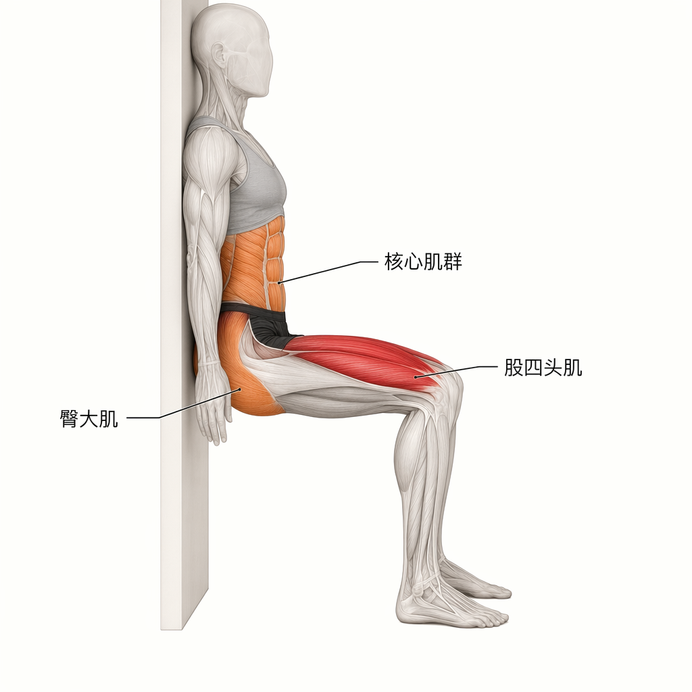

**版本**: v1 · **耗时**: 227s · **生成时间**: 2026-05-02T13:16:02Z

**分类**: 下肢复合 · **视角**: side view, facing right

**应有标签 (中文)**: 股四头肌 / 臀大肌 / 核心肌群

<details><summary>展开 prompt</summary>

```
Anatomical muscle-activation diagram of the "靠墙静蹲" (wall sit) exercise, side view, facing right. Person posture: Athletic person in a wall-sit isometric hold: back, shoulders, and head pressed flat against a vertical wall; feet shoulder-width apart and flat on the ground, positioned about a thigh-length out from the wall; knees bent at exactly 90 degrees with thighs parallel to the floor; shins vertical; arms hanging relaxed at sides or crossed at chest, plain black athletic shorts and gray tank top. Body rendered with semi-transparent skin so underlying muscles are visible. Highlight in saturated red the primary working muscles: quadriceps (front of thighs) holding the isometric position. Highlight in orange the secondary stabilizers: gluteus maximus and core muscles. Other muscles in pale neutral gray. Add small clean labels with thin black arrow leader lines pointing from each label to its target muscle group. The labels MUST be in simplified Chinese characters using a clean sans-serif font. Use exactly the following labels: "股四头肌" pointing to the quadriceps holding the position; "臀大肌" pointing to the gluteus maximus; "核心肌群" pointing to the core muscles. 

CRITICAL CONSTRAINTS — these are non-negotiable:
1. ALL TEXT IN THE IMAGE MUST BE SIMPLIFIED CHINESE CHARACTERS ONLY.
2. ABSOLUTELY NO ENGLISH WORDS, NO LATIN LETTERS, NO PINYIN ANYWHERE IN THE IMAGE.
3. NO romanization or transliteration of muscle names.
4. NO captions, NO subtitles, NO step-by-step text overlays.
5. ONLY the muscle labels listed above should appear as text.

Style: clean medical textbook illustration, off-white background, no facial features (head shape may be shown but no eyes/nose/mouth), anatomically accurate proportions, no shadows on background, no watermarks, no signature.
```

</details>

---

### ❓ SL_WALLSIT — 单腿靠墙静蹲 (single-leg wall sit)

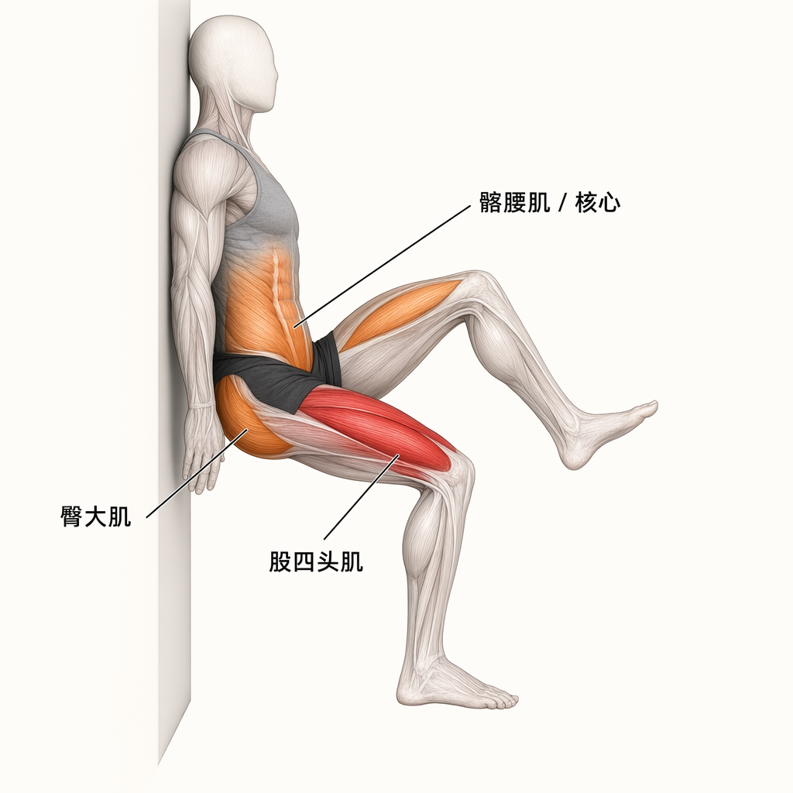

**版本**: v1 · **耗时**: 245s · **生成时间**: 2026-05-04T08:24:14Z

**分类**: 下肢复合 · **视角**: side view, facing right

**应有标签 (中文)**: 股四头肌 / 臀大肌 / 髂腰肌 / 核心

<details><summary>展开 prompt</summary>

```
Anatomical muscle-activation diagram of the "单腿靠墙静蹲" (single-leg wall sit) exercise, side view, facing right. Person posture: Athletic person performing a SINGLE-LEG wall sit on the right leg: back, shoulders, and head pressed flat against a vertical wall. Right foot flat on the ground, positioned about a thigh-length out from the wall. Right knee bent at exactly 90 degrees, right thigh parallel to the floor, right shin vertical — supporting all body weight. The LEFT LEG is lifted entirely OFF THE GROUND with the left thigh lifted forward and held parallel to the floor at the same height as the right thigh, left knee bent so the left shin angles forward. Arms hanging at sides or crossed at chest. Plain black athletic shorts and gray tank top. CRITICAL: only the RIGHT FOOT is on the ground, the left foot is in the air; this is the SINGLE-LEG variant of wall sit.. Body rendered with semi-transparent skin so underlying muscles are visible. Highlight in saturated red the primary working muscles: quadriceps of the supporting (right) leg under heavy isometric load. Highlight in orange the secondary stabilizers: gluteus maximus of the supporting leg, hip flexors of the lifted leg, and core. Other muscles in pale neutral gray. Add small clean labels with thin black arrow leader lines pointing from each label to its target muscle group. The labels MUST be in simplified Chinese characters using a clean sans-serif font. Use exactly the following labels: "股四头肌" pointing to the quadriceps of the supporting leg; "臀大肌" pointing to the gluteus maximus of the supporting leg; "髂腰肌 / 核心" pointing to the hip flexors of the lifted leg and the core. 

CRITICAL CONSTRAINTS — these are non-negotiable:
1. ALL TEXT IN THE IMAGE MUST BE SIMPLIFIED CHINESE CHARACTERS ONLY.
2. ABSOLUTELY NO ENGLISH WORDS, NO LATIN LETTERS, NO PINYIN ANYWHERE IN THE IMAGE.
3. NO romanization or transliteration of muscle names.
4. NO captions, NO subtitles, NO step-by-step text overlays.
5. ONLY the muscle labels listed above should appear as text.

Style: clean medical textbook illustration, off-white background, no facial features (head shape may be shown but no eyes/nose/mouth), anatomically accurate proportions, no shadows on background, no watermarks, no signature.
```

</details>

---

## 侧平面 (4)

### ❓ T1116 — 站立侧抬腿 (standing side leg raise)

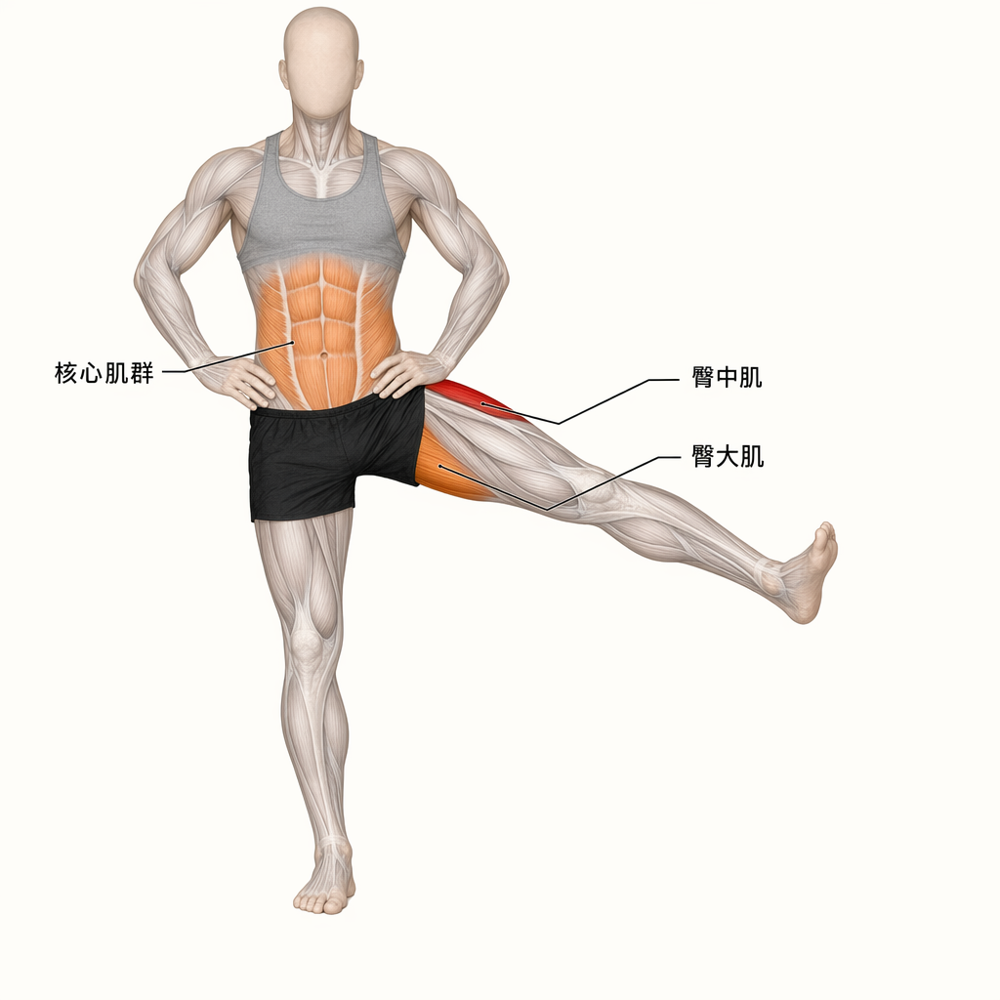

**版本**: v1 · **耗时**: 238s · **生成时间**: 2026-05-02T13:35:18Z

**分类**: 侧平面 · **视角**: front view, facing the viewer

**应有标签 (中文)**: 臀中肌 / 臀大肌 / 核心肌群

<details><summary>展开 prompt</summary>

```
Anatomical muscle-activation diagram of the "站立侧抬腿" (standing side leg raise) exercise, front view, facing the viewer. Person posture: Athletic person at the top of a standing side leg raise: right leg supporting with foot flat on the ground and knee almost fully extended (slight bend); left leg fully extended straight out to the side at about 30-45 degrees away from the body, foot flexed (toes pointing forward); torso upright with neutral spine, hands on hips for support; plain black athletic shorts and gray tank top. Body rendered with semi-transparent skin so underlying muscles are visible. Highlight in saturated red the primary working muscles: gluteus medius of the lifted (left) hip. Highlight in orange the secondary stabilizers: gluteus maximus and core muscles for stability. Other muscles in pale neutral gray. Add small clean labels with thin black arrow leader lines pointing from each label to its target muscle group. The labels MUST be in simplified Chinese characters using a clean sans-serif font. Use exactly the following labels: "臀中肌" pointing to the gluteus medius of the lifted hip; "臀大肌" pointing to the gluteus maximus; "核心肌群" pointing to the core muscles. 

CRITICAL CONSTRAINTS — these are non-negotiable:
1. ALL TEXT IN THE IMAGE MUST BE SIMPLIFIED CHINESE CHARACTERS ONLY.
2. ABSOLUTELY NO ENGLISH WORDS, NO LATIN LETTERS, NO PINYIN ANYWHERE IN THE IMAGE.
3. NO romanization or transliteration of muscle names.
4. NO captions, NO subtitles, NO step-by-step text overlays.
5. ONLY the muscle labels listed above should appear as text.

Style: clean medical textbook illustration, off-white background, no facial features (head shape may be shown but no eyes/nose/mouth), anatomically accurate proportions, no shadows on background, no watermarks, no signature.
```

</details>

---

### ❓ T1174 — 滑雪跨步 (ski hops / lateral airborne jumps)

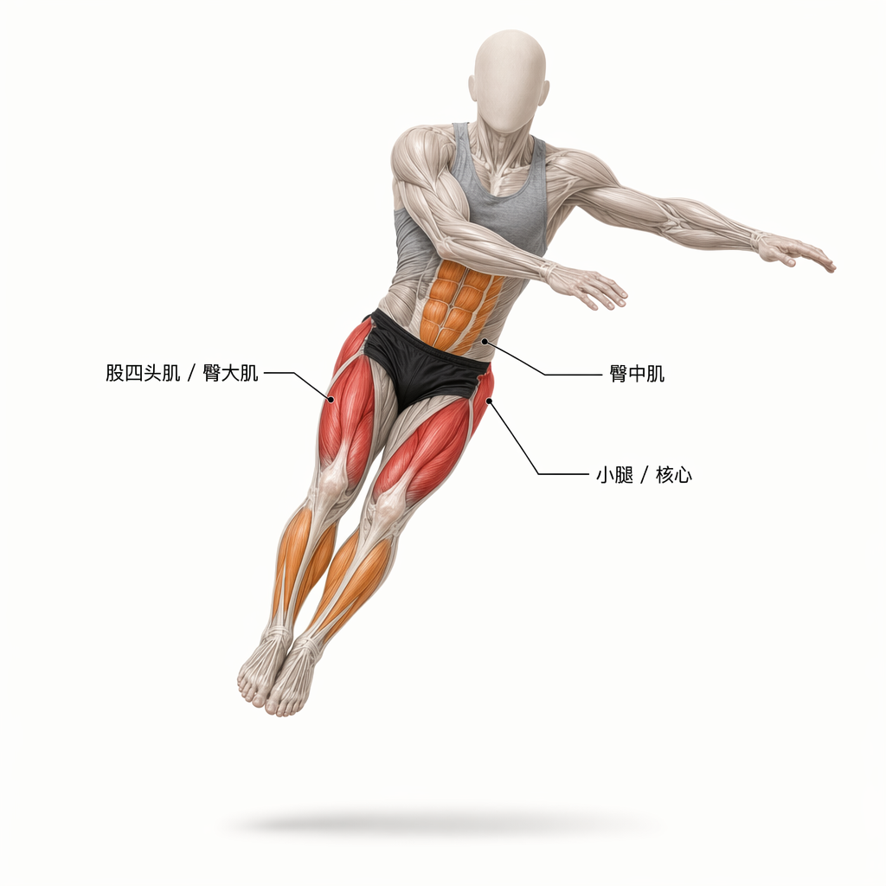

**版本**: v3 · **耗时**: 248s · **生成时间**: 2026-05-04T08:13:20Z

**分类**: 侧平面 · **视角**: front view, facing the viewer, freeze-frame photographic style

**应有标签 (中文)**: 股四头肌 / 臀大肌 / 臀中肌 / 小腿 / 核心

<details><summary>展开 prompt</summary>

```
Anatomical muscle-activation diagram of the "滑雪跨步" (ski hops / lateral airborne jumps) exercise, front view, facing the viewer, freeze-frame photographic style. Person posture: Photographic freeze-frame, front view, of a lateral ski-style HOP. The athlete is suspended IN MID-AIR — about 15-20 cm of CLEAR EMPTY FLOOR SPACE is visible directly below both feet (a small shadow on the ground far below the body confirms airborne). The body is mid-flight TRAVELING LATERALLY (sideways) to the LEFT side of the frame. BOTH FEET ARE TOGETHER and SWUNG to the LEFT side of the body (feet are about 30 cm to the left of where the head is). The HIPS AND TORSO LEAN to the LEFT, body angled sideways like a downhill skier carving a turn. Both knees slightly bent. Both arms swing to the RIGHT side of the body for counterbalance (opposite to the legs), like a skier's ski poles. Plain black athletic shorts and gray tank top. NEGATIVE: this is NOT a stationary standing pose — the body is AIRBORNE, suspended above the ground, traveling sideways through the air.. Body rendered with semi-transparent skin so underlying muscles are visible. Highlight in saturated red the primary working muscles: quadriceps, gluteus maximus, and gluteus medius of both legs for lateral propulsion. Highlight in orange the secondary stabilizers: calf muscles and core muscles for stabilization. Other muscles in pale neutral gray. Add small clean labels with thin black arrow leader lines pointing from each label to its target muscle group. The labels MUST be in simplified Chinese characters using a clean sans-serif font. Use exactly the following labels: "股四头肌 / 臀大肌" pointing to the quadriceps and gluteus maximus; "臀中肌" pointing to the gluteus medius for lateral motion; "小腿 / 核心" pointing to the calf and core area. 

CRITICAL CONSTRAINTS — these are non-negotiable:
1. ALL TEXT IN THE IMAGE MUST BE SIMPLIFIED CHINESE CHARACTERS ONLY.
2. ABSOLUTELY NO ENGLISH WORDS, NO LATIN LETTERS, NO PINYIN ANYWHERE IN THE IMAGE.
3. NO romanization or transliteration of muscle names.
4. NO captions, NO subtitles, NO step-by-step text overlays.
5. ONLY the muscle labels listed above should appear as text.

Style: clean medical textbook illustration, off-white background, no facial features (head shape may be shown but no eyes/nose/mouth), anatomically accurate proportions, no shadows on background, no watermarks, no signature.
```

</details>

---

### ❓ T1153 — 侧弓步 (lateral lunge / side step lunge)

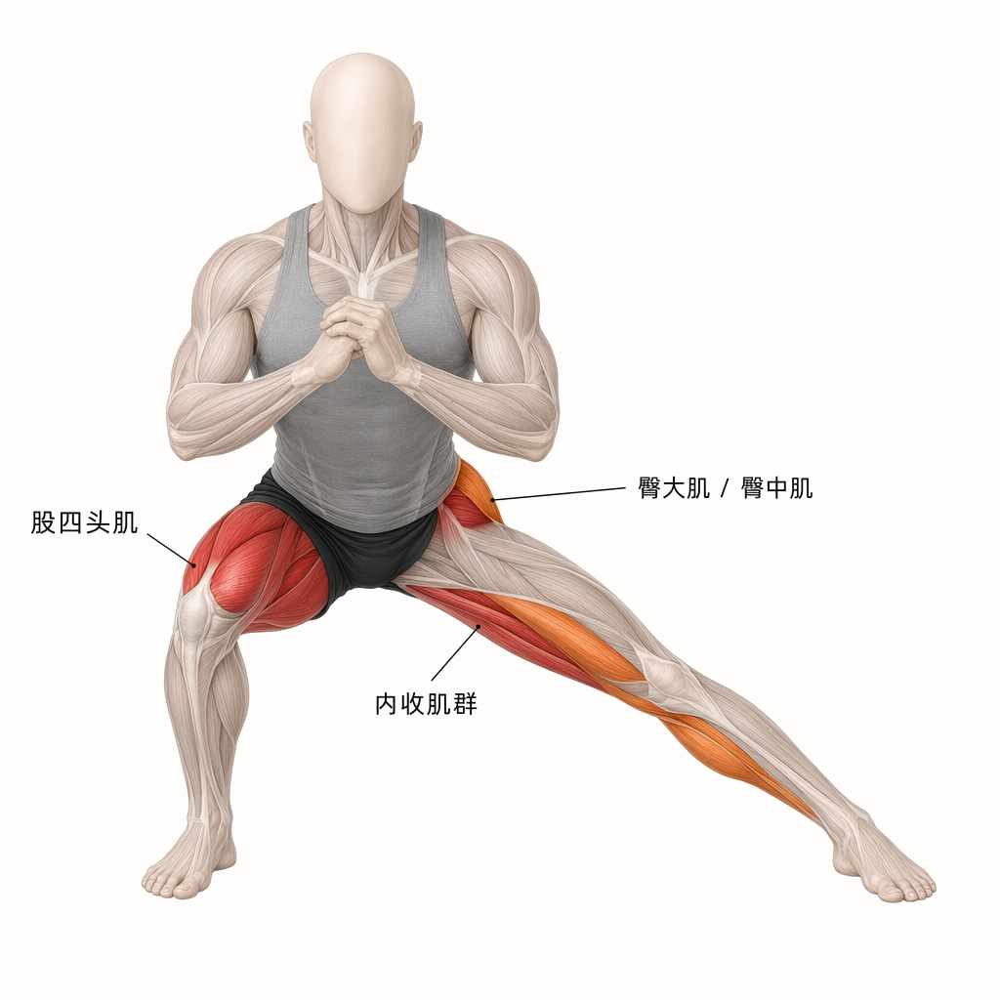

**版本**: v1 · **耗时**: 216s · **生成时间**: 2026-05-02T13:56:07Z

**分类**: 侧平面 · **视角**: front view, facing the viewer

**应有标签 (中文)**: 股四头肌 / 臀大肌 / 臀中肌 / 内收肌群

<details><summary>展开 prompt</summary>

```
Anatomical muscle-activation diagram of the "侧弓步" (lateral lunge / side step lunge) exercise, front view, facing the viewer. Person posture: Athletic person at the bottom of a lateral lunge: feet wide apart with weight shifted entirely onto the right leg, right knee bent at 90 degrees with right thigh parallel to the floor and right foot flat on the ground; left leg fully extended straight to the side with foot flat on the ground; this is at the moment of the lunge depth, similar to T1217 lateral squat but with more dynamic step-out emphasis; hands clasped at chest height; torso upright with slight forward lean; plain black athletic shorts and gray tank top. Body rendered with semi-transparent skin so underlying muscles are visible. Highlight in saturated red the primary working muscles: quadriceps and gluteus maximus of the bent (right) leg, with adductor stretch on the extended (left) leg. Highlight in orange the secondary stabilizers: gluteus medius and hamstring group. Other muscles in pale neutral gray. Add small clean labels with thin black arrow leader lines pointing from each label to its target muscle group. The labels MUST be in simplified Chinese characters using a clean sans-serif font. Use exactly the following labels: "股四头肌" pointing to the quadriceps of the bent leg; "臀大肌 / 臀中肌" pointing to the glute area; "内收肌群" pointing to the adductor muscles. 

CRITICAL CONSTRAINTS — these are non-negotiable:
1. ALL TEXT IN THE IMAGE MUST BE SIMPLIFIED CHINESE CHARACTERS ONLY.
2. ABSOLUTELY NO ENGLISH WORDS, NO LATIN LETTERS, NO PINYIN ANYWHERE IN THE IMAGE.
3. NO romanization or transliteration of muscle names.
4. NO captions, NO subtitles, NO step-by-step text overlays.
5. ONLY the muscle labels listed above should appear as text.

Style: clean medical textbook illustration, off-white background, no facial features (head shape may be shown but no eyes/nose/mouth), anatomically accurate proportions, no shadows on background, no watermarks, no signature.
```

</details>

---

### ❓ T1103 — 弹力带绕踝侧向行走 (banded lateral walk / monster walk)

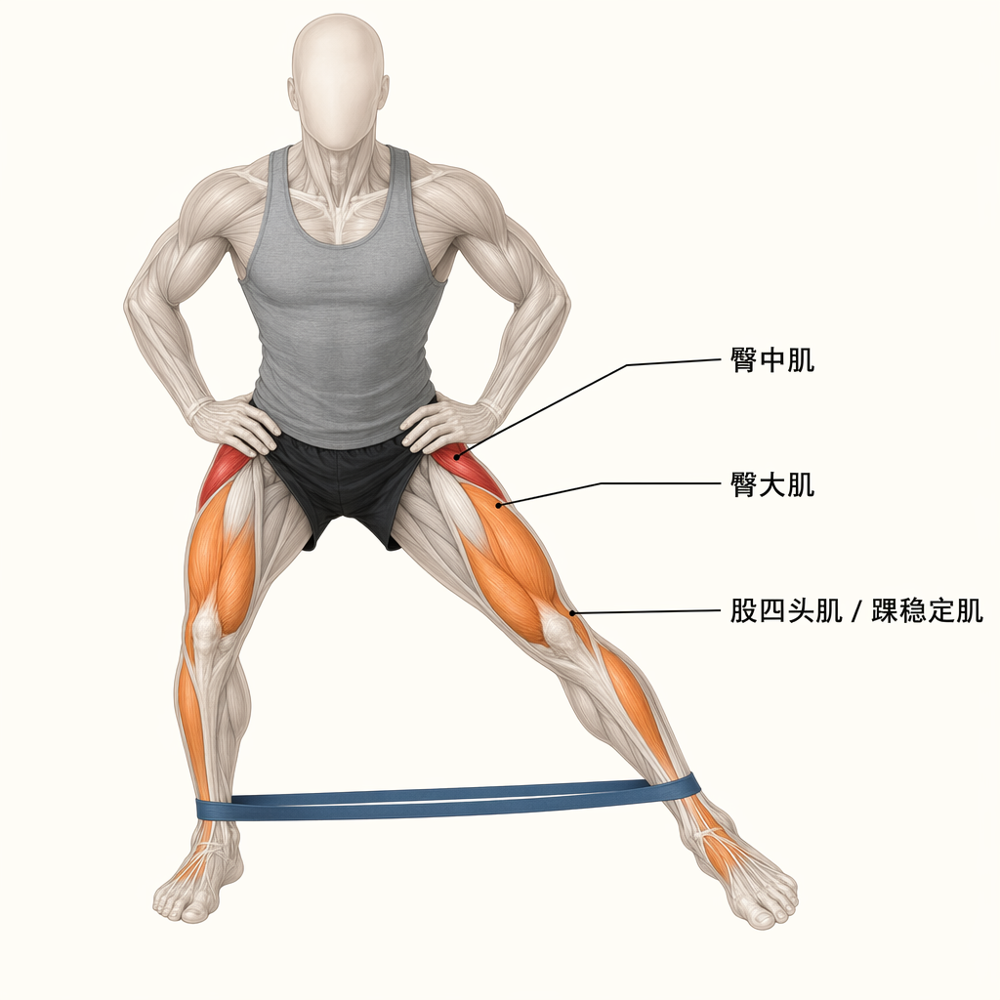

**版本**: v1 · **耗时**: 243s · **生成时间**: 2026-05-04T08:28:18Z

**分类**: 侧平面 · **视角**: front view, facing the viewer

**应有标签 (中文)**: 臀中肌 / 臀大肌 / 股四头肌 / 踝稳定肌

<details><summary>展开 prompt</summary>

```
Anatomical muscle-activation diagram of the "弹力带绕踝侧向行走" (banded lateral walk / monster walk) exercise, front view, facing the viewer. Person posture: Athletic person performing a banded lateral walk: standing in a quarter-squat position with knees slightly bent (about 30 degrees of knee flexion) and hips pushed back. A loop resistance band is wrapped around both ankles, kept taut. The person is mid-step, taking a wide lateral step to the right with the right foot, while the left leg remains slightly bent and stable. The band creates outward tension that the gluteus medius works against. Torso upright. Hands at hips. Plain black athletic shorts and gray tank top.. Body rendered with semi-transparent skin so underlying muscles are visible. Highlight in saturated red the primary working muscles: gluteus medius (especially of the moving and stabilizing legs). Highlight in orange the secondary stabilizers: gluteus maximus and quadriceps and ankle stabilizers. Other muscles in pale neutral gray. Add small clean labels with thin black arrow leader lines pointing from each label to its target muscle group. The labels MUST be in simplified Chinese characters using a clean sans-serif font. Use exactly the following labels: "臀中肌" pointing to the gluteus medius; "臀大肌" pointing to the gluteus maximus; "股四头肌 / 踝稳定肌" pointing to the quadriceps and ankle stabilizers. 

CRITICAL CONSTRAINTS — these are non-negotiable:
1. ALL TEXT IN THE IMAGE MUST BE SIMPLIFIED CHINESE CHARACTERS ONLY.
2. ABSOLUTELY NO ENGLISH WORDS, NO LATIN LETTERS, NO PINYIN ANYWHERE IN THE IMAGE.
3. NO romanization or transliteration of muscle names.
4. NO captions, NO subtitles, NO step-by-step text overlays.
5. ONLY the muscle labels listed above should appear as text.

Style: clean medical textbook illustration, off-white background, no facial features (head shape may be shown but no eyes/nose/mouth), anatomically accurate proportions, no shadows on background, no watermarks, no signature.
```

</details>

---

## 动态激活 (10)

### ❓ T1222 — 前后摆腿 (leg swing (front and back))

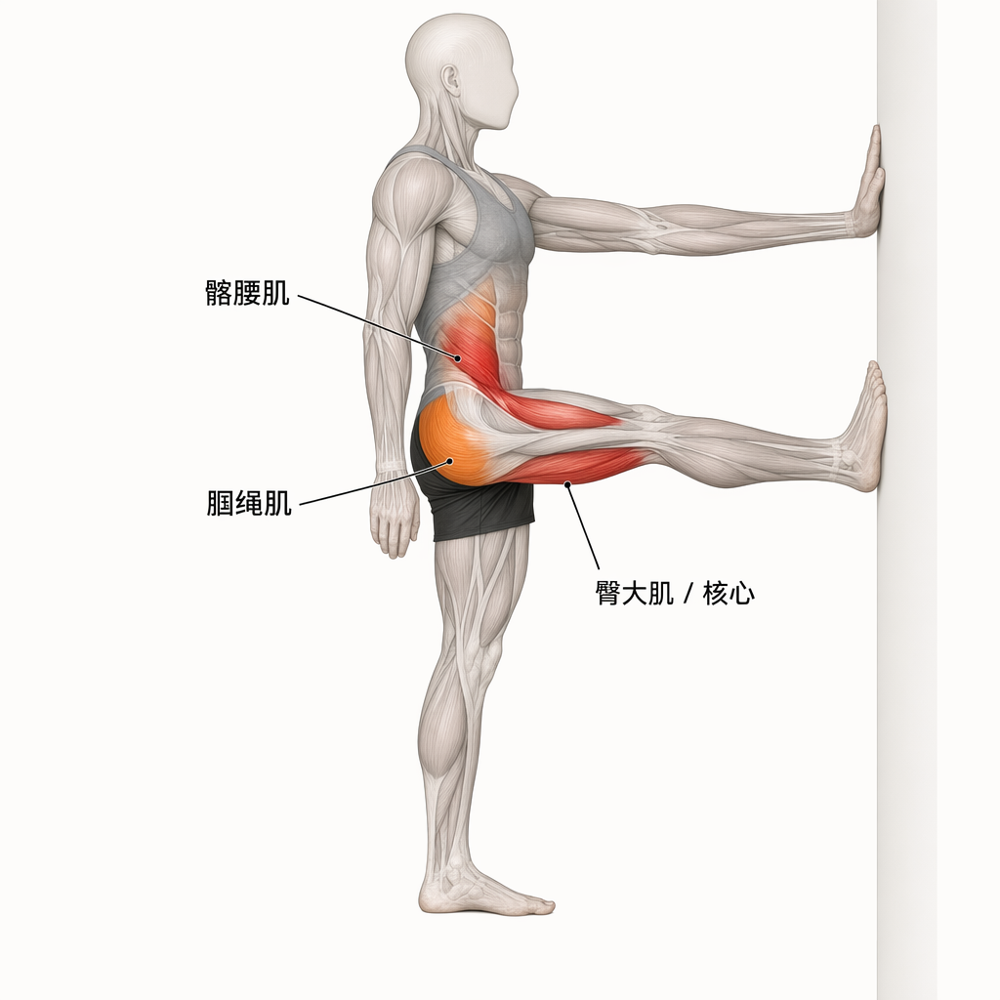

**版本**: v1 · **耗时**: 242s · **生成时间**: 2026-05-02T13:35:34Z

**分类**: 动态激活 · **视角**: side view, facing right

**应有标签 (中文)**: 髂腰肌 / 腘绳肌 / 臀大肌 / 核心

<details><summary>展开 prompt</summary>

```
Anatomical muscle-activation diagram of the "前后摆腿" (leg swing (front and back)) exercise, side view, facing right. Person posture: Athletic person at the front phase of a forward leg swing (dynamic stretch / activation): right leg supporting with foot flat on the ground; left leg swung forward and up to hip height with knee almost fully extended; torso upright, right hand placed on a wall or support to the right for balance; this is a controlled dynamic mobility movement; plain black athletic shorts and gray tank top. Body rendered with semi-transparent skin so underlying muscles are visible. Highlight in saturated red the primary working muscles: hip flexors (psoas) of the swinging leg, with eccentric load on the hamstring group. Highlight in orange the secondary stabilizers: gluteus maximus of the supporting leg and core muscles. Other muscles in pale neutral gray. Add small clean labels with thin black arrow leader lines pointing from each label to its target muscle group. The labels MUST be in simplified Chinese characters using a clean sans-serif font. Use exactly the following labels: "髂腰肌" pointing to the hip flexors of the swinging leg; "腘绳肌" pointing to the hamstring group (eccentric load); "臀大肌 / 核心" pointing to the glute and core area. 

CRITICAL CONSTRAINTS — these are non-negotiable:
1. ALL TEXT IN THE IMAGE MUST BE SIMPLIFIED CHINESE CHARACTERS ONLY.
2. ABSOLUTELY NO ENGLISH WORDS, NO LATIN LETTERS, NO PINYIN ANYWHERE IN THE IMAGE.
3. NO romanization or transliteration of muscle names.
4. NO captions, NO subtitles, NO step-by-step text overlays.
5. ONLY the muscle labels listed above should appear as text.

Style: clean medical textbook illustration, off-white background, no facial features (head shape may be shown but no eyes/nose/mouth), anatomically accurate proportions, no shadows on background, no watermarks, no signature.
```

</details>

---

### ❓ T1175 — 前后跨步 (front-back agility hops (feet together))

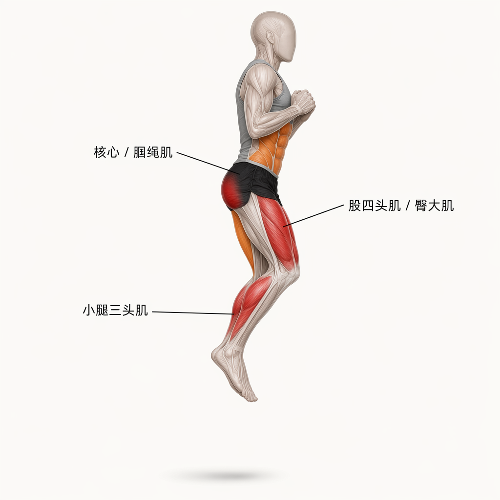

**版本**: v3 · **耗时**: 230s · **生成时间**: 2026-05-04T08:13:02Z

**分类**: 动态激活 · **视角**: side view, facing right, freeze-frame photographic style

**应有标签 (中文)**: 小腿三头肌 / 股四头肌 / 臀大肌 / 核心 / 腘绳肌

<details><summary>展开 prompt</summary>

```
Anatomical muscle-activation diagram of the "前后跨步" (front-back agility hops (feet together)) exercise, side view, facing right, freeze-frame photographic style. Person posture: Photographic freeze-frame, side view, of a forward agility hop with feet together. The athlete is suspended IN MID-AIR — about 15-20 cm of CLEAR EMPTY FLOOR SPACE is visible directly below both feet (a small shadow on the ground far below confirms airborne). BOTH FEET ARE PARALLEL and TOUCHING each other (side-by-side as one unit, like a frog hop or two-foot bunny hop). Both knees slightly bent in mid-flight. The body is mid-flight TRAVELING FORWARD (toward the right of the frame). Arms held at chest height bent at the elbows close to the body for balance. Torso upright with slight forward lean indicating forward motion. Plain black athletic shorts and gray tank top. NEGATIVE: this is NOT a running stride with feet apart in front-back position; this is NOT a single-leg hop — both feet are TOGETHER as one unit, and both feet are CURRENTLY OFF THE GROUND.. Body rendered with semi-transparent skin so underlying muscles are visible. Highlight in saturated red the primary working muscles: calf muscles and quadriceps and gluteus maximus for quick reactive jumps. Highlight in orange the secondary stabilizers: core muscles and hamstring group. Other muscles in pale neutral gray. Add small clean labels with thin black arrow leader lines pointing from each label to its target muscle group. The labels MUST be in simplified Chinese characters using a clean sans-serif font. Use exactly the following labels: "小腿三头肌" pointing to the calf muscles; "股四头肌 / 臀大肌" pointing to the quadriceps and glute area; "核心 / 腘绳肌" pointing to the core and hamstring area. 

CRITICAL CONSTRAINTS — these are non-negotiable:
1. ALL TEXT IN THE IMAGE MUST BE SIMPLIFIED CHINESE CHARACTERS ONLY.
2. ABSOLUTELY NO ENGLISH WORDS, NO LATIN LETTERS, NO PINYIN ANYWHERE IN THE IMAGE.
3. NO romanization or transliteration of muscle names.
4. NO captions, NO subtitles, NO step-by-step text overlays.
5. ONLY the muscle labels listed above should appear as text.

Style: clean medical textbook illustration, off-white background, no facial features (head shape may be shown but no eyes/nose/mouth), anatomically accurate proportions, no shadows on background, no watermarks, no signature.
```

</details>

---

### ❓ T1224 — 弓步动态拉伸 (dynamic lunge pulls)

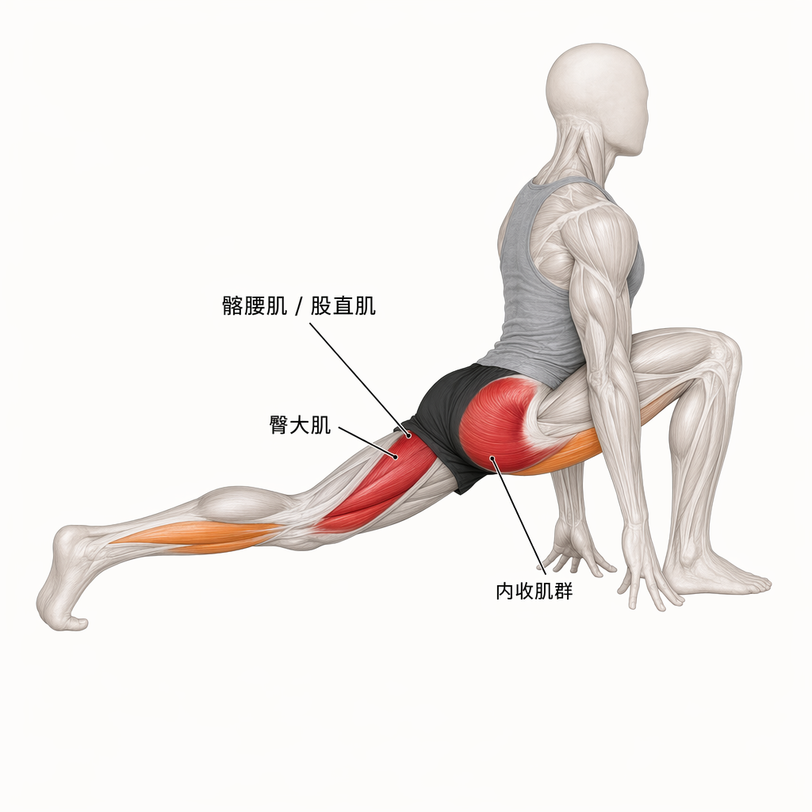

**版本**: v1 · **耗时**: 233s · **生成时间**: 2026-05-02T13:52:59Z

**分类**: 动态激活 · **视角**: side view, facing right

**应有标签 (中文)**: 髂腰肌 / 股直肌 / 臀大肌 / 内收肌群

<details><summary>展开 prompt</summary>

```
Anatomical muscle-activation diagram of the "弓步动态拉伸" (dynamic lunge pulls) exercise, side view, facing right. Person posture: Athletic person in a dynamic lunge stretch position: right leg in a deep lunge front position with right foot flat and right knee bent at 90 degrees; left leg extended fully back with knee close to but not touching the ground, ball of left foot on the ground; both hands placed on the floor inside the right foot for support, hips pushed forward and down to deepen the hip flexor stretch on the rear (left) leg; torso upright through the spine, looking forward; plain black athletic shorts and gray tank top. Body rendered with semi-transparent skin so underlying muscles are visible. Highlight in saturated red the primary working muscles: hip flexors (psoas, rectus femoris) of the rear leg under stretch, and gluteus maximus of the front leg. Highlight in orange the secondary stabilizers: quadriceps of the rear leg and adductor muscles. Other muscles in pale neutral gray. Add small clean labels with thin black arrow leader lines pointing from each label to its target muscle group. The labels MUST be in simplified Chinese characters using a clean sans-serif font. Use exactly the following labels: "髂腰肌 / 股直肌" pointing to the hip flexors of the rear leg under stretch; "臀大肌" pointing to the gluteus maximus of the front leg; "内收肌群" pointing to the adductor muscles. 

CRITICAL CONSTRAINTS — these are non-negotiable:
1. ALL TEXT IN THE IMAGE MUST BE SIMPLIFIED CHINESE CHARACTERS ONLY.
2. ABSOLUTELY NO ENGLISH WORDS, NO LATIN LETTERS, NO PINYIN ANYWHERE IN THE IMAGE.
3. NO romanization or transliteration of muscle names.
4. NO captions, NO subtitles, NO step-by-step text overlays.
5. ONLY the muscle labels listed above should appear as text.

Style: clean medical textbook illustration, off-white background, no facial features (head shape may be shown but no eyes/nose/mouth), anatomically accurate proportions, no shadows on background, no watermarks, no signature.
```

</details>

---

### ❓ T1263 — 侧向摆腿 (lateral leg swings)

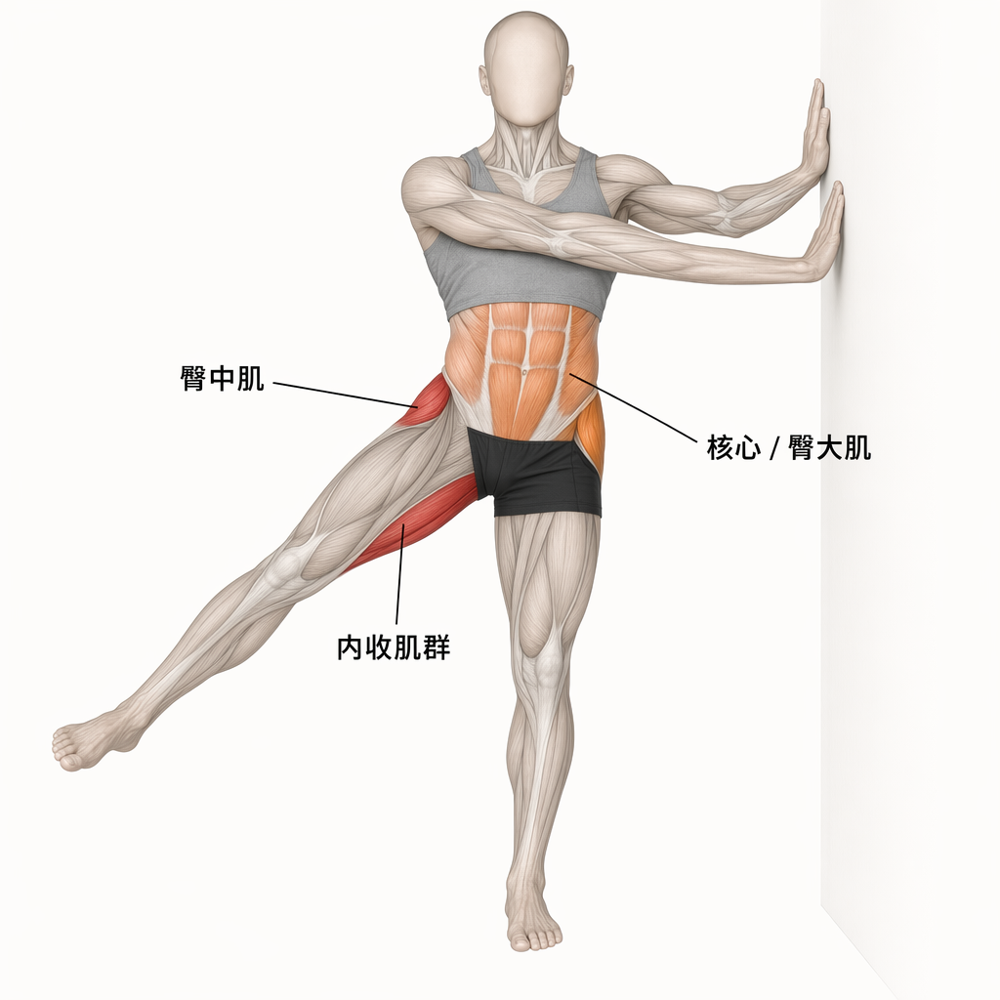

**版本**: v1 · **耗时**: 210s · **生成时间**: 2026-05-02T13:52:55Z

**分类**: 动态激活 · **视角**: front view, facing the viewer

**应有标签 (中文)**: 臀中肌 / 内收肌群 / 核心 / 臀大肌

<details><summary>展开 prompt</summary>

```
Anatomical muscle-activation diagram of the "侧向摆腿" (lateral leg swings) exercise, front view, facing the viewer. Person posture: Athletic person at the top of an outward lateral leg swing: right leg supporting with foot flat on the ground; left leg swung outward to the left side at about 45 degrees from the vertical, knee almost fully extended, foot relaxed; both hands placed on a wall in front of the body at shoulder height for balance, arms straight; torso upright, hips facing forward; controlled dynamic mobility movement; plain black athletic shorts and gray tank top. Body rendered with semi-transparent skin so underlying muscles are visible. Highlight in saturated red the primary working muscles: gluteus medius and adductor muscles (eccentric stretch). Highlight in orange the secondary stabilizers: core muscles and gluteus maximus of the supporting hip. Other muscles in pale neutral gray. Add small clean labels with thin black arrow leader lines pointing from each label to its target muscle group. The labels MUST be in simplified Chinese characters using a clean sans-serif font. Use exactly the following labels: "臀中肌" pointing to the gluteus medius; "内收肌群" pointing to the adductor muscles (under stretch); "核心 / 臀大肌" pointing to the core and supporting glute area. 

CRITICAL CONSTRAINTS — these are non-negotiable:
1. ALL TEXT IN THE IMAGE MUST BE SIMPLIFIED CHINESE CHARACTERS ONLY.
2. ABSOLUTELY NO ENGLISH WORDS, NO LATIN LETTERS, NO PINYIN ANYWHERE IN THE IMAGE.
3. NO romanization or transliteration of muscle names.
4. NO captions, NO subtitles, NO step-by-step text overlays.
5. ONLY the muscle labels listed above should appear as text.

Style: clean medical textbook illustration, off-white background, no facial features (head shape may be shown but no eyes/nose/mouth), anatomically accurate proportions, no shadows on background, no watermarks, no signature.
```

</details>

---

### ❓ T1248 — 胸椎旋转 (thoracic spine rotation)

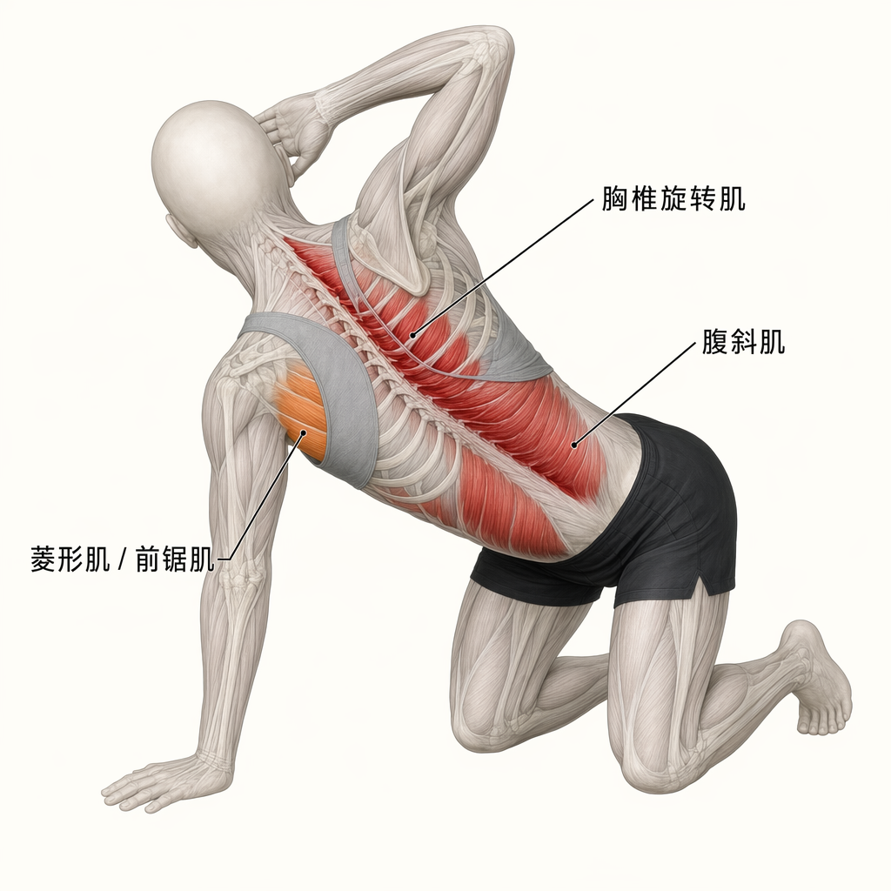

**版本**: v1 · **耗时**: 237s · **生成时间**: 2026-05-02T14:17:34Z

**分类**: 动态激活 · **视角**: front-three-quarter view

**应有标签 (中文)**: 胸椎旋转肌 / 腹斜肌 / 菱形肌 / 前锯肌

<details><summary>展开 prompt</summary>

```
Anatomical muscle-activation diagram of the "胸椎旋转" (thoracic spine rotation) exercise, front-three-quarter view. Person posture: Athletic person performing a thoracic spine rotation in quadruped position: starting on hands and knees (hands under shoulders, knees under hips); right hand placed lightly behind the head with elbow out to the side; rotating the upper back so that the right elbow points up toward the ceiling, opening the chest to the right side; the left arm remains supporting on the ground; lower back and hips remain stable (rotation is from the thoracic spine only, not the lumbar); plain black athletic shorts and gray tank top. Body rendered with semi-transparent skin so underlying muscles are visible. Highlight in saturated red the primary working muscles: thoracic spine rotators and obliques. Highlight in orange the secondary stabilizers: rhomboids and serratus anterior of the supporting arm. Other muscles in pale neutral gray. Add small clean labels with thin black arrow leader lines pointing from each label to its target muscle group. The labels MUST be in simplified Chinese characters using a clean sans-serif font. Use exactly the following labels: "胸椎旋转肌" pointing to the thoracic spine rotators; "腹斜肌" pointing to the obliques; "菱形肌 / 前锯肌" pointing to the rhomboids and serratus anterior. 

CRITICAL CONSTRAINTS — these are non-negotiable:
1. ALL TEXT IN THE IMAGE MUST BE SIMPLIFIED CHINESE CHARACTERS ONLY.
2. ABSOLUTELY NO ENGLISH WORDS, NO LATIN LETTERS, NO PINYIN ANYWHERE IN THE IMAGE.
3. NO romanization or transliteration of muscle names.
4. NO captions, NO subtitles, NO step-by-step text overlays.
5. ONLY the muscle labels listed above should appear as text.

Style: clean medical textbook illustration, off-white background, no facial features (head shape may be shown but no eyes/nose/mouth), anatomically accurate proportions, no shadows on background, no watermarks, no signature.
```

</details>

---

### ❓ T1262 — 世界最佳拉伸 (world's greatest stretch)

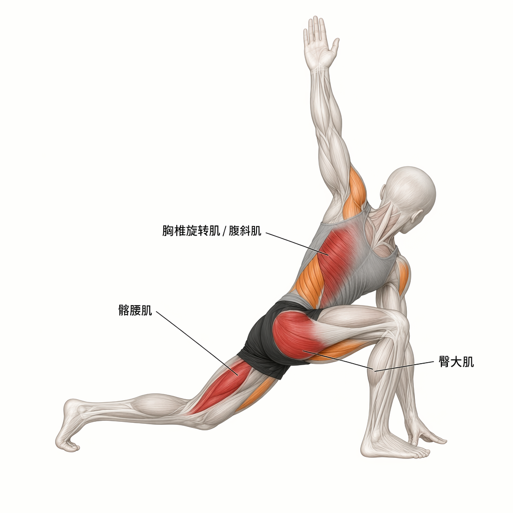

**版本**: v1 · **耗时**: 237s · **生成时间**: 2026-05-02T14:17:38Z

**分类**: 动态激活 · **视角**: side view, facing right

**应有标签 (中文)**: 髂腰肌 / 臀大肌 / 胸椎旋转肌 / 腹斜肌

<details><summary>展开 prompt</summary>

```
Anatomical muscle-activation diagram of the "世界最佳拉伸" (world's greatest stretch) exercise, side view, facing right. Person posture: Athletic person at the deepest phase of the world's greatest stretch (low lunge with thoracic rotation): right foot in a deep lunge front position with right knee bent at 90 degrees, foot flat; left leg extended back with knee just above the ground, ball of left foot on the ground; left hand placed on the ground inside the right foot for support; right arm reaching straight up toward the ceiling with the chest opened and rotated to the right; head following the right hand; full-body dynamic stretch combining hip flexor stretch, glute stretch, and thoracic rotation; plain black athletic shorts and gray tank top. Body rendered with semi-transparent skin so underlying muscles are visible. Highlight in saturated red the primary working muscles: hip flexors of the rear leg under stretch and gluteus maximus of the front leg, and thoracic rotators. Highlight in orange the secondary stabilizers: obliques and adductors and shoulder stabilizers. Other muscles in pale neutral gray. Add small clean labels with thin black arrow leader lines pointing from each label to its target muscle group. The labels MUST be in simplified Chinese characters using a clean sans-serif font. Use exactly the following labels: "髂腰肌" pointing to the hip flexors of the rear leg; "臀大肌" pointing to the gluteus maximus of the front leg; "胸椎旋转肌 / 腹斜肌" pointing to the thoracic rotators and obliques. 

CRITICAL CONSTRAINTS — these are non-negotiable:
1. ALL TEXT IN THE IMAGE MUST BE SIMPLIFIED CHINESE CHARACTERS ONLY.
2. ABSOLUTELY NO ENGLISH WORDS, NO LATIN LETTERS, NO PINYIN ANYWHERE IN THE IMAGE.
3. NO romanization or transliteration of muscle names.
4. NO captions, NO subtitles, NO step-by-step text overlays.
5. ONLY the muscle labels listed above should appear as text.

Style: clean medical textbook illustration, off-white background, no facial features (head shape may be shown but no eyes/nose/mouth), anatomically accurate proportions, no shadows on background, no watermarks, no signature.
```

</details>

---

### ❓ T1244 — 臀部拉伸 / 鸽子式 (pigeon pose / glute stretch)

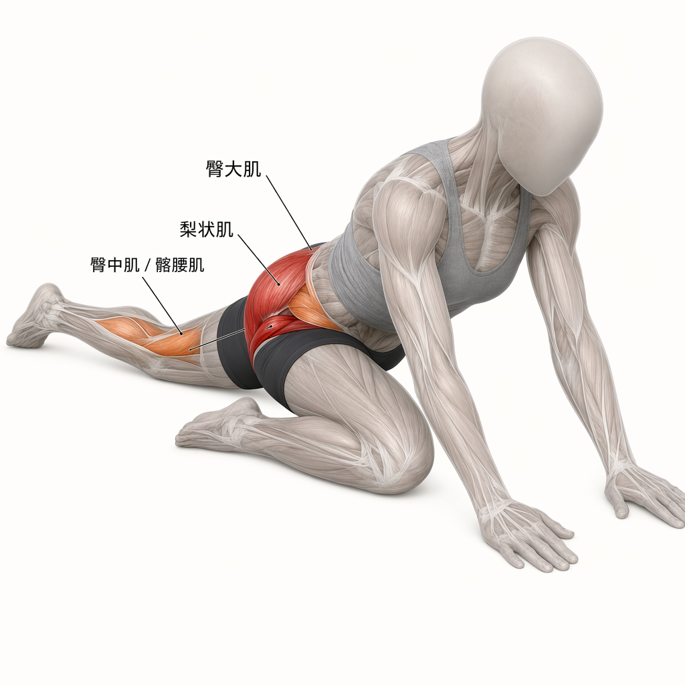

**版本**: v1 · **耗时**: 243s · **生成时间**: 2026-05-04T08:17:23Z

**分类**: 动态激活 · **视角**: three-quarter view from the front and slightly above

**应有标签 (中文)**: 臀大肌 / 梨状肌 / 臀中肌 / 髂腰肌

<details><summary>展开 prompt</summary>

```
Anatomical muscle-activation diagram of the "臀部拉伸 / 鸽子式" (pigeon pose / glute stretch) exercise, three-quarter view from the front and slightly above. Person posture: Athletic person in a pigeon pose stretch: starting from a quadruped position, the right leg has been brought forward and placed under the body so that the right knee is bent and pointing forward, the right shin lies horizontally across the body (right foot near the left hip, right shin roughly parallel to the front edge of the mat). The left leg is fully extended straight back, with the top of the left foot resting flat on the ground. The torso leans gently forward over the front (right) leg, with both forearms or hands flat on the ground in front of the body for support. Hips squared toward the front, deep stretch in the right glute and outer hip. Plain black athletic shorts and gray tank top.. Body rendered with semi-transparent skin so underlying muscles are visible. Highlight in saturated red the primary working muscles: gluteus maximus and piriformis of the front (right) hip. Highlight in orange the secondary stabilizers: hip flexors of the rear (left) leg and gluteus medius of the front hip. Other muscles in pale neutral gray. Add small clean labels with thin black arrow leader lines pointing from each label to its target muscle group. The labels MUST be in simplified Chinese characters using a clean sans-serif font. Use exactly the following labels: "臀大肌" pointing to the gluteus maximus of the front hip; "梨状肌" pointing to the piriformis; "臀中肌 / 髂腰肌" pointing to the gluteus medius and hip flexor area. 

CRITICAL CONSTRAINTS — these are non-negotiable:
1. ALL TEXT IN THE IMAGE MUST BE SIMPLIFIED CHINESE CHARACTERS ONLY.
2. ABSOLUTELY NO ENGLISH WORDS, NO LATIN LETTERS, NO PINYIN ANYWHERE IN THE IMAGE.
3. NO romanization or transliteration of muscle names.
4. NO captions, NO subtitles, NO step-by-step text overlays.
5. ONLY the muscle labels listed above should appear as text.

Style: clean medical textbook illustration, off-white background, no facial features (head shape may be shown but no eyes/nose/mouth), anatomically accurate proportions, no shadows on background, no watermarks, no signature.
```

</details>

---

### ❓ T1274 — 髂腰肌弓步拉伸 (kneeling lunge hip flexor stretch)

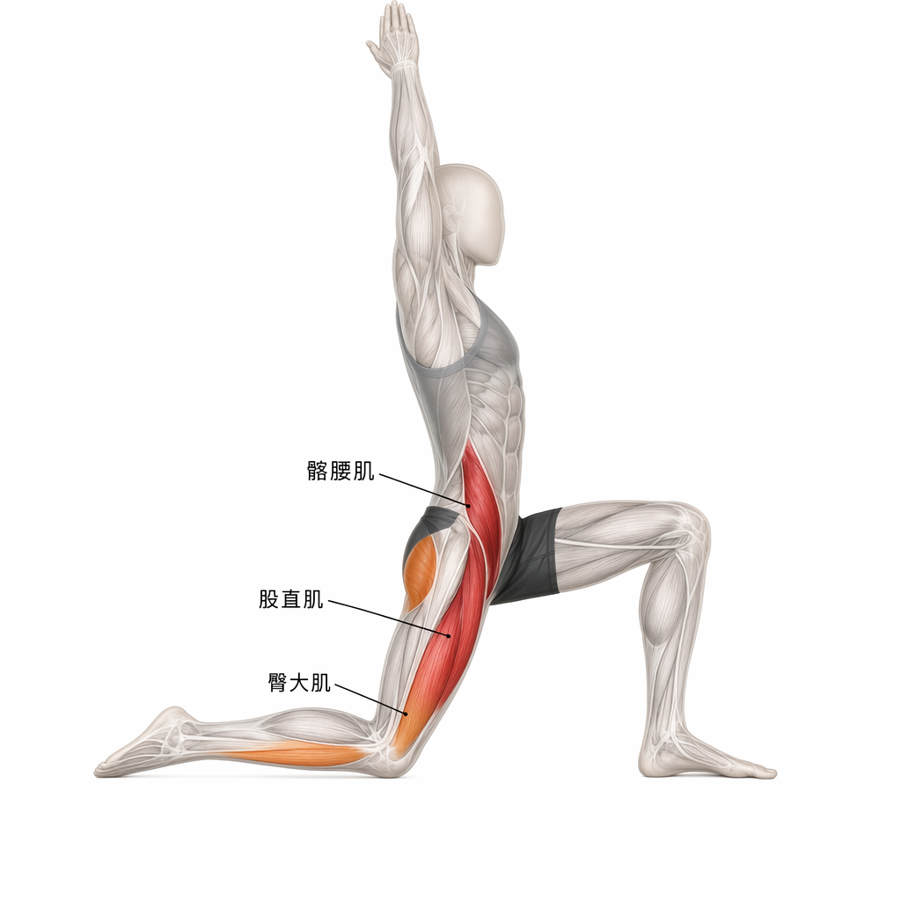

**版本**: v1 · **耗时**: 223s · **生成时间**: 2026-05-04T08:20:10Z

**分类**: 动态激活 · **视角**: side view, facing right

**应有标签 (中文)**: 髂腰肌 / 股直肌 / 臀大肌

<details><summary>展开 prompt</summary>

```
Anatomical muscle-activation diagram of the "髂腰肌弓步拉伸" (kneeling lunge hip flexor stretch) exercise, side view, facing right. Person posture: Athletic person in a kneeling lunge hip flexor stretch position: front leg (right) bent with foot flat on the ground and knee at 90 degrees, knee directly over ankle. Rear leg (left) kneeling with the knee on the ground (on a soft mat) and the top of the foot pointing back. Hips pushed forward to feel the stretch in the front of the rear (left) hip and thigh. Torso completely upright (vertical), or both arms raised straight overhead with hands together to deepen the hip flexor stretch. Plain black athletic shorts and gray tank top. CRITICAL: the rear LEFT KNEE is on the ground, the front RIGHT KNEE is over the right ankle at 90 degrees.. Body rendered with semi-transparent skin so underlying muscles are visible. Highlight in saturated red the primary working muscles: hip flexors (psoas major and rectus femoris) of the rear (left) leg under stretch. Highlight in orange the secondary stabilizers: quadriceps of the rear leg and gluteus maximus of the front leg. Other muscles in pale neutral gray. Add small clean labels with thin black arrow leader lines pointing from each label to its target muscle group. The labels MUST be in simplified Chinese characters using a clean sans-serif font. Use exactly the following labels: "髂腰肌" pointing to the iliopsoas (hip flexor) of the rear leg; "股直肌" pointing to the rectus femoris of the rear leg; "臀大肌" pointing to the gluteus maximus of the front leg. 

CRITICAL CONSTRAINTS — these are non-negotiable:
1. ALL TEXT IN THE IMAGE MUST BE SIMPLIFIED CHINESE CHARACTERS ONLY.
2. ABSOLUTELY NO ENGLISH WORDS, NO LATIN LETTERS, NO PINYIN ANYWHERE IN THE IMAGE.
3. NO romanization or transliteration of muscle names.
4. NO captions, NO subtitles, NO step-by-step text overlays.
5. ONLY the muscle labels listed above should appear as text.

Style: clean medical textbook illustration, off-white background, no facial features (head shape may be shown but no eyes/nose/mouth), anatomically accurate proportions, no shadows on background, no watermarks, no signature.
```

</details>

---

### ❓ T1234 — 猫牛式 (牛相) (cat-cow stretch (cow phase))

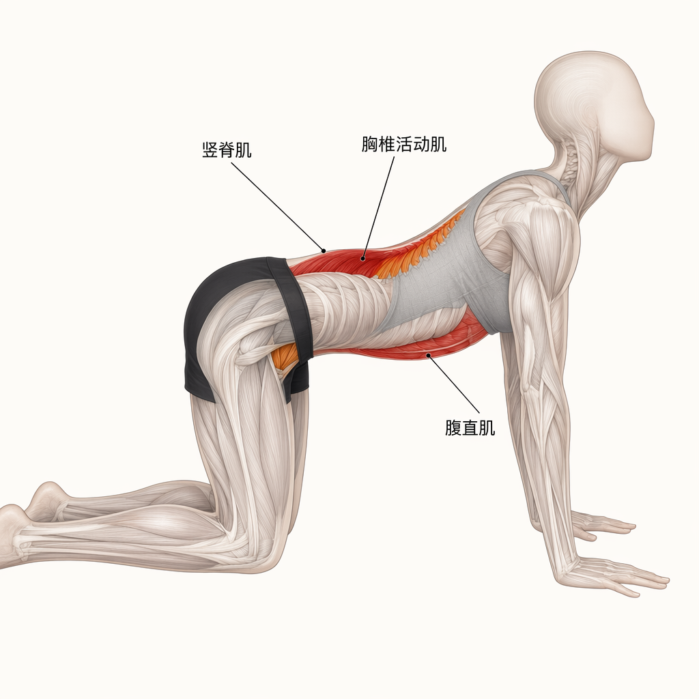

**版本**: v1 · **耗时**: 225s · **生成时间**: 2026-05-04T08:20:13Z

**分类**: 动态激活 · **视角**: side view, facing right

**应有标签 (中文)**: 竖脊肌 / 腹直肌 / 胸椎活动肌

<details><summary>展开 prompt</summary>

```
Anatomical muscle-activation diagram of the "猫牛式 (牛相)" (cat-cow stretch (cow phase)) exercise, side view, facing right. Person posture: Athletic person in a quadruped position performing the COW phase of the cat-cow stretch: hands flat on the ground directly under shoulders (arms straight, fingers spread), knees on the ground directly under hips. The back is gently ARCHED downward (lumbar extension) — belly drops toward the floor, chest lifts up and forward, the head tilts up to look slightly forward and up. This is the OPEN/COW phase. Plain black athletic shorts and gray tank top.. Body rendered with semi-transparent skin so underlying muscles are visible. Highlight in saturated red the primary working muscles: erector spinae and rectus abdominis (eccentric stretch through spinal flexion-extension cycle). Highlight in orange the secondary stabilizers: thoracic spine mobilizers and pelvic floor muscles. Other muscles in pale neutral gray. Add small clean labels with thin black arrow leader lines pointing from each label to its target muscle group. The labels MUST be in simplified Chinese characters using a clean sans-serif font. Use exactly the following labels: "竖脊肌" pointing to the erector spinae; "腹直肌" pointing to the rectus abdominis (under stretch in cow phase); "胸椎活动肌" pointing to the thoracic spine mobilizers. 

CRITICAL CONSTRAINTS — these are non-negotiable:
1. ALL TEXT IN THE IMAGE MUST BE SIMPLIFIED CHINESE CHARACTERS ONLY.
2. ABSOLUTELY NO ENGLISH WORDS, NO LATIN LETTERS, NO PINYIN ANYWHERE IN THE IMAGE.
3. NO romanization or transliteration of muscle names.
4. NO captions, NO subtitles, NO step-by-step text overlays.
5. ONLY the muscle labels listed above should appear as text.

Style: clean medical textbook illustration, off-white background, no facial features (head shape may be shown but no eyes/nose/mouth), anatomically accurate proportions, no shadows on background, no watermarks, no signature.
```

</details>

---

### ❓ HIP_9090 — 90/90 髋开合 (90/90 hip switch position)

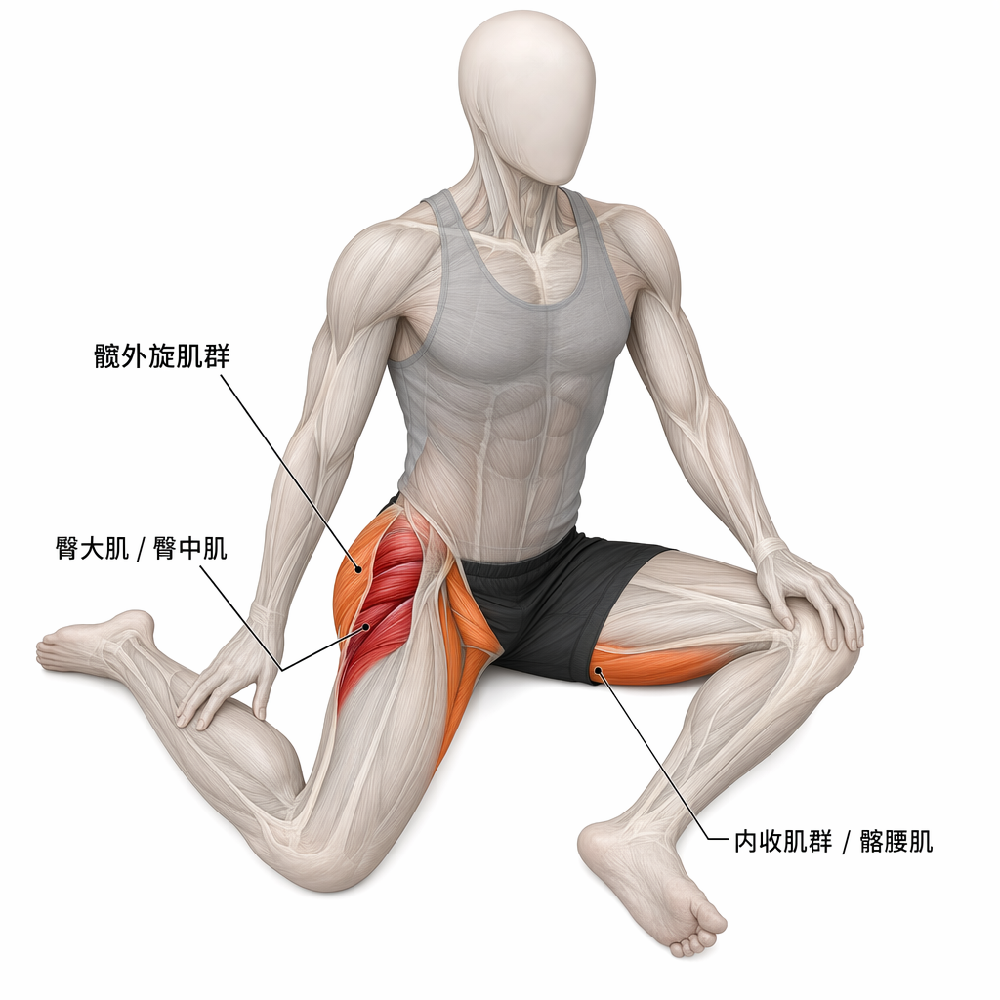

**版本**: v1 · **耗时**: 247s · **生成时间**: 2026-05-04T08:28:29Z

**分类**: 动态激活 · **视角**: front-three-quarter view from above and slightly to the side

**应有标签 (中文)**: 髋外旋肌群 / 臀大肌 / 臀中肌 / 内收肌群 / 髂腰肌

<details><summary>展开 prompt</summary>

```
Anatomical muscle-activation diagram of the "90/90 髋开合" (90/90 hip switch position) exercise, front-three-quarter view from above and slightly to the side. Person posture: Athletic person seated on the floor in a 90/90 hip position: the right leg is in front with the right hip externally rotated, right knee bent at 90 degrees with the right thigh perpendicular to the body (knee pointing out to the right side) and the right shin lying horizontally across the body. The left leg is behind to the left side with the left hip internally rotated, left knee bent at 90 degrees with the left thigh angled to the left and the left shin lying horizontally pointing backward (knee pointing forward, foot pointing back). Torso upright with hands either on the floor at the sides or on the front knee. Plain black athletic shorts and gray tank top.. Body rendered with semi-transparent skin so underlying muscles are visible. Highlight in saturated red the primary working muscles: hip rotators (deep external and internal rotators) of both hips, with stretch on the gluteal complex. Highlight in orange the secondary stabilizers: adductors and hip flexors and gluteus medius. Other muscles in pale neutral gray. Add small clean labels with thin black arrow leader lines pointing from each label to its target muscle group. The labels MUST be in simplified Chinese characters using a clean sans-serif font. Use exactly the following labels: "髋外旋肌群" pointing to the external hip rotators; "臀大肌 / 臀中肌" pointing to the gluteal muscles; "内收肌群 / 髂腰肌" pointing to the adductor and hip flexor area. 

CRITICAL CONSTRAINTS — these are non-negotiable:
1. ALL TEXT IN THE IMAGE MUST BE SIMPLIFIED CHINESE CHARACTERS ONLY.
2. ABSOLUTELY NO ENGLISH WORDS, NO LATIN LETTERS, NO PINYIN ANYWHERE IN THE IMAGE.
3. NO romanization or transliteration of muscle names.
4. NO captions, NO subtitles, NO step-by-step text overlays.
5. ONLY the muscle labels listed above should appear as text.

Style: clean medical textbook illustration, off-white background, no facial features (head shape may be shown but no eyes/nose/mouth), anatomically accurate proportions, no shadows on background, no watermarks, no signature.
```

</details>

---

## 单腿稳定 (3)

### ❓ T1144 — 单腿硬拉抬膝 (single-leg deadlift with knee drive)

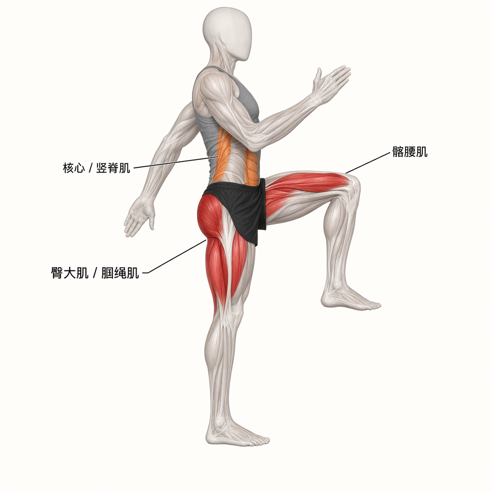

**版本**: v1 · **耗时**: 246s · **生成时间**: 2026-05-02T13:16:23Z

**分类**: 单腿稳定 · **视角**: side view, facing right

**应有标签 (中文)**: 臀大肌 / 腘绳肌 / 髂腰肌 / 核心 / 竖脊肌

<details><summary>展开 prompt</summary>

```
Anatomical muscle-activation diagram of the "单腿硬拉抬膝" (single-leg deadlift with knee drive) exercise, side view, facing right. Person posture: Athletic person at the top of a single-leg deadlift to knee drive: right leg standing with a slight bend at the knee; left knee driven up high in front of the body to hip height with thigh parallel to the floor and shin perpendicular (90 degree knee bend); torso upright with neutral spine; arms swinging in opposition (right arm forward, left arm back) like a running stride; plain black athletic shorts and gray tank top. Body rendered with semi-transparent skin so underlying muscles are visible. Highlight in saturated red the primary working muscles: gluteus maximus and hamstring of the supporting (right) leg, hip flexors (psoas and rectus femoris) of the lifted (left) leg. Highlight in orange the secondary stabilizers: core muscles (transverse abdominis) and erector spinae. Other muscles in pale neutral gray. Add small clean labels with thin black arrow leader lines pointing from each label to its target muscle group. The labels MUST be in simplified Chinese characters using a clean sans-serif font. Use exactly the following labels: "臀大肌 / 腘绳肌" pointing to the glute and hamstring of the supporting leg; "髂腰肌" pointing to the hip flexors of the lifted leg; "核心 / 竖脊肌" pointing to the core and erector spinae area. 

CRITICAL CONSTRAINTS — these are non-negotiable:
1. ALL TEXT IN THE IMAGE MUST BE SIMPLIFIED CHINESE CHARACTERS ONLY.
2. ABSOLUTELY NO ENGLISH WORDS, NO LATIN LETTERS, NO PINYIN ANYWHERE IN THE IMAGE.
3. NO romanization or transliteration of muscle names.
4. NO captions, NO subtitles, NO step-by-step text overlays.
5. ONLY the muscle labels listed above should appear as text.

Style: clean medical textbook illustration, off-white background, no facial features (head shape may be shown but no eyes/nose/mouth), anatomically accurate proportions, no shadows on background, no watermarks, no signature.
```

</details>

---

### ❓ T1166 — 台阶踩上 (box step-up)

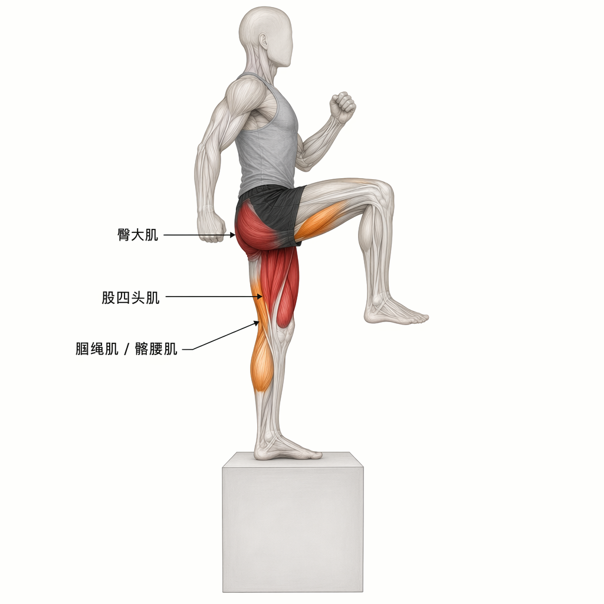

**版本**: v1 · **耗时**: 214s · **生成时间**: 2026-05-02T13:34:37Z

**分类**: 单腿稳定 · **视角**: side view, facing right

**应有标签 (中文)**: 股四头肌 / 臀大肌 / 腘绳肌 / 髂腰肌

<details><summary>展开 prompt</summary>

```
Anatomical muscle-activation diagram of the "台阶踩上" (box step-up) exercise, side view, facing right. Person posture: Athletic person at the top of a box step-up: right foot fully planted on top of a knee-height box or platform with right knee fully extended supporting the body weight; left leg lifted with thigh at hip height (parallel to floor) and knee bent at 90 degrees; torso upright with neutral spine; arms in running-style opposition; plain black athletic shorts and gray tank top. Body rendered with semi-transparent skin so underlying muscles are visible. Highlight in saturated red the primary working muscles: quadriceps and gluteus maximus of the standing (right) leg. Highlight in orange the secondary stabilizers: hamstring group of the standing leg and hip flexors of the lifted leg. Other muscles in pale neutral gray. Add small clean labels with thin black arrow leader lines pointing from each label to its target muscle group. The labels MUST be in simplified Chinese characters using a clean sans-serif font. Use exactly the following labels: "股四头肌" pointing to the quadriceps of the standing leg; "臀大肌" pointing to the gluteus maximus; "腘绳肌 / 髂腰肌" pointing to the hamstring and hip flexor area. 

CRITICAL CONSTRAINTS — these are non-negotiable:
1. ALL TEXT IN THE IMAGE MUST BE SIMPLIFIED CHINESE CHARACTERS ONLY.
2. ABSOLUTELY NO ENGLISH WORDS, NO LATIN LETTERS, NO PINYIN ANYWHERE IN THE IMAGE.
3. NO romanization or transliteration of muscle names.
4. NO captions, NO subtitles, NO step-by-step text overlays.
5. ONLY the muscle labels listed above should appear as text.

Style: clean medical textbook illustration, off-white background, no facial features (head shape may be shown but no eyes/nose/mouth), anatomically accurate proportions, no shadows on background, no watermarks, no signature.
```

</details>

---

### ❓ T1345 — BOSU 单腿站立 (BOSU single-leg balance)

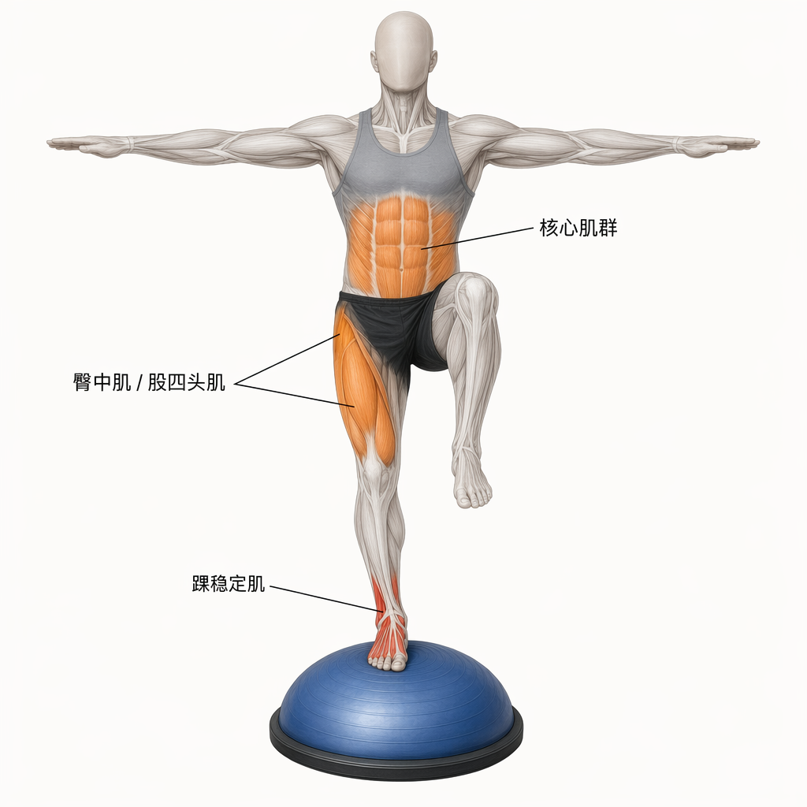

**版本**: v1 · **耗时**: 251s · **生成时间**: 2026-05-04T08:25:05Z

**分类**: 单腿稳定 · **视角**: front view, facing the viewer

**应有标签 (中文)**: 踝稳定肌 / 臀中肌 / 股四头肌 / 核心肌群

<details><summary>展开 prompt</summary>

```
Anatomical muscle-activation diagram of the "BOSU 单腿站立" (BOSU single-leg balance) exercise, front view, facing the viewer. Person posture: Athletic person standing on a BOSU half-ball training device with the dome side facing UP (the flat platform is on the floor, the rubber dome is what the foot stands on). Only the RIGHT FOOT is balanced on the center of the dome. The LEFT LEG is lifted off the ground with the left knee bent to 90 degrees in front of the body (left thigh approximately parallel to the floor). Both arms are extended out to the sides at shoulder height for balance. Right knee is slightly bent for shock absorption. Torso upright with neutral spine. Plain black athletic shorts and gray tank top.. Body rendered with semi-transparent skin so underlying muscles are visible. Highlight in saturated red the primary working muscles: ankle stabilizers of the supporting leg (peroneals, tibialis posterior, intrinsic foot muscles). Highlight in orange the secondary stabilizers: quadriceps and gluteus medius of the supporting leg, and core stabilizers. Other muscles in pale neutral gray. Add small clean labels with thin black arrow leader lines pointing from each label to its target muscle group. The labels MUST be in simplified Chinese characters using a clean sans-serif font. Use exactly the following labels: "踝稳定肌" pointing to the ankle stabilizers; "臀中肌 / 股四头肌" pointing to the gluteus medius and quadriceps; "核心肌群" pointing to the core stabilizers. 

CRITICAL CONSTRAINTS — these are non-negotiable:
1. ALL TEXT IN THE IMAGE MUST BE SIMPLIFIED CHINESE CHARACTERS ONLY.
2. ABSOLUTELY NO ENGLISH WORDS, NO LATIN LETTERS, NO PINYIN ANYWHERE IN THE IMAGE.
3. NO romanization or transliteration of muscle names.
4. NO captions, NO subtitles, NO step-by-step text overlays.
5. ONLY the muscle labels listed above should appear as text.

Style: clean medical textbook illustration, off-white background, no facial features (head shape may be shown but no eyes/nose/mouth), anatomically accurate proportions, no shadows on background, no watermarks, no signature.
```

</details>

---

## 单腿跳跃 (3)

### ❓ T1218 — 单腿高抬腿跳 (single-leg high-knee jump)

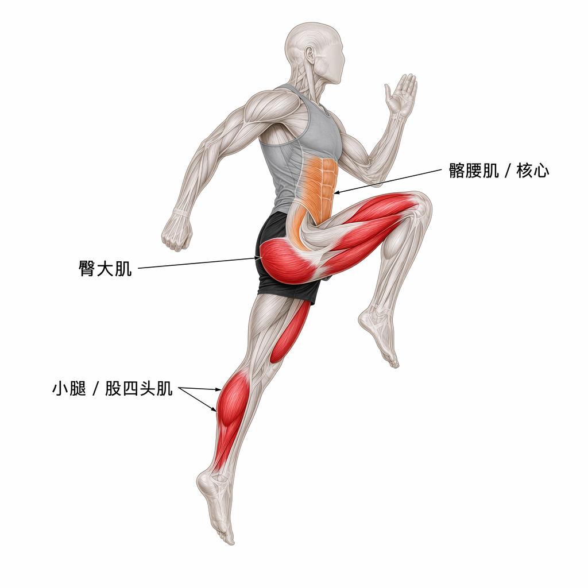

**版本**: v1 · **耗时**: 226s · **生成时间**: 2026-05-02T13:31:32Z

**分类**: 单腿跳跃 · **视角**: side view, facing right

**应有标签 (中文)**: 小腿 / 股四头肌 / 臀大肌 / 髂腰肌 / 核心

<details><summary>展开 prompt</summary>

```
Anatomical muscle-activation diagram of the "单腿高抬腿跳" (single-leg high-knee jump) exercise, side view, facing right. Person posture: Athletic person at the peak of a single-leg high-knee jump: right leg fully extended pushing off the ground (toes about to leave or just left the ground); left thigh driven up high to hip height or above with knee bent at 90 degrees; arms in running-style opposition; torso upright; explosive single-leg jump posture; plain black athletic shorts and gray tank top. Body rendered with semi-transparent skin so underlying muscles are visible. Highlight in saturated red the primary working muscles: calf muscles and quadriceps and gluteus maximus of the jumping (right) leg. Highlight in orange the secondary stabilizers: hip flexors of the lifted leg and core muscles. Other muscles in pale neutral gray. Add small clean labels with thin black arrow leader lines pointing from each label to its target muscle group. The labels MUST be in simplified Chinese characters using a clean sans-serif font. Use exactly the following labels: "小腿 / 股四头肌" pointing to the calf and quadriceps of the jumping leg; "臀大肌" pointing to the gluteus maximus; "髂腰肌 / 核心" pointing to the hip flexors and core area. 

CRITICAL CONSTRAINTS — these are non-negotiable:
1. ALL TEXT IN THE IMAGE MUST BE SIMPLIFIED CHINESE CHARACTERS ONLY.
2. ABSOLUTELY NO ENGLISH WORDS, NO LATIN LETTERS, NO PINYIN ANYWHERE IN THE IMAGE.
3. NO romanization or transliteration of muscle names.
4. NO captions, NO subtitles, NO step-by-step text overlays.
5. ONLY the muscle labels listed above should appear as text.

Style: clean medical textbook illustration, off-white background, no facial features (head shape may be shown but no eyes/nose/mouth), anatomically accurate proportions, no shadows on background, no watermarks, no signature.
```

</details>

---

### ❓ T1273 — 单腿跳 (single-leg hop)

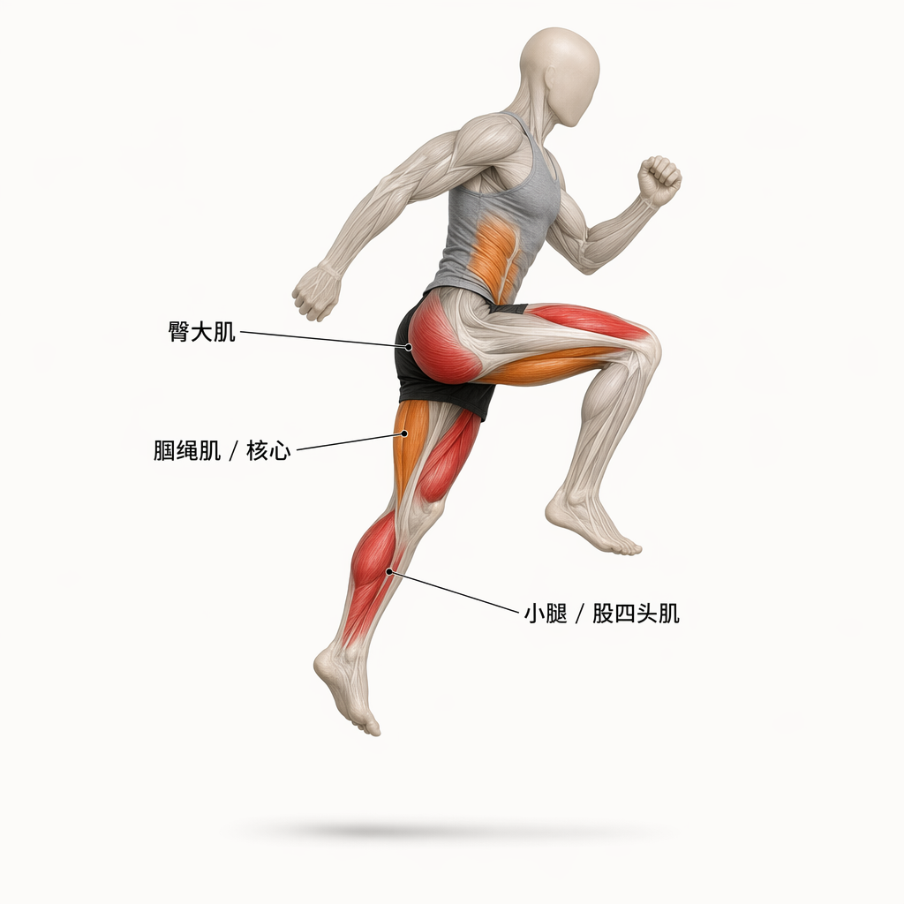

**版本**: v3 · **耗时**: 217s · **生成时间**: 2026-05-04T08:12:49Z

**分类**: 单腿跳跃 · **视角**: side view, facing right, freeze-frame photographic style

**应有标签 (中文)**: 小腿 / 股四头肌 / 臀大肌 / 腘绳肌 / 核心

<details><summary>展开 prompt</summary>

```
Anatomical muscle-activation diagram of the "单腿跳" (single-leg hop) exercise, side view, facing right, freeze-frame photographic style. Person posture: Photographic freeze-frame showing an athlete suspended IN MID-AIR during a forward single-leg hop. EVIDENCE OF AIRBORNE POSITION: about 15-25 cm of CLEAR EMPTY FLOOR SPACE is visible directly below the right foot (the hopping foot) — the floor/ground is rendered with a small visible shadow far below the body. The LEFT LEG is HELD UP throughout the entire hop with the left knee bent at 90 degrees, left thigh horizontal — the LEFT FOOT NEVER TOUCHES THE GROUND in this drill. Only the RIGHT LEG provides propulsion; in this freeze-frame the right leg is mid-flight with knee slightly bent. Arms swing for momentum. Torso slightly forward-leaning showing forward motion. Plain black athletic shorts and gray tank top. NEGATIVE: NOT a regular running stride with both feet alternating on the ground — both feet are CURRENTLY OFF THE GROUND, the body is suspended in the air, and the LEFT foot has been held up the entire time.. Body rendered with semi-transparent skin so underlying muscles are visible. Highlight in saturated red the primary working muscles: calf muscles and quadriceps and gluteus maximus of the hopping leg. Highlight in orange the secondary stabilizers: hamstring group and core muscles for stabilization. Other muscles in pale neutral gray. Add small clean labels with thin black arrow leader lines pointing from each label to its target muscle group. The labels MUST be in simplified Chinese characters using a clean sans-serif font. Use exactly the following labels: "小腿 / 股四头肌" pointing to the calf and quadriceps of the hopping leg; "臀大肌" pointing to the gluteus maximus; "腘绳肌 / 核心" pointing to the hamstring and core area. 

CRITICAL CONSTRAINTS — these are non-negotiable:
1. ALL TEXT IN THE IMAGE MUST BE SIMPLIFIED CHINESE CHARACTERS ONLY.
2. ABSOLUTELY NO ENGLISH WORDS, NO LATIN LETTERS, NO PINYIN ANYWHERE IN THE IMAGE.
3. NO romanization or transliteration of muscle names.
4. NO captions, NO subtitles, NO step-by-step text overlays.
5. ONLY the muscle labels listed above should appear as text.

Style: clean medical textbook illustration, off-white background, no facial features (head shape may be shown but no eyes/nose/mouth), anatomically accurate proportions, no shadows on background, no watermarks, no signature.
```

</details>

---

### ❓ T1260 — 直腿跳 (straight-leg pogo hops)

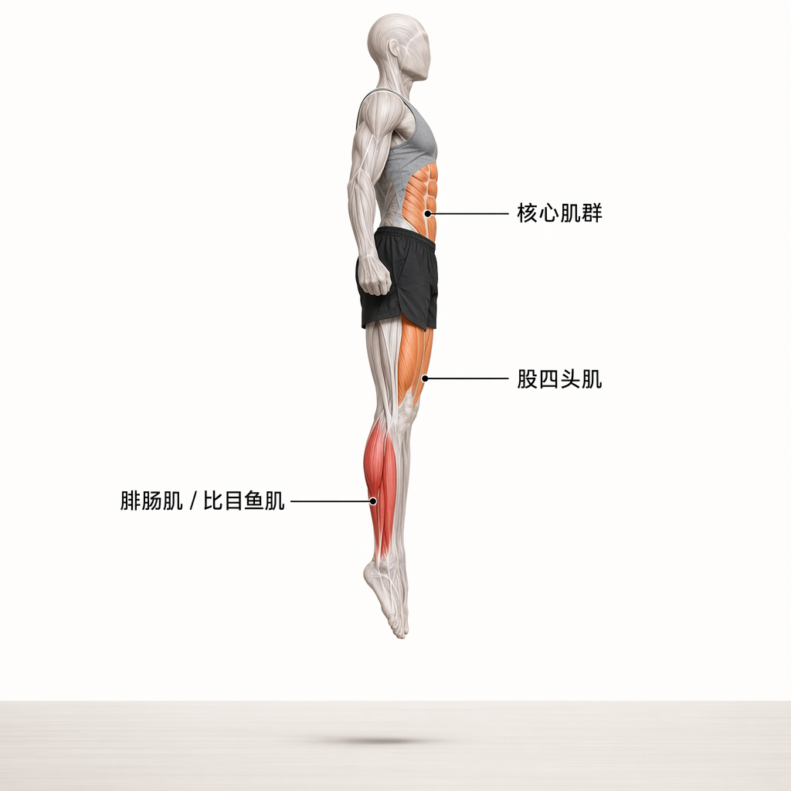

**版本**: v3 · **耗时**: 241s · **生成时间**: 2026-05-04T08:16:58Z

**分类**: 单腿跳跃 · **视角**: side view, facing right, freeze-frame photographic style

**应有标签 (中文)**: 腓肠肌 / 比目鱼肌 / 股四头肌 / 核心肌群

<details><summary>展开 prompt</summary>

```
Anatomical muscle-activation diagram of the "直腿跳" (straight-leg pogo hops) exercise, side view, facing right, freeze-frame photographic style. Person posture: Photographic freeze-frame of a pogo-style stiff-leg jump, mid-air. The athlete is suspended ABOVE THE GROUND with about 20 cm of CLEAR EMPTY FLOOR SPACE visible directly below both feet (you can see the floor and a small shadow far below). BOTH KNEES ARE LOCKED COMPLETELY STRAIGHT (zero bend, locked extension, RIGID — like vertical stiff sticks). Both legs parallel and held side-by-side. Ankles in plantarflexion (toes pointed DOWN at the floor like a ballerina). The whole body is rigid and vertical, like a pogo stick rod. Arms held at sides with slight elbow bend for balance. Torso completely upright (vertical). Plain black athletic shorts and gray tank top. NEGATIVE: this is NOT running, NOT jogging, NOT a normal jump with bent knees — knees DO NOT BEND AT ALL, only the ankles work. The body looks like a stiff stick jumping straight up.. Body rendered with semi-transparent skin so underlying muscles are visible. Highlight in saturated red the primary working muscles: calf muscles (gastrocnemius and soleus) for elastic recoil and ankle stiffness. Highlight in orange the secondary stabilizers: quadriceps and core muscles for body rigidity. Other muscles in pale neutral gray. Add small clean labels with thin black arrow leader lines pointing from each label to its target muscle group. The labels MUST be in simplified Chinese characters using a clean sans-serif font. Use exactly the following labels: "腓肠肌 / 比目鱼肌" pointing to the calf muscles for elastic recoil; "股四头肌" pointing to the quadriceps; "核心肌群" pointing to the core muscles. 

CRITICAL CONSTRAINTS — these are non-negotiable:
1. ALL TEXT IN THE IMAGE MUST BE SIMPLIFIED CHINESE CHARACTERS ONLY.
2. ABSOLUTELY NO ENGLISH WORDS, NO LATIN LETTERS, NO PINYIN ANYWHERE IN THE IMAGE.
3. NO romanization or transliteration of muscle names.
4. NO captions, NO subtitles, NO step-by-step text overlays.
5. ONLY the muscle labels listed above should appear as text.

Style: clean medical textbook illustration, off-white background, no facial features (head shape may be shown but no eyes/nose/mouth), anatomically accurate proportions, no shadows on background, no watermarks, no signature.
```

</details>

---

## 小腿 (2)

### ❓ T1070 — 站立提踵 (standing calf raise on tiptoes)

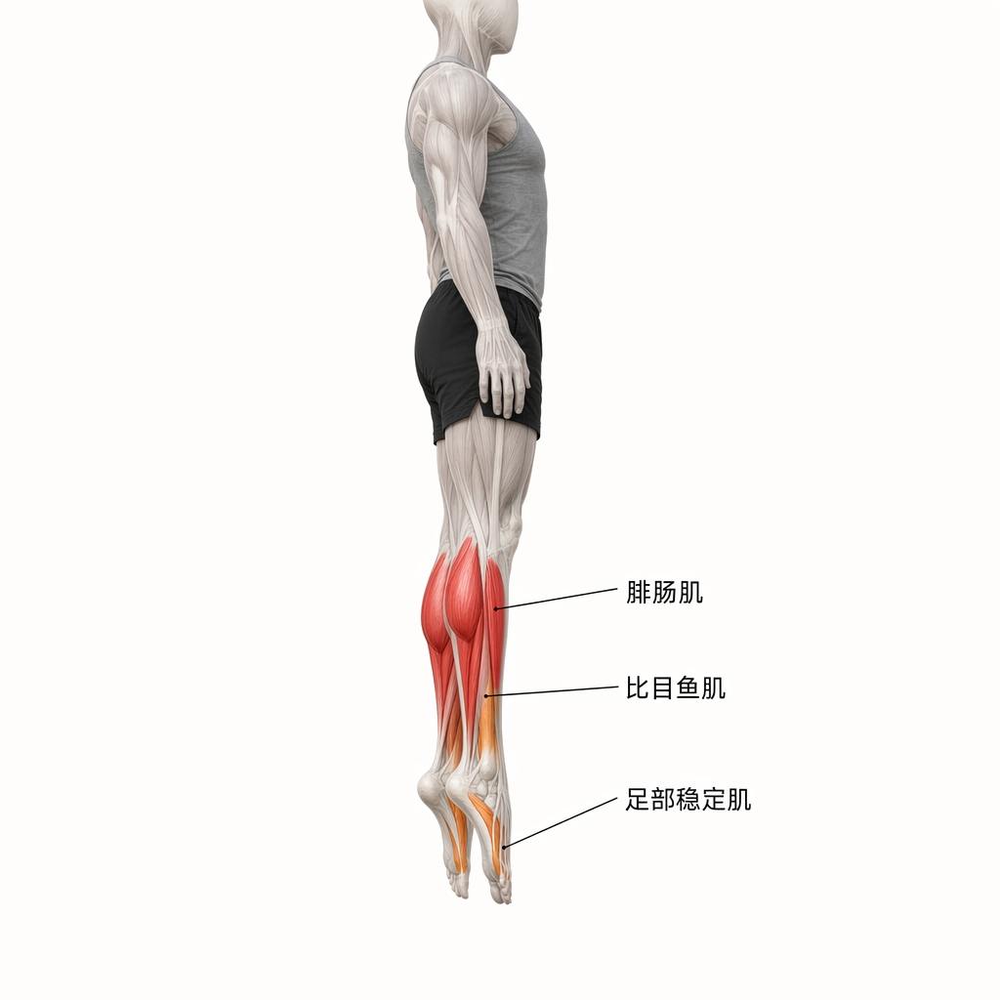

**版本**: v3 · **耗时**: 219s · **生成时间**: 2026-05-02T14:57:29Z

**分类**: 小腿 · **视角**: side view from ground level, the lower legs and feet fill the lower half of the frame

**应有标签 (中文)**: 腓肠肌 / 比目鱼肌 / 足部稳定肌

<details><summary>展开 prompt</summary>

```
Anatomical muscle-activation diagram of the "站立提踵" (standing calf raise on tiptoes) exercise, side view from ground level, the lower legs and feet fill the lower half of the frame. Person posture: Athletic person standing on TIPTOES like a ballet dancer en pointe — only the BALLS OF THE TOES touch the ground. The HEELS are lifted HIGH IN THE AIR with a large visible gap between heels and floor (about 8-10 cm of empty space). The ankle joints are in EXTREME plantarflexion, the back of the ankles deeply pinched. Both legs are straight and parallel, hip-width apart. The figure looks taller than normal because of the heel lift. Torso upright, arms relaxed at the sides. Plain black athletic shorts and gray tank top. EMPHASIS: this person is balanced on TIPTOES like a ballerina — the heels are dramatically OFF THE FLOOR. The figure is taller than a normal standing pose because of the elevated stance.. Body rendered with semi-transparent skin so underlying muscles are visible. Highlight in saturated red the primary working muscles: calf muscles (gastrocnemius and soleus). Highlight in orange the secondary stabilizers: tibialis posterior and small intrinsic foot muscles. Other muscles in pale neutral gray. Add small clean labels with thin black arrow leader lines pointing from each label to its target muscle group. The labels MUST be in simplified Chinese characters using a clean sans-serif font. Use exactly the following labels: "腓肠肌" pointing to the gastrocnemius (upper calf); "比目鱼肌" pointing to the soleus (deep calf); "足部稳定肌" pointing to the foot stabilizers. 

CRITICAL CONSTRAINTS — these are non-negotiable:
1. ALL TEXT IN THE IMAGE MUST BE SIMPLIFIED CHINESE CHARACTERS ONLY.
2. ABSOLUTELY NO ENGLISH WORDS, NO LATIN LETTERS, NO PINYIN ANYWHERE IN THE IMAGE.
3. NO romanization or transliteration of muscle names.
4. NO captions, NO subtitles, NO step-by-step text overlays.
5. ONLY the muscle labels listed above should appear as text.

Style: clean medical textbook illustration, off-white background, no facial features (head shape may be shown but no eyes/nose/mouth), anatomically accurate proportions, no shadows on background, no watermarks, no signature.
```

</details>

---

### ❓ T1275 — 单腿提踵 (single-leg calf raise on tiptoe)

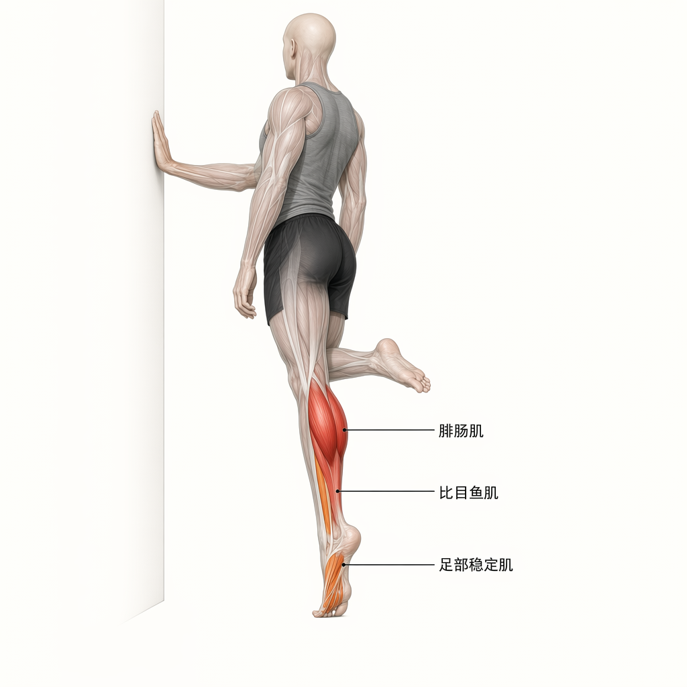

**版本**: v3 · **耗时**: 228s · **生成时间**: 2026-05-02T14:57:38Z

**分类**: 小腿 · **视角**: side view from ground level, the lower body and feet fill the bottom half of the frame

**应有标签 (中文)**: 腓肠肌 / 比目鱼肌 / 足部稳定肌

<details><summary>展开 prompt</summary>

```
Anatomical muscle-activation diagram of the "单腿提踵" (single-leg calf raise on tiptoe) exercise, side view from ground level, the lower body and feet fill the bottom half of the frame. Person posture: Athletic person balanced on the TIPTOES of the RIGHT foot only, like a ballerina en pointe on a single foot. Only the BALL OF THE RIGHT TOES touches the floor; the RIGHT HEEL is lifted HIGH IN THE AIR with a visible gap of about 8-10 cm between heel and floor. The right leg is straight, supporting all body weight. The LEFT LEG is lifted entirely OFF THE GROUND, with the left knee bent at 90 degrees and the left foot tucked behind the right ankle (left foot suspended in air, NEVER touching anything). Left hand placed lightly on a wall to the left for balance. Torso upright. Plain black athletic shorts and gray tank top. EMPHASIS: the figure is balanced on a SINGLE TIPTOE (right toes only), with the right heel dramatically OFF THE FLOOR and the entire left foot in the air.. Body rendered with semi-transparent skin so underlying muscles are visible. Highlight in saturated red the primary working muscles: calf muscles (gastrocnemius and soleus) of the supporting (right) leg. Highlight in orange the secondary stabilizers: tibialis posterior and intrinsic foot muscles for stabilization. Other muscles in pale neutral gray. Add small clean labels with thin black arrow leader lines pointing from each label to its target muscle group. The labels MUST be in simplified Chinese characters using a clean sans-serif font. Use exactly the following labels: "腓肠肌" pointing to the gastrocnemius (upper calf); "比目鱼肌" pointing to the soleus (deep calf); "足部稳定肌" pointing to the foot stabilizers. 

CRITICAL CONSTRAINTS — these are non-negotiable:
1. ALL TEXT IN THE IMAGE MUST BE SIMPLIFIED CHINESE CHARACTERS ONLY.
2. ABSOLUTELY NO ENGLISH WORDS, NO LATIN LETTERS, NO PINYIN ANYWHERE IN THE IMAGE.
3. NO romanization or transliteration of muscle names.
4. NO captions, NO subtitles, NO step-by-step text overlays.
5. ONLY the muscle labels listed above should appear as text.

Style: clean medical textbook illustration, off-white background, no facial features (head shape may be shown but no eyes/nose/mouth), anatomically accurate proportions, no shadows on background, no watermarks, no signature.
```

</details>

---

## 弓步 (6)

### ❓ T1136 — 跳跃弓步 (jumping lunge)

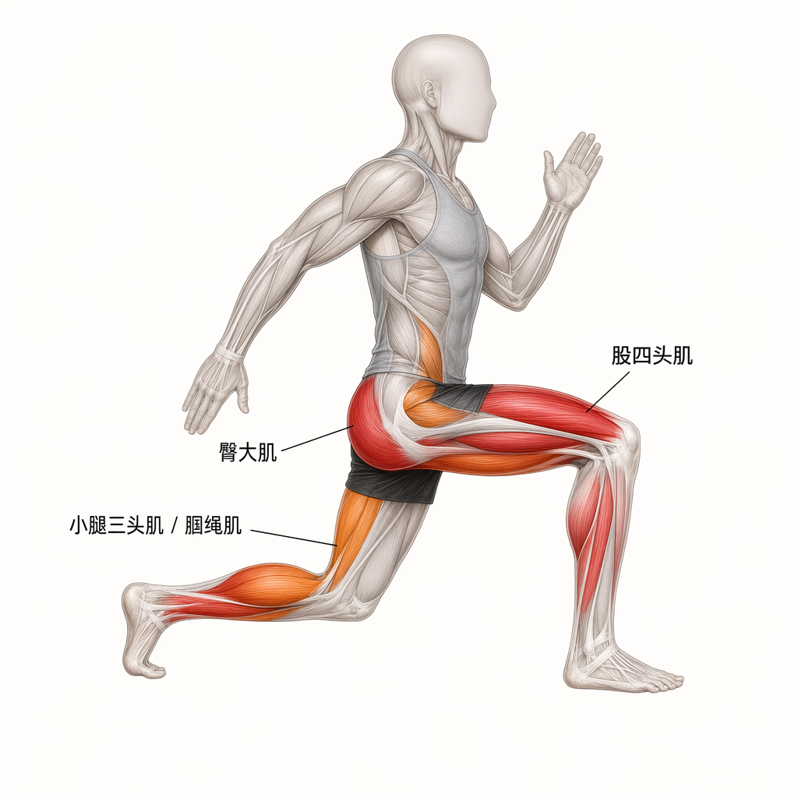

**版本**: v1 · **耗时**: 228s · **生成时间**: 2026-05-02T13:19:50Z

**分类**: 弓步 · **视角**: side view, facing right

**应有标签 (中文)**: 股四头肌 / 臀大肌 / 小腿三头肌 / 腘绳肌

<details><summary>展开 prompt</summary>

```
Anatomical muscle-activation diagram of the "跳跃弓步" (jumping lunge) exercise, side view, facing right. Person posture: Athletic person at the bottom of a jumping lunge just before takeoff: front leg (right) bent at 90 degrees with thigh parallel to the floor, foot flat; rear leg (left) bent at 90 degrees with knee just above the ground, ball of the rear foot on the ground; torso upright with neutral spine, arms swinging in running-style opposition (left arm forward, right arm back); plain black athletic shorts and gray tank top. Body rendered with semi-transparent skin so underlying muscles are visible. Highlight in saturated red the primary working muscles: quadriceps and gluteus maximus of the front leg, calf muscles for jump propulsion. Highlight in orange the secondary stabilizers: hamstring group and hip flexors. Other muscles in pale neutral gray. Add small clean labels with thin black arrow leader lines pointing from each label to its target muscle group. The labels MUST be in simplified Chinese characters using a clean sans-serif font. Use exactly the following labels: "股四头肌" pointing to the quadriceps of the front leg; "臀大肌" pointing to the gluteus maximus; "小腿三头肌 / 腘绳肌" pointing to the calf and hamstring area. 

CRITICAL CONSTRAINTS — these are non-negotiable:
1. ALL TEXT IN THE IMAGE MUST BE SIMPLIFIED CHINESE CHARACTERS ONLY.
2. ABSOLUTELY NO ENGLISH WORDS, NO LATIN LETTERS, NO PINYIN ANYWHERE IN THE IMAGE.
3. NO romanization or transliteration of muscle names.
4. NO captions, NO subtitles, NO step-by-step text overlays.
5. ONLY the muscle labels listed above should appear as text.

Style: clean medical textbook illustration, off-white background, no facial features (head shape may be shown but no eyes/nose/mouth), anatomically accurate proportions, no shadows on background, no watermarks, no signature.
```

</details>

---

### ❓ T1225 — 行进弓步 (walking lunge)

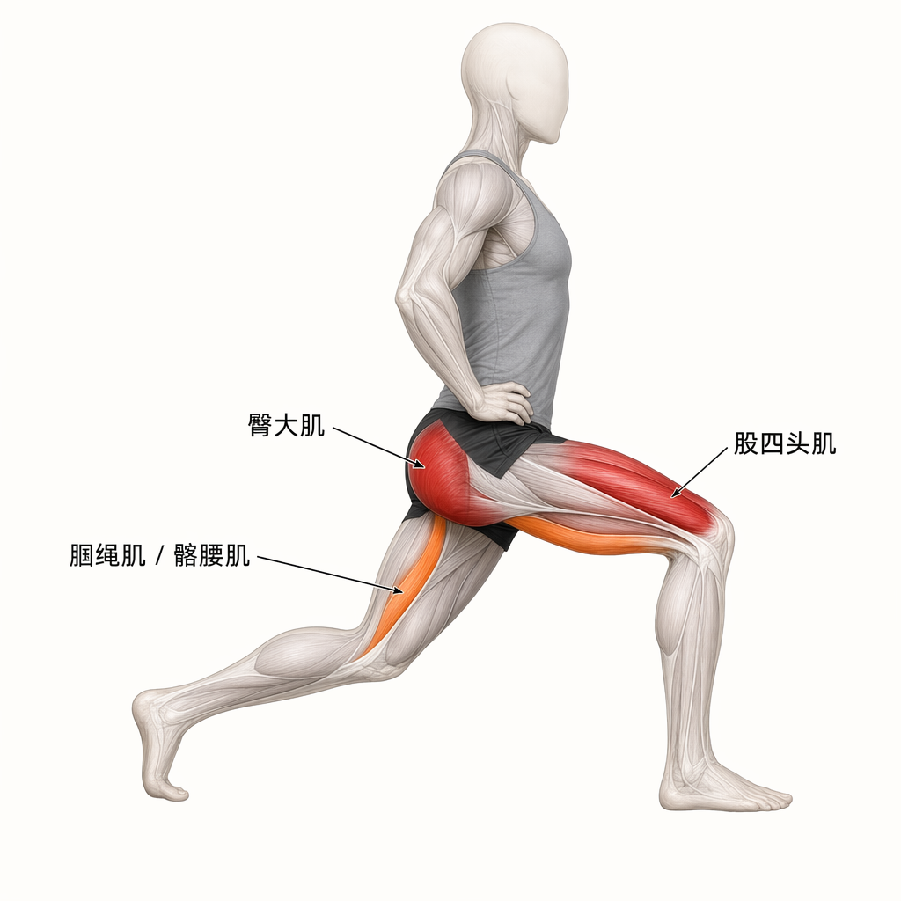

**版本**: v1 · **耗时**: 218s · **生成时间**: 2026-05-02T13:19:46Z

**分类**: 弓步 · **视角**: side view, facing right

**应有标签 (中文)**: 股四头肌 / 臀大肌 / 腘绳肌 / 髂腰肌

<details><summary>展开 prompt</summary>

```
Anatomical muscle-activation diagram of the "行进弓步" (walking lunge) exercise, side view, facing right. Person posture: Athletic person mid-stride during a walking lunge: front leg (right) just landed with foot flat and knee bent at 90 degrees, thigh parallel to the floor; rear leg (left) extended back with knee bent and hovering just above the ground, ball of the rear foot on the ground; torso upright with neutral spine, hands on hips, plain black athletic shorts and gray tank top. Body rendered with semi-transparent skin so underlying muscles are visible. Highlight in saturated red the primary working muscles: quadriceps and gluteus maximus of the front leg. Highlight in orange the secondary stabilizers: hamstring group of the front leg and hip flexors of the rear leg. Other muscles in pale neutral gray. Add small clean labels with thin black arrow leader lines pointing from each label to its target muscle group. The labels MUST be in simplified Chinese characters using a clean sans-serif font. Use exactly the following labels: "股四头肌" pointing to the quadriceps of the front leg; "臀大肌" pointing to the gluteus maximus; "腘绳肌 / 髂腰肌" pointing to the hamstring and hip flexor area. 

CRITICAL CONSTRAINTS — these are non-negotiable:
1. ALL TEXT IN THE IMAGE MUST BE SIMPLIFIED CHINESE CHARACTERS ONLY.
2. ABSOLUTELY NO ENGLISH WORDS, NO LATIN LETTERS, NO PINYIN ANYWHERE IN THE IMAGE.
3. NO romanization or transliteration of muscle names.
4. NO captions, NO subtitles, NO step-by-step text overlays.
5. ONLY the muscle labels listed above should appear as text.

Style: clean medical textbook illustration, off-white background, no facial features (head shape may be shown but no eyes/nose/mouth), anatomically accurate proportions, no shadows on background, no watermarks, no signature.
```

</details>

---

### ❓ T1226 — 反向弓步 (reverse lunge)

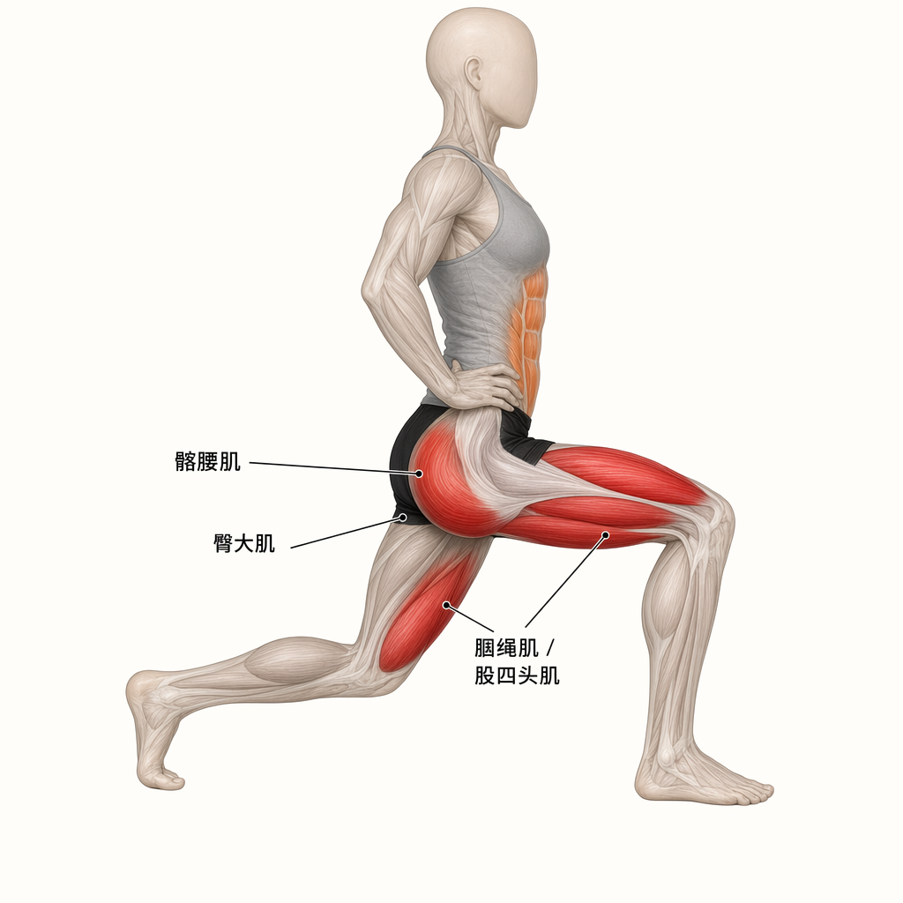

**版本**: v1 · **耗时**: 246s · **生成时间**: 2026-05-02T13:20:22Z

**分类**: 弓步 · **视角**: side view, facing right

**应有标签 (中文)**: 臀大肌 / 腘绳肌 / 股四头肌 / 髂腰肌

<details><summary>展开 prompt</summary>

```
Anatomical muscle-activation diagram of the "反向弓步" (reverse lunge) exercise, side view, facing right. Person posture: Athletic person at the bottom of a reverse lunge: front leg (right) standing in place with foot flat and knee bent at 90 degrees, thigh parallel to the floor; rear leg (left) stepped back with knee bent and hovering just above the ground, ball of the rear foot on the ground; torso upright with neutral spine, hands on hips, plain black athletic shorts and gray tank top. Body rendered with semi-transparent skin so underlying muscles are visible. Highlight in saturated red the primary working muscles: gluteus maximus and hamstring group of the front leg, plus quadriceps. Highlight in orange the secondary stabilizers: hip flexors of the rear leg and core muscles. Other muscles in pale neutral gray. Add small clean labels with thin black arrow leader lines pointing from each label to its target muscle group. The labels MUST be in simplified Chinese characters using a clean sans-serif font. Use exactly the following labels: "臀大肌" pointing to the gluteus maximus of the front leg; "腘绳肌 / 股四头肌" pointing to the hamstring and quadriceps area; "髂腰肌" pointing to the hip flexors of the rear leg. 

CRITICAL CONSTRAINTS — these are non-negotiable:
1. ALL TEXT IN THE IMAGE MUST BE SIMPLIFIED CHINESE CHARACTERS ONLY.
2. ABSOLUTELY NO ENGLISH WORDS, NO LATIN LETTERS, NO PINYIN ANYWHERE IN THE IMAGE.
3. NO romanization or transliteration of muscle names.
4. NO captions, NO subtitles, NO step-by-step text overlays.
5. ONLY the muscle labels listed above should appear as text.

Style: clean medical textbook illustration, off-white background, no facial features (head shape may be shown but no eyes/nose/mouth), anatomically accurate proportions, no shadows on background, no watermarks, no signature.
```

</details>

---

### ❓ T1138 — 弓步抬腿 (lunge with leg lift)

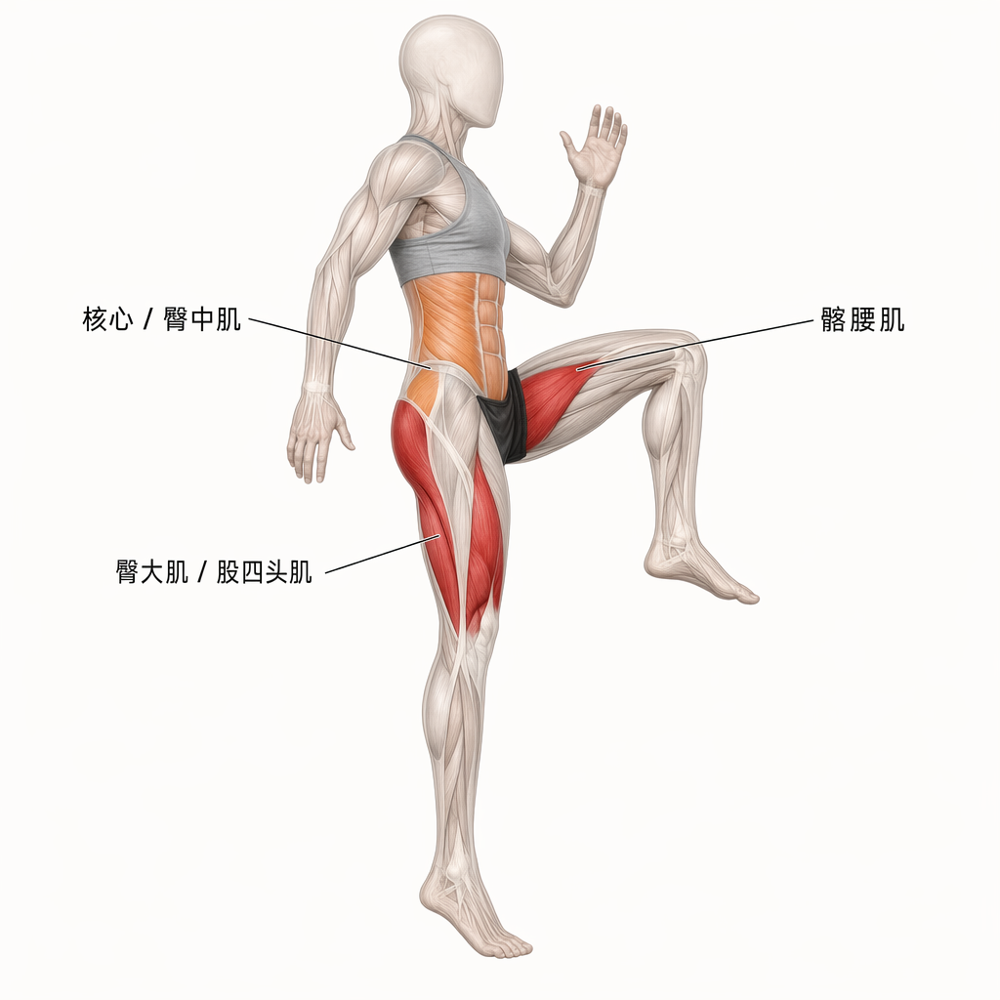

**版本**: v1 · **耗时**: 250s · **生成时间**: 2026-05-02T13:20:33Z

**分类**: 弓步 · **视角**: side view, facing right

**应有标签 (中文)**: 臀大肌 / 股四头肌 / 髂腰肌 / 核心 / 臀中肌

<details><summary>展开 prompt</summary>

```
Anatomical muscle-activation diagram of the "弓步抬腿" (lunge with leg lift) exercise, side view, facing right. Person posture: Athletic person at the top of a lunge with knee lift: standing on the right leg with right knee almost fully extended (slight bend); left knee driven up high in front of the body to hip height, thigh parallel to floor, shin perpendicular; torso upright; arms in running-style opposition; plain black athletic shorts and gray tank top. Body rendered with semi-transparent skin so underlying muscles are visible. Highlight in saturated red the primary working muscles: gluteus maximus and quadriceps of the supporting (right) leg, plus hip flexors (psoas) of the lifted (left) leg. Highlight in orange the secondary stabilizers: core muscles and gluteus medius. Other muscles in pale neutral gray. Add small clean labels with thin black arrow leader lines pointing from each label to its target muscle group. The labels MUST be in simplified Chinese characters using a clean sans-serif font. Use exactly the following labels: "臀大肌 / 股四头肌" pointing to the glute and quad of the supporting leg; "髂腰肌" pointing to the hip flexors of the lifted leg; "核心 / 臀中肌" pointing to the core and gluteus medius area. 

CRITICAL CONSTRAINTS — these are non-negotiable:
1. ALL TEXT IN THE IMAGE MUST BE SIMPLIFIED CHINESE CHARACTERS ONLY.
2. ABSOLUTELY NO ENGLISH WORDS, NO LATIN LETTERS, NO PINYIN ANYWHERE IN THE IMAGE.
3. NO romanization or transliteration of muscle names.
4. NO captions, NO subtitles, NO step-by-step text overlays.
5. ONLY the muscle labels listed above should appear as text.

Style: clean medical textbook illustration, off-white background, no facial features (head shape may be shown but no eyes/nose/mouth), anatomically accurate proportions, no shadows on background, no watermarks, no signature.
```

</details>

---

### ❓ T1137 — 弓步抬膝 (lunge to high-knee drive)

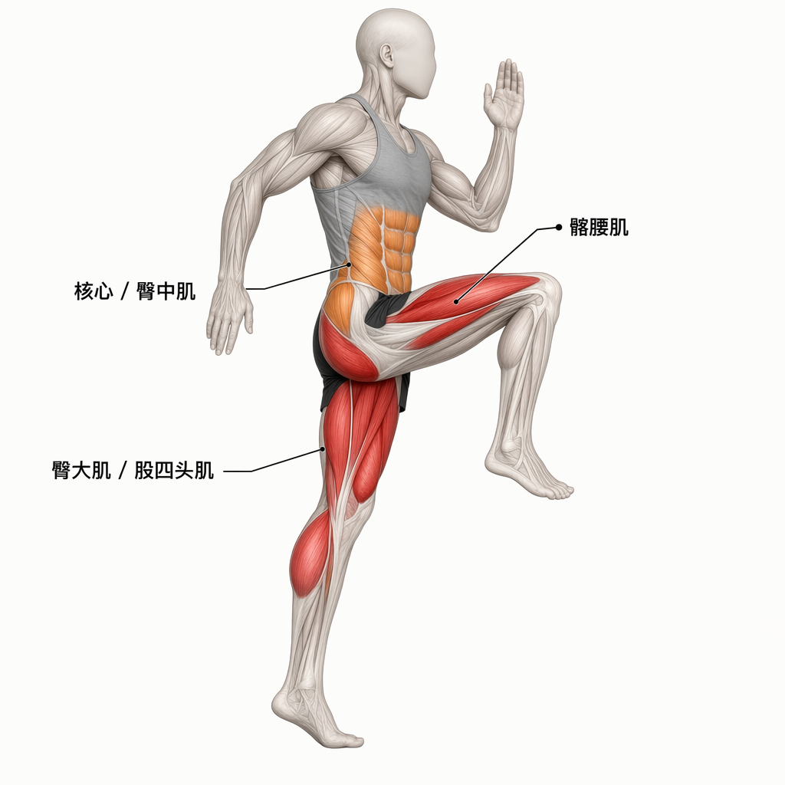

**版本**: v1 · **耗时**: 217s · **生成时间**: 2026-05-02T13:45:10Z

**分类**: 弓步 · **视角**: side view, facing right

**应有标签 (中文)**: 臀大肌 / 股四头肌 / 髂腰肌 / 核心 / 臀中肌

<details><summary>展开 prompt</summary>

```
Anatomical muscle-activation diagram of the "弓步抬膝" (lunge to high-knee drive) exercise, side view, facing right. Person posture: Athletic person at the explosive top phase of a lunge with high knee drive (just having stood up from a lunge): right leg fully extended supporting; left knee driven up high to hip height with thigh parallel to the floor and knee bent at 90 degrees with shin perpendicular; arms in running-style opposition (right arm forward, left arm back); torso upright with slight forward lean; plain black athletic shorts and gray tank top. Body rendered with semi-transparent skin so underlying muscles are visible. Highlight in saturated red the primary working muscles: gluteus maximus and quadriceps of the supporting (right) leg, plus hip flexors of the lifted (left) leg. Highlight in orange the secondary stabilizers: core muscles and gluteus medius for stability. Other muscles in pale neutral gray. Add small clean labels with thin black arrow leader lines pointing from each label to its target muscle group. The labels MUST be in simplified Chinese characters using a clean sans-serif font. Use exactly the following labels: "臀大肌 / 股四头肌" pointing to the glute and quadriceps of the supporting leg; "髂腰肌" pointing to the hip flexors of the lifted leg; "核心 / 臀中肌" pointing to the core and stabilizer area. 

CRITICAL CONSTRAINTS — these are non-negotiable:
1. ALL TEXT IN THE IMAGE MUST BE SIMPLIFIED CHINESE CHARACTERS ONLY.
2. ABSOLUTELY NO ENGLISH WORDS, NO LATIN LETTERS, NO PINYIN ANYWHERE IN THE IMAGE.
3. NO romanization or transliteration of muscle names.
4. NO captions, NO subtitles, NO step-by-step text overlays.
5. ONLY the muscle labels listed above should appear as text.

Style: clean medical textbook illustration, off-white background, no facial features (head shape may be shown but no eyes/nose/mouth), anatomically accurate proportions, no shadows on background, no watermarks, no signature.
```

</details>

---

### ❓ T1139 — 跳跃前弓步 (jumping forward lunge)

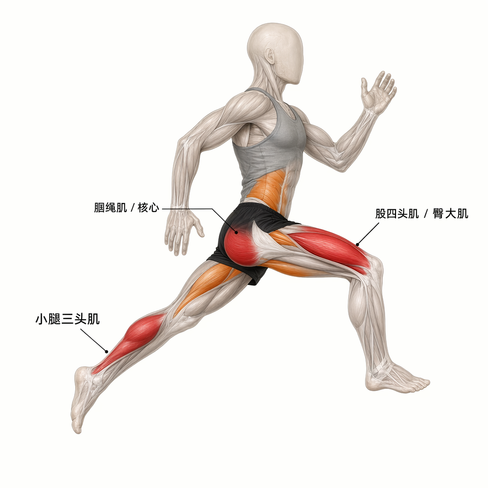

**版本**: v1 · **耗时**: 237s · **生成时间**: 2026-05-02T13:49:07Z

**分类**: 弓步 · **视角**: side view, facing right

**应有标签 (中文)**: 股四头肌 / 臀大肌 / 小腿三头肌 / 腘绳肌 / 核心

<details><summary>展开 prompt</summary>

```
Anatomical muscle-activation diagram of the "跳跃前弓步" (jumping forward lunge) exercise, side view, facing right. Person posture: Athletic person mid-air during a jumping forward lunge: airborne, both legs extended forward and back like in mid-stride; the front (right) leg is preparing to land in a deep lunge with knee starting to bend; the rear (left) leg is extended back with knee slightly bent; arms in running-style opposition; torso upright; explosive forward jumping motion; plain black athletic shorts and gray tank top. Body rendered with semi-transparent skin so underlying muscles are visible. Highlight in saturated red the primary working muscles: quadriceps and gluteus maximus and calf muscles for jump propulsion. Highlight in orange the secondary stabilizers: hamstring group and hip flexors and core muscles. Other muscles in pale neutral gray. Add small clean labels with thin black arrow leader lines pointing from each label to its target muscle group. The labels MUST be in simplified Chinese characters using a clean sans-serif font. Use exactly the following labels: "股四头肌 / 臀大肌" pointing to the quadriceps and glute area; "小腿三头肌" pointing to the calf muscles; "腘绳肌 / 核心" pointing to the hamstring and core area. 

CRITICAL CONSTRAINTS — these are non-negotiable:
1. ALL TEXT IN THE IMAGE MUST BE SIMPLIFIED CHINESE CHARACTERS ONLY.
2. ABSOLUTELY NO ENGLISH WORDS, NO LATIN LETTERS, NO PINYIN ANYWHERE IN THE IMAGE.
3. NO romanization or transliteration of muscle names.
4. NO captions, NO subtitles, NO step-by-step text overlays.
5. ONLY the muscle labels listed above should appear as text.

Style: clean medical textbook illustration, off-white background, no facial features (head shape may be shown but no eyes/nose/mouth), anatomically accurate proportions, no shadows on background, no watermarks, no signature.
```

</details>

---

## 核心 (12)

### ❓ T1010 — 平板支撑 (forearm plank)

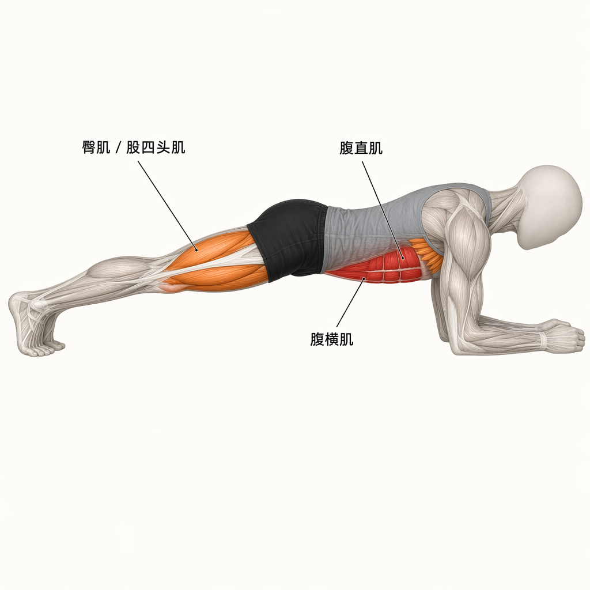

**版本**: v1 · **耗时**: 244s · **生成时间**: 2026-05-02T14:02:18Z

**分类**: 核心 · **视角**: side view, facing right

**应有标签 (中文)**: 腹直肌 / 腹横肌 / 臀肌 / 股四头肌

<details><summary>展开 prompt</summary>

```
Anatomical muscle-activation diagram of the "平板支撑" (forearm plank) exercise, side view, facing right. Person posture: Athletic person holding a forearm plank: forearms flat on the ground with elbows directly under the shoulders, forearms parallel to the body, hands relaxed; toes on the ground, feet hip-width apart; body in a perfectly straight line from heels to head with no sag at the hips and no piking up; hips at the same height as shoulders; head in line with the spine, neutral neck, eyes looking down; glutes engaged, core braced; plain black athletic shorts and gray tank top. Body rendered with semi-transparent skin so underlying muscles are visible. Highlight in saturated red the primary working muscles: rectus abdominis (front of abdomen) and transverse abdominis (deep core). Highlight in orange the secondary stabilizers: gluteus maximus, quadriceps, and shoulder stabilizers (serratus anterior). Other muscles in pale neutral gray. Add small clean labels with thin black arrow leader lines pointing from each label to its target muscle group. The labels MUST be in simplified Chinese characters using a clean sans-serif font. Use exactly the following labels: "腹直肌" pointing to the rectus abdominis; "腹横肌" pointing to the transverse abdominis (deep core); "臀肌 / 股四头肌" pointing to the glute and quadriceps stabilizers. 

CRITICAL CONSTRAINTS — these are non-negotiable:
1. ALL TEXT IN THE IMAGE MUST BE SIMPLIFIED CHINESE CHARACTERS ONLY.
2. ABSOLUTELY NO ENGLISH WORDS, NO LATIN LETTERS, NO PINYIN ANYWHERE IN THE IMAGE.
3. NO romanization or transliteration of muscle names.
4. NO captions, NO subtitles, NO step-by-step text overlays.
5. ONLY the muscle labels listed above should appear as text.

Style: clean medical textbook illustration, off-white background, no facial features (head shape may be shown but no eyes/nose/mouth), anatomically accurate proportions, no shadows on background, no watermarks, no signature.
```

</details>

---

### ❓ T1185 — 侧平板 (side plank)

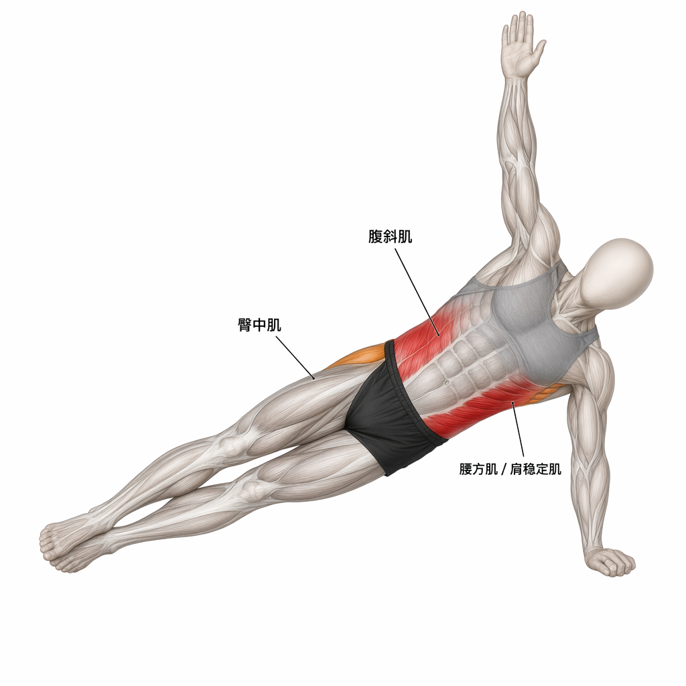

**版本**: v1 · **耗时**: 227s · **生成时间**: 2026-05-02T14:02:01Z

**分类**: 核心 · **视角**: front-three-quarter view from the open side

**应有标签 (中文)**: 腹斜肌 / 臀中肌 / 腰方肌 / 肩稳定肌

<details><summary>展开 prompt</summary>

```
Anatomical muscle-activation diagram of the "侧平板" (side plank) exercise, front-three-quarter view from the open side. Person posture: Athletic person holding a left-side plank: lying on the left side with the left forearm flat on the ground (left elbow directly under the left shoulder, forearm perpendicular to the body); legs fully stacked with feet together, the left edge of the left foot on the ground; hips lifted so that the body forms one straight line from the left ankle through the hips to the head; the right arm extended straight up toward the ceiling with palm facing forward; head in line with spine; plain black athletic shorts and gray tank top. Body rendered with semi-transparent skin so underlying muscles are visible. Highlight in saturated red the primary working muscles: obliques (especially the bottom side facing the ground) and quadratus lumborum. Highlight in orange the secondary stabilizers: gluteus medius of the bottom hip and shoulder stabilizers (serratus anterior). Other muscles in pale neutral gray. Add small clean labels with thin black arrow leader lines pointing from each label to its target muscle group. The labels MUST be in simplified Chinese characters using a clean sans-serif font. Use exactly the following labels: "腹斜肌" pointing to the obliques (lateral core); "臀中肌" pointing to the gluteus medius of the supporting hip; "腰方肌 / 肩稳定肌" pointing to the quadratus lumborum and shoulder stabilizers. 

CRITICAL CONSTRAINTS — these are non-negotiable:
1. ALL TEXT IN THE IMAGE MUST BE SIMPLIFIED CHINESE CHARACTERS ONLY.
2. ABSOLUTELY NO ENGLISH WORDS, NO LATIN LETTERS, NO PINYIN ANYWHERE IN THE IMAGE.
3. NO romanization or transliteration of muscle names.
4. NO captions, NO subtitles, NO step-by-step text overlays.
5. ONLY the muscle labels listed above should appear as text.

Style: clean medical textbook illustration, off-white background, no facial features (head shape may be shown but no eyes/nose/mouth), anatomically accurate proportions, no shadows on background, no watermarks, no signature.
```

</details>

---

### ❓ T1216 — 侧平板抬腿 (side plank with leg raise)

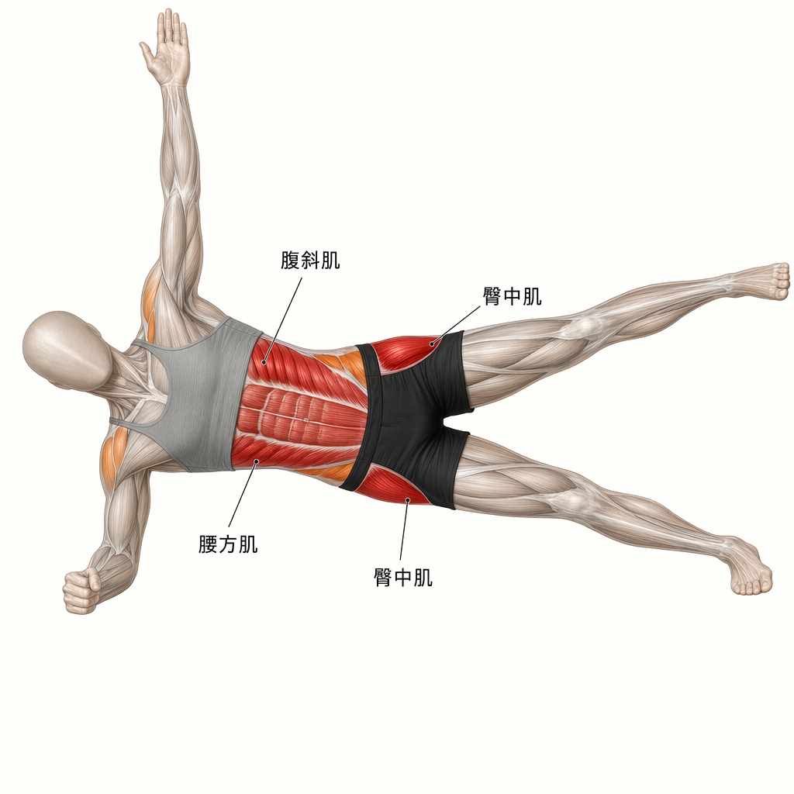

**版本**: v2 · **耗时**: 218s · **生成时间**: 2026-05-02T14:41:07Z

**分类**: 核心 · **视角**: side profile view of the lateral edge of the body, the body horizontal and supported on one forearm only

**应有标签 (中文)**: 腹斜肌 / 臀中肌 / 腰方肌

<details><summary>展开 prompt</summary>

```
Anatomical muscle-activation diagram of the "侧平板抬腿" (side plank with leg raise) exercise, side profile view of the lateral edge of the body, the body horizontal and supported on one forearm only. Person posture: Athletic person holding a side plank on the LEFT side with the top leg lifted: the body is LYING ON ITS LEFT SIDE (lateral side, NOT supine, NOT prone). Only the LEFT FOREARM is on the ground (left elbow directly under left shoulder, left forearm perpendicular to the body), and ONLY the OUTER EDGE of the LEFT FOOT touches the ground supporting the body — these are the only two contact points. The body is held in one perfectly straight rigid line from the left foot through the hips to the head, parallel to the ground. Hips are lifted off the ground (not sagging). The RIGHT (top) leg is lifted upward to about 30-45 degrees above horizontal, knee fully extended. The right arm is fully extended STRAIGHT UP toward the ceiling, perpendicular to the body line. Plain black athletic shorts and gray tank top. CRITICAL: this is a SIDE PLANK position — body sideways with one forearm support — NOT a four-limb extended X-pose, NOT a supine pose, NOT a face-down pose.. Body rendered with semi-transparent skin so underlying muscles are visible. Highlight in saturated red the primary working muscles: obliques and gluteus medius of both hips (top hip for abduction, bottom hip for stability). Highlight in orange the secondary stabilizers: quadratus lumborum and shoulder stabilizers. Other muscles in pale neutral gray. Add small clean labels with thin black arrow leader lines pointing from each label to its target muscle group. The labels MUST be in simplified Chinese characters using a clean sans-serif font. Use exactly the following labels: "腹斜肌" pointing to the obliques; "臀中肌" pointing to the gluteus medius of both hips; "腰方肌" pointing to the quadratus lumborum. 

CRITICAL CONSTRAINTS — these are non-negotiable:
1. ALL TEXT IN THE IMAGE MUST BE SIMPLIFIED CHINESE CHARACTERS ONLY.
2. ABSOLUTELY NO ENGLISH WORDS, NO LATIN LETTERS, NO PINYIN ANYWHERE IN THE IMAGE.
3. NO romanization or transliteration of muscle names.
4. NO captions, NO subtitles, NO step-by-step text overlays.
5. ONLY the muscle labels listed above should appear as text.

Style: clean medical textbook illustration, off-white background, no facial features (head shape may be shown but no eyes/nose/mouth), anatomically accurate proportions, no shadows on background, no watermarks, no signature.
```

</details>

---

### ❓ T1243 — 死虫式 (dead bug)

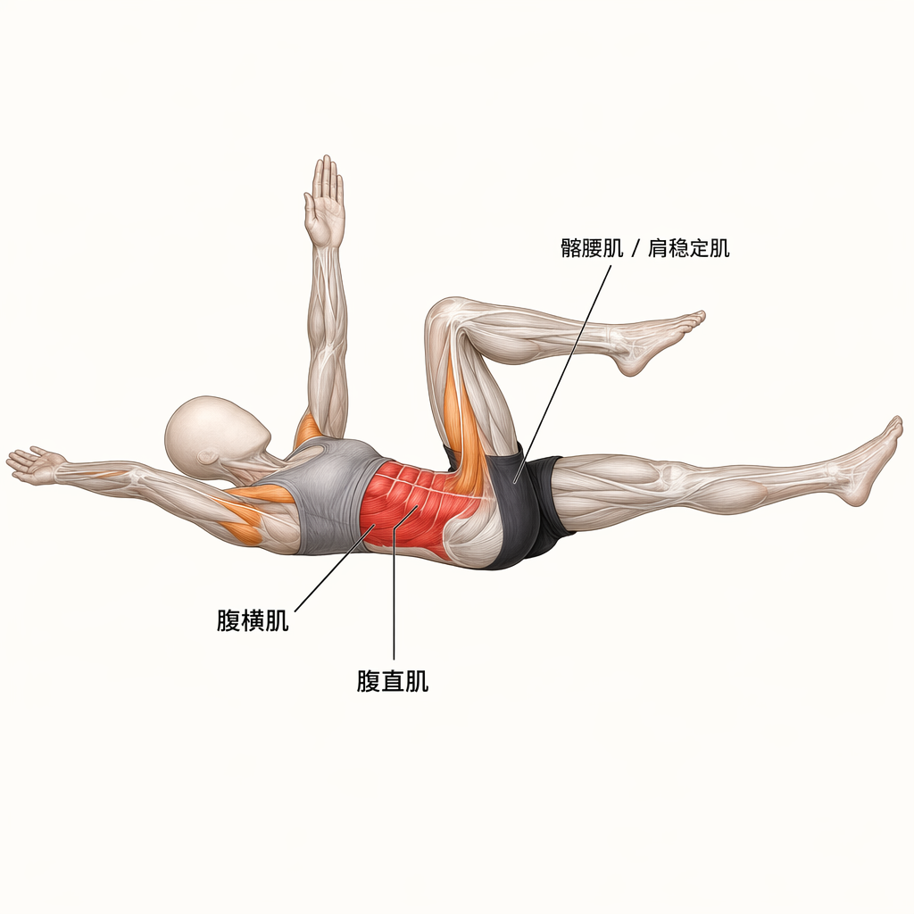

**版本**: v3 · **耗时**: 226s · **生成时间**: 2026-05-02T14:57:36Z

**分类**: 核心 · **视角**: three-quarter side view, body lying on the back, viewed from the right side at slight angle from above

**应有标签 (中文)**: 腹横肌 / 腹直肌 / 髂腰肌 / 肩稳定肌

<details><summary>展开 prompt</summary>

```
Anatomical muscle-activation diagram of the "死虫式" (dead bug) exercise, three-quarter side view, body lying on the back, viewed from the right side at slight angle from above. Person posture: Athletic person mid-rep of a dead bug exercise. Lying SUPINE on the floor, lower back pressed flat to the ground. The body shows DIAGONAL OPPOSITE limb action: ONE side extends, the OTHER stays tucked. Specifically: the RIGHT ARM is reaching back overhead almost touching the floor behind the head (arm fully extended). The LEFT LEG is fully extended straight out forward, parallel to the floor, just a few centimeters above the ground (toes pointing forward). At the same time the LEFT ARM points straight up toward the ceiling (vertical arm), and the RIGHT LEG is held with knee tucked toward the chest (right thigh vertical/perpendicular to the floor with shin parallel to the floor like a tabletop). Show a CLEAR VISUAL DIAGONAL between the extended-right-arm-back-overhead and the extended-left-leg-forward; meanwhile the tucked left arm points up and the tucked right knee points up. Plain black athletic shorts and gray tank top.. Body rendered with semi-transparent skin so underlying muscles are visible. Highlight in saturated red the primary working muscles: deep core (transverse abdominis and rectus abdominis) for anti-extension. Highlight in orange the secondary stabilizers: hip flexors of the bent leg and shoulder stabilizers. Other muscles in pale neutral gray. Add small clean labels with thin black arrow leader lines pointing from each label to its target muscle group. The labels MUST be in simplified Chinese characters using a clean sans-serif font. Use exactly the following labels: "腹横肌" pointing to the transverse abdominis (deep core); "腹直肌" pointing to the rectus abdominis; "髂腰肌 / 肩稳定肌" pointing to the hip flexors and shoulder stabilizers. 

CRITICAL CONSTRAINTS — these are non-negotiable:
1. ALL TEXT IN THE IMAGE MUST BE SIMPLIFIED CHINESE CHARACTERS ONLY.
2. ABSOLUTELY NO ENGLISH WORDS, NO LATIN LETTERS, NO PINYIN ANYWHERE IN THE IMAGE.
3. NO romanization or transliteration of muscle names.
4. NO captions, NO subtitles, NO step-by-step text overlays.
5. ONLY the muscle labels listed above should appear as text.

Style: clean medical textbook illustration, off-white background, no facial features (head shape may be shown but no eyes/nose/mouth), anatomically accurate proportions, no shadows on background, no watermarks, no signature.
```

</details>

---

### ❓ T1249 — 鸟狗平衡 (bird-dog balance)

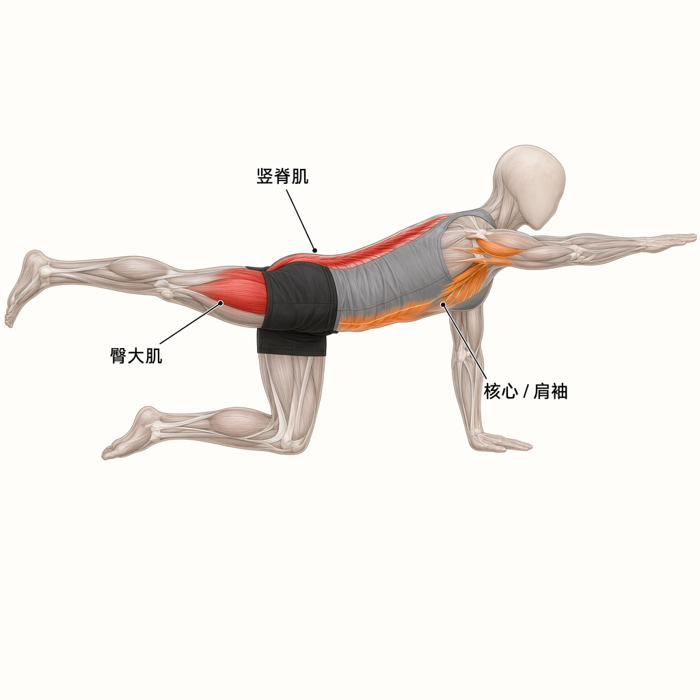

**版本**: v1 · **耗时**: 217s · **生成时间**: 2026-05-02T14:05:38Z

**分类**: 核心 · **视角**: side view, facing right

**应有标签 (中文)**: 竖脊肌 / 臀大肌 / 核心 / 肩袖

<details><summary>展开 prompt</summary>

```
Anatomical muscle-activation diagram of the "鸟狗平衡" (bird-dog balance) exercise, side view, facing right. Person posture: Athletic person at the top of a bird-dog hold: in a quadruped position with hands flat on the ground directly under the shoulders and knees on the ground directly under the hips; the right arm extended forward parallel to the floor with the hand at shoulder height; the left leg extended straight backward parallel to the floor with the foot at hip height, so that right arm, torso, and left leg form one straight horizontal line; spine neutral, hips and shoulders level (no rotation), core braced; plain black athletic shorts and gray tank top. Body rendered with semi-transparent skin so underlying muscles are visible. Highlight in saturated red the primary working muscles: erector spinae (back muscles along the spine) and gluteus maximus of the extended (left) leg. Highlight in orange the secondary stabilizers: deep core (transverse abdominis) and shoulder stabilizers (rotator cuff and serratus anterior) of the extended arm. Other muscles in pale neutral gray. Add small clean labels with thin black arrow leader lines pointing from each label to its target muscle group. The labels MUST be in simplified Chinese characters using a clean sans-serif font. Use exactly the following labels: "竖脊肌" pointing to the erector spinae; "臀大肌" pointing to the gluteus maximus of the extended leg; "核心 / 肩袖" pointing to the core and rotator cuff stabilizers. 

CRITICAL CONSTRAINTS — these are non-negotiable:
1. ALL TEXT IN THE IMAGE MUST BE SIMPLIFIED CHINESE CHARACTERS ONLY.
2. ABSOLUTELY NO ENGLISH WORDS, NO LATIN LETTERS, NO PINYIN ANYWHERE IN THE IMAGE.
3. NO romanization or transliteration of muscle names.
4. NO captions, NO subtitles, NO step-by-step text overlays.
5. ONLY the muscle labels listed above should appear as text.

Style: clean medical textbook illustration, off-white background, no facial features (head shape may be shown but no eyes/nose/mouth), anatomically accurate proportions, no shadows on background, no watermarks, no signature.
```

</details>

---

### ❓ T1006 — 仰卧起坐 (sit-up)

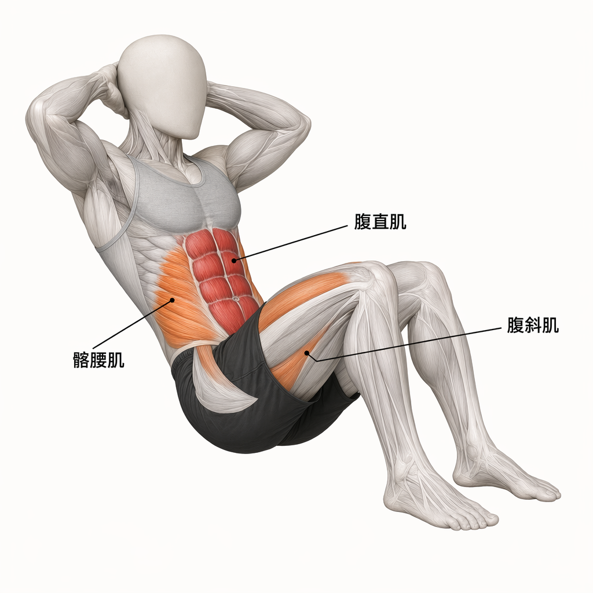

**版本**: v1 · **耗时**: 210s · **生成时间**: 2026-05-02T14:05:34Z

**分类**: 核心 · **视角**: side view, facing right

**应有标签 (中文)**: 腹直肌 / 髂腰肌 / 腹斜肌

<details><summary>展开 prompt</summary>

```
Anatomical muscle-activation diagram of the "仰卧起坐" (sit-up) exercise, side view, facing right. Person posture: Athletic person at the top of a sit-up: starting from supine position, now sitting up so that the torso is lifted off the ground at about 60-70 degrees from horizontal; both knees bent at 90 degrees with feet flat on the ground; hands placed lightly behind the head with elbows out to the sides (not pulling on the neck); chin tucked slightly, neck neutral; full contraction of the abdominal wall; plain black athletic shorts and gray tank top. Body rendered with semi-transparent skin so underlying muscles are visible. Highlight in saturated red the primary working muscles: rectus abdominis (front of abdomen, full contraction). Highlight in orange the secondary stabilizers: hip flexors (psoas, rectus femoris) and obliques. Other muscles in pale neutral gray. Add small clean labels with thin black arrow leader lines pointing from each label to its target muscle group. The labels MUST be in simplified Chinese characters using a clean sans-serif font. Use exactly the following labels: "腹直肌" pointing to the rectus abdominis; "髂腰肌" pointing to the hip flexors; "腹斜肌" pointing to the obliques. 

CRITICAL CONSTRAINTS — these are non-negotiable:
1. ALL TEXT IN THE IMAGE MUST BE SIMPLIFIED CHINESE CHARACTERS ONLY.
2. ABSOLUTELY NO ENGLISH WORDS, NO LATIN LETTERS, NO PINYIN ANYWHERE IN THE IMAGE.
3. NO romanization or transliteration of muscle names.
4. NO captions, NO subtitles, NO step-by-step text overlays.
5. ONLY the muscle labels listed above should appear as text.

Style: clean medical textbook illustration, off-white background, no facial features (head shape may be shown but no eyes/nose/mouth), anatomically accurate proportions, no shadows on background, no watermarks, no signature.
```

</details>

---

### ❓ T1149 — 卷腹 (crunch)

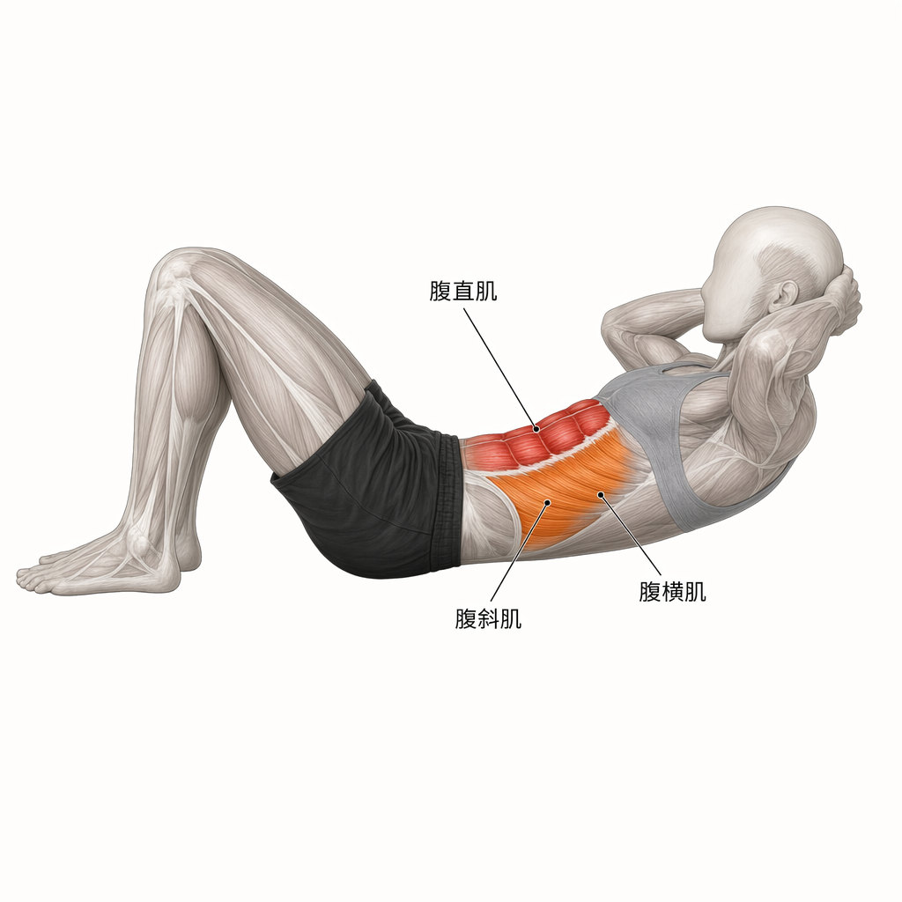

**版本**: v1 · **耗时**: 244s · **生成时间**: 2026-05-02T14:06:17Z

**分类**: 核心 · **视角**: side view, facing right

**应有标签 (中文)**: 腹直肌 / 腹斜肌 / 腹横肌

<details><summary>展开 prompt</summary>

```
Anatomical muscle-activation diagram of the "卷腹" (crunch) exercise, side view, facing right. Person posture: Athletic person at the top of a crunch (smaller range than sit-up): lying supine with both knees bent at 90 degrees and feet flat on the ground; only the upper back and shoulders lifted off the ground (about 30-40 degrees), with the lower back remaining in contact with the ground; hands placed lightly behind the head with elbows out, chin tucked; focused contraction of the upper rectus abdominis; plain black athletic shorts and gray tank top. Body rendered with semi-transparent skin so underlying muscles are visible. Highlight in saturated red the primary working muscles: rectus abdominis (especially the upper portion). Highlight in orange the secondary stabilizers: obliques and transverse abdominis. Other muscles in pale neutral gray. Add small clean labels with thin black arrow leader lines pointing from each label to its target muscle group. The labels MUST be in simplified Chinese characters using a clean sans-serif font. Use exactly the following labels: "腹直肌" pointing to the rectus abdominis (upper portion); "腹斜肌" pointing to the obliques; "腹横肌" pointing to the transverse abdominis. 

CRITICAL CONSTRAINTS — these are non-negotiable:
1. ALL TEXT IN THE IMAGE MUST BE SIMPLIFIED CHINESE CHARACTERS ONLY.
2. ABSOLUTELY NO ENGLISH WORDS, NO LATIN LETTERS, NO PINYIN ANYWHERE IN THE IMAGE.
3. NO romanization or transliteration of muscle names.
4. NO captions, NO subtitles, NO step-by-step text overlays.
5. ONLY the muscle labels listed above should appear as text.

Style: clean medical textbook illustration, off-white background, no facial features (head shape may be shown but no eyes/nose/mouth), anatomically accurate proportions, no shadows on background, no watermarks, no signature.
```

</details>

---

### ❓ T1076 — 自行车卷腹 (bicycle crunch on the floor)

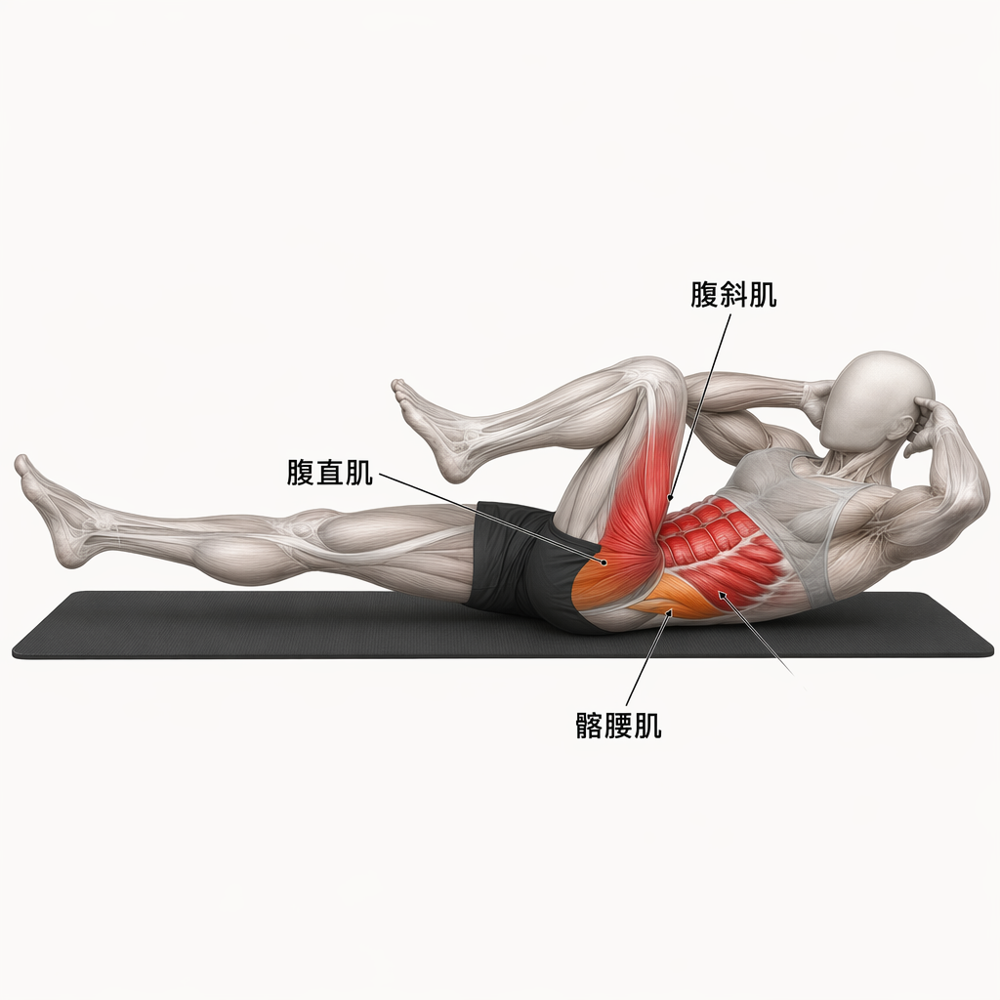

**版本**: v3 · **耗时**: 216s · **生成时间**: 2026-05-02T15:00:59Z

**分类**: 核心 · **视角**: side view from low angle on the right side of the body, body lying on the floor

**应有标签 (中文)**: 腹斜肌 / 腹直肌 / 髂腰肌

<details><summary>展开 prompt</summary>

```
Anatomical muscle-activation diagram of the "自行车卷腹" (bicycle crunch on the floor) exercise, side view from low angle on the right side of the body, body lying on the floor. Person posture: Athletic person LYING ON THEIR BACK ON A YOGA MAT ON THE FLOOR (SUPINE position) — the LOWER BACK and HIPS remain pressed onto the mat. Only the upper torso (head and shoulders) is slightly lifted off the mat by the abdominal contraction. Both hands lightly behind the head with elbows out. The RIGHT KNEE is pulled HIGH toward the chest (right hip and knee deeply flexed). The LEFT LEG is FULLY EXTENDED forward parallel to and just above the floor (left foot hovering near floor level). The torso is rotated so the LEFT ELBOW reaches diagonally toward the RIGHT KNEE — the left elbow and right knee meet in the middle of the body. Plain black athletic shorts and gray tank top. CRITICAL CONSTRAINTS: this person is LYING DOWN, NOT seated, NOT sitting up at 45 degrees, NOT in any kind of seated V-position. The body is HORIZONTAL on the floor with only a small abdominal crunch lifting the head/shoulders. Show the floor/mat clearly underneath.. Body rendered with semi-transparent skin so underlying muscles are visible. Highlight in saturated red the primary working muscles: obliques (especially the side rotating across) and rectus abdominis. Highlight in orange the secondary stabilizers: hip flexors of the drawn-up knee and lower abs. Other muscles in pale neutral gray. Add small clean labels with thin black arrow leader lines pointing from each label to its target muscle group. The labels MUST be in simplified Chinese characters using a clean sans-serif font. Use exactly the following labels: "腹斜肌" pointing to the obliques; "腹直肌" pointing to the rectus abdominis; "髂腰肌" pointing to the hip flexors. 

CRITICAL CONSTRAINTS — these are non-negotiable:
1. ALL TEXT IN THE IMAGE MUST BE SIMPLIFIED CHINESE CHARACTERS ONLY.
2. ABSOLUTELY NO ENGLISH WORDS, NO LATIN LETTERS, NO PINYIN ANYWHERE IN THE IMAGE.
3. NO romanization or transliteration of muscle names.
4. NO captions, NO subtitles, NO step-by-step text overlays.
5. ONLY the muscle labels listed above should appear as text.

Style: clean medical textbook illustration, off-white background, no facial features (head shape may be shown but no eyes/nose/mouth), anatomically accurate proportions, no shadows on background, no watermarks, no signature.
```

</details>

---

### ❓ T1183 — 平板支撑摸肩 (plank shoulder taps)

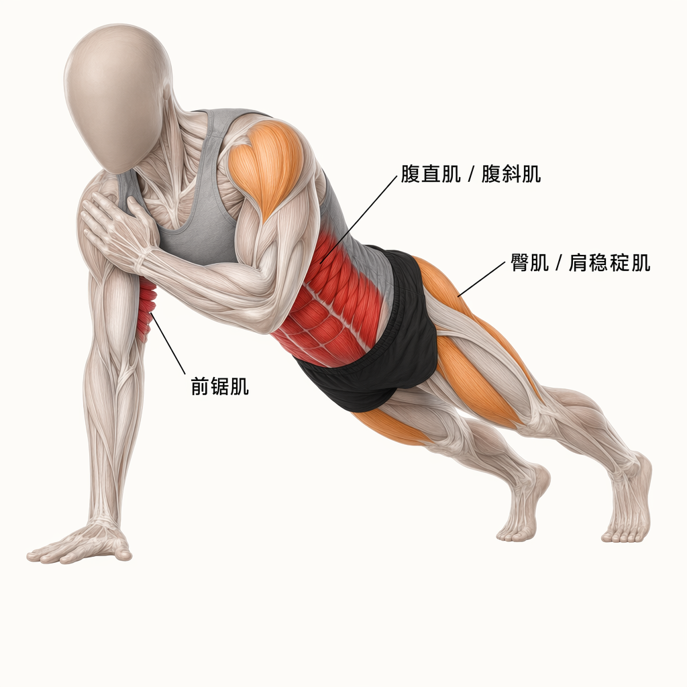

**版本**: v1 · **耗时**: 226s · **生成时间**: 2026-05-02T14:09:20Z

**分类**: 核心 · **视角**: front-three-quarter view

**应有标签 (中文)**: 腹直肌 / 腹斜肌 / 前锯肌 / 臀肌 / 肩稳定肌

<details><summary>展开 prompt</summary>

```
Anatomical muscle-activation diagram of the "平板支撑摸肩" (plank shoulder taps) exercise, front-three-quarter view. Person posture: Athletic person mid-rep of a plank shoulder tap: holding a high plank position (hands on the ground under shoulders with arms straight, toes on the ground, body in one straight line); currently lifting the right hand off the ground to tap the left shoulder while balancing the body on the left hand and both feet (the supporting hand is wider for stability); hips remain level and stable (no rotation); plain black athletic shorts and gray tank top. Body rendered with semi-transparent skin so underlying muscles are visible. Highlight in saturated red the primary working muscles: rectus abdominis and obliques (anti-rotation core work) and serratus anterior of the supporting arm. Highlight in orange the secondary stabilizers: shoulder stabilizers and gluteus maximus and quadriceps. Other muscles in pale neutral gray. Add small clean labels with thin black arrow leader lines pointing from each label to its target muscle group. The labels MUST be in simplified Chinese characters using a clean sans-serif font. Use exactly the following labels: "腹直肌 / 腹斜肌" pointing to the rectus abdominis and obliques (anti-rotation); "前锯肌" pointing to the serratus anterior of the supporting arm; "臀肌 / 肩稳定肌" pointing to the glute and shoulder stabilizers. 

CRITICAL CONSTRAINTS — these are non-negotiable:
1. ALL TEXT IN THE IMAGE MUST BE SIMPLIFIED CHINESE CHARACTERS ONLY.
2. ABSOLUTELY NO ENGLISH WORDS, NO LATIN LETTERS, NO PINYIN ANYWHERE IN THE IMAGE.
3. NO romanization or transliteration of muscle names.
4. NO captions, NO subtitles, NO step-by-step text overlays.
5. ONLY the muscle labels listed above should appear as text.

Style: clean medical textbook illustration, off-white background, no facial features (head shape may be shown but no eyes/nose/mouth), anatomically accurate proportions, no shadows on background, no watermarks, no signature.
```

</details>

---

### ❓ T1239 — 平板转体 (plank with rotation)

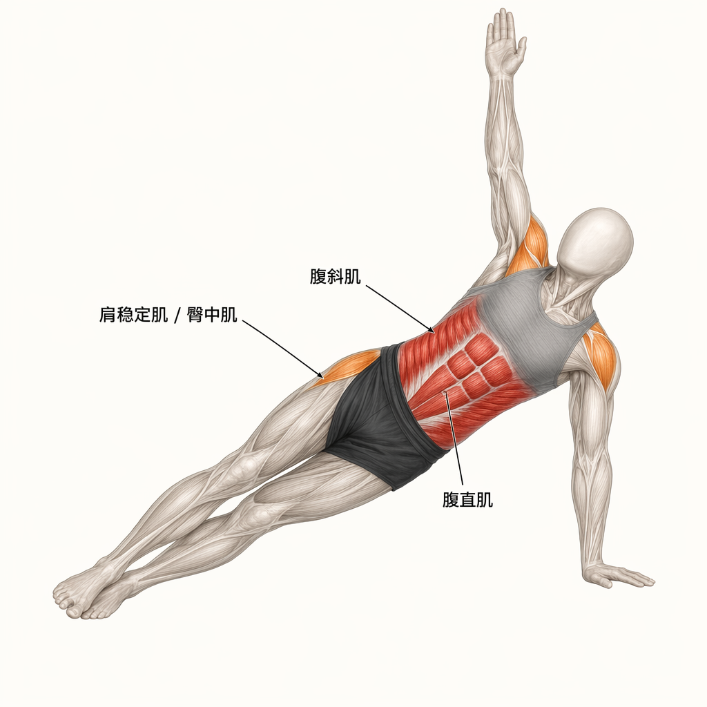

**版本**: v2 · **耗时**: 248s · **生成时间**: 2026-05-02T14:45:14Z

**分类**: 核心 · **视角**: front-three-quarter view from the open (rotated-toward) side

**应有标签 (中文)**: 腹斜肌 / 腹直肌 / 肩稳定肌 / 臀中肌

<details><summary>展开 prompt</summary>

```
Anatomical muscle-activation diagram of the "平板转体" (plank with rotation) exercise, front-three-quarter view from the open (rotated-toward) side. Person posture: Athletic person at the top phase of a plank rotation — currently in a SIDE-PLANK-LIKE position after rotating 90 degrees from a high plank. The RIGHT HAND remains on the ground supporting the entire body weight, right arm fully extended. The LEFT ARM is FULLY EXTENDED STRAIGHT UP toward the ceiling, perpendicular to the body, fingers pointing up. The body is rotated 90 degrees so the left side of the torso faces the ceiling. The legs are STACKED on top of each other (left foot on top of right foot), only the right foot's outer edge contacts the ground. The body forms one straight line from feet to head. Head looks up toward the raised left hand. Plain black athletic shorts and gray tank top. CRITICAL: ONE arm is on the ground, the OTHER arm is extended straight up toward the ceiling — NOT both hands on the ground.. Body rendered with semi-transparent skin so underlying muscles are visible. Highlight in saturated red the primary working muscles: obliques (rotational core) and rectus abdominis. Highlight in orange the secondary stabilizers: shoulder stabilizers and gluteus medius. Other muscles in pale neutral gray. Add small clean labels with thin black arrow leader lines pointing from each label to its target muscle group. The labels MUST be in simplified Chinese characters using a clean sans-serif font. Use exactly the following labels: "腹斜肌" pointing to the obliques (rotational core); "腹直肌" pointing to the rectus abdominis; "肩稳定肌 / 臀中肌" pointing to the shoulder and gluteus medius stabilizers. 

CRITICAL CONSTRAINTS — these are non-negotiable:
1. ALL TEXT IN THE IMAGE MUST BE SIMPLIFIED CHINESE CHARACTERS ONLY.
2. ABSOLUTELY NO ENGLISH WORDS, NO LATIN LETTERS, NO PINYIN ANYWHERE IN THE IMAGE.
3. NO romanization or transliteration of muscle names.
4. NO captions, NO subtitles, NO step-by-step text overlays.
5. ONLY the muscle labels listed above should appear as text.

Style: clean medical textbook illustration, off-white background, no facial features (head shape may be shown but no eyes/nose/mouth), anatomically accurate proportions, no shadows on background, no watermarks, no signature.
```

</details>

---

### ❓ T1368 — 哥本哈根侧平板 (Copenhagen plank (bent-leg variant))

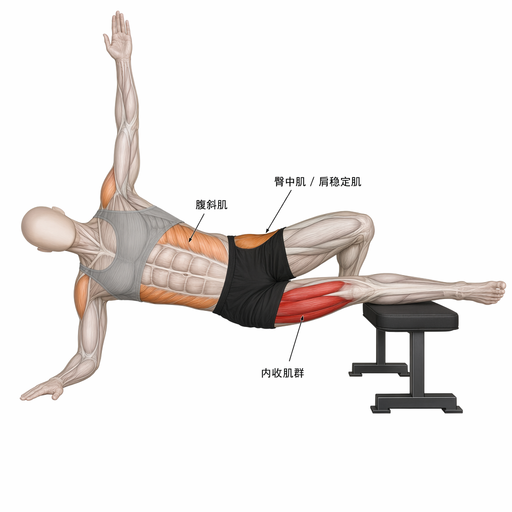

**版本**: v1 · **耗时**: 207s · **生成时间**: 2026-05-04T08:16:29Z

**分类**: 核心 · **视角**: side view from the open side

**应有标签 (中文)**: 内收肌群 / 腹斜肌 / 臀中肌 / 肩稳定肌

<details><summary>展开 prompt</summary>

```
Anatomical muscle-activation diagram of the "哥本哈根侧平板" (Copenhagen plank (bent-leg variant)) exercise, side view from the open side. Person posture: Athletic person holding a Copenhagen side plank with bent-leg variant on the LEFT side: lying on the LEFT side. Left forearm flat on the ground (left elbow directly under left shoulder, left forearm perpendicular to the body line). The TOP (RIGHT) LEG is BENT at 90 degrees with the inside of the right knee resting on top of a knee-height bench/box for support. The BOTTOM (LEFT) LEG is FULLY EXTENDED straight and held in the AIR OFF THE GROUND, parallel to the floor (this is the working leg — the inner thigh activates to keep the leg lifted). Hips lifted off the ground so the body forms one straight line from the left foot through the hips to the head. Right arm extended straight up toward the ceiling. Plain black athletic shorts and gray tank top. CRITICAL: the LEFT LEG is OFF THE GROUND, not touching anything — it is the working leg held in space.. Body rendered with semi-transparent skin so underlying muscles are visible. Highlight in saturated red the primary working muscles: adductor muscles of the bottom (left) leg (inner thigh). Highlight in orange the secondary stabilizers: obliques and gluteus medius and shoulder stabilizers. Other muscles in pale neutral gray. Add small clean labels with thin black arrow leader lines pointing from each label to its target muscle group. The labels MUST be in simplified Chinese characters using a clean sans-serif font. Use exactly the following labels: "内收肌群" pointing to the adductor muscles (inner thigh); "腹斜肌" pointing to the obliques; "臀中肌 / 肩稳定肌" pointing to the gluteus medius and shoulder stabilizers. 

CRITICAL CONSTRAINTS — these are non-negotiable:
1. ALL TEXT IN THE IMAGE MUST BE SIMPLIFIED CHINESE CHARACTERS ONLY.
2. ABSOLUTELY NO ENGLISH WORDS, NO LATIN LETTERS, NO PINYIN ANYWHERE IN THE IMAGE.
3. NO romanization or transliteration of muscle names.
4. NO captions, NO subtitles, NO step-by-step text overlays.
5. ONLY the muscle labels listed above should appear as text.

Style: clean medical textbook illustration, off-white background, no facial features (head shape may be shown but no eyes/nose/mouth), anatomically accurate proportions, no shadows on background, no watermarks, no signature.
```

</details>

---

### ❓ T1259 — 平板支撑交替抬腿 (plank with alternating leg raise)

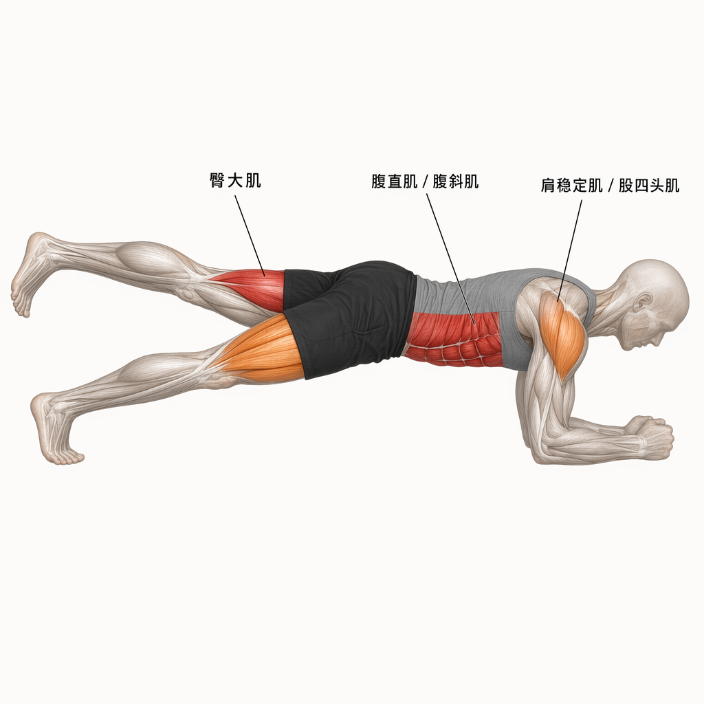

**版本**: v1 · **耗时**: 247s · **生成时间**: 2026-05-04T08:25:10Z

**分类**: 核心 · **视角**: side view, facing right

**应有标签 (中文)**: 腹直肌 / 腹斜肌 / 臀大肌 / 肩稳定肌 / 股四头肌

<details><summary>展开 prompt</summary>

```
Anatomical muscle-activation diagram of the "平板支撑交替抬腿" (plank with alternating leg raise) exercise, side view, facing right. Person posture: Athletic person holding a forearm plank with one leg lifted: forearms on the ground (elbows under shoulders), body in a straight line from heels to head. The LEFT LEG is on the ground with the left toes supporting the body. The RIGHT LEG is lifted straight up off the ground, knee fully extended, with the right foot hovering about 15-20 cm above the floor. Hips remain level (no rotation). Glutes engaged. Plain black athletic shorts and gray tank top.. Body rendered with semi-transparent skin so underlying muscles are visible. Highlight in saturated red the primary working muscles: rectus abdominis and obliques (anti-extension and anti-rotation core work) and gluteus maximus of the lifted leg. Highlight in orange the secondary stabilizers: shoulder stabilizers and quadriceps. Other muscles in pale neutral gray. Add small clean labels with thin black arrow leader lines pointing from each label to its target muscle group. The labels MUST be in simplified Chinese characters using a clean sans-serif font. Use exactly the following labels: "腹直肌 / 腹斜肌" pointing to the rectus abdominis and obliques; "臀大肌" pointing to the gluteus maximus of the lifted leg; "肩稳定肌 / 股四头肌" pointing to the shoulder stabilizers and quadriceps. 

CRITICAL CONSTRAINTS — these are non-negotiable:
1. ALL TEXT IN THE IMAGE MUST BE SIMPLIFIED CHINESE CHARACTERS ONLY.
2. ABSOLUTELY NO ENGLISH WORDS, NO LATIN LETTERS, NO PINYIN ANYWHERE IN THE IMAGE.
3. NO romanization or transliteration of muscle names.
4. NO captions, NO subtitles, NO step-by-step text overlays.
5. ONLY the muscle labels listed above should appear as text.

Style: clean medical textbook illustration, off-white background, no facial features (head shape may be shown but no eyes/nose/mouth), anatomically accurate proportions, no shadows on background, no watermarks, no signature.
```

</details>

---

## 离心控制 (2)

### ❓ T1221 — 反向北欧弯举 (inverse Nordic curl)

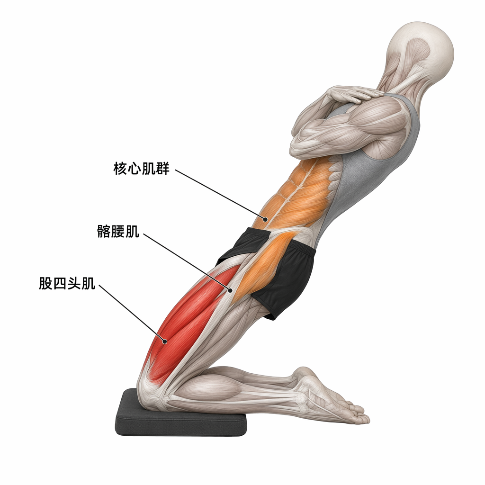

**版本**: v1 · **耗时**: 236s · **生成时间**: 2026-05-02T13:38:33Z

**分类**: 离心控制 · **视角**: side view, facing right

**应有标签 (中文)**: 股四头肌 / 髂腰肌 / 核心肌群

<details><summary>展开 prompt</summary>

```
Anatomical muscle-activation diagram of the "反向北欧弯举" (inverse Nordic curl) exercise, side view, facing right. Person posture: Athletic person mid-descent in an inverse Nordic curl: kneeling on the ground with both knees on a soft pad, shins flat on the ground, toes pointed, and ankles flat; the body is leaning backward as a single straight rigid line from knees to head, currently at about 45 degrees from vertical (descending under control); arms crossed over the chest or extended forward for counterbalance; the quadriceps work eccentrically to control the descent; plain black athletic shorts and gray tank top. Body rendered with semi-transparent skin so underlying muscles are visible. Highlight in saturated red the primary working muscles: quadriceps (under heavy eccentric load). Highlight in orange the secondary stabilizers: hip flexors and core muscles for spinal stability. Other muscles in pale neutral gray. Add small clean labels with thin black arrow leader lines pointing from each label to its target muscle group. The labels MUST be in simplified Chinese characters using a clean sans-serif font. Use exactly the following labels: "股四头肌" pointing to the quadriceps under eccentric load; "髂腰肌" pointing to the hip flexors; "核心肌群" pointing to the core muscles. 

CRITICAL CONSTRAINTS — these are non-negotiable:
1. ALL TEXT IN THE IMAGE MUST BE SIMPLIFIED CHINESE CHARACTERS ONLY.
2. ABSOLUTELY NO ENGLISH WORDS, NO LATIN LETTERS, NO PINYIN ANYWHERE IN THE IMAGE.
3. NO romanization or transliteration of muscle names.
4. NO captions, NO subtitles, NO step-by-step text overlays.
5. ONLY the muscle labels listed above should appear as text.

Style: clean medical textbook illustration, off-white background, no facial features (head shape may be shown but no eyes/nose/mouth), anatomically accurate proportions, no shadows on background, no watermarks, no signature.
```

</details>

---

### ❓ T1255 — 站立勾腿 (standing hamstring curl)

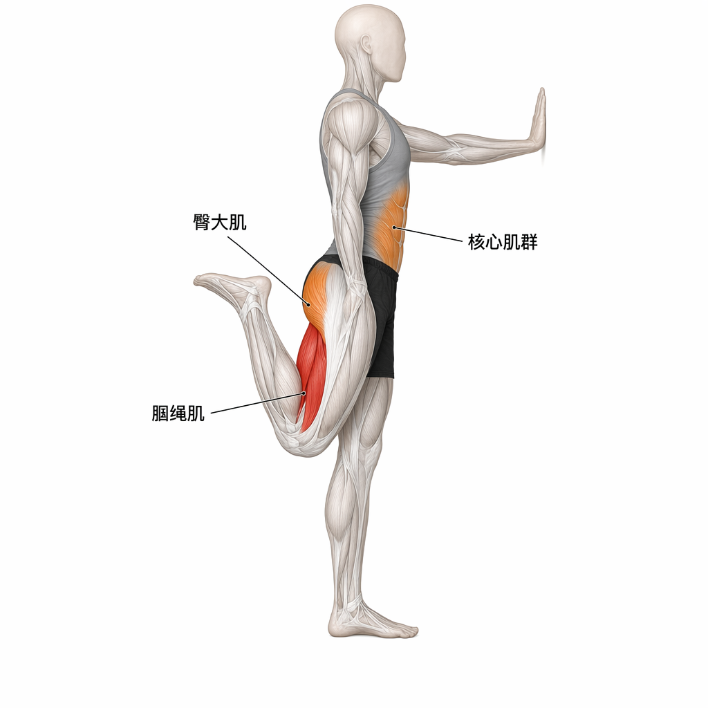

**版本**: v1 · **耗时**: 236s · **生成时间**: 2026-05-02T13:39:15Z

**分类**: 离心控制 · **视角**: side view, facing right

**应有标签 (中文)**: 腘绳肌 / 臀大肌 / 核心肌群

<details><summary>展开 prompt</summary>

```
Anatomical muscle-activation diagram of the "站立勾腿" (standing hamstring curl) exercise, side view, facing right. Person posture: Athletic person at the top of a standing hamstring curl: right leg supporting with foot flat on the ground and knee almost fully extended (slight bend); left leg lifted behind the body with knee bent so that the left foot heel is brought toward the left buttock (knee fully flexed), the left thigh remains roughly vertical (perpendicular to the floor); torso upright with neutral spine, right hand placed on a wall in front for balance; plain black athletic shorts and gray tank top. Body rendered with semi-transparent skin so underlying muscles are visible. Highlight in saturated red the primary working muscles: hamstring group of the curling (left) leg. Highlight in orange the secondary stabilizers: gluteus maximus of the curling leg and core muscles. Other muscles in pale neutral gray. Add small clean labels with thin black arrow leader lines pointing from each label to its target muscle group. The labels MUST be in simplified Chinese characters using a clean sans-serif font. Use exactly the following labels: "腘绳肌" pointing to the hamstring group of the curling leg; "臀大肌" pointing to the gluteus maximus; "核心肌群" pointing to the core muscles. 

CRITICAL CONSTRAINTS — these are non-negotiable:
1. ALL TEXT IN THE IMAGE MUST BE SIMPLIFIED CHINESE CHARACTERS ONLY.
2. ABSOLUTELY NO ENGLISH WORDS, NO LATIN LETTERS, NO PINYIN ANYWHERE IN THE IMAGE.
3. NO romanization or transliteration of muscle names.
4. NO captions, NO subtitles, NO step-by-step text overlays.
5. ONLY the muscle labels listed above should appear as text.

Style: clean medical textbook illustration, off-white background, no facial features (head shape may be shown but no eyes/nose/mouth), anatomically accurate proportions, no shadows on background, no watermarks, no signature.
```

</details>

---

## 肩胛稳定 (4)

### ❓ T1277 — 俯卧 I 字 (prone I raise)

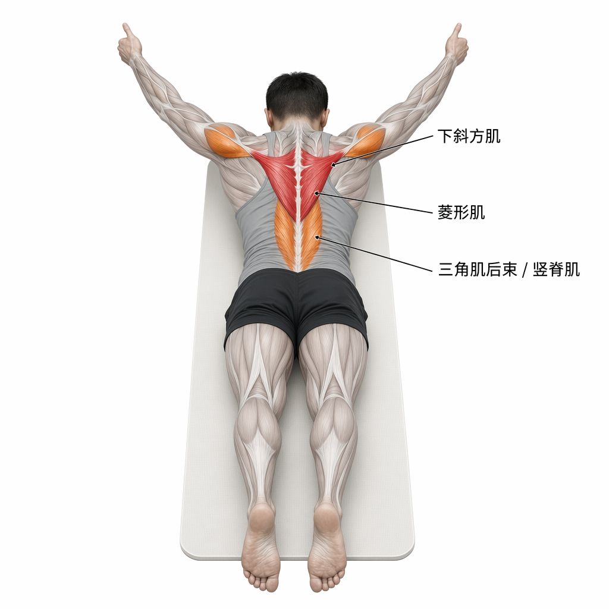

**版本**: v1 · **耗时**: 237s · **生成时间**: 2026-05-02T14:13:37Z

**分类**: 肩胛稳定 · **视角**: view from above and slightly behind

**应有标签 (中文)**: 下斜方肌 / 菱形肌 / 三角肌后束 / 竖脊肌

<details><summary>展开 prompt</summary>

```
Anatomical muscle-activation diagram of the "俯卧 I 字" (prone I raise) exercise, view from above and slightly behind. Person posture: Athletic person doing a prone I (Y-T-W-I series): lying face-down on the floor on a mat, legs extended together; both arms fully extended overhead in a straight line with the body (forming the letter I from above), thumbs pointing toward the ceiling, palms facing each other; arms lifted off the ground a few inches by squeezing the upper back; chin slightly tucked, forehead just off the ground; this works the lower trapezius and shoulder stabilizers; plain black athletic shorts and gray tank top. Body rendered with semi-transparent skin so underlying muscles are visible. Highlight in saturated red the primary working muscles: lower trapezius and rhomboids (mid-back retraction). Highlight in orange the secondary stabilizers: rear deltoid and erector spinae. Other muscles in pale neutral gray. Add small clean labels with thin black arrow leader lines pointing from each label to its target muscle group. The labels MUST be in simplified Chinese characters using a clean sans-serif font. Use exactly the following labels: "下斜方肌" pointing to the lower trapezius; "菱形肌" pointing to the rhomboids; "三角肌后束 / 竖脊肌" pointing to the rear deltoid and erector spinae. 

CRITICAL CONSTRAINTS — these are non-negotiable:
1. ALL TEXT IN THE IMAGE MUST BE SIMPLIFIED CHINESE CHARACTERS ONLY.
2. ABSOLUTELY NO ENGLISH WORDS, NO LATIN LETTERS, NO PINYIN ANYWHERE IN THE IMAGE.
3. NO romanization or transliteration of muscle names.
4. NO captions, NO subtitles, NO step-by-step text overlays.
5. ONLY the muscle labels listed above should appear as text.

Style: clean medical textbook illustration, off-white background, no facial features (head shape may be shown but no eyes/nose/mouth), anatomically accurate proportions, no shadows on background, no watermarks, no signature.
```

</details>

---

### ❓ T1278 — 俯卧 Y 字 (prone Y raise)

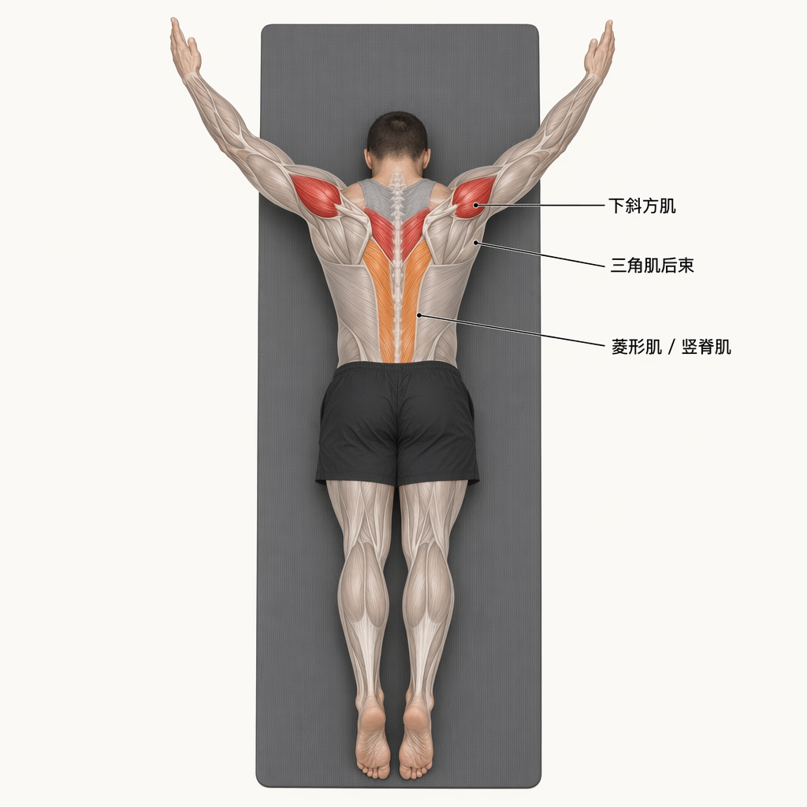

**版本**: v2 · **耗时**: 245s · **生成时间**: 2026-05-02T14:45:12Z

**分类**: 肩胛稳定 · **视角**: bird's-eye view from directly above looking down at the floor

**应有标签 (中文)**: 下斜方肌 / 三角肌后束 / 菱形肌 / 竖脊肌

<details><summary>展开 prompt</summary>

```
Anatomical muscle-activation diagram of the "俯卧 Y 字" (prone Y raise) exercise, bird's-eye view from directly above looking down at the floor. Person posture: Athletic person LYING FACE-DOWN ON A YOGA MAT ON THE FLOOR (PRONE position) — the chest, abdomen, hips, and the front of the thighs are all pressed flat into the mat. The forehead rests on the mat, head down. Legs are extended straight together. Both arms are extended ABOVE THE HEAD and angled outward at about 45 degrees from the body axis, so the body+arms form the LETTER Y as seen from above (legs together as the stem, arms as the upper branches). Thumbs pointing toward the ceiling, palms facing each other. The arms are LIFTED A FEW CENTIMETERS off the mat by squeezing the lower trapezius. Plain black athletic shorts and gray tank top. CRITICAL CONSTRAINT: this person is LYING DOWN ON THE FLOOR FACE-DOWN. The person is NOT STANDING. The person is NOT UPRIGHT. The body is HORIZONTAL ON THE GROUND. Show the full body lying flat from a top-down perspective.. Body rendered with semi-transparent skin so underlying muscles are visible. Highlight in saturated red the primary working muscles: lower trapezius and rear deltoid. Highlight in orange the secondary stabilizers: rhomboids and erector spinae. Other muscles in pale neutral gray. Add small clean labels with thin black arrow leader lines pointing from each label to its target muscle group. The labels MUST be in simplified Chinese characters using a clean sans-serif font. Use exactly the following labels: "下斜方肌" pointing to the lower trapezius; "三角肌后束" pointing to the rear deltoid; "菱形肌 / 竖脊肌" pointing to the rhomboids and erector spinae. 

CRITICAL CONSTRAINTS — these are non-negotiable:
1. ALL TEXT IN THE IMAGE MUST BE SIMPLIFIED CHINESE CHARACTERS ONLY.
2. ABSOLUTELY NO ENGLISH WORDS, NO LATIN LETTERS, NO PINYIN ANYWHERE IN THE IMAGE.
3. NO romanization or transliteration of muscle names.
4. NO captions, NO subtitles, NO step-by-step text overlays.
5. ONLY the muscle labels listed above should appear as text.

Style: clean medical textbook illustration, off-white background, no facial features (head shape may be shown but no eyes/nose/mouth), anatomically accurate proportions, no shadows on background, no watermarks, no signature.
```

</details>

---

### ❓ T1279 — 俯卧 T 字 (prone T raise)

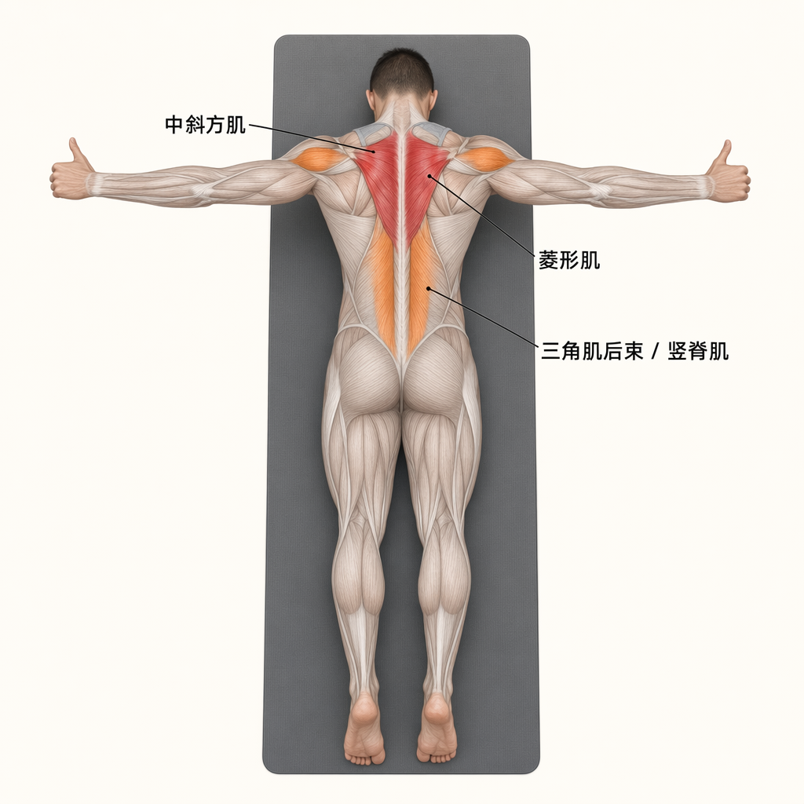

**版本**: v2 · **耗时**: 240s · **生成时间**: 2026-05-02T14:48:58Z

**分类**: 肩胛稳定 · **视角**: bird's-eye view from directly above looking down at the floor

**应有标签 (中文)**: 中斜方肌 / 菱形肌 / 三角肌后束 / 竖脊肌

<details><summary>展开 prompt</summary>

```
Anatomical muscle-activation diagram of the "俯卧 T 字" (prone T raise) exercise, bird's-eye view from directly above looking down at the floor. Person posture: Athletic person LYING FACE-DOWN ON A YOGA MAT ON THE FLOOR (PRONE position) — chest, abdomen, hips, and front of thighs pressed flat into the mat. Forehead resting on the mat, head down. Legs extended straight together. Both arms extended OUT TO THE SIDES at exactly 90 degrees from the body axis, so the body+arms form the LETTER T as seen from above (legs together as the stem, arms as the horizontal cross). Thumbs pointing toward the ceiling, palms facing the floor. The arms are LIFTED A FEW CENTIMETERS off the mat by retracting the shoulder blades together. Plain black athletic shorts and gray tank top. CRITICAL CONSTRAINT: this person is LYING DOWN ON THE FLOOR FACE-DOWN. The person is NOT STANDING. The person is NOT UPRIGHT. The body is HORIZONTAL ON THE GROUND. Show the full body lying flat from a top-down perspective.. Body rendered with semi-transparent skin so underlying muscles are visible. Highlight in saturated red the primary working muscles: middle trapezius and rhomboids (scapular retraction). Highlight in orange the secondary stabilizers: rear deltoid and erector spinae. Other muscles in pale neutral gray. Add small clean labels with thin black arrow leader lines pointing from each label to its target muscle group. The labels MUST be in simplified Chinese characters using a clean sans-serif font. Use exactly the following labels: "中斜方肌" pointing to the middle trapezius; "菱形肌" pointing to the rhomboids; "三角肌后束 / 竖脊肌" pointing to the rear deltoid and erector spinae. 

CRITICAL CONSTRAINTS — these are non-negotiable:
1. ALL TEXT IN THE IMAGE MUST BE SIMPLIFIED CHINESE CHARACTERS ONLY.
2. ABSOLUTELY NO ENGLISH WORDS, NO LATIN LETTERS, NO PINYIN ANYWHERE IN THE IMAGE.
3. NO romanization or transliteration of muscle names.
4. NO captions, NO subtitles, NO step-by-step text overlays.
5. ONLY the muscle labels listed above should appear as text.

Style: clean medical textbook illustration, off-white background, no facial features (head shape may be shown but no eyes/nose/mouth), anatomically accurate proportions, no shadows on background, no watermarks, no signature.
```

</details>

---

### ❓ T1280 — 俯卧 W 字 (prone W raise)

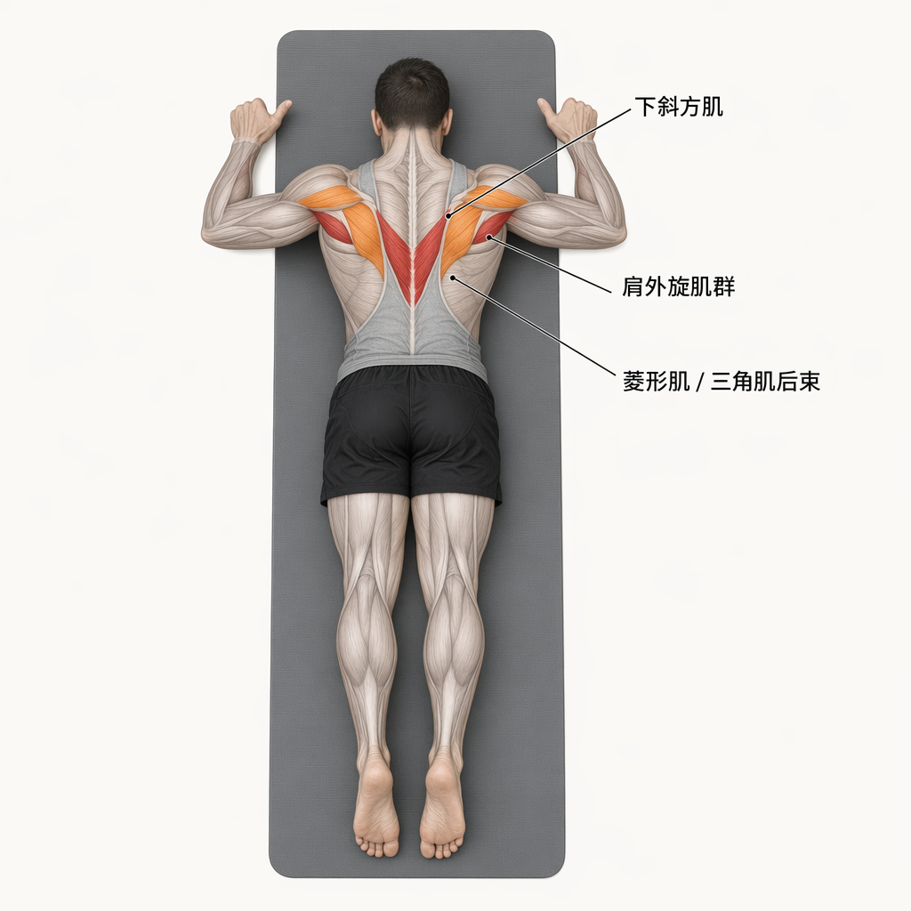

**版本**: v2 · **耗时**: 188s · **生成时间**: 2026-05-02T14:48:09Z

**分类**: 肩胛稳定 · **视角**: bird's-eye view from directly above looking down at the floor

**应有标签 (中文)**: 下斜方肌 / 肩外旋肌群 / 菱形肌 / 三角肌后束

<details><summary>展开 prompt</summary>

```
Anatomical muscle-activation diagram of the "俯卧 W 字" (prone W raise) exercise, bird's-eye view from directly above looking down at the floor. Person posture: Athletic person LYING FACE-DOWN ON A YOGA MAT ON THE FLOOR (PRONE position) — chest, abdomen, hips, and front of thighs pressed flat into the mat. Forehead resting on the mat, head down. Legs extended straight together. Both arms bent at the elbows: shoulders abducted out to the sides at about 90 degrees from the body axis, elbows bent so the forearms come back toward the head with hands near the ears, thumbs pointing toward the ceiling. From a top-down view this forms the LETTER W (the head and arms together making a W shape). The arms are LIFTED A FEW CENTIMETERS off the mat by retracting and depressing the shoulder blades. Plain black athletic shorts and gray tank top. CRITICAL CONSTRAINT: this person is LYING DOWN ON THE FLOOR FACE-DOWN. The person is NOT STANDING. The person is NOT UPRIGHT. The body is HORIZONTAL ON THE GROUND. Show the full body lying flat from a top-down perspective.. Body rendered with semi-transparent skin so underlying muscles are visible. Highlight in saturated red the primary working muscles: lower trapezius and external rotators of the shoulders (infraspinatus, teres minor). Highlight in orange the secondary stabilizers: rhomboids and rear deltoid. Other muscles in pale neutral gray. Add small clean labels with thin black arrow leader lines pointing from each label to its target muscle group. The labels MUST be in simplified Chinese characters using a clean sans-serif font. Use exactly the following labels: "下斜方肌" pointing to the lower trapezius; "肩外旋肌群" pointing to the external rotators of the shoulders; "菱形肌 / 三角肌后束" pointing to the rhomboids and rear deltoid. 

CRITICAL CONSTRAINTS — these are non-negotiable:
1. ALL TEXT IN THE IMAGE MUST BE SIMPLIFIED CHINESE CHARACTERS ONLY.
2. ABSOLUTELY NO ENGLISH WORDS, NO LATIN LETTERS, NO PINYIN ANYWHERE IN THE IMAGE.
3. NO romanization or transliteration of muscle names.
4. NO captions, NO subtitles, NO step-by-step text overlays.
5. ONLY the muscle labels listed above should appear as text.

Style: clean medical textbook illustration, off-white background, no facial features (head shape may be shown but no eyes/nose/mouth), anatomically accurate proportions, no shadows on background, no watermarks, no signature.
```

</details>

---

## 臀部激活 (8)

### ❓ T1132 — 仰卧臀桥 (supine glute bridge)

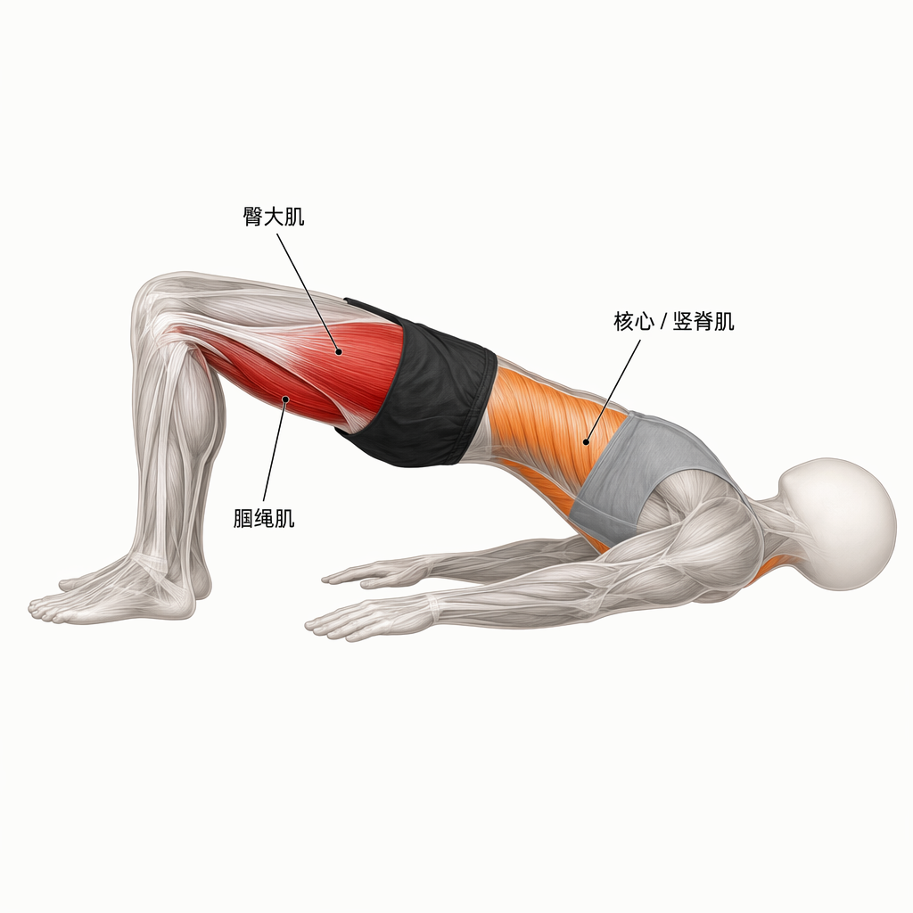

**版本**: v1 · **耗时**: 220s · **生成时间**: 2026-05-02T13:23:26Z

**分类**: 臀部激活 · **视角**: side view, facing right

**应有标签 (中文)**: 臀大肌 / 腘绳肌 / 核心 / 竖脊肌

<details><summary>展开 prompt</summary>

```
Anatomical muscle-activation diagram of the "仰卧臀桥" (supine glute bridge) exercise, side view, facing right. Person posture: Athletic person at the top of a glute bridge: lying supine on the floor with upper back, head, neck, and arms flat on the ground; both feet flat on the ground hip-width apart with both knees bent at 90 degrees; hips lifted upward so that the body forms a straight diagonal line from the knees through the hips to the shoulders; arms resting at the sides with palms down; plain black athletic shorts and gray tank top. Body rendered with semi-transparent skin so underlying muscles are visible. Highlight in saturated red the primary working muscles: gluteus maximus (the main hip extensors) and hamstring group. Highlight in orange the secondary stabilizers: core muscles (transverse abdominis) and erector spinae. Other muscles in pale neutral gray. Add small clean labels with thin black arrow leader lines pointing from each label to its target muscle group. The labels MUST be in simplified Chinese characters using a clean sans-serif font. Use exactly the following labels: "臀大肌" pointing to the gluteus maximus; "腘绳肌" pointing to the hamstring group; "核心 / 竖脊肌" pointing to the core and erector spinae area. 

CRITICAL CONSTRAINTS — these are non-negotiable:
1. ALL TEXT IN THE IMAGE MUST BE SIMPLIFIED CHINESE CHARACTERS ONLY.
2. ABSOLUTELY NO ENGLISH WORDS, NO LATIN LETTERS, NO PINYIN ANYWHERE IN THE IMAGE.
3. NO romanization or transliteration of muscle names.
4. NO captions, NO subtitles, NO step-by-step text overlays.
5. ONLY the muscle labels listed above should appear as text.

Style: clean medical textbook illustration, off-white background, no facial features (head shape may be shown but no eyes/nose/mouth), anatomically accurate proportions, no shadows on background, no watermarks, no signature.
```

</details>

---

### ❓ T1219 — 单腿臀桥保持 (single-leg glute bridge hold)

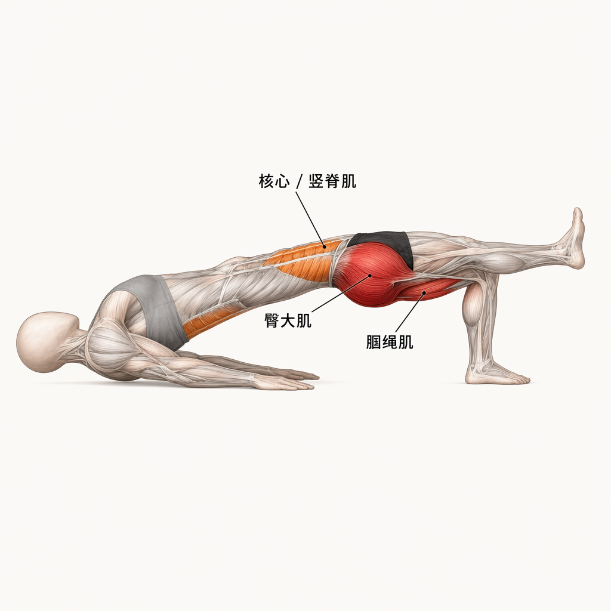

**版本**: v3 · **耗时**: 213s · **生成时间**: 2026-05-02T14:57:23Z

**分类**: 臀部激活 · **视角**: low-angle side view from ground level looking horizontally across the body

**应有标签 (中文)**: 臀大肌 / 腘绳肌 / 核心 / 竖脊肌

<details><summary>展开 prompt</summary>

```
Anatomical muscle-activation diagram of the "单腿臀桥保持" (single-leg glute bridge hold) exercise, low-angle side view from ground level looking horizontally across the body. Person posture: Pilates-style demonstration: athletic person performing a single-leg glute bridge HOLD, photographed from a low ground-level camera looking horizontally across the body. The person is lying supine on the floor with shoulders, head, and arms flat on the ground. The right foot is on the ground with right knee bent 90 degrees, supporting the body. The hips are lifted into a bridge. The KEY visual: the LEFT LEG is FULLY STRAIGHTENED and held PARALLEL TO THE FLOOR like a horizontal pointer extending out from the body — left leg, hips, and right shoulder all align in one HORIZONTAL line that is parallel to the floor. The left toe points away from the body horizontally. Imagine an arrow lying flat on the floor, with the body forming the back of the arrow and the left leg pointing as the arrow's shaft. Plain black athletic shorts and gray tank top. NEGATIVE: the left leg is NOT pointing toward the ceiling, NOT angled upward at all, NOT bent at the knee — it is COMPLETELY HORIZONTAL, parallel to the ground.. Body rendered with semi-transparent skin so underlying muscles are visible. Highlight in saturated red the primary working muscles: gluteus maximus and hamstring group of the supporting (right) leg. Highlight in orange the secondary stabilizers: core muscles and erector spinae and gluteus medius for hip stability. Other muscles in pale neutral gray. Add small clean labels with thin black arrow leader lines pointing from each label to its target muscle group. The labels MUST be in simplified Chinese characters using a clean sans-serif font. Use exactly the following labels: "臀大肌" pointing to the gluteus maximus of the supporting leg; "腘绳肌" pointing to the hamstring group of the supporting leg; "核心 / 竖脊肌" pointing to the core and erector spinae area. 

CRITICAL CONSTRAINTS — these are non-negotiable:
1. ALL TEXT IN THE IMAGE MUST BE SIMPLIFIED CHINESE CHARACTERS ONLY.
2. ABSOLUTELY NO ENGLISH WORDS, NO LATIN LETTERS, NO PINYIN ANYWHERE IN THE IMAGE.
3. NO romanization or transliteration of muscle names.
4. NO captions, NO subtitles, NO step-by-step text overlays.
5. ONLY the muscle labels listed above should appear as text.

Style: clean medical textbook illustration, off-white background, no facial features (head shape may be shown but no eyes/nose/mouth), anatomically accurate proportions, no shadows on background, no watermarks, no signature.
```

</details>

---

### ❓ T1229 — 臀桥保持 (glute bridge hold isometric)

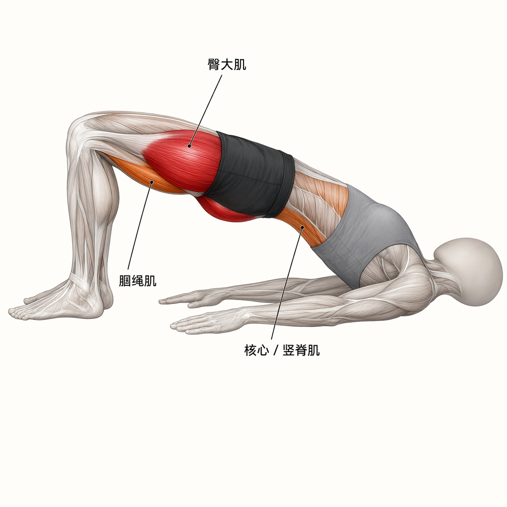

**版本**: v1 · **耗时**: 225s · **生成时间**: 2026-05-02T13:24:07Z

**分类**: 臀部激活 · **视角**: side view, facing right

**应有标签 (中文)**: 臀大肌 / 腘绳肌 / 核心 / 竖脊肌

<details><summary>展开 prompt</summary>

```
Anatomical muscle-activation diagram of the "臀桥保持" (glute bridge hold isometric) exercise, side view, facing right. Person posture: Athletic person holding a glute bridge in isometric position: lying supine with upper back, head, neck, and arms flat on the ground; both feet flat on the ground hip-width apart with both knees bent at 90 degrees; hips lifted maximally so the body forms a strong straight line from knees to shoulders, glutes fully squeezed; arms flat at sides with palms down; plain black athletic shorts and gray tank top. Body rendered with semi-transparent skin so underlying muscles are visible. Highlight in saturated red the primary working muscles: gluteus maximus (under maximal isometric contraction). Highlight in orange the secondary stabilizers: hamstring group and core muscles and erector spinae. Other muscles in pale neutral gray. Add small clean labels with thin black arrow leader lines pointing from each label to its target muscle group. The labels MUST be in simplified Chinese characters using a clean sans-serif font. Use exactly the following labels: "臀大肌" pointing to the gluteus maximus; "腘绳肌" pointing to the hamstring group; "核心 / 竖脊肌" pointing to the core and erector spinae area. 

CRITICAL CONSTRAINTS — these are non-negotiable:
1. ALL TEXT IN THE IMAGE MUST BE SIMPLIFIED CHINESE CHARACTERS ONLY.
2. ABSOLUTELY NO ENGLISH WORDS, NO LATIN LETTERS, NO PINYIN ANYWHERE IN THE IMAGE.
3. NO romanization or transliteration of muscle names.
4. NO captions, NO subtitles, NO step-by-step text overlays.
5. ONLY the muscle labels listed above should appear as text.

Style: clean medical textbook illustration, off-white background, no facial features (head shape may be shown but no eyes/nose/mouth), anatomically accurate proportions, no shadows on background, no watermarks, no signature.
```

</details>

---

### ❓ T1233 — 驴踢腿 (donkey kick / quadruped hip extension)

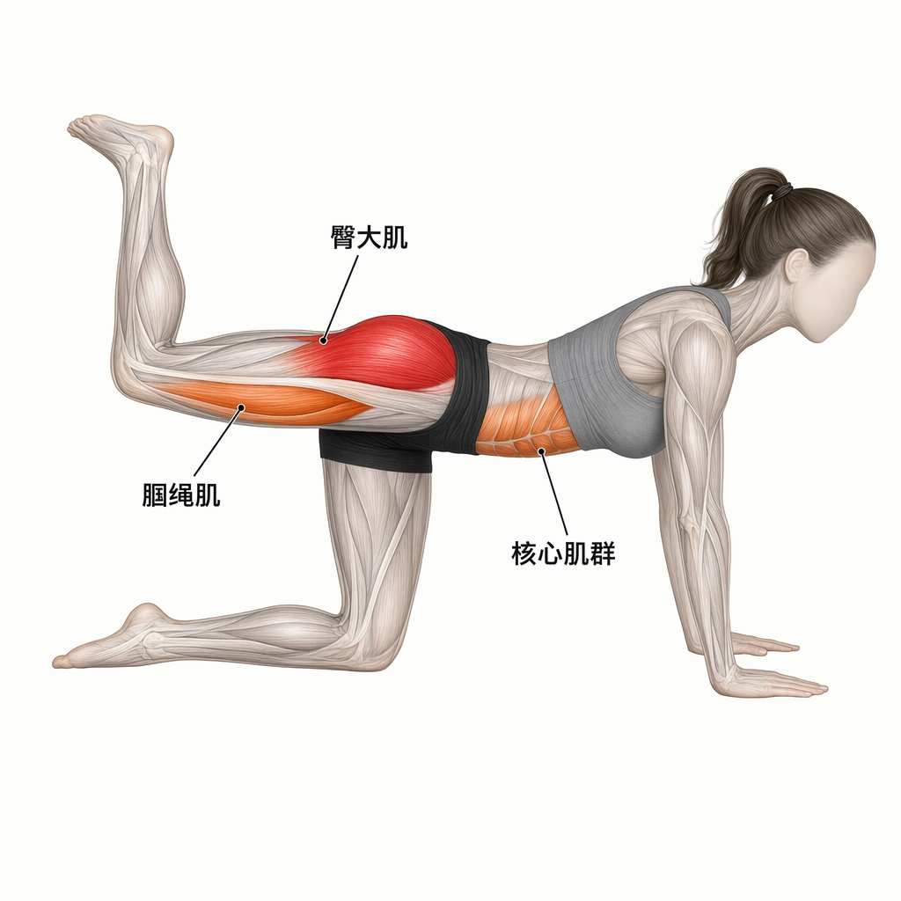

**版本**: v1 · **耗时**: 243s · **生成时间**: 2026-05-02T13:24:35Z

**分类**: 臀部激活 · **视角**: side view, facing right

**应有标签 (中文)**: 臀大肌 / 腘绳肌 / 核心肌群

<details><summary>展开 prompt</summary>

```
Anatomical muscle-activation diagram of the "驴踢腿" (donkey kick / quadruped hip extension) exercise, side view, facing right. Person posture: Athletic person at the top of a donkey kick: in a quadruped position with hands flat on the ground directly under shoulders and right knee on the ground directly under hip; left leg lifted with knee still bent at 90 degrees and the sole of the left foot pushing toward the ceiling, thigh parallel to the ground or slightly higher; spine neutral, hips and shoulders level (no rotation); plain black athletic shorts and gray tank top. Body rendered with semi-transparent skin so underlying muscles are visible. Highlight in saturated red the primary working muscles: gluteus maximus of the kicking (left) leg. Highlight in orange the secondary stabilizers: hamstring group of the kicking leg and core muscles for stability. Other muscles in pale neutral gray. Add small clean labels with thin black arrow leader lines pointing from each label to its target muscle group. The labels MUST be in simplified Chinese characters using a clean sans-serif font. Use exactly the following labels: "臀大肌" pointing to the gluteus maximus of the kicking leg; "腘绳肌" pointing to the hamstring group; "核心肌群" pointing to the core muscles. 

CRITICAL CONSTRAINTS — these are non-negotiable:
1. ALL TEXT IN THE IMAGE MUST BE SIMPLIFIED CHINESE CHARACTERS ONLY.
2. ABSOLUTELY NO ENGLISH WORDS, NO LATIN LETTERS, NO PINYIN ANYWHERE IN THE IMAGE.
3. NO romanization or transliteration of muscle names.
4. NO captions, NO subtitles, NO step-by-step text overlays.
5. ONLY the muscle labels listed above should appear as text.

Style: clean medical textbook illustration, off-white background, no facial features (head shape may be shown but no eyes/nose/mouth), anatomically accurate proportions, no shadows on background, no watermarks, no signature.
```

</details>

---

### ❓ T1317 — 蚌式开合 (clamshell)

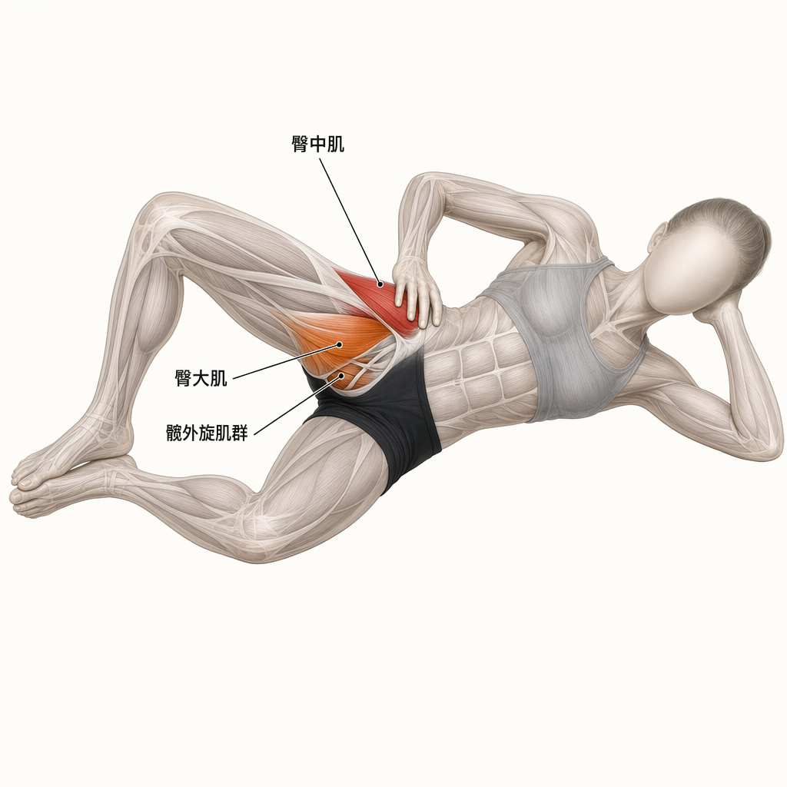

**版本**: v1 · **耗时**: 222s · **生成时间**: 2026-05-02T13:27:08Z

**分类**: 臀部激活 · **视角**: three-quarter view from the front

**应有标签 (中文)**: 臀中肌 / 臀大肌 / 髋外旋肌群

<details><summary>展开 prompt</summary>

```
Anatomical muscle-activation diagram of the "蚌式开合" (clamshell) exercise, three-quarter view from the front. Person posture: Athletic person doing a clamshell exercise: lying on the right side on the ground; both knees bent to about 45 degrees with feet stacked and touching each other; hips stacked vertically; the top knee (left) is rotated open and clearly lifted away from the bottom knee while the feet remain in contact, like a clamshell opening; right arm tucked under the head, left hand resting on the hip; spine neutral; plain black athletic shorts and gray tank top. Body rendered with semi-transparent skin so underlying muscles are visible. Highlight in saturated red the primary working muscles: gluteus medius of the top hip. Highlight in orange the secondary stabilizers: gluteus maximus (upper fibers) and deep external hip rotators. Other muscles in pale neutral gray. Add small clean labels with thin black arrow leader lines pointing from each label to its target muscle group. The labels MUST be in simplified Chinese characters using a clean sans-serif font. Use exactly the following labels: "臀中肌" pointing to the gluteus medius of the top hip; "臀大肌" pointing to the gluteus maximus; "髋外旋肌群" pointing to the deep external hip rotators. 

CRITICAL CONSTRAINTS — these are non-negotiable:
1. ALL TEXT IN THE IMAGE MUST BE SIMPLIFIED CHINESE CHARACTERS ONLY.
2. ABSOLUTELY NO ENGLISH WORDS, NO LATIN LETTERS, NO PINYIN ANYWHERE IN THE IMAGE.
3. NO romanization or transliteration of muscle names.
4. NO captions, NO subtitles, NO step-by-step text overlays.
5. ONLY the muscle labels listed above should appear as text.

Style: clean medical textbook illustration, off-white background, no facial features (head shape may be shown but no eyes/nose/mouth), anatomically accurate proportions, no shadows on background, no watermarks, no signature.
```

</details>

---

### ❓ T1133 — 单腿仰卧抬髋 (alternating single-leg hip lift)

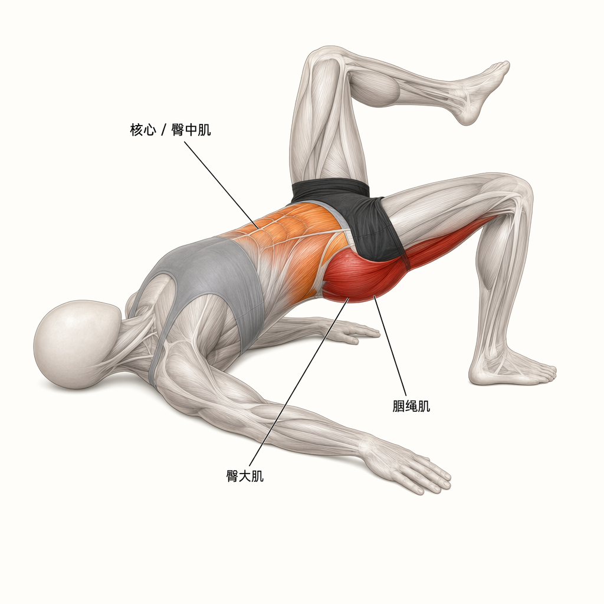

**版本**: v1 · **耗时**: 229s · **生成时间**: 2026-05-02T13:45:21Z

**分类**: 臀部激活 · **视角**: three-quarter view from above and side

**应有标签 (中文)**: 臀大肌 / 腘绳肌 / 核心 / 臀中肌

<details><summary>展开 prompt</summary>

```
Anatomical muscle-activation diagram of the "单腿仰卧抬髋" (alternating single-leg hip lift) exercise, three-quarter view from above and side. Person posture: Athletic person performing an alternating single-leg supine hip lift: lying supine on the floor with upper back, head, neck, shoulders, and arms flat on the ground, arms relaxed at sides palms down; both knees bent at 90 degrees with feet flat on the ground hip-width apart at the start; right leg lifted off the ground with the right knee still bent at 90 degrees (right foot off the ground); left foot remains flat on the ground (this is the supporting leg); hips lifted upward so that left thigh, hips, and shoulders form one straight diagonal line (about 30 degrees from the floor); plain black athletic shorts and gray tank top. Body rendered with semi-transparent skin so underlying muscles are visible. Highlight in saturated red the primary working muscles: gluteus maximus and hamstring group of the supporting (left) leg. Highlight in orange the secondary stabilizers: core muscles and gluteus medius of the supporting hip. Other muscles in pale neutral gray. Add small clean labels with thin black arrow leader lines pointing from each label to its target muscle group. The labels MUST be in simplified Chinese characters using a clean sans-serif font. Use exactly the following labels: "臀大肌" pointing to the gluteus maximus of the supporting leg; "腘绳肌" pointing to the hamstring group; "核心 / 臀中肌" pointing to the core and gluteus medius area. 

CRITICAL CONSTRAINTS — these are non-negotiable:
1. ALL TEXT IN THE IMAGE MUST BE SIMPLIFIED CHINESE CHARACTERS ONLY.
2. ABSOLUTELY NO ENGLISH WORDS, NO LATIN LETTERS, NO PINYIN ANYWHERE IN THE IMAGE.
3. NO romanization or transliteration of muscle names.
4. NO captions, NO subtitles, NO step-by-step text overlays.
5. ONLY the muscle labels listed above should appear as text.

Style: clean medical textbook illustration, off-white background, no facial features (head shape may be shown but no eyes/nose/mouth), anatomically accurate proportions, no shadows on background, no watermarks, no signature.
```

</details>

---

### ❓ T1141 — 单腿仰卧髋膝抬 (single-leg supine hip and knee lift)

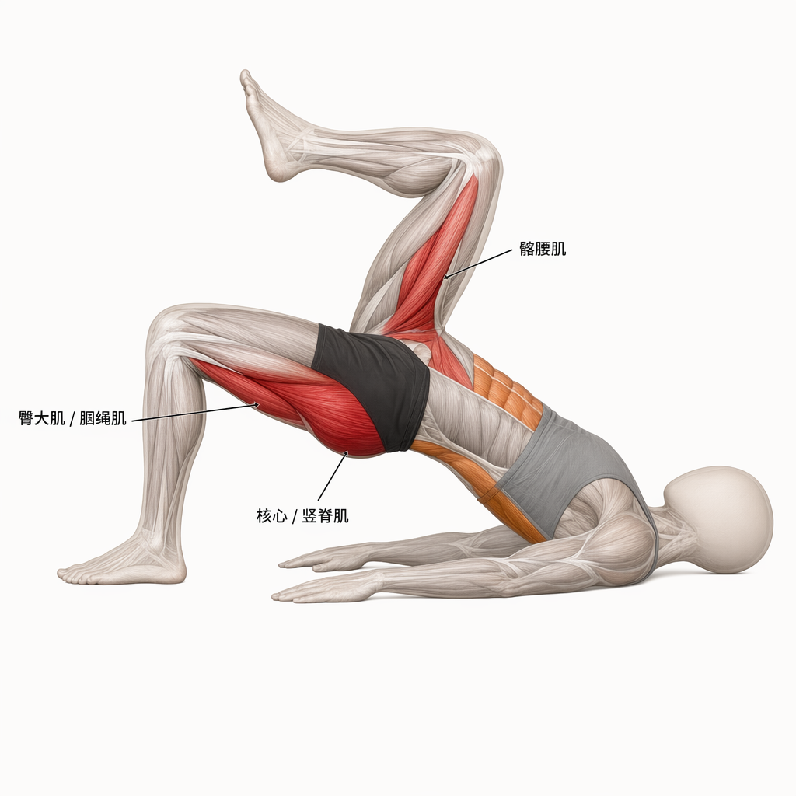

**版本**: v2 · **耗时**: 211s · **生成时间**: 2026-05-02T14:37:26Z

**分类**: 臀部激活 · **视角**: side view, facing right

**应有标签 (中文)**: 臀大肌 / 腘绳肌 / 髂腰肌 / 核心 / 竖脊肌

<details><summary>展开 prompt</summary>

```
Anatomical muscle-activation diagram of the "单腿仰卧髋膝抬" (single-leg supine hip and knee lift) exercise, side view, facing right. Person posture: Athletic person at the top of a single-leg supine bridge with the LIFTED LEG TUCKED TO CHEST: lying SUPINE on the floor with upper back, head, neck, and arms flat on the ground; LEFT foot flat on the ground with left knee bent at 90 degrees — this is the SUPPORTING leg. The RIGHT leg is the LIFTED leg and is in DEEP HIP+KNEE FLEXION — the right knee is pulled TOWARD THE CHEST so that the right thigh is roughly VERTICAL (perpendicular to the floor) and the right shin is angled toward the head, with the right knee positioned ABOVE the right hip; the right foot hovers in the air near the head. Hips are lifted off the ground into a bridge so the supporting (left) thigh, hips, and shoulders form a diagonal straight line. Arms flat at the sides palms down. Plain black athletic shorts and gray tank top. CRITICAL: the right knee is pulled high to the chest, NOT extended out forward, NOT lying flat.. Body rendered with semi-transparent skin so underlying muscles are visible. Highlight in saturated red the primary working muscles: gluteus maximus and hamstring group of the supporting (left) leg, plus hip flexors of the lifted (right) leg. Highlight in orange the secondary stabilizers: core muscles and erector spinae. Other muscles in pale neutral gray. Add small clean labels with thin black arrow leader lines pointing from each label to its target muscle group. The labels MUST be in simplified Chinese characters using a clean sans-serif font. Use exactly the following labels: "臀大肌 / 腘绳肌" pointing to the glute and hamstring of the supporting leg; "髂腰肌" pointing to the hip flexors of the lifted leg; "核心 / 竖脊肌" pointing to the core and erector spinae area. 

CRITICAL CONSTRAINTS — these are non-negotiable:
1. ALL TEXT IN THE IMAGE MUST BE SIMPLIFIED CHINESE CHARACTERS ONLY.
2. ABSOLUTELY NO ENGLISH WORDS, NO LATIN LETTERS, NO PINYIN ANYWHERE IN THE IMAGE.
3. NO romanization or transliteration of muscle names.
4. NO captions, NO subtitles, NO step-by-step text overlays.
5. ONLY the muscle labels listed above should appear as text.

Style: clean medical textbook illustration, off-white background, no facial features (head shape may be shown but no eyes/nose/mouth), anatomically accurate proportions, no shadows on background, no watermarks, no signature.
```

</details>

---

### ❓ T1160 — 单腿桥支撑 (single-leg bridge support)

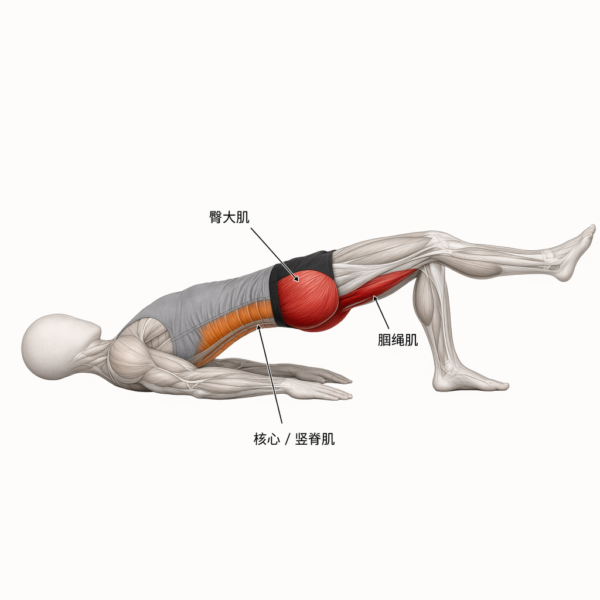

**版本**: v1 · **耗时**: 219s · **生成时间**: 2026-05-02T13:45:11Z

**分类**: 臀部激活 · **视角**: side view from a low angle, facing right

**应有标签 (中文)**: 臀大肌 / 腘绳肌 / 核心 / 竖脊肌

<details><summary>展开 prompt</summary>

```
Anatomical muscle-activation diagram of the "单腿桥支撑" (single-leg bridge support) exercise, side view from a low angle, facing right. Person posture: Athletic person mid-rep of a single-leg bridge (bottom of motion, hips just barely lifted off the ground): lying supine with upper back, head, and arms flat on the ground; left foot flat on the ground with left knee bent at 90 degrees (supporting leg); right leg fully extended straight forward parallel to the floor; hips just starting to lift so that hips are about 5 cm off the ground (low, controlled position, not full extension); arms flat at sides palms down; plain black athletic shorts and gray tank top. Body rendered with semi-transparent skin so underlying muscles are visible. Highlight in saturated red the primary working muscles: gluteus maximus and hamstring group of the supporting (left) leg. Highlight in orange the secondary stabilizers: core muscles and erector spinae. Other muscles in pale neutral gray. Add small clean labels with thin black arrow leader lines pointing from each label to its target muscle group. The labels MUST be in simplified Chinese characters using a clean sans-serif font. Use exactly the following labels: "臀大肌" pointing to the gluteus maximus; "腘绳肌" pointing to the hamstring group; "核心 / 竖脊肌" pointing to the core and erector spinae area. 

CRITICAL CONSTRAINTS — these are non-negotiable:
1. ALL TEXT IN THE IMAGE MUST BE SIMPLIFIED CHINESE CHARACTERS ONLY.
2. ABSOLUTELY NO ENGLISH WORDS, NO LATIN LETTERS, NO PINYIN ANYWHERE IN THE IMAGE.
3. NO romanization or transliteration of muscle names.
4. NO captions, NO subtitles, NO step-by-step text overlays.
5. ONLY the muscle labels listed above should appear as text.

Style: clean medical textbook illustration, off-white background, no facial features (head shape may be shown but no eyes/nose/mouth), anatomically accurate proportions, no shadows on background, no watermarks, no signature.
```

</details>

---

## 跑姿专项 (7)

### ❓ T1013 — 高抬腿 (high knees)

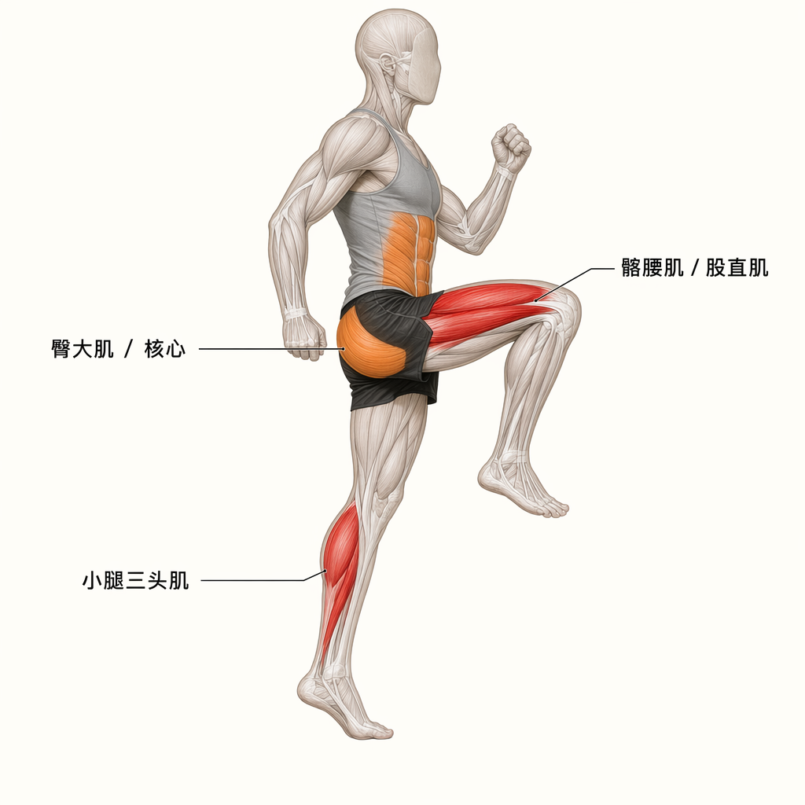

**版本**: v1 · **耗时**: 240s · **生成时间**: 2026-05-02T13:27:39Z

**分类**: 跑姿专项 · **视角**: side view, facing right

**应有标签 (中文)**: 髂腰肌 / 股直肌 / 小腿三头肌 / 臀大肌 / 核心

<details><summary>展开 prompt</summary>

```
Anatomical muscle-activation diagram of the "高抬腿" (high knees) exercise, side view, facing right. Person posture: Athletic person performing a high-knee drill at peak knee lift: right leg supporting with foot in mid-stride contact with the ground; left knee driven up explosively to hip height or higher with thigh at or above parallel to the floor and shin perpendicular; arms in running-style opposition (right arm forward bent at 90 degrees, left arm back bent at 90 degrees); torso upright with slight forward lean; plain black athletic shorts and gray tank top. Body rendered with semi-transparent skin so underlying muscles are visible. Highlight in saturated red the primary working muscles: hip flexors (psoas major and rectus femoris) of the lifted leg, and calf muscles of the supporting leg. Highlight in orange the secondary stabilizers: gluteus maximus of the supporting leg and core muscles. Other muscles in pale neutral gray. Add small clean labels with thin black arrow leader lines pointing from each label to its target muscle group. The labels MUST be in simplified Chinese characters using a clean sans-serif font. Use exactly the following labels: "髂腰肌 / 股直肌" pointing to the hip flexors of the lifted leg; "小腿三头肌" pointing to the calf muscles of the supporting leg; "臀大肌 / 核心" pointing to the glute and core area. 

CRITICAL CONSTRAINTS — these are non-negotiable:
1. ALL TEXT IN THE IMAGE MUST BE SIMPLIFIED CHINESE CHARACTERS ONLY.
2. ABSOLUTELY NO ENGLISH WORDS, NO LATIN LETTERS, NO PINYIN ANYWHERE IN THE IMAGE.
3. NO romanization or transliteration of muscle names.
4. NO captions, NO subtitles, NO step-by-step text overlays.
5. ONLY the muscle labels listed above should appear as text.

Style: clean medical textbook illustration, off-white background, no facial features (head shape may be shown but no eyes/nose/mouth), anatomically accurate proportions, no shadows on background, no watermarks, no signature.
```

</details>

---

### ❓ T1128 — 扶墙高抬腿 (hands-on-wall high knees)

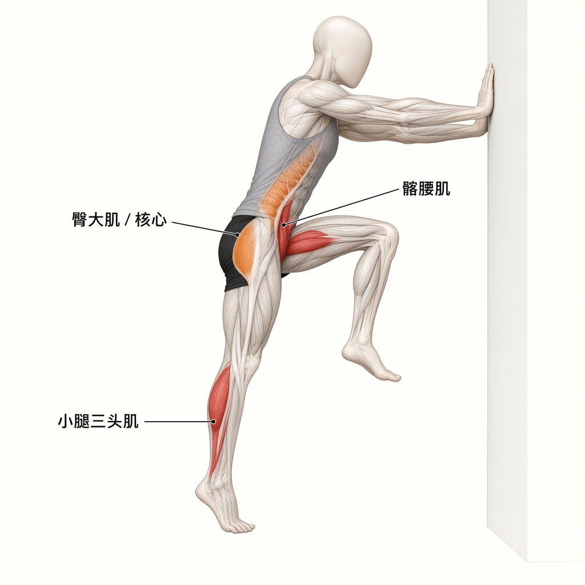

**版本**: v1 · **耗时**: 219s · **生成时间**: 2026-05-02T13:27:47Z

**分类**: 跑姿专项 · **视角**: side view, facing right

**应有标签 (中文)**: 髂腰肌 / 小腿三头肌 / 臀大肌 / 核心

<details><summary>展开 prompt</summary>

```
Anatomical muscle-activation diagram of the "扶墙高抬腿" (hands-on-wall high knees) exercise, side view, facing right. Person posture: Athletic person performing a hands-on-wall high-knee drill: leaning forward at about 45 degrees with both hands flat against a vertical wall at shoulder height, arms straight; right leg supporting on the ball of the foot; left knee driven up high in front of the body to hip height with thigh parallel to the floor and shin perpendicular (90 degree knee angle); torso forms one straight line from heels through hips to head; plain black athletic shorts and gray tank top. Body rendered with semi-transparent skin so underlying muscles are visible. Highlight in saturated red the primary working muscles: hip flexors (psoas) of the lifted leg and calf muscles of the supporting leg. Highlight in orange the secondary stabilizers: gluteus maximus of the supporting leg and core muscles. Other muscles in pale neutral gray. Add small clean labels with thin black arrow leader lines pointing from each label to its target muscle group. The labels MUST be in simplified Chinese characters using a clean sans-serif font. Use exactly the following labels: "髂腰肌" pointing to the hip flexors of the lifted leg; "小腿三头肌" pointing to the calf muscles of the supporting leg; "臀大肌 / 核心" pointing to the glute and core area. 

CRITICAL CONSTRAINTS — these are non-negotiable:
1. ALL TEXT IN THE IMAGE MUST BE SIMPLIFIED CHINESE CHARACTERS ONLY.
2. ABSOLUTELY NO ENGLISH WORDS, NO LATIN LETTERS, NO PINYIN ANYWHERE IN THE IMAGE.
3. NO romanization or transliteration of muscle names.
4. NO captions, NO subtitles, NO step-by-step text overlays.
5. ONLY the muscle labels listed above should appear as text.

Style: clean medical textbook illustration, off-white background, no facial features (head shape may be shown but no eyes/nose/mouth), anatomically accurate proportions, no shadows on background, no watermarks, no signature.
```

</details>

---

### ❓ T1212 — A-Skip 跑姿练习 (A-skip running drill)

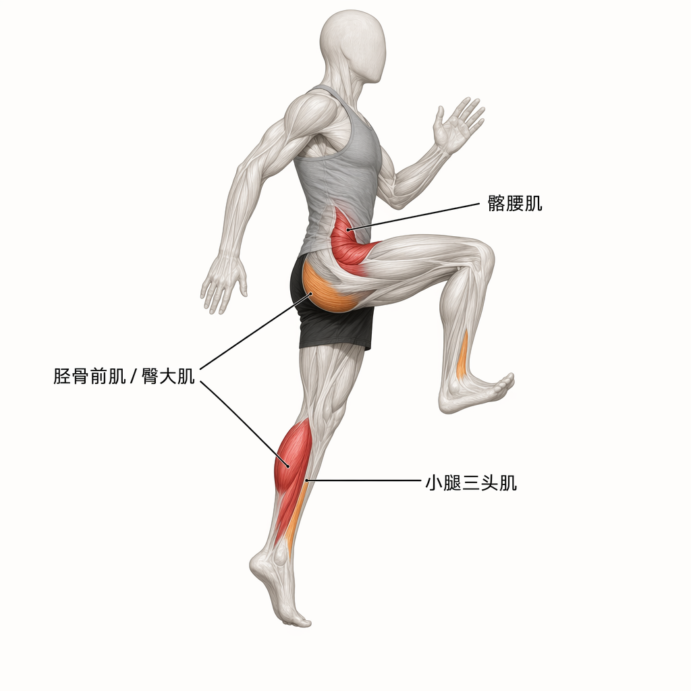

**版本**: v1 · **耗时**: 218s · **生成时间**: 2026-05-02T13:28:13Z

**分类**: 跑姿专项 · **视角**: side view, facing right

**应有标签 (中文)**: 髂腰肌 / 小腿三头肌 / 胫骨前肌 / 臀大肌

<details><summary>展开 prompt</summary>

```
Anatomical muscle-activation diagram of the "A-Skip 跑姿练习" (A-skip running drill) exercise, side view, facing right. Person posture: Athletic person at the top phase of an A-skip drill: right foot on the ball of the foot pushing off the ground; left thigh driven up to parallel with the floor (knee at hip height), left knee bent at 90 degrees with shin perpendicular and toes pulled up (dorsiflexed); arms in opposition like running; torso upright with slight forward lean; this is the classic A-skip drill posture used by sprinters; plain black athletic shorts and gray tank top. Body rendered with semi-transparent skin so underlying muscles are visible. Highlight in saturated red the primary working muscles: hip flexors of the lifted leg and calf muscles of the pushing leg. Highlight in orange the secondary stabilizers: gluteus maximus and tibialis anterior (front of shin). Other muscles in pale neutral gray. Add small clean labels with thin black arrow leader lines pointing from each label to its target muscle group. The labels MUST be in simplified Chinese characters using a clean sans-serif font. Use exactly the following labels: "髂腰肌" pointing to the hip flexors of the lifted leg; "小腿三头肌" pointing to the calf muscles of the pushing leg; "胫骨前肌 / 臀大肌" pointing to the tibialis anterior and glute area. 

CRITICAL CONSTRAINTS — these are non-negotiable:
1. ALL TEXT IN THE IMAGE MUST BE SIMPLIFIED CHINESE CHARACTERS ONLY.
2. ABSOLUTELY NO ENGLISH WORDS, NO LATIN LETTERS, NO PINYIN ANYWHERE IN THE IMAGE.
3. NO romanization or transliteration of muscle names.
4. NO captions, NO subtitles, NO step-by-step text overlays.
5. ONLY the muscle labels listed above should appear as text.

Style: clean medical textbook illustration, off-white background, no facial features (head shape may be shown but no eyes/nose/mouth), anatomically accurate proportions, no shadows on background, no watermarks, no signature.
```

</details>

---

### ❓ T1213 — B-Skip 跑姿练习 (B-skip running drill)

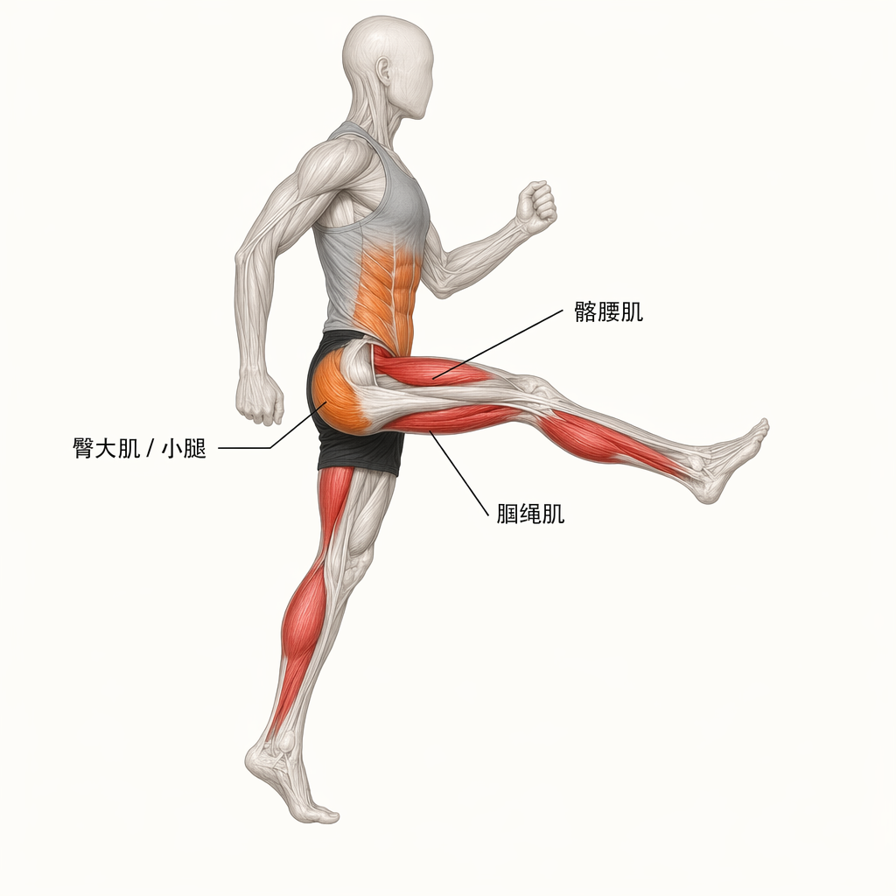

**版本**: v2 · **耗时**: 237s · **生成时间**: 2026-05-02T14:33:55Z

**分类**: 跑姿专项 · **视角**: side view, facing right

**应有标签 (中文)**: 腘绳肌 / 髂腰肌 / 臀大肌 / 小腿

<details><summary>展开 prompt</summary>

```
Anatomical muscle-activation diagram of the "B-Skip 跑姿练习" (B-skip running drill) exercise, side view, facing right. Person posture: Athletic person at the SIGNATURE LEG-EXTENSION + PAW-DOWN phase of a B-skip drill: right foot on the ball of the foot supporting on the ground. The LEFT LEG is the active drill leg and is in the DEFINING B-SKIP shape: left thigh is HELD AT PARALLEL to the floor (knee at hip height) AND the LEFT LOWER LEG (shin) IS FULLY EXTENDED FORWARD with the knee almost straightened — the foot is pointed forward and slightly down as if pawing or kicking forward, ready to whip back toward the ground. So the entire left leg is extended out in front, thigh horizontal and shin extending out from there, almost like a kicking motion. Arms in running-style opposition. Torso upright with slight forward lean. Plain black athletic shorts and gray tank top. CRITICAL: the LEFT LEG IS NOT BENT 90° (that would be A-skip) — the lower leg is EXTENDED FORWARD AT THE KNEE in a forward-paw position. This is the visual difference from A-skip.. Body rendered with semi-transparent skin so underlying muscles are visible. Highlight in saturated red the primary working muscles: hamstring group of the extending leg (eccentric loading) and hip flexors and calf muscles. Highlight in orange the secondary stabilizers: gluteus maximus and core muscles. Other muscles in pale neutral gray. Add small clean labels with thin black arrow leader lines pointing from each label to its target muscle group. The labels MUST be in simplified Chinese characters using a clean sans-serif font. Use exactly the following labels: "腘绳肌" pointing to the hamstrings of the extending leg; "髂腰肌" pointing to the hip flexors; "臀大肌 / 小腿" pointing to the glute and calf area. 

CRITICAL CONSTRAINTS — these are non-negotiable:
1. ALL TEXT IN THE IMAGE MUST BE SIMPLIFIED CHINESE CHARACTERS ONLY.
2. ABSOLUTELY NO ENGLISH WORDS, NO LATIN LETTERS, NO PINYIN ANYWHERE IN THE IMAGE.
3. NO romanization or transliteration of muscle names.
4. NO captions, NO subtitles, NO step-by-step text overlays.
5. ONLY the muscle labels listed above should appear as text.

Style: clean medical textbook illustration, off-white background, no facial features (head shape may be shown but no eyes/nose/mouth), anatomically accurate proportions, no shadows on background, no watermarks, no signature.
```

</details>

---

### ❓ T1236 — 直腿弹跳 (straight-leg bounding)

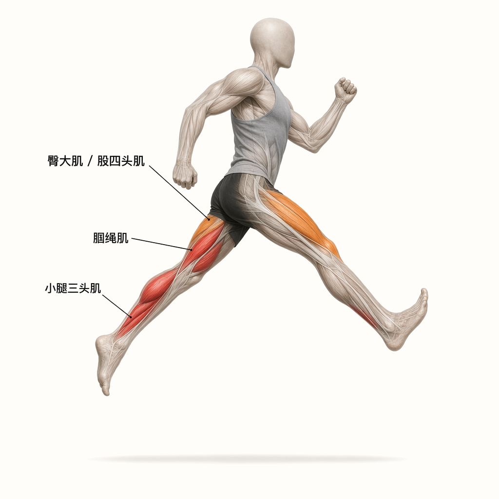

**版本**: v3 · **耗时**: 225s · **生成时间**: 2026-05-04T08:12:57Z

**分类**: 跑姿专项 · **视角**: side view, facing right, freeze-frame photographic style

**应有标签 (中文)**: 小腿三头肌 / 腘绳肌 / 臀大肌 / 股四头肌

<details><summary>展开 prompt</summary>

```
Anatomical muscle-activation diagram of the "直腿弹跳" (straight-leg bounding) exercise, side view, facing right, freeze-frame photographic style. Person posture: Photographic freeze-frame of a STRAIGHT-LEG bounding drill, side view. The athlete is suspended IN MID-AIR — about 15-25 cm of CLEAR EMPTY FLOOR SPACE is visible directly below both feet (a small shadow on the ground far below the body confirms airborne position). BOTH KNEES ARE LOCKED COMPLETELY STRAIGHT — zero knee bend, both legs RIGID like sticks. The FRONT (left) leg is locked-out and angled forward at about 30 degrees from vertical with the foot DORSIFLEXED (toes pulled UP). The REAR (right) leg is locked-out and angled back at about 30 degrees from vertical with the foot PLANTARFLEXED (toes pointed DOWN). Together the two stiff-straight legs form a wide scissor pattern in the air. Arms swinging in vigorous running-style opposition. Body traveling forward (rightward). Plain black athletic shorts and gray tank top. NEGATIVE: this is NOT running with bent knees — both knees are FULLY STRAIGHT throughout the movement; both feet are OFF THE GROUND.. Body rendered with semi-transparent skin so underlying muscles are visible. Highlight in saturated red the primary working muscles: calf muscles (gastrocnemius and soleus) for elastic recoil and hamstring group. Highlight in orange the secondary stabilizers: gluteus maximus and quadriceps. Other muscles in pale neutral gray. Add small clean labels with thin black arrow leader lines pointing from each label to its target muscle group. The labels MUST be in simplified Chinese characters using a clean sans-serif font. Use exactly the following labels: "小腿三头肌" pointing to the calf muscles for elastic recoil; "腘绳肌" pointing to the hamstring group; "臀大肌 / 股四头肌" pointing to the glute and quadriceps area. 

CRITICAL CONSTRAINTS — these are non-negotiable:
1. ALL TEXT IN THE IMAGE MUST BE SIMPLIFIED CHINESE CHARACTERS ONLY.
2. ABSOLUTELY NO ENGLISH WORDS, NO LATIN LETTERS, NO PINYIN ANYWHERE IN THE IMAGE.
3. NO romanization or transliteration of muscle names.
4. NO captions, NO subtitles, NO step-by-step text overlays.
5. ONLY the muscle labels listed above should appear as text.

Style: clean medical textbook illustration, off-white background, no facial features (head shape may be shown but no eyes/nose/mouth), anatomically accurate proportions, no shadows on background, no watermarks, no signature.
```

</details>

---

### ❓ T1214 — C-Skip 跑姿练习 (C-skip running drill)

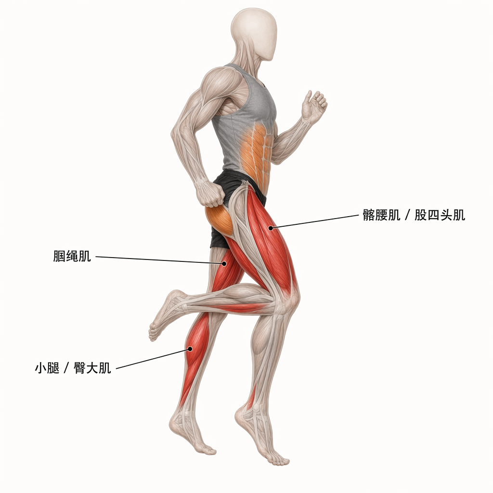

**版本**: v3 · **耗时**: 218s · **生成时间**: 2026-05-04T08:16:26Z

**分类**: 跑姿专项 · **视角**: side view, facing right, freeze-frame photographic style

**应有标签 (中文)**: 髂腰肌 / 股四头肌 / 腘绳肌 / 小腿 / 臀大肌

<details><summary>展开 prompt</summary>

```
Anatomical muscle-activation diagram of the "C-Skip 跑姿练习" (C-skip running drill) exercise, side view, facing right, freeze-frame photographic style. Person posture: Photographic freeze-frame at the SIGNATURE 'CYCLING-DOWN' phase of a C-skip drill (the bottom-back arc of the cycling motion). Side view facing right. The right foot is on the ball-of-foot in ground contact. The LEFT LEG is the active drill leg in mid-cycle: the left thigh has descended from horizontal back down toward the standing position (now angled about 30-45 degrees from vertical, going down), AND the left knee is BENT so the left lower leg (shin) curls BACKWARD with the left FOOT TUCKED BEHIND-AND-BELOW THE KNEE (like the bottom-back portion of a bicycle pedal stroke, tracing a C-shaped arc). The visual signature: an athlete's leg making a circular paddling motion at the BOTTOM of the cycle. Arms in running-style opposition. Plain black athletic shorts and gray tank top. NEGATIVE: NOT a standing running stride; NOT thigh held high horizontal (that is A-skip); NOT shin extended forward (that is B-skip). The defining feature is the leg mid-DESCENT with shin curled back.. Body rendered with semi-transparent skin so underlying muscles are visible. Highlight in saturated red the primary working muscles: hip flexors and quadriceps and hamstring of the cycling leg, plus calf muscles of the supporting leg. Highlight in orange the secondary stabilizers: gluteus maximus and core muscles. Other muscles in pale neutral gray. Add small clean labels with thin black arrow leader lines pointing from each label to its target muscle group. The labels MUST be in simplified Chinese characters using a clean sans-serif font. Use exactly the following labels: "髂腰肌 / 股四头肌" pointing to the hip flexors and quadriceps; "腘绳肌" pointing to the hamstring group; "小腿 / 臀大肌" pointing to the calf and glute area. 

CRITICAL CONSTRAINTS — these are non-negotiable:
1. ALL TEXT IN THE IMAGE MUST BE SIMPLIFIED CHINESE CHARACTERS ONLY.
2. ABSOLUTELY NO ENGLISH WORDS, NO LATIN LETTERS, NO PINYIN ANYWHERE IN THE IMAGE.
3. NO romanization or transliteration of muscle names.
4. NO captions, NO subtitles, NO step-by-step text overlays.
5. ONLY the muscle labels listed above should appear as text.

Style: clean medical textbook illustration, off-white background, no facial features (head shape may be shown but no eyes/nose/mouth), anatomically accurate proportions, no shadows on background, no watermarks, no signature.
```

</details>

---

### ❓ T1130 — 后踢腿跑 (butt kicks / heel-up running drill)

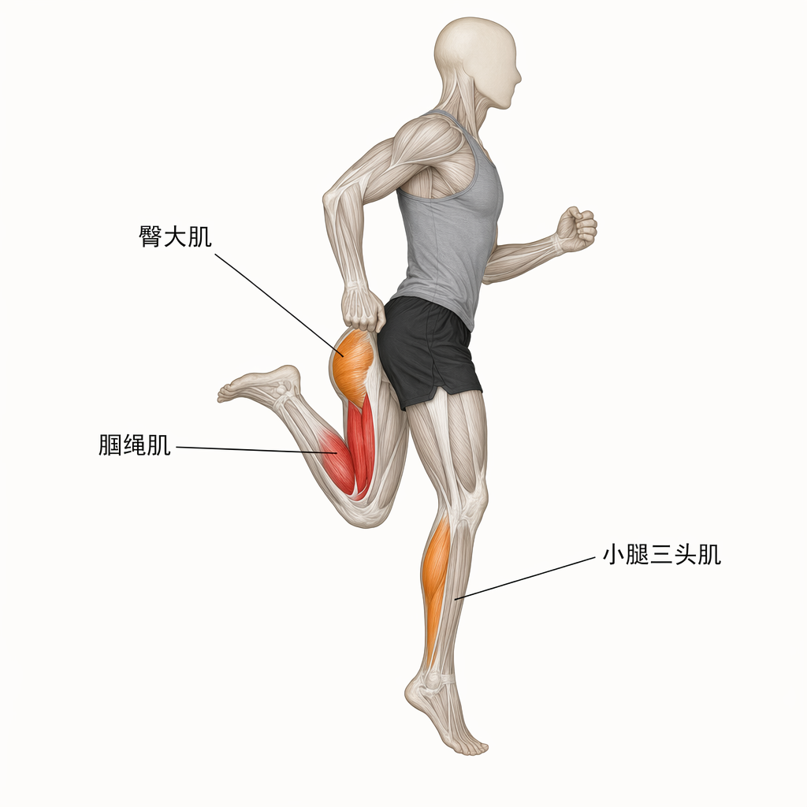

**版本**: v1 · **耗时**: 221s · **生成时间**: 2026-05-02T13:56:36Z

**分类**: 跑姿专项 · **视角**: side view, facing right

**应有标签 (中文)**: 腘绳肌 / 小腿三头肌 / 臀大肌

<details><summary>展开 prompt</summary>

```
Anatomical muscle-activation diagram of the "后踢腿跑" (butt kicks / heel-up running drill) exercise, side view, facing right. Person posture: Athletic person performing a butt-kick running drill at the heel-up phase: right leg supporting on the ball of the foot in mid-stride contact; left knee bent so that the left heel kicks up to touch the left buttock (left foot pulled up to the glute), the left thigh remains roughly vertical (perpendicular to the floor); arms in running-style opposition; torso upright with slight forward lean; plain black athletic shorts and gray tank top. Body rendered with semi-transparent skin so underlying muscles are visible. Highlight in saturated red the primary working muscles: hamstring group of the kicking (left) leg (heel-to-glute action). Highlight in orange the secondary stabilizers: calf muscles of the supporting leg and gluteus maximus. Other muscles in pale neutral gray. Add small clean labels with thin black arrow leader lines pointing from each label to its target muscle group. The labels MUST be in simplified Chinese characters using a clean sans-serif font. Use exactly the following labels: "腘绳肌" pointing to the hamstring group of the kicking leg; "小腿三头肌" pointing to the calf muscles of the supporting leg; "臀大肌" pointing to the gluteus maximus. 

CRITICAL CONSTRAINTS — these are non-negotiable:
1. ALL TEXT IN THE IMAGE MUST BE SIMPLIFIED CHINESE CHARACTERS ONLY.
2. ABSOLUTELY NO ENGLISH WORDS, NO LATIN LETTERS, NO PINYIN ANYWHERE IN THE IMAGE.
3. NO romanization or transliteration of muscle names.
4. NO captions, NO subtitles, NO step-by-step text overlays.
5. ONLY the muscle labels listed above should appear as text.

Style: clean medical textbook illustration, off-white background, no facial features (head shape may be shown but no eyes/nose/mouth), anatomically accurate proportions, no shadows on background, no watermarks, no signature.
```

</details>

---

## 踝稳定 (3)

### ❓ T1326 — 弹力带踝内翻 (banded ankle inversion)

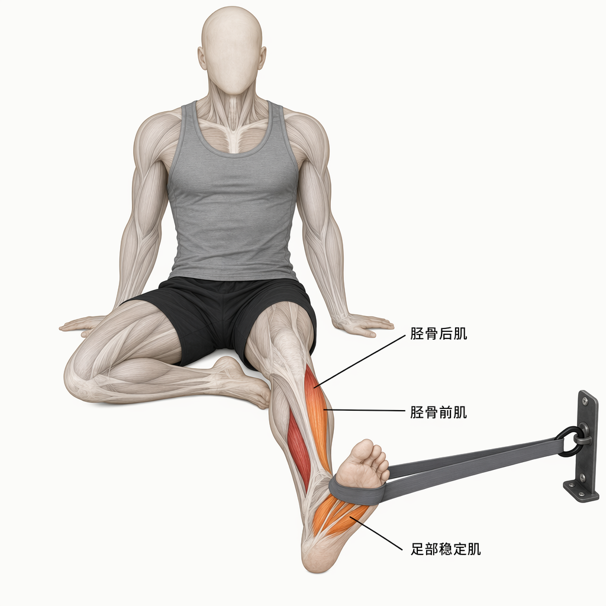

**版本**: v1 · **耗时**: 236s · **生成时间**: 2026-05-04T08:20:54Z

**分类**: 踝稳定 · **视角**: front view, focused on lower leg and foot

**应有标签 (中文)**: 胫骨后肌 / 胫骨前肌 / 足部稳定肌

<details><summary>展开 prompt</summary>

```
Anatomical muscle-activation diagram of the "弹力带踝内翻" (banded ankle inversion) exercise, front view, focused on lower leg and foot. Person posture: Athletic person seated on the floor with the right leg extended straight forward. A loop resistance band is attached to a fixed anchor on the right side at floor level, with the loop wrapped around the ball of the right foot. The right foot pulls INWARD (medially) against the band's outward pull — this is the ANKLE INVERSION movement. The right ankle rotates so the sole of the foot turns to face slightly inward (toward the left foot), strengthening the tibialis posterior. Left leg is bent comfortably to the side. Plain black athletic shorts and gray tank top.. Body rendered with semi-transparent skin so underlying muscles are visible. Highlight in saturated red the primary working muscles: tibialis posterior (inner side of the lower leg/ankle). Highlight in orange the secondary stabilizers: tibialis anterior and small intrinsic foot muscles. Other muscles in pale neutral gray. Add small clean labels with thin black arrow leader lines pointing from each label to its target muscle group. The labels MUST be in simplified Chinese characters using a clean sans-serif font. Use exactly the following labels: "胫骨后肌" pointing to the tibialis posterior; "胫骨前肌" pointing to the tibialis anterior (assisting); "足部稳定肌" pointing to the foot stabilizers. 

CRITICAL CONSTRAINTS — these are non-negotiable:
1. ALL TEXT IN THE IMAGE MUST BE SIMPLIFIED CHINESE CHARACTERS ONLY.
2. ABSOLUTELY NO ENGLISH WORDS, NO LATIN LETTERS, NO PINYIN ANYWHERE IN THE IMAGE.
3. NO romanization or transliteration of muscle names.
4. NO captions, NO subtitles, NO step-by-step text overlays.
5. ONLY the muscle labels listed above should appear as text.

Style: clean medical textbook illustration, off-white background, no facial features (head shape may be shown but no eyes/nose/mouth), anatomically accurate proportions, no shadows on background, no watermarks, no signature.
```

</details>

---

### ❓ T1327 — 弹力带踝外翻 (banded ankle eversion)

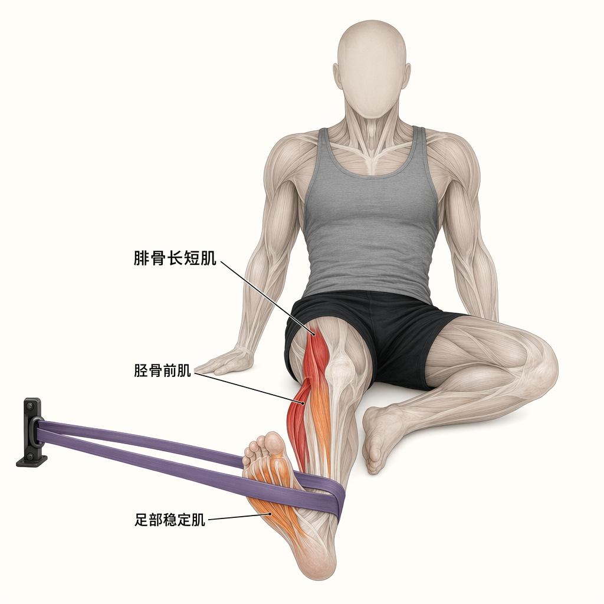

**版本**: v1 · **耗时**: 220s · **生成时间**: 2026-05-04T08:21:03Z

**分类**: 踝稳定 · **视角**: front view, focused on lower leg and foot

**应有标签 (中文)**: 腓骨长短肌 / 胫骨前肌 / 足部稳定肌

<details><summary>展开 prompt</summary>

```
Anatomical muscle-activation diagram of the "弹力带踝外翻" (banded ankle eversion) exercise, front view, focused on lower leg and foot. Person posture: Athletic person seated on the floor with the right leg extended straight forward. A loop resistance band is attached to a fixed anchor on the LEFT side at floor level, with the loop wrapped around the ball of the right foot. The right foot pulls OUTWARD (laterally) against the band's inward pull — this is the ANKLE EVERSION movement. The right ankle rotates so the sole of the foot turns to face slightly outward (away from the left foot), strengthening the peroneal muscles on the outside of the lower leg. Left leg is bent comfortably to the side. Plain black athletic shorts and gray tank top.. Body rendered with semi-transparent skin so underlying muscles are visible. Highlight in saturated red the primary working muscles: peroneal muscles (peroneus longus and brevis, outer side of the lower leg). Highlight in orange the secondary stabilizers: tibialis anterior and small intrinsic foot muscles. Other muscles in pale neutral gray. Add small clean labels with thin black arrow leader lines pointing from each label to its target muscle group. The labels MUST be in simplified Chinese characters using a clean sans-serif font. Use exactly the following labels: "腓骨长短肌" pointing to the peroneal muscles (outer lower leg); "胫骨前肌" pointing to the tibialis anterior (assisting); "足部稳定肌" pointing to the foot stabilizers. 

CRITICAL CONSTRAINTS — these are non-negotiable:
1. ALL TEXT IN THE IMAGE MUST BE SIMPLIFIED CHINESE CHARACTERS ONLY.
2. ABSOLUTELY NO ENGLISH WORDS, NO LATIN LETTERS, NO PINYIN ANYWHERE IN THE IMAGE.
3. NO romanization or transliteration of muscle names.
4. NO captions, NO subtitles, NO step-by-step text overlays.
5. ONLY the muscle labels listed above should appear as text.

Style: clean medical textbook illustration, off-white background, no facial features (head shape may be shown but no eyes/nose/mouth), anatomically accurate proportions, no shadows on background, no watermarks, no signature.
```

</details>

---

### ❓ T1318 — 胫骨前肌抬脚 (tibialis anterior raise (seated))

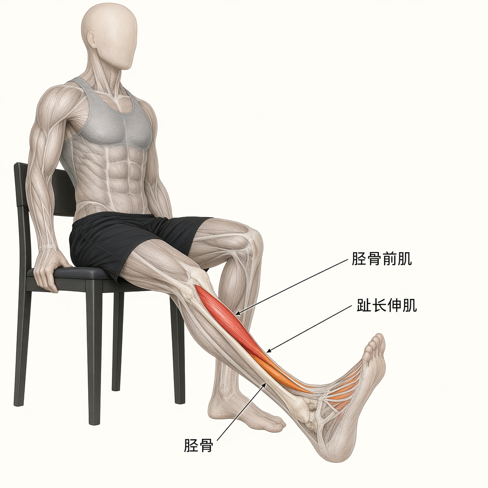

**版本**: v1 · **耗时**: 248s · **生成时间**: 2026-05-04T08:24:22Z

**分类**: 踝稳定 · **视角**: side view from the right, focused on the lower leg and foot

**应有标签 (中文)**: 胫骨前肌 / 趾长伸肌 / 胫骨

<details><summary>展开 prompt</summary>

```
Anatomical muscle-activation diagram of the "胫骨前肌抬脚" (tibialis anterior raise (seated)) exercise, side view from the right, focused on the lower leg and foot. Person posture: Athletic person seated on a chair, right leg extended forward with the right heel resting on the floor (knee almost fully extended, slight bend). The right foot is FULLY DORSIFLEXED — the toes and forefoot are pulled UP toward the shin as far as possible, creating a sharp angle at the ankle. The contracted tibialis anterior muscle bulges visibly along the front-outer side of the right shin (lateral aspect of the tibia). Left leg is bent and resting normally. Plain black athletic shorts and gray tank top.. Body rendered with semi-transparent skin so underlying muscles are visible. Highlight in saturated red the primary working muscles: tibialis anterior (front-outer side of the shin). Highlight in orange the secondary stabilizers: extensor digitorum longus (toe extensors). Other muscles in pale neutral gray. Add small clean labels with thin black arrow leader lines pointing from each label to its target muscle group. The labels MUST be in simplified Chinese characters using a clean sans-serif font. Use exactly the following labels: "胫骨前肌" pointing to the tibialis anterior; "趾长伸肌" pointing to the toe extensor muscles; "胫骨" pointing to the tibia bone. 

CRITICAL CONSTRAINTS — these are non-negotiable:
1. ALL TEXT IN THE IMAGE MUST BE SIMPLIFIED CHINESE CHARACTERS ONLY.
2. ABSOLUTELY NO ENGLISH WORDS, NO LATIN LETTERS, NO PINYIN ANYWHERE IN THE IMAGE.
3. NO romanization or transliteration of muscle names.
4. NO captions, NO subtitles, NO step-by-step text overlays.
5. ONLY the muscle labels listed above should appear as text.

Style: clean medical textbook illustration, off-white background, no facial features (head shape may be shown but no eyes/nose/mouth), anatomically accurate proportions, no shadows on background, no watermarks, no signature.
```

</details>

---
